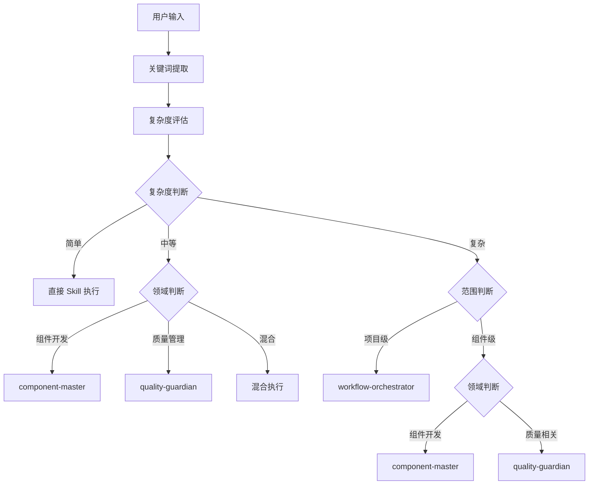

# 🎯 Xorigo UI Sub-agents 触发机制完整指南

本文档详细说明 Xorigo UI 项目中 Sub-agents 的触发机制、使用方法和最佳实践。

## 📋 目录

1. [Sub-agents 概览](#sub-agents-概览)
2. [触发机制原理](#触发机制原理)
3. [各 Sub-agent 详细说明](#各-sub-agent-详细说明)
4. [触发决策矩阵](#触发决策矩阵)
5. [使用示例](#使用示例)
6. [测试验证](#测试验证)
7. [故障排除](#故障排除)
8. [最佳实践](#最佳实践)

## 📊 Sub-agents 概览

### 三个专业 Sub-agents

| Sub-agent | 专业领域 | 触发关键词 | 复杂度要求 |
|-----------|----------|-----------|------------|
| **xorigo-component-master** | 组件开发全流程 | 完整组件、API设计、多步骤开发 | 中等复杂度 |
| **xorigo-quality-guardian** | 质量管理 | 项目级质量、多维度检查、批量评估 | 中-高复杂度 |
| **xorigo-workflow-orchestrator** | 工作流编排 | 多任务协调、跨领域协作、版本发布 | 高复杂度 |

### 🔄 执行模式对比

| 执行模式 | 任务特征 | 触发方式 | 典型场景 |
|----------|----------|----------|----------|
| **直接 Skill** | 单一功能、简单任务 | Claude 直接调用 | "创建 Badge 组件" |
| **Sub-agent 协调** | 多步骤、跨领域 | Claude 委派给 Sub-agent | "创建完整 DataTable 组件" |
| **混合执行** | 中等复杂度 | 部分直接 + 部分委派 | "优化 Button 组件" |

## 🧠 触发机制原理

### 📊 任务复杂度评估算法

```typescript
interface TaskAnalysis {
  complexity: 'simple' | 'medium' | 'complex'
  domain: 'component' | 'quality' | 'workflow' | 'mixed'
  steps: number
  crossDomain: boolean
  requiresStateManagement: boolean
  scope: 'single' | 'batch' | 'project'
}

function analyzeTask(userInput: string): TaskAnalysis {
  // 1. 关键词匹配
  const keywords = extractKeywords(userInput)

  // 2. 复杂度评估
  const complexity = assessComplexity(keywords, userInput)

  // 3. 领域分类
  const domain = classifyDomain(keywords)

  // 4. 步骤估算
  const steps = estimateSteps(userInput)

  // 5. 跨领域判断
  const crossDomain = detectCrossDomain(keywords)

  // 6. 状态管理需求
  const requiresStateManagement = needsStateManagement(userInput)

  // 7. 范围判断
  const scope = determineScope(keywords)

  return { complexity, domain, steps, crossDomain, requiresStateManagement, scope }
}

function determineExecutionMode(analysis: TaskAnalysis): ExecutionMode {
  if (analysis.complexity === 'simple' && analysis.scope === 'single') {
    return 'direct-skill'
  }

  if (analysis.complexity === 'complex' || analysis.scope === 'project') {
    return 'sub-agent-coordination'
  }

  return 'hybrid'
}
```

### 🔍 关键词权重表

| 关键词类别 | 关键词 | 权重 | 触发倾向 |
|------------|--------|------|----------|
| **完整性** | 完整、全流程、端到端 | +3 | Sub-agent |
| **范围** | 项目级、批量、所有 | +3 | Sub-agent |
| **复杂性** | 复杂、多步骤、高级 | +2 | Sub-agent |
| **协调** | 协调、管理、编排 | +2 | Sub-agent |
| **质量** | 全面、综合、多维度 | +2 | quality-guardian |
| **开发** | 创建、开发、设计 | +1 | component-master |
| **检查** | 检查、验证、测试 | +1 | direct-skill |
| **简单** | 简单、快速、基础 | -2 | direct-skill |

## 📋 各 Sub-agent 详细说明

### 1. Xorigo UI 组件开发主管

#### 🎯 专业职责
- **组件全流程开发** - 从需求到文档的完整开发流程
- **API 设计** - 组件接口设计和标准化
- **质量协调** - 协调各种质量检查
- **多步骤任务管理** - 管理组件开发的多个阶段

#### 📝 触发条件 (已优化)
**Description**: "专门负责 Xorigo UI 组件开发全流程的专家，当需要创建完整组件、设计组件API、协调多步骤组件开发时触发，负责组件创建、质量检查、测试和文档生成的协调工作"

**高优先级触发词**:
- ✅ **完整组件**: "完整组件"、"全功能组件"
- ✅ **API 设计**: "设计 API"、"接口设计"、"组件架构"
- ✅ **多步骤开发**: "包含分页排序"、"带筛选功能"
- ✅ **协调开发**: "组件开发流程"、"端到端开发"

**触发阈值**: 评分 ≥ 4 分

#### 📊 典型触发场景

| 用户请求 | 触发结果 | 理由 |
|----------|----------|------|
| "创建一个完整的 DataTable 组件，包括分页、排序、筛选" | ✅ 触发 | 完整组件 (+3) + 多步骤 (+2) = 5 |
| "设计 Modal 组件的 API 接口" | ✅ 触发 | API 设计 (+3) + 设计 (+1) = 4 |
| "创建一个 Badge 组件" | ❌ 不触发 | 创建 (+1) = 1 < 4 |
| "开发 Button 组件" | ❌ 不触发 | 开发 (+1) = 1 < 4 |

### 2. Xorigo UI 质量守护者

#### 🎯 专业职责
- **全方位质量检查** - 代码、性能、可访问性、设计系统
- **项目级质量管理** - 整个项目的质量监控
- **批量质量评估** - 多个组件的批量检查
- **质量标准制定** - 设定和维护质量基准

#### 📝 触发条件 (已优化)
**Description**: "专门负责 Xorigo UI 项目全方位质量管理的专家，当需要项目级质量管理、多维度质量检查、批量组件质量评估时触发，协调代码质量、性能、可访问性和设计系统合规性检查"

**高优先级触发词**:
- ✅ **项目级**: "项目质量"、"全项目检查"
- ✅ **多维度**: "全面检查"、"综合评估"
- ✅ **批量**: "所有组件"、"批量检查"
- ✅ **质量管理**: "质量提升"、"质量优化"

**触发阈值**: 评分 ≥ 4 分

#### 📊 典型触发场景

| 用户请求 | 触发结果 | 理由 |
|----------|----------|------|
| "检查所有核心组件的质量" | ✅ 触发 | 批量 (+3) + 质量 (+1) = 4 |
| "全面评估 Button 组件的性能和可访问性" | ✅ 触发 | 全面 (+2) + 质量 (+1) + 性能 (+1) = 4 |
| "检查 Button 的命名规范" | ❌ 不触发 | 检查 (+1) = 1 < 4 |
| "优化 Button 组件" | ❌ 不触发 | 优化 (+1) = 1 < 4 |

### 3. Xorigo UI 工作流编排器

#### 🎯 专业职责
- **复杂工作流编排** - 多步骤、跨领域任务协调
- **Sub-agent 协调** - 协调多个 Sub-agents 协作
- **版本发布管理** - 发布流程的管理和协调
- **异常处理** - 工作流执行中的异常处理

#### 📝 触发条件 (已优化)
**Description**: "专门负责编排和管理复杂工作流的专家，当需要多步骤任务协调、跨多个领域协作、版本发布管理时触发，协调多个 Sub-agents 和 Skills 完成复杂的开发任务"

**高优先级触发词**:
- ✅ **多任务协调**: "协调多个任务"、"工作流管理"
- ✅ **跨领域协作**: "跨多个领域"、"多团队协作"
- ✅ **版本发布**: "准备发布"、"版本管理"
- ✅ **项目管理**: "项目级任务"、"整体规划"

**触发阈值**: 评分 ≥ 5 分

#### 📊 典型触发场景

| 用户请求 | 触发结果 | 理由 |
|----------|----------|------|
| "准备 v2.0.0 版本发布" | ✅ 触发 | 版本发布 (+4) + 管理 (+1) = 5 |
| "协调所有组件的优化和文档更新" | ✅ 触发 | 协调 (+2) + 多任务 (+2) = 4 |
| "优化所有组件" | ❌ 不触发 | 优化 (+1) = 1 < 5 |
| "更新文档" | ❌ 不触发 | 更新 (+1) = 1 < 5 |

## 📊 触发决策矩阵

### 🎯 完整决策流程



### 📋 评分计算示例

#### 示例 1: "创建完整的 DataTable 组件，包括分页和排序功能"
```
关键词提取: ["创建", "完整", "组件", "分页", "排序", "功能"]
评分计算:
- 完整: +3
- 组件: +1
- 功能 (多步骤): +2
- 分页排序 (复杂): +1
总分: 7
触发: component-master (≥4)
```

#### 示例 2: "检查所有组件的代码质量和性能"
```
关键词提取: ["检查", "所有", "组件", "代码质量", "性能"]
评分计算:
- 所有 (批量): +3
- 质量: +1
- 性能: +1
- 检查: +1
总分: 6
触发: quality-guardian (≥4)
```

#### 示例 3: "准备版本 2.0.0 发布，包括质量检查和文档更新"
```
关键词提取: ["准备", "版本", "发布", "质量检查", "文档", "更新"]
评分计算:
- 版本发布: +4
- 准备 (管理): +1
- 质量检查: +1
总分: 6
触发: workflow-orchestrator (≥5)
```

## 🎨 使用示例

### 场景 1: 简单组件开发
```
用户: "创建一个 Badge 组件"

分析:
- 关键词: ["创建", "组件"]
- 评分: 2 分
- 决策: 直接 Skill 执行

执行:
Claude 直接调用 xorigo-component-generator Skill
```

### 场景 2: 复杂组件开发
```
用户: "创建一个完整的 DataTable 组件，包括分页、排序、筛选功能"

分析:
- 关键词: ["创建", "完整", "组件", "分页", "排序", "筛选", "功能"]
- 评分: 7 分
- 决策: 触发 component-master

执行:
Claude 委派给 xorigo-component-master
component-master 协调多个 Skills:
1. xorigo-component-generator (生成基础组件)
2. xorigo-design-validator (验证设计)
3. xorigo-theme-tester (测试主题)
4. xorigo-test-automation (生成测试)
5. xorigo-docs-generator (生成文档)
```

### 场景 3: 项目质量检查
```
用户: "全面检查所有核心组件的质量状况"

分析:
- 关键词: ["全面", "检查", "所有", "组件", "质量"]
- 评分: 6 分
- 决策: 触发 quality-guardian

执行:
Claude 委派给 xorigo-quality-guardian
quality-guardian 协调多个 Skills:
1. xorigo-code-quality-guard (代码质量)
2. xorigo-design-validator (设计验证)
3. xorigo-theme-tester (主题测试)
4. xorigo-performance-optimizer (性能分析)
5. xorigo-test-automation (测试覆盖)
```

### 场景 4: 版本发布准备
```
用户: "准备 v2.0.0 版本发布，需要全面质量检查和文档更新"

分析:
- 关键词: ["准备", "版本", "发布", "全面", "质量检查", "文档", "更新"]
- 评分: 8 分
- 决策: 触发 workflow-orchestrator

执行:
Claude 委派给 xorigo-workflow-orchestrator
workflow-orchestrator 协调多个 Sub-agents:
1. xorigo-quality-guardian (全面质量检查)
2. xorigo-component-master (组件完整性验证)
3. 多个 Skills (文档更新、测试验证等)
```

## 🧪 测试验证

### 测试用例设计

#### 测试集 1: 组件开发任务
```bash
# 应该直接 Skill (评分 < 4)
"创建 Badge 组件"
"开发 Alert 组件"
"生成 Spinner 组件"

# 应该触发 component-master (评分 ≥ 4)
"创建完整的 DataTable 组件，包括分页"
"设计 Modal 组件的 API 接口"
"开发带筛选功能的 ComboBox 组件"
```

#### 测试集 2: 质量检查任务
```bash
# 应该直接 Skill (评分 < 4)
"检查 Button 命名规范"
"验证 Card 组件的可访问性"
"测试 Input 组件的性能"

# 应该触发 quality-guardian (评分 ≥ 4)
"全面检查所有组件质量"
"评估项目整体性能"
"批量验证组件的可访问性"
```

#### 测试集 3: 工作流任务
```bash
# 应该直接 Skill 或简单混合 (评分 < 5)
"优化 Button 组件"
"更新 Modal 文档"
"修复 Input 组件 bug"

# 应该触发 workflow-orchestrator (评分 ≥ 5)
"准备 v2.0.0 发布"
"协调所有组件的优化工作"
"管理项目整体质量提升计划"
```

### 验证方法

#### 1. 手动验证
```bash
# 测试命令
echo "创建完整的 DataTable 组件，包括分页、排序、筛选" | claude-code
echo "检查所有核心组件的质量" | claude-code
echo "准备 v2.0.0 版本发布" | claude-code
```

#### 2. 自动化验证
```typescript
// 自动化测试脚本
const testCases = [
  { input: "创建 Badge 组件", expected: "direct-skill" },
  { input: "创建完整的 DataTable 组件", expected: "component-master" },
  { input: "检查所有组件质量", expected: "quality-guardian" },
  { input: "准备版本发布", expected: "workflow-orchestrator" }
]

testCases.forEach(({ input, expected }) => {
  const result = analyzeTask(input)
  const actual = determineExecutionMode(result)
  assert.equal(actual, expected, `Failed for: ${input}`)
})
```

## 🔧 故障排除

### 常见问题

#### 1. Sub-agent 不触发
**问题**: 明显应该触发 Sub-agent 的请求没有触发

**可能原因**:
- Description 中缺少关键触发词
- 任务描述不够明确
- 复杂度评分低于阈值

**解决方案**:
```markdown
# 优化 Description
在 description 中明确添加触发条件，例如：
"当需要创建完整组件、设计组件API时触发"
```

#### 2. 错误的 Sub-agent 被触发
**问题**: 触发了不合适的 Sub-agent

**可能原因**:
- 关键词权重设置不当
- 领域分类错误
- 触发阈值设置不合理

**解决方案**:
```markdown
# 调整关键词权重
重新评估关键词的触发权重，确保专业领域匹配
```

#### 3. 执行效率低
**问题**: Sub-agent 执行时间过长

**可能原因**:
- 工作流设计不合理
- Skills 调用顺序不当
- 并行度不够

**解决方案**:
```markdown
# 优化工作流
1. 增加 Skills 并行调用
2. 优化执行顺序
3. 增加缓存机制
```

### 调试工具

#### 1. 触发分析工具
```typescript
function debugTrigger(userInput: string): TriggerAnalysis {
  const analysis = analyzeTask(userInput)
  const executionMode = determineExecutionMode(analysis)

  return {
    input: userInput,
    keywords: extractKeywords(userInput),
    scores: calculateScores(userInput),
    complexity: analysis.complexity,
    domain: analysis.domain,
    executionMode,
    recommendation: getRecommendation(analysis)
  }
}
```

#### 2. 性能监控
```typescript
interface ExecutionMetrics {
  triggerTime: number
  executionTime: number
  success: boolean
  agentUsed: string
  skillsInvoked: string[]
  userSatisfaction: number
}

const metrics = collectExecutionMetrics()
// 分析性能瓶颈和优化机会
```

## 🎯 最佳实践

### ✅ 用户端最佳实践

#### 1. 明确的任务描述
```bash
# ❌ 模糊描述
"做一下 Button"

# ✅ 明确描述
"创建一个完整的 Button 组件，包括所有变体和完整测试"
```

#### 2. 包含关键触发词
```bash
# ❌ 缺少触发词
"开发表格组件"

# ✅ 包含触发词
"创建完整的 DataTable 组件，包括分页、排序、筛选功能"
```

#### 3. 合理的任务分解
```bash
# ❌ 过于复杂的单一任务
"创建包含所有功能的完整组件库"

# ✅ 合理分解
"先创建 Button 组件"
"然后创建 Card 组件"
"最后检查整体质量"
```

### ✅ 开发端最佳实践

#### 1. 定期优化触发条件
- 基于实际使用数据调整关键词权重
- 优化 Description 中的触发词
- 定期测试和验证触发机制

#### 2. 完善监控体系
- 收集触发准确率数据
- 监控执行效率
- 收集用户满意度反馈

#### 3. 持续改进工作流
- 优化 Skills 调用顺序
- 增加并行执行能力
- 完善异常处理机制

### 📈 性能优化建议

#### 1. 触发优化
```typescript
// 缓存分析结果
const analysisCache = new Map<string, TaskAnalysis>()

function getCachedAnalysis(userInput: string): TaskAnalysis {
  if (analysisCache.has(userInput)) {
    return analysisCache.get(userInput)!
  }

  const analysis = analyzeTask(userInput)
  analysisCache.set(userInput, analysis)
  return analysis
}
```

#### 2. 并行执行
```typescript
// 并行调用多个 Skills
const results = await Promise.all([
  callSkill('xorigo-design-validator'),
  callSkill('xorigo-theme-tester'),
  callSkill('xorigo-performance-optimizer')
])
```

#### 3. 智能缓存
```typescript
// 缓存 Skill 执行结果
const skillCache = new Map<string, any>()

async function callSkillWithCache(skillName: string, input: any): Promise<any> {
  const cacheKey = `${skillName}:${JSON.stringify(input)}`

  if (skillCache.has(cacheKey)) {
    return skillCache.get(cacheKey)
  }

  const result = await callSkill(skillName, input)
  skillCache.set(cacheKey, result)
  return result
}
```

## 📝 总结

Xorigo UI 的 Sub-agents 触发机制通过智能的任务分析和决策算法，实现了：

### 🎯 核心价值
1. **智能任务分发** - 自动识别任务复杂度和领域
2. **专业化执行** - 委派给最合适的专业 Sub-agent
3. **效率优化** - 避免过度工程化，选择最优执行模式

### 🚀 使用效果
- **简单任务**: 直接调用 Skills，响应快速
- **复杂任务**: Sub-agent 协调，执行专业
- **项目级任务**: 工作流编排，管理有序

### 🔮 未来发展
- **机器学习优化** - 基于历史数据优化触发算法
- **个性化适配** - 根据用户习惯调整触发策略
- **实时学习** - 动态优化关键词权重和阈值

通过这套完整的触发机制，Xorigo UI 项目实现了高效、智能的任务自动化处理，大大提升了开发效率和代码质量。