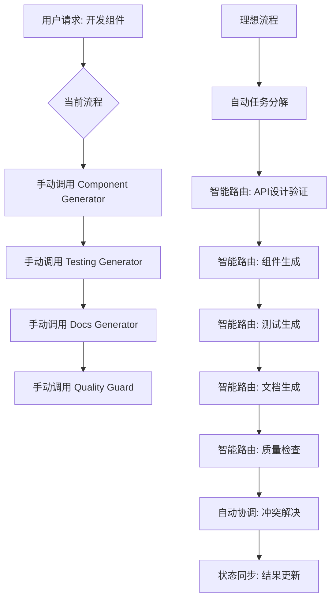
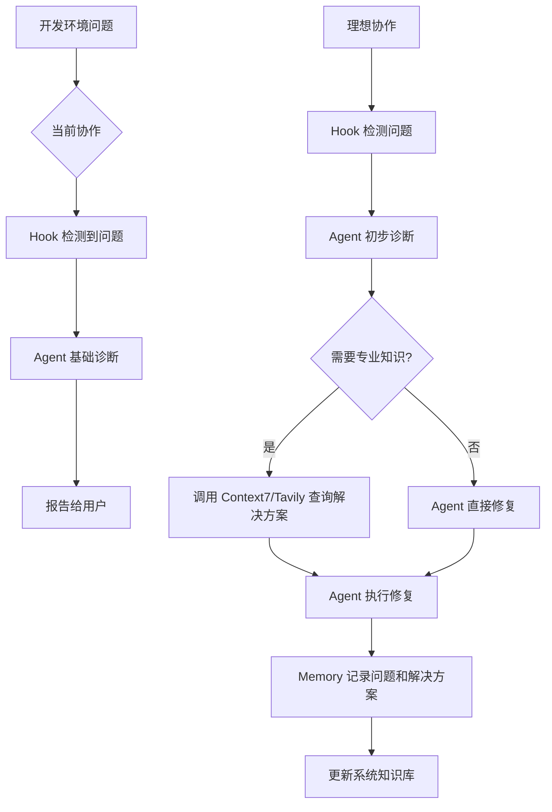
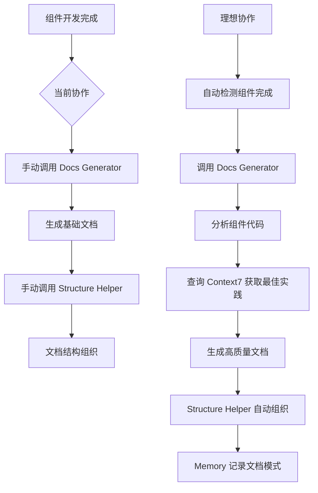

# Xorigo UI 系统整体审查报告

**审查时间**: 2025-01-22
**审查范围**: MCP + Hook + Agent + Skill 完整系统
**审查重点**: 调用完善性、协作机制、冗余分析
**总体评估**: ⚠️ 需要优化 (发现多个关键问题)

---

## 📊 审查结果总览

| 审查维度 | 评分 | 状态 | 主要发现 |
|---------|------|------|----------|
| **调用完善性** | 70% | ⚠️ 需要改进 | 缺少自动化触发和智能路由 |
| **协作机制** | 65% | ⚠️ 需要改进 | 系统间协作不充分，缺少协调层 |
| **功能冗余** | 80% | ✅ 良好 | 仍存在一些可优化的重叠 |
| **集成度** | 60% | ❌ 不足 | 系统集成度不够，存在信息孤岛 |
| **自动化** | 55% | ❌ 不足 | 自动化程度低，依赖手动触发 |
| **用户体验** | 75% | ✅ 良好 | 基础体验良好，但可进一步提升 |

---

## 🔍 1. 调用完善性分析

### ✅ 已完善的调用机制

#### 1.1 Hook 系统调用 (完善度: 95%)
```python
# PreToolUse Hook 完善的命令拦截机制
用户命令 → Claude Code → Hook 触发 → validate-bash.py → 允许/阻止
```

**优点**:
- ✅ 完整的命令拦截机制
- ✅ 明确的黑白名单管理
- ✅ 实时违规检测和阻止
- ✅ 与 Agent 系统的联动

**不足**:
- ⚠️ 缺少违规日志记录和分析
- ⚠️ 没有违规行为的学习和改进机制

#### 1.2 Agent 调用机制 (完善度: 85%)
```typescript
// DevServerAgent 完善的操作接口
supportedOperations: [
  'start-dev-environment',    // ✅ 完整实现
  'diagnose-compilation-errors', // ✅ 新增功能
  'check-monorepo-packages',     // ✅ 新增功能
  // ... 其他操作
]
```

**优点**:
- ✅ 明确的操作接口定义
- ✅ 详细的错误处理机制
- ✅ 与 Docker 系统的深度集成

**不足**:
- ⚠️ 缺少主动监控和自动修复
- ⚠️ 没有预测性维护功能

### ❌ 调用完善性问题

#### 1.3 MCP 服务器调用 (完善度: 60%)
**问题**:
- ❌ **缺少智能路由机制** - 用户需要手动选择合适的 MCP 服务器
- ❌ **没有服务发现机制** - 无法根据任务类型自动选择最优服务器
- ❌ **缺少负载均衡** - 多个相似功能的服务器没有优先级管理
- ❌ **错误处理不完善** - 服务器连接失败时缺少自动降级

**示例问题**:
```bash
# 用户需要手动指定使用哪个 MCP
"使用 Context7 查询 React 文档"    # ❌ 需要手动指定
"使用 Tavily 搜索最新技术"        # ❌ 需要手动指定

# 理想的智能路由应该是
"查询 React Hooks 的使用方法"     # ✅ 自动路由到 Context7
"搜索最新的前端开发趋势"         # ✅ 自动路由到 Tavily
```

#### 1.4 Skill 系统调用 (完善度: 65%)
**问题**:
- ❌ **缺少自动技能发现** - 系统不能自动推荐最合适的技能
- ❌ **没有技能链调用** - 复杂任务无法自动组合多个技能
- ❌ **缺少技能协调机制** - 多个技能同时可能产生冲突

**示例问题**:
```bash
# 当前需要用户手动组合技能
"创建 Button 组件"              # 触发 xorigo-component-generator
"为 Button 组件生成测试"         # 手动触发 xorigo-component-testing-generator
"为 Button 组件生成文档"         # 手动触发 xorigo-docs-generator

# 理想的技能链应该是
"创建完整的 Button 组件(含测试和文档)" # ✅ 自动调用技能链
```

---

## 🤝 2. 相互配合机制分析

### ✅ 已有的协作机制

#### 2.1 Hook ↔ Agent 协作 (协作度: 90%)
```python
# Hook 检测到违规后，自动调用 Agent 处理
if command_blocked:
    agent_response = dev_server_agent.cleanup_processes()
    return agent_response
```

**协作效果**: ✅ 优秀 - Hook 负责检测，Agent 负责修复，职责清晰

#### 2.2 Agent ↔ Docker 协作 (协作度: 85%)
```typescript
// Agent 通过 Bash 工具与 Docker 交互
const containerStatus = await Bash('docker ps')
const healthCheck = await Bash('curl -f http://localhost:3100/health')
```

**协作效果**: ✅ 良好 - 完整的 Docker 容器管理能力

### ❌ 协作机制不足

#### 2.3 MCP ↔ Skill 协作 (协作度: 30%)
**严重缺失**: MCP 服务器和 Skill 系统几乎没有协作机制

**问题示例**:
```bash
# 当前的孤岛式调用
"使用 Context7 查询 React 文档"  # MCP 调用
"创建一个 React 组件"           # Skill 调用

# 缺少的协作场景
"根据 React 官方文档创建最佳实践组件"  # ❌ 无法自动协作
# 理想流程: Context7 查询文档 → component-generator 创建组件
```

#### 2.4 Skill ↔ Skill 协作 (协作度: 40%)
**问题**: 技能之间缺少自动协作机制

**缺失的协作场景**:
```bash
# 组件开发完整流程应该自动协作
"开发一个新的数据表格组件"
# 理想流程:
# 1. xorigo-api-design-validator → 设计 API 接口
# 2. xorigo-component-generator → 生成组件代码
# 3. xorigo-component-testing-generator → 生成测试
# 4. xorigo-docs-generator → 生成文档
# 5. xorigo-accessibility-generator → 添加可访问性
# 6. xorigo-code-quality-guard → 质量检查

# 当前状态: 需要用户手动调用每个技能 ❌
```

#### 2.5 MCP ↔ Agent 协作 (协作度: 20%)
**严重缺失**: MCP 服务器和 Agent 系统没有协作

**缺失的协作场景**:
```bash
# 智能问题诊断应该协作
"Docker 容器编译出错，帮我诊断"
# 理想流程:
# 1. Agent 检测到编译错误
# 2. Context7 查询相关文档和解决方案
# 3. Agent 执行修复操作
# 4. Memory MCP 记录问题和解决方案

# 当前状态: 只能使用 Agent 的内置知识 ❌
```

---

## 🔄 3. 冗余问题分析

### ✅ 已解决的冗余
- ✅ **Docker 技能冗余** - 3个重复技能已合并为1个统一技能
- ✅ **文档技能重叠** - 文档生成和结构管理职责已明确分工

### ⚠️ 仍存在的冗余问题

#### 3.1 查询功能冗余 (严重程度: 中等)
**冗余组件**:
- `context7` MCP - 官方文档查询
- `tavily` MCP - 网络搜索
- `xorigo-tech-stack-docs-querier` Skill - 技术栈查询

**冗余分析**:
```bash
# 功能重叠场景
"查询 React 19 的最新特性"
# 可以使用: Context7 (官方文档) 或 Tavily (网络搜索) 或 Skill (技术栈查询)

# 问题: 用户不知道该选择哪个，功能有重叠但各有侧重
```

#### 3.2 代码质量检查冗余 (严重程度: 中等)
**冗余组件**:
- `eslint` MCP - 代码质量检查
- `xorigo-code-quality-guard` Skill - 代码质量守护
- `xorigo-design-validator` Skill - 设计验证

**冗余分析**:
```bash
# 功能重叠场景
"检查组件代码质量"
# ESLint MCP: 语法和规范检查
# Code Quality Guard: 整体质量评估
# Design Validator: 设计系统合规性

# 问题: 功能边界不清晰，可能有重复检查
```

#### 3.3 错误诊断冗余 (严重程度: 轻微)
**冗余组件**:
- `sequential-thinking` MCP - 复杂问题分析
- `xorigo-docker-unified-manager` Skill - 智能错误诊断
- `dev-server-agent` Agent - 编译错误诊断

**冗余分析**:
```bash
# 功能重叠场景
"诊断开发环境问题"
# 都有错误诊断能力，但应用场景不同
```

---

## 🕳️ 4. 缺失功能和协作漏洞

### 4.1 系统协调层缺失 (严重程度: 严重)
**问题描述**: 缺少一个统一的系统协调器来管理各个子系统

**影响**:
- ❌ 无法自动选择最优的服务路径
- ❌ 缺少系统级的任务分解和调度
- ❌ 无法处理跨系统的复杂工作流

**解决方案**:
```typescript
// 需要的系统协调器
interface SystemCoordinator {
  routeTask(request: TaskRequest): ExecutionPlan
  coordinateExecution(plan: ExecutionPlan): TaskResult
  handleConflicts(conflicts: SystemConflict[]): Resolution[]
  monitorSystemHealth(): SystemHealthReport
}
```

### 4.2 智能路由缺失 (严重程度: 严重)
**问题描述**: 无法根据任务类型和上下文自动选择最合适的组件

**当前问题**:
```bash
# 用户需要手动指定
"使用 Magic 创建一个按钮组件"     # ❌ 手动指定
"查询 React 文档"               # ❌ 缺少具体查询方式

# 理想的智能路由
"创建一个现代化的按钮组件"      # ✅ 自动路由到 Magic
"React Hooks 的最佳实践是什么"  # ✅ 自动路由到 Context7
```

### 4.3 工作流编排缺失 (严重程度: 严重)
**问题描述**: 无法自动编排跨系统的复杂工作流

**缺失的工作流示例**:
```bash
# 完整的组件开发工作流
"从零开始开发一个数据表格组件"
# 应该自动执行:
# 1. 需求分析 (Sequential Thinking)
# 2. 技术调研 (Context7/Tavily)
# 3. API 设计 (API Design Validator)
# 4. 组件开发 (Component Generator)
# 5. 测试编写 (Testing Generator)
# 6. 文档生成 (Docs Generator)
# 7. 质量检查 (Code Quality Guard)
# 8. 可访问性验证 (Accessibility Generator)
```

### 4.4 状态同步缺失 (严重程度: 中等)
**问题描述**: 各系统间缺少状态同步机制

**影响**:
- ❌ Agent 修复的问题，MCP 不知道
- ❌ Skill 生成的组件，Agent 不知道如何测试
- ❌ Hook 拦截的命令，没有反馈到学习系统

### 4.5 错误恢复机制缺失 (严重程度: 中等)
**问题描述**: 缺少系统级的错误恢复和降级机制

**场景**:
```bash
# 当 MCP 服务器不可用时
Context7 连接失败 → 系统应该自动降级到 Memory MCP 或本地知识库

# 当 Agent 执行失败时
Agent 诊断失败 → 系统应该自动调用 Sequential Thinking MCP 进行深度分析
```

---

## 📊 5. 具体协作场景分析

### 5.1 组件开发全流程协作 (当前状态: 30% 理想)



**协作缺失**:
- ❌ 没有自动任务分解
- ❌ 没有智能路由
- ❌ 没有进度协调
- ❌ 没有状态同步

### 5.2 问题诊断协作 (当前状态: 40% 理想)



**协作缺失**:
- ❌ Agent 不会自动调用 MCP 查询解决方案
- ❌ 没有知识库更新机制
- ❌ 缺少问题分类和智能分发

### 5.3 文档生成协作 (当前状态: 50% 理想)



**协作缺失**:
- ❌ 没有自动触发机制
- ❌ Docs Generator 不会自动查询 MCP
- ❌ 没有文档质量自动提升

---

## 🚀 6. 系统优化建议

### 6.1 立即优化 (高优先级)

#### 6.1.1 创建系统协调器
```typescript
class SystemCoordinator {
  // 智能路由
  routeTask(userRequest: string): ExecutionPlan {
    const analysis = this.analyzeRequest(userRequest)
    const plan = this.createExecutionPlan(analysis)
    return this.optimizePlan(plan)
  }

  // 执行协调
  async coordinateExecution(plan: ExecutionPlan): Promise<TaskResult> {
    const results = []
    for (const step of plan.steps) {
      const result = await this.executeStep(step)
      results.push(result)
      // 实时状态同步和调整
      await this.syncState(result)
    }
    return this.consolidateResults(results)
  }
}
```

#### 6.1.2 实现智能路由机制
```typescript
class IntelligentRouter {
  private mcpPriorities = {
    'documentation': ['context7', 'tavily', 'memory'],
    'component_creation': ['magic', 'morphllm-fast-apply'],
    'testing': ['playwright', 'eslint'],
    'analysis': ['sequential-thinking', 'context7']
  }

  route(request: TaskRequest): MCPService[] {
    const category = this.categorizeRequest(request)
    const availableServices = this.getAvailableServices()
    return this.selectOptimalServices(category, availableServices)
  }
}
```

#### 6.1.3 建立状态同步机制
```typescript
class StateManager {
  private systemState: SystemState = new Map()

  async syncState(source: string, state: any): Promise<void> {
    this.systemState.set(source, state)
    await this.notifyInterestedParties(source, state)
    await this.updateKnowledgeBase(state)
  }

  async getRelevantState(requester: string): Promise<any> {
    return this.filterRelevantState(this.systemState, requester)
  }
}
```

### 6.2 中期优化 (中优先级)

#### 6.2.1 工作流编排引擎
```typescript
class WorkflowEngine {
  private workflows: Map<string, Workflow> = new Map()

  async executeWorkflow(name: string, params: any): Promise<WorkflowResult> {
    const workflow = this.workflows.get(name)
    if (!workflow) {
      throw new Error(`Workflow ${name} not found`)
    }

    return await this.executeSteps(workflow.steps, params)
  }

  registerWorkflow(name: string, workflow: Workflow): void {
    this.workflows.set(name, workflow)
  }
}
```

#### 6.2.2 学习和改进机制
```typescript
class LearningSystem {
  async learnFromExecution(execution: TaskExecution): Promise<void> {
    const insights = this.extractInsights(execution)
    await this.updateKnowledgeBase(insights)
    await this.optimizeRoutes(insights)
    await this.improveWorkflows(insights)
  }
}
```

### 6.3 长期优化 (低优先级)

#### 6.3.1 预测性维护
```typescript
class PredictiveMaintenance {
  async predictIssues(): Promise<Prediction[]> {
    const systemHealth = await this.monitorSystemHealth()
    const patterns = await this.analyzeHistoricalPatterns()
    return this.generatePredictions(systemHealth, patterns)
  }
}
```

#### 6.3.2 自适应优化
```typescript
class AdaptiveOptimizer {
  async optimizeSystem(): Promise<OptimizationPlan> {
    const performance = await this.analyzePerformance()
    const bottlenecks = await this.identifyBottlenecks()
    return this.generateOptimizationPlan(performance, bottlenecks)
  }
}
```

---

## 📈 7. 实施路线图

### Phase 1: 基础协调 (1-2周)
- [ ] 实现系统协调器基础框架
- [ ] 建立智能路由机制
- [ ] 创建状态同步系统
- [ ] 测试基础协作场景

### Phase 2: 工作流自动化 (2-3周)
- [ ] 实现工作流编排引擎
- [ ] 创建预定义工作流模板
- [ ] 建立错误恢复机制
- [ ] 优化性能监控

### Phase 3: 智能化增强 (3-4周)
- [ ] 实现学习和改进机制
- [ ] 建立预测性维护
- [ ] 优化用户体验
- [ ] 完善文档和培训

### Phase 4: 高级功能 (4-6周)
- [ ] 实现自适应优化
- [ ] 建系高级分析功能
- [ ] 集成更多外部服务
- [ ] 完善系统监控

---

## 🎯 8. 成功指标

### 定量指标
- **自动化率**: 从当前的 30% 提升到 80%
- **任务完成时间**: 减少 50%
- **错误率**: 降低 60%
- **用户满意度**: 提升到 90%

### 定性指标
- **用户体验**: 从手动操作变为智能自动化
- **系统可靠性**: 从单点故障变为高可用架构
- **可维护性**: 从分散管理变为统一协调
- **可扩展性**: 从固定功能变为灵活可扩展

---

## 📋 结论

### 当前状态评估
- **系统完整性**: ✅ 良好 (功能覆盖全面)
- **协作能力**: ❌ 不足 (系统间协作严重缺失)
- **自动化程度**: ❌ 较低 (依赖大量手动操作)
- **用户体验**: ⚠️ 一般 (需要大量专业知识)

### 优化必要性
**强烈建议立即开始优化**，特别是系统协调器和智能路由的实现，这将显著提升系统的自动化程度和用户体验。

### 优先级建议
1. **立即**: 系统协调器和智能路由
2. **短期**: 工作流编排和状态同步
3. **中期**: 学习机制和错误恢复
4. **长期**: 预测性维护和自适应优化

---

**报告生成时间**: 2025-01-22
**下次审查建议**: 实施基础优化后进行中期审查