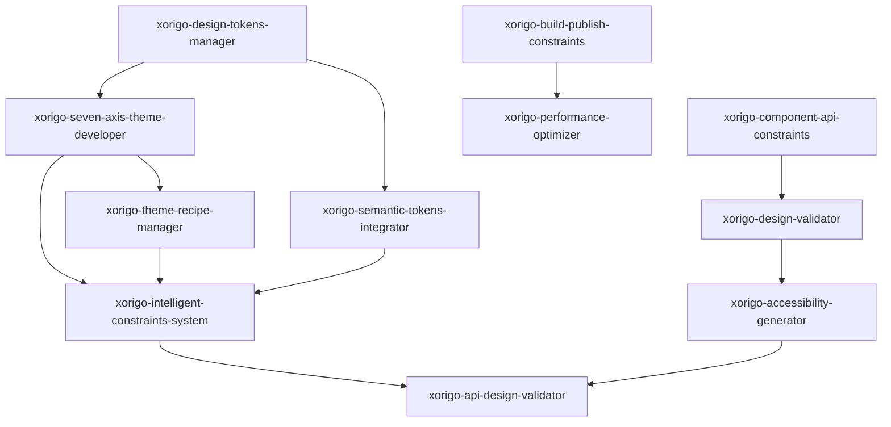

# 🎨 Xorigo UI Skills 目录

基于 Xorigo UI v1.4 SSOT (单一事实来源) 的专门化技能集合，为 Xorigo UI 组件库开发提供强约束和标准化支持。

## 🎯 技能重组说明

基于冗余审查结果，对技能进行了重新分类和边界明确化，确保每个技能都有明确的职责范围。

---

## 📋 核心技能体系 (22个)

### 🎨 主题系统核心 (5个) - 完整主题开发生态

| 技能名称 | 主要功能 | 独特价值 | 优先级 |
|-----------|---------|---------|---------|
| **xorigo-seven-axis-theme-developer** | 七轴主题系统开发 | 核心开发引擎 | 🔥 **极高** |
| **xorigo-design-tokens-manager** | 设计令牌管理 | 标准化令牌体系 | 🔥 **极高** |
| **xorigo-theme-recipe-manager** | 主题配方管理器 | 20+配方管理 | 🔥 **极高** |
| **xorigo-theme-tester** | 主题测试器 | 10主题自动化测试 | 🔥 **极高** |
| **xorigo-intelligent-constraints-system** | 智能约束系统 | 可访问性约束 + 冲突解决 | 🔥 **极高** |

### 🔧 组件开发生态 (7个) - 完整组件开发流程

| 技能名称 | 主要功能 | 独特价值 | 优先级 |
|-----------|---------|---------|---------|
| **xorigo-component-generator** | 标准组件生成器 | 标准模板生成 | 🔥 **极高** |
| **xorigo-component-api-constraints** | React组件API约束器 | **React专用API标准 + 验证生成** | 🔥 **极高** |
| **xorigo-component-testing-generator** | 组件测试生成器 | 测试用例自动生成 | 🔥 **极高** |
| **xorigo-component-variants-standard** | 组件变体标准器 | 变体规范化 | 🔥 **极高** |
| **xorigo-accessibility-generator** | 可访问性生成器 | WCAG 2.1 AA合规 | 🔥 **极高** |
| **xorigo-design-validator** | 设计系统验证器 | 设计令牌+主题兼容性 | 🔥 **极高** |
| **xorigo-code-quality-guard** | 代码质量守护者 | 全方位代码质量检查 | 🔥 **极高** |
| **xorigo-performance-optimizer** | 性能优化器 | 系统性能优化 | 🔥 **极高** |

### 📚 文档与开发生态 (5个) - 知识管理和流程

| 技能名称 | 主要功能 | 独特价值 | 优先级 |
|-----------|---------|---------|---------|
| **xorigo-docs-generator** | 文档生成器 | 自动化文档生成 | 🔥 **极高** |
| **xorigo-docs-structure-helper** | 文档结构助手 | 文档规范化管理 | 🔥 **极高** |
| **xorigo-tech-stack-docs-querier** | 技术栈文档查询器 | 技术文档检索 | ⚡ **中等** |
| **xorigo-migration-audit-archiver** | 迁移审计归档器 | 迁移过程记录 | ⚡ **中等** |
| **xorigo-migration-architecture-validator** | 迁移架构验证器 | 架构迁移合规性 | ⚡ **中等** |

### 🚀 构建与发布生态 (4个) - 自动化CI/CD

| 技能名称 | 主要功能 | 独特价值 | 优先级 |
|-----------|---------|---------|---------|
| **xorigo-build-publish-constraints** | 构建发布约束器 | 完整构建发布流程 | 🔥 **极高** |
| **xorigo-test-automation** | 测试自动化器 | 全流程测试自动化 | 🔥 **极高** |
| **xorigo-nextjs-architect-optimizer** | Next.js架构优化器 | 前端架构优化 | ⚡ **中等** |
| **xorigo-docker-unified-manager** | Docker统一管理器 | 容器化环境管理 | ⚡ **中等** |

### 🔄 主题集成系统 (1个) - 系统集成层

| 技能名称 | 主要功能 | 独特价值 | 优先级 |
|-----------|---------|---------|---------|
| **xorigo-semantic-tokens-integrator** | 语义令牌集成器 | 七轴配方系统集成 | 🔥 **极高** |

### 📊 配方与注册 (1个) - 配方管理

| 技能名称 | 主要功能 | 独特价值 | 优先级 |
|-----------|---------|---------|---------|
| **xorigo-recipe-registry-manager** | 配方注册管理器 | 配方注册与分发 | ⚡ **中等** |

---

## 🎯 技能边界明确化

### 🚨 **高优先级技能边界**

#### 主题系统核心技能边界
- **xorigo-seven-axis-theme-developer**: 仅负责主题轴开发和配方创建
- **xorigo-design-tokens-manager**: 仅负责 foundations层令牌
- **xorigo-theme-recipe-manager**: 仅负责 recipes 目录管理
- **xorigo-theme-tester**: 仅负责主题兼容性测试
- **xorigo-intelligent-constraints-system**: 仅负责约束规则和冲突解决

#### 组件开发生态技能边界
- **xorigo-component-generator**: 仅负责标准组件模板生成
- **xorigo-component-api-constraints**: **唯一**负责React组件API约束 + API验证生成
- **xorigo-design-validator**: 集成设计令牌+主题+可访问性验证
- **xorigo-code-quality-guard**: 仅负责代码质量检查（不包含API设计）

### ⚠️ **中等优先级技能边界**

#### 文档与开发生态
- **xorigo-docs-generator**: 自动化文档生成
- **xorigo-docs-structure-helper**: 文档结构规范化
- **xorigo-tech-stack-docs-querier**: 技术文档检索（可考虑整合）

#### 构建与发布生态
- **xorigo-build-publish-constraints**: 构建发布流程管控
- **xorigo-test-automation**: 测试自动化（与build-publish协调）
- **xorigo-nextjs-architect-optimizer**: Next.js特定优化
- **xorigo-docker-unified-manager**: Docker环境管理

### 🔄 **系统边界集成层**

#### 主题系统集成
- **xorigo-semantic-tokens-integrator**: 七轴配方系统与令牌系统桥接

#### 配方管理系统
- **xorigo-recipe-registry-manager**: 配方注册和分发管理

---

## 🎯 去除重复功能的建议

### ✅ **已完成的技能合并**

#### API设计技能整合
```
✅ xorigo-api-design-validator (1009行)
↓
已整合到 xorigo-component-api-constraints v1.4.1 中
```

**完成的功能**:
- API设计验证器功能完全合并
- 组件接口生成器功能集成
- API一致性检查器功能保留
- 迁移助手功能增强
- 版本升级至 v1.4.1

### ⚠️ **功能重复但暂时保留**

#### 技能重叠但领域不同
- **API设计**: xorigo-component-api-constraints (React) vs xorigo-design-validator (通用)
- **质量检查**: xorigo-code-quality-guard (代码) vs xorigo-design-validator (设计)
- **性能优化**: xorigo-performance-optimizer (运行时) vs 各技能中的性能检查

**保持原因**: 每个技能的检查维度和工具都不同

---

## 🚀 使用指南

### 🎨 主题系统完整工作流
```bash
# 1. 创建新主题配方
"使用 xorigo-seven-axis-theme-developer 创建七轴主题配置"

# 2. 管理设计令牌
"使用 xorigo-design-tokens-manager 标准化色彩和间距令牌"

# 3. 管理主题配方
"使用 xorigo-theme-recipe-manager 管理20+主题配方"

# 4. 测试主题兼容性
"使用 xorigo-theme-tester 自动测试10种主题"

# 5. 验证约束规则
"使用 xorigo-intelligent-constraints-system 验证七轴约束规则"
```

### 🔧 组件开发完整工作流
```bash
# 1. 创建标准化组件
"使用 xorigo-component-generator 生成React组件模板"

# 2. 应用API约束
"使用 xorigo-component-api-constraints 确保API一致性"

# 3. 生成测试用例
"使用 xorigo-component-testing-generator 生成完整测试"

# 4. 确保可访问性
"使用 xorigo-accessibility-generator 实现WCAG 2.1 AA合规"

# 5. 验证设计合规性
"使用 xorigo-design-validator 检查设计令牌使用"

# 6. 代码质量检查
"使用 xorigo-code-quality-guard 检查代码规范"

# 7. 性能优化
"使用 xorigo-performance-optimizer 优化组件性能"
```

### 📚 文档自动化工作流
```bash
# 1. 生成API文档
"使用 xorigo-docs-generator 自动生成组件API文档"

# 2. 规范化文档结构
"使用 xorigo-docs-structure-helper 确保文档结构一致"

# 3. 技术文档查询
"使用 xorigo-tech-stack-docs-querier 查询技术文档"
```

### 🚀 构建发布自动化工作流
```bash
# 1. 构建验证
"使用 xorigo-build-publish-constraints 验证构建环境"

# 2. 测试验证
"使用 xorigo-test-automation 执行自动化测试"

# 3. 发布前检查
"使用 xorigo-build-publish-constraints 执行发布前验证"

# 4. 性能优化
"使用 xorigo-performance-optimizer 优化发布包"
```

### 🔄 系统集成工作流
```bash
# 主题系统集成
"使用 xorigo-semantic-tokens-integrator 集成七轴配方系统"

# 配方注册管理
"使用 xorigo-recipe-registry-manager 管理配方注册"
```

## 🎯 使用指南

### 主题系统开发

```bash
# 创建新主题配方
"使用 xorigo-seven-axis-theme-developer 创建主题配置"

# 管理设计令牌
"使用 xorigo-design-tokens-manager 管理色彩和间距令牌"

# 验证主题合规性
"使用 xorigo-intelligent-constraints-system 验证约束规则"
```

### 组件开发

```bash
# 创建标准化组件
"使用 xorigo-component-api-constraints 创建新组件"

# 验证设计合规性
"使用 xorigo-design-validator 验证组件设计"

# 确保可访问性
"使用 xorigo-accessibility-generator 检查可访问性"
```

### 构建发布

```bash
# 验证构建配置
"使用 xorigo-build-publish-constraints 检查构建环境"

# 发布前验证
"使用 xorigo-build-publish-constraints 执行发布前检查"

# 性能优化
"使用 xorigo-performance-optimizer 优化包大小"
```

### 架构迁移

```bash
# 完整架构迁移
"使用 xorigo-migration-architecture-validator 执行完整迁移流程"

# 单文件迁移验证
"使用 xorigo-migration-architecture-validator 验证单文件迁移合规性"

# 冲突检测和解决
"使用 xorigo-migration-architecture-validator 检测并解决迁移冲突"
```

## 🔗 Skills 依赖关系



## 🎨 技能激活模式

### 自动激活条件

1. **主题相关操作**：
   - 修改 `system/` 目录文件
   - 创建或修改主题配方
   - 调整七轴配置
   - 验证主题兼容性

2. **组件开发操作**：
   - 创建新组件文件
   - 修改组件 API 接口
   - 添加新变体或状态
   - 组件代码审查

3. **构建发布操作**：
   - 修改构建配置
   - 更新包版本
   - 执行发布流程
   - CI/CD 配置

4. **架构迁移操作**：
   - 修改 src-archived 目录
   - 执行文件迁移操作
   - 重组目录结构
   - 处理迁移冲突

### 手动激活命令

```bash
# 主题系统
/claude skill xorigo-seven-axis-theme-developer
/claude skill xorigo-design-tokens-manager
/claude skill xorigo-theme-recipe-manager
/claude skill xorigo-intelligent-constraints-system

# 组件开发
/claude skill xorigo-component-api-constraints
/claude skill xorigo-design-validator

# 构建发布
/claude skill xorigo-build-publish-constraints

# 架构迁移
/claude skill xorigo-migration-architecture-validator
```

## 📊 质量保证体系

### 分层验证机制

1. **Foundations 层**：设计令牌标准化验证
2. **System 层**：七轴主题系统和约束逻辑验证
3. **Primitives 层**：原子组件 API 设计验证
4. **Components 层**：复合组件组合模式验证
5. **Build 层**：构建产物和发布流程验证

### 约束优先级

- **P0 (强制)**：安全、可访问性、核心功能
- **P1 (重要)**：性能、用户体验、最佳实践
- **P2 (建议)**：代码质量、文档完整性
- **P3 (可选)**：优化建议、增强功能

## 🛠️ 扩展指南

### 创建新 Skill

1. **确定职责范围**：明确技能的核心职责和边界
2. **设计 API 接口**：定义输入输出格式
3. **实现核心逻辑**：基于 SSOT 文档实现功能
4. **添加验证规则**：确保符合设计系统规范
5. **编写文档**：详细的使用说明和示例

### 集成现有 Skills

1. **识别依赖关系**：明确技能间的依赖和调用关系
2. **设计数据流**：确保数据在技能间正确传递
3. **处理冲突解决**：定义优先级和冲突解决机制
4. **统一错误处理**：标准化的错误处理和反馈

## 📚 文档结构

每个 Skill 包含以下文档：

```
.claude/skills/[skill-name]/
├── SKILL.md              # 技能定义和说明
├── examples/             # 使用示例
├── tests/               # 测试用例
└── docs/               # 详细文档
    ├── api.md           # API 文档
    ├── guides.md        # 使用指南
    └── troubleshooting.md  # 故障排除
```

## 🎯 核心原则

1. **SSOT 优先**：所有技能基于 v1.4 单一事实源文档
2. **强约束设计**：严格的验证和自动修复机制
3. **自动化集成**：与 CI/CD 和开发工具链深度集成
4. **开发者友好**：清晰的错误提示和修复建议
5. **持续改进**：基于用户反馈和数据分析持续优化

基于 Xorigo UI v1.4 SSOT，这套 Skills 体系为 Xorigo UI 组件库的开发提供全方位的标准化支持和质量保障。