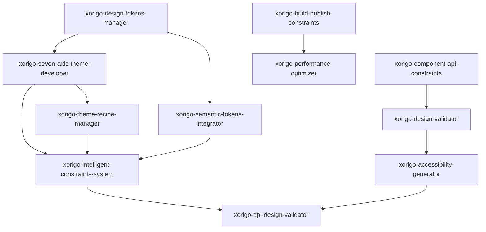

# 🎨 Xorigo UI Skills 目录

基于 Xorigo UI v1.4 SSOT (单一事实来源) 的专门化技能集合，为 Xorigo UI 组件库开发提供强约束和标准化支持。

## 📋 Skills 总览

### 🎯 主题系统相关 Skills

| Skill 名称 | 功能描述 | 核心职责 | 触发场景 |
|-----------|---------|---------|---------|
| **xorigo-seven-axis-theme-developer** | 七轴主题系统开发器 | 七轴主题轴控制、智能约束逻辑 | 主题配置、配方创建、约束验证 |
| **xorigo-design-tokens-manager** | 设计令牌管理器 | foundations/ 层令牌标准化 | 令牌生成、验证、CSS 变量输出 |
| **xorigo-theme-recipe-manager** | 主题配方管理器 | recipes/ 目录配方管理 | 配方创建、注册表维护、验证 |
| **xorigo-intelligent-constraints-system** | 智能约束系统 | A11y Guard、冲突自动解决 | 约束验证、可访问性检查、冲突解决 |

### 🔧 组件开发相关 Skills

| Skill 名称 | 功能描述 | 核心职责 | 触发场景 |
|-----------|---------|---------|---------|
| **xorigo-component-api-constraints** | 组件 API 设计约束器 | 组件接口标准化、React 模式规范 | API 设计、组件创建、接口验证 |
| **xorigo-design-validator** | 设计系统验证器 | 设计令牌使用、主题兼容性验证 | 组件审查、设计合规检查、可访问性测试 |

### 🚀 构建发布相关 Skills

| Skill 名称 | 功能描述 | 核心职责 | 触发场景 |
|-----------|---------|---------|---------|
| **xorigo-build-publish-constraints** | 构建发布约束器 | 构建流程、版本控制、NPM 发布 | 构建验证、发布前检查、CI/CD 配置 |

### 🔄 架构迁移相关 Skills

| Skill 名称 | 功能描述 | 核心职责 | 触发场景 |
|-----------|---------|---------|---------|
| **xorigo-migration-architecture-validator** | 迁移架构验证器 | 旧版本到新架构迁移验证、Skills协调 | 架构迁移、文件重组、兼容性检查 |

### 🛠️ 现有相关 Skills

| Skill 名称 | 功能描述 | 核心职责 | 触发场景 |
|-----------|---------|---------|---------|
| **xorigo-semantic-tokens-integrator** | 语义令牌集成器 | 七轴配方系统集成、令牌映射 | 主题切换、配方应用、令牌生成 |
| **xorigo-accessibility-generator** | 可访问性生成器 | ARIA 属性、键盘导航、对比度检查 | 组件可访问性实现、WCAG 合规 |
| **xorigo-performance-optimizer** | 性能优化器 | 包大小优化、渲染性能、懒加载 | 性能分析、优化建议、代码分割 |
| **xorigo-api-design-validator** | API 设计验证器 | 接口一致性、类型安全、最佳实践 | API 审查、设计模式验证 |

## 🎯 使用指南

### 主题系统开发

```bash
# 创建新主题配方
"使用 xorigo-seven-axis-theme-developer 创建主题配置"

# 管理设计令牌
"使用 xorigo-design-tokens-manager 管理色彩和间距令牌"

# 验证主题合规性
"使用 xorigo-intelligent-constraints-system 验证约束规则"
```

### 组件开发

```bash
# 创建标准化组件
"使用 xorigo-component-api-constraints 创建新组件"

# 验证设计合规性
"使用 xorigo-design-validator 验证组件设计"

# 确保可访问性
"使用 xorigo-accessibility-generator 检查可访问性"
```

### 构建发布

```bash
# 验证构建配置
"使用 xorigo-build-publish-constraints 检查构建环境"

# 发布前验证
"使用 xorigo-build-publish-constraints 执行发布前检查"

# 性能优化
"使用 xorigo-performance-optimizer 优化包大小"
```

### 架构迁移

```bash
# 完整架构迁移
"使用 xorigo-migration-architecture-validator 执行完整迁移流程"

# 单文件迁移验证
"使用 xorigo-migration-architecture-validator 验证单文件迁移合规性"

# 冲突检测和解决
"使用 xorigo-migration-architecture-validator 检测并解决迁移冲突"
```

## 🔗 Skills 依赖关系



## 🎨 技能激活模式

### 自动激活条件

1. **主题相关操作**：
   - 修改 `system/` 目录文件
   - 创建或修改主题配方
   - 调整七轴配置
   - 验证主题兼容性

2. **组件开发操作**：
   - 创建新组件文件
   - 修改组件 API 接口
   - 添加新变体或状态
   - 组件代码审查

3. **构建发布操作**：
   - 修改构建配置
   - 更新包版本
   - 执行发布流程
   - CI/CD 配置

4. **架构迁移操作**：
   - 修改 src-archived 目录
   - 执行文件迁移操作
   - 重组目录结构
   - 处理迁移冲突

### 手动激活命令

```bash
# 主题系统
/claude skill xorigo-seven-axis-theme-developer
/claude skill xorigo-design-tokens-manager
/claude skill xorigo-theme-recipe-manager
/claude skill xorigo-intelligent-constraints-system

# 组件开发
/claude skill xorigo-component-api-constraints
/claude skill xorigo-design-validator

# 构建发布
/claude skill xorigo-build-publish-constraints

# 架构迁移
/claude skill xorigo-migration-architecture-validator
```

## 📊 质量保证体系

### 分层验证机制

1. **Foundations 层**：设计令牌标准化验证
2. **System 层**：七轴主题系统和约束逻辑验证
3. **Primitives 层**：原子组件 API 设计验证
4. **Components 层**：复合组件组合模式验证
5. **Build 层**：构建产物和发布流程验证

### 约束优先级

- **P0 (强制)**：安全、可访问性、核心功能
- **P1 (重要)**：性能、用户体验、最佳实践
- **P2 (建议)**：代码质量、文档完整性
- **P3 (可选)**：优化建议、增强功能

## 🛠️ 扩展指南

### 创建新 Skill

1. **确定职责范围**：明确技能的核心职责和边界
2. **设计 API 接口**：定义输入输出格式
3. **实现核心逻辑**：基于 SSOT 文档实现功能
4. **添加验证规则**：确保符合设计系统规范
5. **编写文档**：详细的使用说明和示例

### 集成现有 Skills

1. **识别依赖关系**：明确技能间的依赖和调用关系
2. **设计数据流**：确保数据在技能间正确传递
3. **处理冲突解决**：定义优先级和冲突解决机制
4. **统一错误处理**：标准化的错误处理和反馈

## 📚 文档结构

每个 Skill 包含以下文档：

```
.claude/skills/[skill-name]/
├── SKILL.md              # 技能定义和说明
├── examples/             # 使用示例
├── tests/               # 测试用例
└── docs/               # 详细文档
    ├── api.md           # API 文档
    ├── guides.md        # 使用指南
    └── troubleshooting.md  # 故障排除
```

## 🎯 核心原则

1. **SSOT 优先**：所有技能基于 v1.4 单一事实源文档
2. **强约束设计**：严格的验证和自动修复机制
3. **自动化集成**：与 CI/CD 和开发工具链深度集成
4. **开发者友好**：清晰的错误提示和修复建议
5. **持续改进**：基于用户反馈和数据分析持续优化

基于 Xorigo UI v1.4 SSOT，这套 Skills 体系为 Xorigo UI 组件库的开发提供全方位的标准化支持和质量保障。