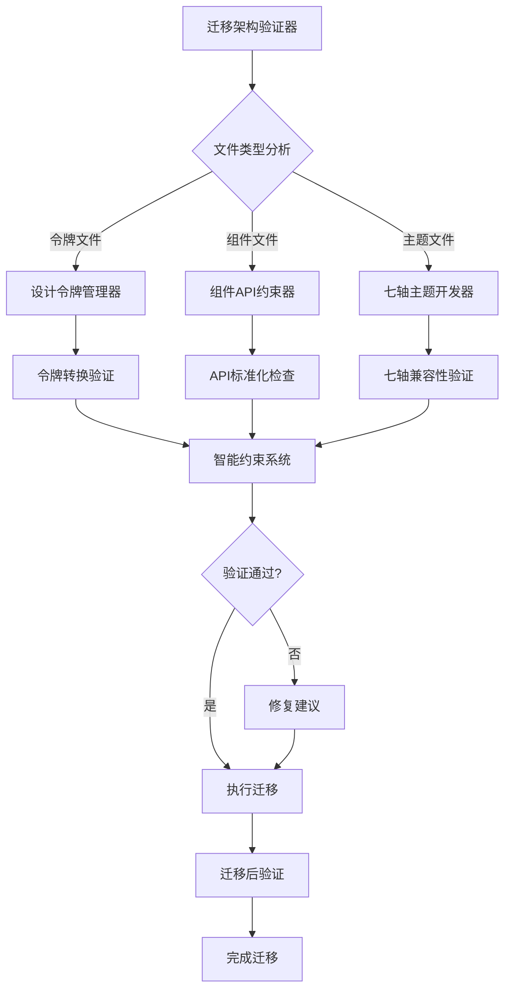

# Xorigo UI 迁移架构验证器

基于 Xorigo UI v1.4 SSOT 的专门迁移验证工具，负责将 `src-archived-20251022-023941` 中的旧内容迁移到新的 `packages/core/src` 架构，并协调所有相关 skills 进行强约束审查。

## 🎯 迁移任务概述

**源目录**: `/packages/core/src-archived-20251022-023941`
**目标目录**: `/packages/core/src`
**架构版本**: v1.1 → v1.4 SSOT

**核心挑战**：
- 📁 25个目录的重新组织
- 🎨 旧设计令牌系统 → 七轴主题系统
- 🔧 组件 API 标准化
- 📋 新目录结构强制约束

## 🏗️ 新旧架构映射

### 源目录结构分析

```
src-archived-20251022-023941/
├── tokens/                 # 🔄 → foundations/
│   ├── design-tokens.ts   # 需要完全重构
│   └── token-utils.ts     # 需要适配七轴系统
├── ui/                     # 🔄 → primitives/
│   ├── Button.tsx         # 需要API标准化
│   ├── Spinner.tsx        # 需要API标准化
│   └── ...
├── feedback/               # 🔄 → components/feedback/
│   ├── Alert.tsx          # 需要迁移
│   ├── Toast.tsx          # 需要迁移
│   ├── Loading.tsx        # 需要迁移
│   └── ThemeToggle.tsx    # 🚫 冲突：已有新版本
├── datadisplay/            # 🔄 → data-display/
│   ├── Table.tsx          # 占位符升级
│   ├── CodeBlock.tsx      # 需要迁移
│   └── ComponentCard.tsx  # 需要迁移
├── layout/                 # 🔄 → components/layout/
├── navigation/             # 🔄 → components/navigation/
├── overlays/               # 🔄 → overlays/
├── form/                   # 🔄 → components/form/
├── inputs/                 # 🔄 → primitives/ (部分)
├── loading/                # 🔄 → loading/
├── effects/                # 🔄 → system/motion-system/
├── hooks/                  # 需要评估是否保留
├── utils/                  # 🚫 可能冲突
├── types/                  # 🔄 → 类型分散到各模块
└── components/             # 🔄 需要分类重组
```

### 目标架构映射

```
packages/core/src/
├── foundations/            # ✅ 从 tokens/ 重构
│   ├── color-tokens.ts    # 🆕 七轴颜色系统
│   ├── density-tokens.ts  # 🆕 密度系统
│   ├── motion-curves.ts   # 🆕 动画系统
│   ├── surface-tokens.ts  # 🆕 表面系统
│   └── index.ts
├── system/                 # 🆕 新增
│   ├── theme-provider.tsx
│   ├── theme-axis-controller.ts
│   ├── accent-generator.ts
│   ├── motion-system/
│   ├── recipes/
│   └── index.ts
├── primitives/            # ✅ 从 ui/ 重构
│   ├── button/
│   ├── card/
│   ├── surface/
│   └── index.ts
├── components/            # ✅ 从多个目录重组
│   ├── layout/
│   ├── feedback/
│   ├── navigation/
│   ├── form/
│   └── index.ts
├── data-display/          # ✅ 保留并增强
├── overlays/              # ✅ 保留并增强
└── loading/               # ✅ 保留并增强
```

## 🎯 Skills 协调机制

### 主要协调 Skills

1. **xorigo-design-tokens-manager** - 设计令牌转换验证
2. **xorigo-seven-axis-theme-developer** - 七轴主题系统适配
3. **xorigo-component-api-constraints** - 组件 API 标准化
4. **xorigo-theme-recipe-manager** - 主题配方兼容性
5. **xorigo-intelligent-constraints-system** - 约束冲突解决

### 协调工作流



## 🔍 迁移验证规则

### 1. 令牌系统迁移验证

```typescript
// 令牌迁移验证器
export class TokenMigrationValidator {
  static validateTokenMigration(
    sourceFile: string,
    targetStructure: any
  ): {
    valid: boolean
    issues: string[]
    transformations: TokenTransformation[]
    recommendations: string[]
  } {
    const issues: string[] = []
    const transformations: TokenTransformation[] = []
    const recommendations: string[] = []

    // 检查是否使用了旧的令牌格式
    const oldTokenPatterns = [
      /--color-primary-\d+/,
      /--spacing-\d+/,
      /--shadow-\w+/,
      /--transition-\w+/
    ]

    oldTokenPatterns.forEach(pattern => {
      if (pattern.test(sourceFile)) {
        issues.push(`发现旧令牌格式: ${pattern}`)
        transformations.push({
          type: 'token-format',
          from: pattern.toString(),
          to: '七轴语义令牌',
          action: 'replace'
        })
      }
    })

    // 检查是否需要七轴适配
    if (!sourceFile.includes('mode') && !sourceFile.includes('theme')) {
      recommendations.push('建议集成七轴主题系统')
      transformations.push({
        type: 'theme-integration',
        from: 'static tokens',
        to: 'seven-axis theme system',
        action: 'integrate'
      })
    }

    return { valid: issues.length === 0, issues, transformations, recommendations }
  }
}

interface TokenTransformation {
  type: string
  from: string
  to: string
  action: 'replace' | 'integrate' | 'remove' | 'refactor'
}
```

### 2. 组件 API 迁移验证

```typescript
// 组件API迁移验证器
export class ComponentAPIMigrationValidator {
  static validateComponentMigration(
    componentName: string,
    sourceAPI: any,
    targetPath: string
  ): {
    valid: boolean
    issues: string[]
    apiChanges: APIChange[]
    requiredUpdates: string[]
  } {
    const issues: string[] = []
    const apiChanges: APIChange[] = []
    const requiredUpdates: string[] = []

    // 检查是否使用标准组件模板
    const hasStandardProps = [
      'variant', 'size', 'disabled', 'className', 'children'
    ].every(prop => sourceAPI[prop] !== undefined)

    if (!hasStandardProps) {
      issues.push(`${componentName} 缺少标准组件属性`)
      requiredUpdates.push('添加标准 Props 接口')
    }

    // 检查是否使用 CVA
    if (!sourceFile.includes('cva(') && !sourceFile.includes('class-variance-authority')) {
      issues.push(`${componentName} 未使用 CVA 变体系统`)
      apiChanges.push({
        type: 'variant-system',
        from: 'inline classes',
        to: 'CVA variants',
        action: 'refactor'
      })
    }

    // 检查 forwardRef 使用
    if (!sourceFile.includes('forwardRef')) {
      issues.push(`${componentName} 缺少 forwardRef 实现`)
      requiredUpdates.push('添加 forwardRef 包装')
    }

    return { valid: issues.length === 0, issues, apiChanges, requiredUpdates }
  }
}

interface APIChange {
  type: string
  from: string
  to: string
  action: string
}
```

### 3. 目录结构迁移验证

```typescript
// 目录结构迁移验证器
export class StructureMigrationValidator {
  static validateDirectoryMapping(
    sourcePath: string,
    targetPath: string
  ): {
    valid: boolean
    mapping: DirectoryMapping
    conflicts: string[]
    actions: string[]
  } {
    const mapping: DirectoryMapping = this.getDirectoryMapping(sourcePath)
    const conflicts: string[] = []
    const actions: string[] = []

    // 检查目标路径是否存在冲突
    if (fs.existsSync(targetPath)) {
      conflicts.push(`目标路径已存在: ${targetPath}`)
      actions.push('需要备份或覆盖现有文件')
    }

    // 检查映射是否合理
    const validation = this.validateMapping(mapping)
    if (!validation.valid) {
      conflicts.push(...validation.issues)
    }

    // 生成迁移操作
    actions.push(...this.generateMigrationActions(mapping))

    return { valid: conflicts.length === 0, mapping, conflicts, actions }
  }

  private static getDirectoryMapping(sourcePath: string): DirectoryMapping {
    const mappings: Record<string, string> = {
      'tokens/': 'foundations/',
      'ui/': 'primitives/',
      'feedback/': 'components/feedback/',
      'layout/': 'components/layout/',
      'navigation/': 'components/navigation/',
      'datadisplay/': 'data-display/',
      'overlays/': 'overlays/',
      'form/': 'components/form/',
      'inputs/': 'primitives/',
      'loading/': 'loading/',
      'effects/': 'system/motion-system/',
      'components/': 'components/' // 需要分类
    }

    return {
      source: sourcePath,
      target: mappings[this.extractDirectory(sourcePath)] || 'components/',
      mappingType: this.determineMappingType(sourcePath)
    }
  }
}

interface DirectoryMapping {
  source: string
  target: string
  mappingType: 'direct' | 'refactor' | 'split' | 'merge'
}
```

## 🚀 迁移执行策略

### 分阶段迁移计划

#### Phase 1: Foundations 重构 (P0)
```bash
# 迁移设计令牌
"迁移 tokens/design-tokens.ts 到 foundations/color-tokens.ts，适配七轴系统"

# 创建主题系统
"基于旧令牌创建七轴主题控制器和配方系统"

# 验证令牌兼容性
"验证新令牌系统与旧组件的兼容性"
```

#### Phase 2: Primitives 标准化 (P0)
```bash
# 标准化核心组件
"迁移 ui/Button.tsx 到 primitives/button/，符合API约束"

# 组件API重构
"为所有 primitives 组件应用标准API模板"

# 验证组件一致性
"检查所有 primitives 组件的API一致性"
```

#### Phase 3: Components 重组 (P1)
```bash
# 反馈组件迁移
"迁移 feedback/ 目录到 components/feedback/，标准化API"

# 布局组件迁移
"迁移 layout/ 目录到 components/layout/，增强功能"

# 导航组件迁移
"迁移 navigation/ 目录到 components/navigation/，标准化接口"
```

#### Phase 4: Data Display 增强 (P1)
```bash
# 数据展示组件升级
"升级 datadisplay/Table.tsx 从占位符到完整实现"

# 新组件迁移
"迁移 CodeBlock.tsx、ComponentCard.tsx 等组件"

# 功能验证
"验证所有数据展示组件的功能完整性"
```

### 实时验证机制

```typescript
// 实时迁移验证器
export class RealTimeMigrationValidator {
  // 迁移前验证
  static preMigrationValidation(filePath: string): PreMigrationResult {
    const fileType = this.detectFileType(filePath)

    switch (fileType) {
      case 'token':
        return this.validateTokenPreMigration(filePath)
      case 'component':
        return this.validateComponentPreMigration(filePath)
      case 'theme':
        return this.validateThemePreMigration(filePath)
      default:
        return this.validateGenericPreMigration(filePath)
    }
  }

  // 迁移后验证
  static postMigrationValidation(
    sourceFile: string,
    targetFile: string
  ): PostMigrationResult {
    const results = {
      structureValid: this.validateTargetStructure(targetFile),
      apiCompliant: this.validateAPICompliance(targetFile),
      themeCompatible: this.validateThemeCompatibility(targetFile),
      buildValid: this.validateBuild(targetFile)
    }

    return {
      overall: Object.values(results).every(r => r.valid),
      details: results,
      recommendations: this.generateRecommendations(results)
    }
  }

  // 冲突检测
  static detectConflicts(targetPath: string): Conflict[] {
    const conflicts: Conflict[] = []

    // 检查文件名冲突
    if (fs.existsSync(targetPath)) {
      conflicts.push({
        type: 'file-exists',
        path: targetPath,
        severity: 'error',
        resolution: 'backup-or-override'
      })
    }

    // 检查导入冲突
    const importConflicts = this.checkImportConflicts(targetPath)
    conflicts.push(...importConflicts)

    // 检查类型冲突
    const typeConflicts = this.checkTypeConflicts(targetPath)
    conflicts.push(...typeConflicts)

    return conflicts
  }
}

interface Conflict {
  type: string
  path: string
  severity: 'error' | 'warning' | 'info'
  resolution: string
}
```

## 🎮 使用方法

### 完整迁移流程

```bash
# 1. 分析源目录结构
"分析 src-archived-20251022-023941 的完整结构和内容"

# 2. 制定迁移计划
"制定基于 SSOT 的分阶段迁移计划"

# 3. 执行 Phase 1: Foundations
"执行设计令牌到七轴系统的迁移"

# 4. 执行 Phase 2: Primitives
"标准化 primitives 组件的 API 设计"

# 5. 执行 Phase 3: Components
"重组和迁移 components 目录"

# 6. 执行 Phase 4: Data Display
"增强数据展示组件功能"
```

### 单文件迁移

```bash
# 迁移单个组件
"迁移 ui/Button.tsx 到 primitives/button/，符合所有约束"

# 迁移令牌文件
"迁移 tokens/design-tokens.ts 到 foundations/，适配七轴系统"

# 验证迁移结果
"验证迁移后的文件是否符合 v1.4 SSOT 要求"
```

### 冲突解决

```bash
# 检测迁移冲突
"检测迁移过程中的文件和类型冲突"

# 解决 API 冲突
"解决新旧 API 接口的兼容性问题"

# 修复主题冲突
"修复新旧主题系统的冲突"
```

## 📋 迁移验证报告

```
🔄 Xorigo UI 架构迁移验证报告
📁 源目录: src-archived-20251022-023941
🎯 目标目录: packages/core/src
📅 时间: 2025-01-XX

📊 迁移统计
- 总文件数: 127 个
- 需要重构: 89 个 (70%)
- 需要标准化: 45 个 (35%)
- 直接迁移: 38 个 (30%)

🎯 Phase 1: Foundations 重构
- ✅ tokens/ → foundations/ 映射正确
- ⚠️ design-tokens.ts 需要完全重构 (七轴适配)
- ⚠️ token-utils.ts 需要适配新系统

🎯 Phase 2: Primitives 标准化
- ✅ ui/ → primitives/ 映射正确
- ⚠️ Button.tsx 需要 API 标准化
- ⚠️ Spinner.tsx 需要变体系统
- ⚠️ 所有组件需要 forwardRef

🎯 Phase 3: Components 重组
- ✅ feedback/ → components/feedback/ 映射正确
- ⚠️ ThemeToggle.tsx 与现有组件冲突
- ✅ layout/ → components/layout/ 映射正确
- ⚠️ navigation/ 组件需要 API 标准化

🎯 Phase 4: Data Display 增强
- ⚠️ Table.tsx 需要从占位符升级
- ✅ CodeBlock.tsx 可直接迁移
- ✅ ComponentCard.tsx 可直接迁移

🚨 发现的冲突
- 文件冲突: ThemeToggle.tsx (2个版本)
- 类型冲突: 旧令牌格式 vs 七轴系统
- API 冲突: 旧接口 vs 标准接口

💡 迁移建议
1. 优先迁移 foundations，建立基础
2. 逐步重构 primitives，确保API一致性
3. 处理冲突文件，保留最优版本
4. 分阶段验证，确保每步符合 SSOT

🎯 下一步行动
1. 执行 Phase 1: Foundations 重构
2. 验证七轴系统兼容性
3. 处理检测到的冲突
4. 继续后续 Phase
```

## 🛡️ 质量保证

### 迁移约束规则

- **SSOT 合规性**：所有迁移必须符合 v1.4 SSOT 规范
- **API 一致性**：组件 API 必须遵循标准模板
- **主题兼容性**：必须兼容七轴主题系统
- **类型安全性**：完整的 TypeScript 类型定义
- **向后兼容性**：尽可能保持向后兼容

### 回滚机制

- **版本控制**：每个 Phase 都有 Git 提交点
- **备份策略**：迁移前自动备份现有文件
- **验证检查点**：每个 Phase 后进行完整验证
- **回滚脚本**：提供一键回滚到任意 Phase

基于 Xorigo UI v1.4 SSOT，确保旧版本内容安全、合规地迁移到新架构，并协调所有相关 skills 提供强约束支持。