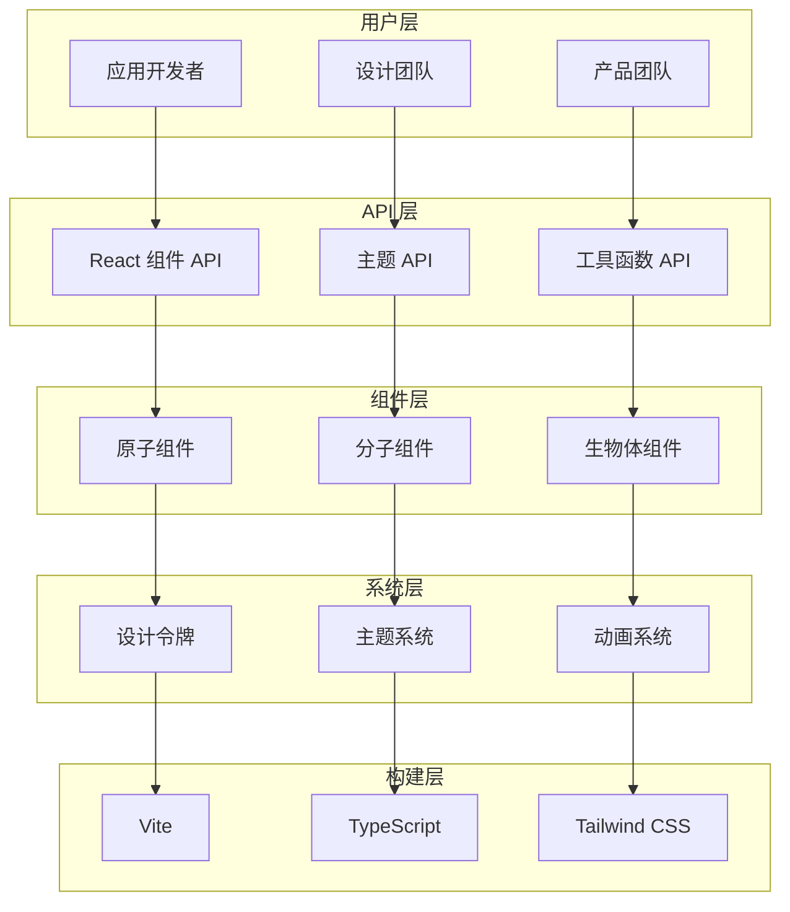
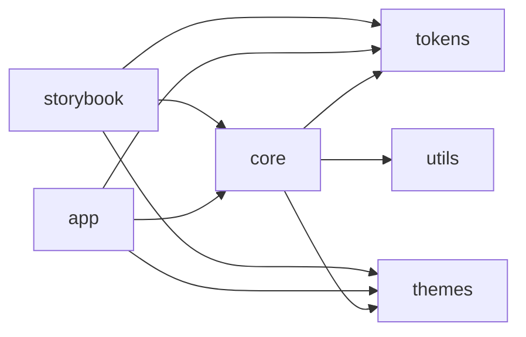
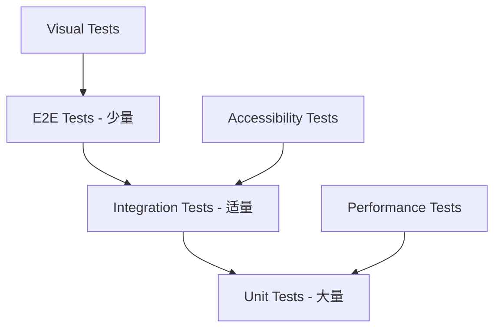

Xorigo UI 采用现代化的架构设计，确保组件库的可维护性、可扩展性和性能。

## 架构概览



## 设计原则

### 1. 原子化设计 (Atomic Design)

我们的组件架构基于原子化设计理念：

```typescript
// 原子 (Atoms) - 最基础的组件
export const Button = () => { /* ... */ }
export const Input = () => { /* ... */ }
export const Icon = () => { /* ... */ }

// 分子 (Molecules) - 原子的简单组合
export const SearchInput = () => (
  <div className="flex">
    <Input />
    <Button>搜索</Button>
  </div>
)

// 生物体 (Organisms) - 复杂的组件组合
export const Header = () => (
  <header className="flex items-center justify-between">
    <Logo />
    <Navigation />
    <SearchInput />
    <UserMenu />
  </header>
)
```

### 2. 组合优于继承

```typescript
// ✅ 推荐：使用组合
const Card = ({ children, className, ...props }) => (
  <div className={cn('card', className)} {...props}>
    {children}
  </div>
)

const CardHeader = ({ children, className, ...props }) => (
  <div className={cn('card-header', className)} {...props}>
    {children}
  </div>
)

// 使用组合
<Card>
  <CardHeader>标题</CardHeader>
  <CardContent>内容</CardContent>
</Card>

// ❌ 避免：复杂的继承
class BaseComponent extends Component { /* ... */ }
class Card extends BaseComponent { /* ... */ }
class Button extends BaseComponent { /* ... */ }
```

### 3. 一致的 API 设计

```typescript
// 标准化的组件 API
interface ComponentProps {
  variant?: 'primary' | 'secondary' | 'outline'
  size?: 'sm' | 'md' | 'lg'
  className?: string
  children?: React.ReactNode
  disabled?: boolean
  onClick?: (event: Event) => void
}
```

## 技术架构

### 包结构

```
@xorigo-ui/
├── core/                 # 核心组件库
│   ├── src/
│   │   ├── components/   # React 组件
│   │   ├── hooks/        # 自定义 Hooks
│   │   ├── utils/        # 工具函数
│   │   ├── types/        # TypeScript 类型
│   │   └── index.ts      # 导出入口
│   ├── package.json
│   └── README.md
├── tokens/               # 设计令牌
│   ├── src/
│   │   ├── colors/       # 颜色系统
│   │   ├── typography/   # 字体系统
│   │   ├── spacing/      # 间距系统
│   │   └── index.ts
│   └── package.json
├── themes/               # 主题系统
│   ├── src/
│   │   ├── default/      # 默认主题
│   │   ├── dark/         # 深色主题
│   │   └── index.ts
│   └── package.json
└── build-tools/          # 构建工具
    ├── vite.config.ts
    ├── tsconfig.json
    └── tailwind.config.js
```

### 依赖关系



## 组件架构

### 组件生命周期

```typescript
// 组件生命周期管理
const ComponentLifecycle = {
  // 1. 组件定义
  define: (component) => {
    // TypeScript 类型检查
    // Props 验证
    // 可访问性检查
  },

  // 2. 样式生成
  generateStyles: (variants, defaultProps) => {
    // 使用 class-variance-authority
    // 生成 CSS 类名
    // 主题集成
  },

  // 3. 文档生成
  generateDocs: (component) => {
    // Props 文档
    // 使用示例
    // 可访问性指南
  },

  // 4. 测试生成
  generateTests: (component) => {
    // 单元测试
    // 可访问性测试
    // 视觉回归测试
  }
}
```

### 状态管理

```typescript
// 轻量级状态管理
const createComponentStore = (initialState) => {
  let state = initialState
  const listeners = new Set()

  return {
    getState: () => state,
    setState: (newState) => {
      state = { ...state, ...newState }
      listeners.forEach(listener => listener(state))
    },
    subscribe: (listener) => {
      listeners.add(listener)
      return () => listeners.delete(listener)
    }
  }
}

// 使用示例
const themeStore = createComponentStore({ theme: 'light' })
```

### 事件系统

```typescript
// 统一的事件处理系统
const createEventEmitter = () => {
  const events = new Map()

  return {
    on: (event, callback) => {
      if (!events.has(event)) {
        events.set(event, new Set())
      }
      events.get(event).add(callback)
    },

    emit: (event, data) => {
      if (events.has(event)) {
        events.get(event).forEach(callback => callback(data))
      }
    },

    off: (event, callback) => {
      if (events.has(event)) {
        events.get(event).delete(callback)
      }
    }
  }
}
```

## 样式架构

### CSS-in-JS vs Utility-First

我们采用 Utility-First 的方法，结合 CSS 变量：

```typescript
// 使用 class-variance-authority 生成变体
const buttonVariants = cva(
  // 基础样式
  'inline-flex items-center justify-center rounded-md font-medium transition-colors',
  {
    variants: {
      variant: {
        primary: 'bg-blue-500 text-white hover:bg-blue-600',
        secondary: 'bg-gray-100 text-gray-900 hover:bg-gray-200',
        outline: 'border border-gray-300 bg-white hover:bg-gray-50',
      },
      size: {
        sm: 'h-8 px-3 text-sm',
        md: 'h-10 px-4 text-base',
        lg: 'h-12 px-6 text-lg',
      }
    },
    defaultVariants: {
      variant: 'primary',
      size: 'md',
    }
  }
)
```

### 主题系统集成

```typescript
// 主题上下文
const ThemeContext = createContext<ThemeContextType | undefined>(undefined)

export const ThemeProvider: React.FC<ThemeProviderProps> = ({
  theme = 'default',
  children
}) => {
  const [currentTheme, setCurrentTheme] = useState(theme)

  const value = useMemo(() => ({
    theme: currentTheme,
    setTheme: setCurrentTheme,
    colors: getThemeColors(currentTheme),
    typography: getThemeTypography(currentTheme),
  }), [currentTheme])

  return (
    <ThemeContext.Provider value={value}>
      <div
        className={cn('theme-provider', `theme-${currentTheme}`)}
        style={getThemeStyles(currentTheme)}
      >
        {children}
      </div>
    </ThemeContext.Provider>
  )
}
```

### 响应式设计

```typescript
// 响应式工具函数
const breakpoints = {
  sm: '640px',
  md: '768px',
  lg: '1024px',
  xl: '1280px',
  '2xl': '1536px'
}

export const responsive = {
  up: (breakpoint: keyof typeof breakpoints) =>
    `@media (min-width: ${breakpoints[breakpoint]})`,

  down: (breakpoint: keyof typeof breakpoints) =>
    `@media (max-width: ${breakpoints[breakpoint]})`,

  between: (start: keyof typeof breakpoints, end: keyof typeof breakpoints) =>
    `@media (min-width: ${breakpoints[start]}) and (max-width: ${breakpoints[end]})`,
}
```

## 构建架构

### Vite 配置

```typescript
// vite.config.ts
export default defineConfig({
  plugins: [
    react(),
    // TypeScript 插件
    dts({
      include: ['src'],
      rollupTypes: true,
    }),
  ],
  build: {
    lib: {
      entry: {
        index: 'src/index.ts',
        theme: 'src/theme/index.ts',
        tokens: 'src/tokens/index.ts',
      },
      formats: ['es', 'cjs'],
    },
    rollupOptions: {
      external: ['react', 'react-dom', 'framer-motion'],
      output: {
        globals: {
          react: 'React',
          'react-dom': 'ReactDOM',
          'framer-motion': 'Motion',
        },
      },
    },
  },
})
```

### TypeScript 配置

```json
{
  "compilerOptions": {
    "strict": true,
    "declaration": true,
    "declarationMap": true,
    "sourceMap": true,
    "target": "ES2020",
    "module": "ESNext",
    "moduleResolution": "bundler",
    "allowSyntheticDefaultImports": true,
    "esModuleInterop": true,
    "jsx": "react-jsx",
    "baseUrl": ".",
    "paths": {
      "@/*": ["./src/*"],
      "@/components/*": ["./src/components/*"],
      "@/hooks/*": ["./src/hooks/*"],
      "@/utils/*": ["./src/utils/*"],
      "@/types/*": ["./src/types/*"]
    }
  }
}
```

## 测试架构

### 测试金字塔



### 测试工具链

```typescript
// 单元测试配置
import { defineConfig } from 'vitest/config'
import react from '@vitejs/plugin-react'

export default defineConfig({
  plugins: [react()],
  test: {
    globals: true,
    environment: 'jsdom',
    setupFiles: ['./src/test/setup.ts'],
    coverage: {
      reporter: ['text', 'json', 'html'],
      threshold: {
        global: {
          branches: 80,
          functions: 80,
          lines: 80,
          statements: 80,
        },
      },
    },
  },
})
```

## 性能优化

### 代码分割

```typescript
// 动态导入组件
const HeavyComponent = lazy(() => import('./HeavyComponent'))

// 使用 Suspense 处理加载状态
<Suspense fallback={<Loading />}>
  <HeavyComponent />
</Suspense>
```

### 组件优化

```typescript
// 使用 React.memo 优化渲染
const OptimizedComponent = React.memo(({ data, onUpdate }) => {
  return <div>{data}</div>
}, (prevProps, nextProps) => {
  // 自定义比较函数
  return prevProps.data === nextProps.data
})

// 使用 useMemo 缓存计算结果
const ExpensiveComponent = ({ items }) => {
  const expensiveValue = useMemo(() => {
    return items.reduce((sum, item) => sum + item.value, 0)
  }, [items])

  return <div>{expensiveValue}</div>
}
```

### Bundle 分析

```typescript
// 构建分析脚本
import { analyzeBundle } from 'vite-bundle-analyzer'

export default defineConfig({
  build: {
    rollupOptions: {
      plugins: [
        process.env.ANALYZE && analyzeBundle()
      ].filter(Boolean)
    }
  }
})
```

## 可访问性架构

### ARIA 支持

```typescript
// 可访问的组件实现
const AccessibleButton = ({
  children,
  ariaLabel,
  ariaDescribedBy,
  ...props
}) => (
  <button
    aria-label={ariaLabel}
    aria-describedby={ariaDescribedBy}
    {...props}
  >
    {children}
  </button>
)
```

### 键盘导航

```typescript
// 键盘导航 Hook
const useKeyboardNavigation = (items, onSelect) => {
  const [selectedIndex, setSelectedIndex] = useState(0)

  useEffect(() => {
    const handleKeyDown = (event) => {
      switch (event.key) {
        case 'ArrowDown':
          setSelectedIndex(prev => (prev + 1) % items.length)
          break
        case 'ArrowUp':
          setSelectedIndex(prev => (prev - 1 + items.length) % items.length)
          break
        case 'Enter':
          onSelect(items[selectedIndex])
          break
      }
    }

    document.addEventListener('keydown', handleKeyDown)
    return () => document.removeEventListener('keydown', handleKeyDown)
  }, [items, selectedIndex, onSelect])

  return selectedIndex
}
```

## 发布架构

### 版本管理

```json
{
  "name": "@xorigo-ui/core",
  "version": "0.1.0",
  "publishConfig": {
    "access": "public",
    "registry": "https://registry.npmjs.org/"
  }
}
```

### 自动化发布

```yaml
# .github/workflows/release.yml
name: Release

on:
  push:
    tags:
      - 'v*'

jobs:
  release:
    runs-on: ubuntu-latest
    steps:
      - uses: actions/checkout@v3
      - uses: actions/setup-node@v3
        with:
          node-version: '18'
          registry-url: 'https://registry.npmjs.org'

      - run: npm ci
      - run: npm run build
      - run: npm run test
      - run: npm publish
        env:
          NODE_AUTH_TOKEN: ${{ secrets.NPM_TOKEN }}
```

## 最佳实践

### 1. 代码组织

```
src/
├── components/          # 按功能分组
│   ├── Button/
│   │   ├── Button.tsx
│   │   ├── Button.test.tsx
│   │   ├── Button.stories.tsx
│   │   └── index.ts
│   └── index.ts
├── hooks/               # 自定义 Hooks
├── utils/               # 工具函数
├── types/               # 类型定义
└── styles/              # 样式文件
```

### 2. 命名规范

```typescript
// 组件命名：PascalCase
const Button = () => { /* ... */ }

// Hook 命名：use + PascalCase
const useTheme = () => { /* ... */ }

// 工具函数：camelCase
const formatCurrency = (amount) => { /* ... */ }

// 类型定义：PascalCase
interface ButtonProps { /* ... */ }
type Theme = 'light' | 'dark'
```

### 3. 文档规范

```typescript
/**
 * Button 组件
 *
 * @example
 * ```tsx
 * <Button variant="primary" size="md">
 *   点击我
 * </Button>
 * ```
 */
export const Button: React.FC<ButtonProps> = ({
  variant = 'primary',
  size = 'md',
  children,
  ...props
}) => {
  // 组件实现
}
```