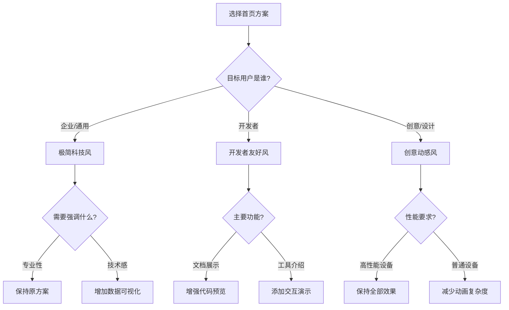

# 🎨 Xorigo UI 首页设计方案

## 📁 文件结构

```
/apps/website/app/(marketing)/demo/
├── page.tsx                 # 首页选择器（入口）
├── page-v1-minimal.tsx      # 方案1：极简科技风
├── page-v2-developer.tsx    # 方案2：开发者友好风
├── page-v3-creative.tsx     # 方案3：创意动感风
└── README.md               # 本文档
```

## 🚀 访问地址

**Docker 容器访问**：http://localhost:3100/demo

## 🎯 三个设计方案

### 方案1：极简科技风 🌌

**视觉特点**：
- ✨ 流体渐变背景，颜色缓慢流动
- 🌟 30个粒子动效，营造科技氛围
- 🔮 玻璃态卡片设计，半透明模糊效果
- ⬜ 大量留白，简洁优雅
- 📊 数字动画计数器效果

**技术亮点**：
- 使用 `useScroll` 和 `useTransform` 实现滚动视差
- 粒子系统采用随机运动算法
- 流体渐变通过旋转动画实现
- 响应式布局适配各种屏幕

**适用场景**：
- 企业级产品展示
- 专业技术文档网站
- 追求简约现代的项目

### 方案2：开发者友好风 💻

**视觉特点**：
- 🖥️ 黑色背景，代码编辑器美学
- ⌨️ 终端动画，逐行显示命令
- ✍️ 打字机效果，文字逐个出现
- 👁️ 组件实时预览器
- 🎨 代码高亮和复制功能

**技术亮点**：
- 终端模拟器组件，自动执行命令序列
- 打字机效果使用字符切片实现
- 代码预览支持实时切换
- 深色主题优化，减少视觉疲劳

**适用场景**：
- 开发工具和框架
- 技术博客和教程
- 面向程序员的产品

### 方案3：创意动感风 🎨

**视觉特点**：
- 🎭 3D透视卡片，鼠标交互响应
- 💫 霓虹发光效果，多彩渐变
- 🌈 鼠标跟随光效
- 🌊 波浪动画背景
- ⭐ 浮动图标装饰

**技术亮点**：
- 3D变换使用 `rotateX/Y` 和透视
- 鼠标跟随使用 `useMotionValue`
- SVG波浪动画，路径动态变形
- 多层视差滚动效果

**适用场景**：
- 创意设计机构
- 游戏和娱乐产品
- 需要强视觉冲击的项目

## 💡 技术栈

所有方案均使用：
- **React** 19.2.0
- **TypeScript** 5.9.3
- **Tailwind CSS** 3.4.18
- **Framer Motion** 12.23.5
- **@xorigo-ui/core** 0.1.0

## 🛠️ 如何使用

### 1. 直接使用某个方案

如果您已经决定使用某个方案，可以直接将对应文件内容复制到您的首页：

```bash
# 例如，使用极简科技风作为首页
cp apps/website/app/(marketing)/demo/page-v1-minimal.tsx apps/website/app/(marketing)/page.tsx
```

### 2. 自定义修改

每个方案都是独立的组件，您可以：
- 修改颜色主题
- 调整动画参数
- 添加或删除功能模块
- 混合不同方案的元素

### 3. 性能优化建议

- **懒加载**：使用 `dynamic` 导入减少初始加载
- **动画优化**：在移动端减少粒子数量
- **图片优化**：使用 WebP 格式和响应式图片
- **代码分割**：将大型组件拆分为独立模块

## 📊 方案对比

| 特性 | 极简科技风 | 开发者友好风 | 创意动感风 |
|------|-----------|-------------|-----------|
| **视觉复杂度** | ⭐⭐ | ⭐⭐⭐ | ⭐⭐⭐⭐⭐ |
| **性能要求** | 低 | 中 | 高 |
| **交互丰富度** | ⭐⭐⭐ | ⭐⭐⭐⭐ | ⭐⭐⭐⭐⭐ |
| **代码复杂度** | 简单 | 中等 | 复杂 |
| **适配难度** | 容易 | 中等 | 较难 |
| **目标用户** | 通用 | 开发者 | 设计师 |

## 🎯 选择建议



## 🔧 常见问题

### Q: 如何减少动画以提高性能？

```javascript
// 使用 prefers-reduced-motion 检测
const prefersReducedMotion = window.matchMedia('(prefers-reduced-motion: reduce)').matches;

// 条件性应用动画
<motion.div
  animate={prefersReducedMotion ? {} : { x: 100 }}
/>
```

### Q: 如何添加暗色/亮色模式切换？

所有方案都已支持 Tailwind 的 dark 模式，只需添加主题切换器：

```javascript
// 在组件库中已有 ThemeProvider
import { ThemeProvider } from '@xorigo-ui/system'
```

### Q: 如何集成到现有项目？

1. 确保安装所需依赖
2. 复制选中的方案文件
3. 根据需要调整导入路径
4. 修改内容和样式以匹配品牌

## 📝 贡献者

- **设计与开发**: Saken + AI
- **组件库**: @xorigo-ui/core
- **GitHub**: https://github.com/SakenW/Xorigo-UI

## 📄 许可

MIT License - 自由使用和修改

---

*这些方案展示了 Xorigo UI 组件库的强大功能和灵活性。选择最适合您项目的方案，或混合使用创建独特的体验！*