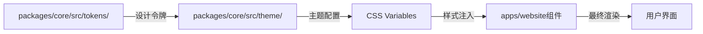
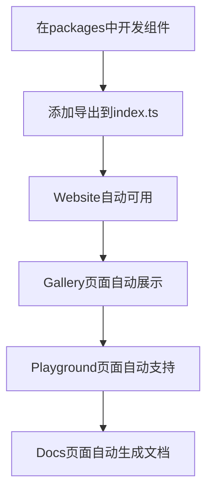
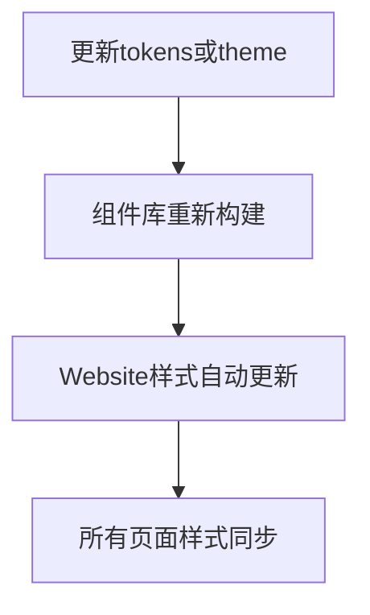

# 🏗️ Website 架构总览

> **核心理念**: Website作为组件库的展示平台，所有UI样式和组件演示都来自`packages/`中的组件库，严格遵循"展示即使用"的原则

---

## 🎯 架构原则

### 1. 严格依赖原则
- ✅ **Website只使用packages中的组件** - 禁止添加额外的UI组件
- ✅ **样式系统来源于packages** - 所有样式变量和主题都来自组件库
- ✅ **组件完整性** - Website必须展示组件库的所有组件及其效果

### 2. 展示即使用原则
- ✅ **所见即所得** - Website上看到的组件效果就是实际使用效果
- ✅ **实时同步** - 组件库更新后，Website立即体现
- ✅ **完整演示** - 展示所有变体、尺寸、状态和交互

### 3. 单一数据源原则
- ✅ **组件定义**: `packages/core/src/` - 唯一的组件定义源
- ✅ **样式系统**: `packages/core/src/theme/` 和 `tokens/` - 唯一的样式源
- ✅ **类型定义**: `packages/core/src/types/` - 唯一的类型定义源

---

## 📂 项目结构

```
Xorigo UI/
├── packages/                          # 📦 核心组件库
│   └── @xorigo-ui/core/              # 🎨 组件库 (唯一UI源)
│       ├── src/
│       │   ├── ui/                  # UI基础组件
│       │   ├── layout/              # 布局组件
│       │   ├── navigation/          # 导航组件
│       │   ├── inputs/              # 输入组件
│       │   ├── form/                # 表单组件
│       │   ├── datadisplay/         # 数据展示组件
│       │   ├── feedback/            # 反馈组件
│       │   ├── overlays/            # 弹层组件
│       │   ├── charts/              # 可视化组件
│       │   ├── utilities/           # 系统工具组件
│       │   ├── theme/               # 主题系统
│       │   └── tokens/              # 设计令牌
│       └── package.json              # 组件库依赖
│
└── apps/
    └── website/                     # 🌐 展示网站 (组件库使用者)
        ├── src/
        │   ├── app/                  # Next.js App Router
        │   ├── components/           # Website专用组件
        │   │   ├── gallery/         # Gallery展示 (调用packages组件)
        │   │   ├── playground/      # Playground编辑器
        │   │   ├── search/          # 搜索功能
        │   │   └── ui/              # UI基础组件 (来自packages)
        │   ├── lib/                  # 工具函数
        │   └── data/                 # 数据配置
        └── package.json              # 依赖@xorigo-ui/core
```

---

## 🔗 依赖关系

### 组件依赖链路

```mermaid
graph TD
    A[apps/website] -->|imports| B[packages/@xorigo-ui/core]
    B --> C[packages/core/src/ui]
    B --> D[packages/core/src/layout]
    B --> E[packages/core/src/navigation]
    B --> F[packages/core/src/inputs]
    B --> G[packages/core/src/form]
    B --> H[packages/core/src/datadisplay]
    B --> I[packages/core/src/feedback]
    B --> J[packages/core/src/overlays]
    B --> K[packages/core/src/charts]
    B --> L[packages/core/src/utilities]
    B --> M[packages/core/src/theme]
    B --> N[packages/core/src/tokens]
```

### 依赖配置示例

**apps/website/package.json**
```json
{
  "dependencies": {
    "@xorigo-ui/core": "workspace:*",
    "react": "^19.2.0",
    "react-dom": "^19.2.0",
    "next": "15.5.4",
    // 禁止添加其他UI组件库!
  }
}
```

---

## 🎨 样式系统架构

### 设计令牌流向



### 样式使用示例

**组件定义 (packages/core/src/ui/Button.tsx)**
```typescript
// 使用设计令牌定义样式
const buttonVariants = cva(
  "inline-flex items-center justify-center rounded-md font-medium transition-colors",
  {
    variants: {
      variant: {
        primary: "bg-[var(--color-primary-500)] text-[var(--color-text-on-primary)]",
        secondary: "bg-[var(--color-secondary-500)] text-[var(--color-text-on-secondary)]",
      },
      size: {
        sm: "h-8 px-3 text-sm",
        md: "h-10 px-4 text-base",
        lg: "h-12 px-6 text-lg",
      },
    },
  }
)
```

**Website使用 (apps/website/src/app/gallery/page.tsx)**
```typescript
// 直接导入使用组件
import { Button } from '@xorigo-ui/core'

export default function GalleryPage() {
  return (
    <div>
      {/* 所有样式都来自组件库 */}
      <Button variant="primary" size="md">
        这是从packages/core导入的Button组件
      </Button>
    </div>
  )
}
```

---

## 📋 页面组件映射

### Gallery页面

**功能**: 展示所有组件库组件
**数据源**: `packages/@xorigo-ui/core` 所有组件
**展示方式**: 按照9大分类体系组织

```typescript
// apps/website/src/app/gallery/page.tsx
import { GalleryServer } from '@/components/gallery/gallery-server'
// GalleryServer内部使用packages组件展示所有UI组件

export default function Gallery() {
  return <GalleryServer />
}
```

### Playground页面

**功能**: 在线编辑和预览组件
**组件库**: 动态导入`packages/@xorigo-ui/core`组件
**实时预览**: 修改props立即反映组件变化

```typescript
// apps/website/src/app/playground/page.tsx
import dynamic from 'next/dynamic'

// 动态导入组件库组件
const ComponentSelector = dynamic(() =>
  import('@/components/playground/component-selector'),
  { ssr: false }
)

export default function Playground() {
  return <ComponentSelector />
}
```

### Docs页面

**功能**: 组件文档和API参考
**组件演示**: 从`packages/@xorigo-ui/core`动态加载组件
**代码示例**: 显示真实的组件使用代码

---

## 🔧 开发工作流

### 1. 组件开发流程



### 2. 样式更新流程



### 3. 发布流程

```bash
# 1. 开发组件库
cd packages/core
npm run build

# 2. 测试Website集成
cd ../website
npm run dev

# 3. 验证所有页面正常
# 访问 /gallery /playground /docs

# 4. 发布组件库
npm run publish

# 5. Website自动部署（CI/CD）
```

---

## 🎯 关键约束

### ✅ 必须遵守
1. **只使用packages中的组件** - Website禁止添加UI组件
2. **样式来自packages** - 所有样式变量和主题定义在packages中
3. **展示完整组件** - Website必须展示组件库的所有功能
4. **保持同步更新** - 组件库更新后Website立即体现

### ❌ 严格禁止
1. **在Website中添加UI组件** - 违反单一数据源原则
2. **硬编码样式** - 必须使用设计令牌
3. **组件功能缺失** - Website必须展示组件库的完整能力
4. **样式不一致** - Website样式必须与组件库完全一致

---

## 🔍 验证检查

### 自动化检查

```bash
# 检查依赖关系
npm run check:dependencies

# 检查组件完整性
npm run check:components

# 检查样式一致性
npm run check:styles

# 检查类型同步
npm run check:types
```

### 手动验证清单

- [ ] Gallery页面展示所有packages组件
- [ ] Playground页面支持所有组件编辑
- [ ] Docs页面有所有组件的完整文档
- [ ] 所有页面样式与组件库一致
- [ ] 组件库更新后Website立即反映变化

---

## 📚 相关文档

- [组件分类系统规范](../../../docs/SHARED/COMPONENT-CLASSIFICATION-SYSTEM.md)
- [Website技术架构](../../../docs/WEBSITE-ARCHITECTURE/00-Website技术架构终极版.md)
- [Next.js架构方案](../../../docs/architecture/NEXTJS_ARCHITECTURE.md)

---

## 🎉 总结

**Website的核心价值**：作为Xorigo UI组件库的唯一展示平台，确保用户看到的每个组件效果都是真实的、可直接使用的。通过严格的依赖管理和展示即使用原则，Website成为了组件库质量的最好证明。