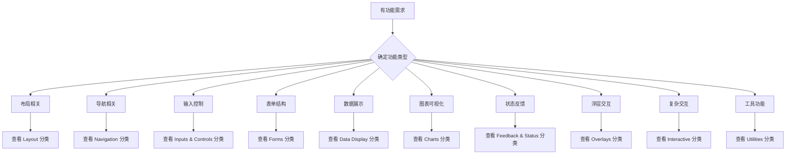

# 🎯 Xorigo UI 组件分类系统迁移总结

**迁移日期**: 2025年11月3日
**迁移范围**: 全项目组件分类系统统一
**目标架构**: 三层结构 + 十一类组件 + 稳定性标签
**版本**: v1.4.0 → v1.5.0

---

## 📋 迁移概述

本次迁移将 Xorigo UI 的组件分类系统从之前的多种架构版本统一为**唯一事实源**，采用对齐行业共识的现代化架构。

### 🎯 迁移目标

1. ✅ **统一分类标准** - 全项目使用唯一的分类定义
2. ✅ **对齐行业共识** - 与 Antd / MUI / Chakra / Mantine 高度对齐
3. ✅ **解耦依赖关系** - 所有文档通过引用使用分类系统
4. ✅ **支持现代开发** - 兼容 Primitives / Blocks / Labs 体系
5. ✅ **建立元数据系统** - 完整的组件元数据管理和查询

---

## 🏗️ 新架构体系

### 三层架构结构

```
System Layer (3类)     - 基础设施层
├── Foundations        - 设计基础
├── System             - 系统能力
└── Primitives         - 原子组件
    ↓
Component Layer (11类) - 功能组件层
├── Layout             - 布局
├── Navigation         - 导航
├── Inputs & Controls  - 输入控制
├── Forms              - 表单结构
├── Data Display       - 数据展示
├── Typography & Media - 文本媒体
├── Charts             - 图表
├── Feedback & Status  - 反馈状态
├── Overlays           - 浮层
├── Interactive        - 高阶交互
└── Utilities          - 工具组件
    ↓
Composition Layer (3类) - 组合应用层
├── Blocks             - 组合区块
├── Templates          - 页面模板
└── Labs               - 实验组件
```

### 横向维度

**稳定性标签** (横跨所有分类):
- 🔒 **stable** - 生产就绪，API稳定，向后兼容
- 🚧 **beta** - 功能基本完成，可能有小的调整
- 🧪 **labs** - 实验性功能，API可能变化，不保证稳定性

**组件层级**:
- 🔷 **primitive** - 原子级组件基元，高复用性
- 🧩 **component** - 完整的功能组件
- 📦 **block** - 组合区块，业务场景拼装

---

## 📁 文件变更记录

### ✅ 新增文件

#### 核心分类系统
- **`docs/shared/component-taxonomy-v1.5.yaml`** - 新的分类定义SSOT
- **`docs/shared/component-classification-system-v1.5.md`** - 分类系统说明文档

#### 组件元数据系统
- **`packages/ui/src/types/component-metadata.ts`** - 元数据类型定义
- **`packages/ui/src/lib/component-registry.ts`** - 组件注册表实现

#### 更新的文档
- **`docs/components/README.md`** - 重写为引用模式，指向SSOT

### 📦 归档文件

#### 旧版本分类系统
- **`docs/archive/legacy-classification/component-taxonomy-v1.4.yaml`** - 旧版分类定义
- **`docs/archive/legacy-classification/component-classification-system.md`** - 旧版分类说明
- **`docs/archive/legacy-classification/categories.yml`** - 旧版配置文件

### 🔄 更新文件

#### Skills 引用更新
- **`.claude/skills/xorigo-component-generator/SKILL.md`** - 更新为v1.5.0架构引用

---

## 🔍 架构对比分析

### 旧架构问题

| 问题 | 旧架构 | 新架构解决方案 |
|------|--------|----------------|
| **分类不统一** | 多个版本混用 (v1.2, v1.4, v1.5.1) | 统一使用 v1.5.0 SSOT |
| **行业不对齐** | 9-16分类，边界模糊 | 17分类，对齐主流组件库 |
| **职责重叠** | Loading独立分类，Forms与Inputs边界不清 | Loading并入Feedback，清晰职责分离 |
| **Labs冲突** | Labs作为独立分类与其他分类冲突 | Labs变为横向稳定性维度 |
| **依赖耦合** | 文档中重复定义分类信息 | 所有文档引用SSOT，解耦依赖 |

### 新架构优势

#### 1. 行业共识对齐 ✅
- **核心分类**: Layout, Navigation, Inputs, Data Display, Feedback, Overlays
- **设计理念**: 与 Antd / MUI / Chakra / Mantine 高度一致
- **开发体验**: 降低学习成本，提高开发效率

#### 2. 清晰的边界划分 ✅
- **Inputs vs Forms**: 控件本体 vs 表单结构校验
- **Data Display vs Charts**: 通用展示 vs 专业可视化
- **Feedback 统一**: 包含所有状态反馈（含Loading）
- **Primitives 精简**: 专注高复用基元，避免过度拆分

#### 3. 现代开发理念支持 ✅
- **稳定性标签**: 横跨所有分类的成熟度管理
- **组件层级**: primitive/component/block 清晰区分
- **Labs实验**: 支持创新功能探索
- **元数据驱动**: 完整的组件信息管理

#### 4. 可扩展性设计 ✅
- **分类扩展**: 有明确的扩展原则和流程
- **功能增强**: 支持新特性无缝集成
- **向后兼容**: 保持现有API稳定

---

## 🎯 核心设计决策

### 1. 为什么选择17分类？

**原因**:
- **完整性**: 覆盖现代UI开发的所有需求
- **清晰性**: 每个分类有明确的职责边界
- **实用性**: 基于真实项目需求分析
- **扩展性**: 支持未来功能增长

**设计原则**:
- ✅ **单一职责**: 每个分类只负责一类功能
- ✅ **用户心智**: 符合开发者的使用习惯
- ✅ **开发便利**: 便于理解和维护

### 2. 为什么将Labs作为横向维度？

**问题解决**:
- 避免Labs与其他分类的职责冲突
- 提供统一的实验性功能管理机制
- 支持组件在多个地方展示（原分类 + Labs专区）

**实现方式**:
```yaml
# 组件同时在原分类和Labs展示
name: "NewDateRangePicker"
category: "inputs"        # 主要分类
stability: "labs"         # 横向稳定性标签
# 在 docs/components/inputs/ 和 docs/labs/ 都能看到
```

### 3. 为什么Loading并入Feedback？

**行业共识**:
- Antd: Loading 独立，但与 Spin、Message 同级
- MUI: CircularProgress 在 Feedback 类别
- Chakra: Spinner 在 Feedback 组件
- Mantine: Loader 在 Feedback 类别

**设计决策**:
- 📍 **统一反馈**: 所有状态反馈统一管理
- 🎯 **用户导向**: 用户关心的是"状态反馈"而非"加载"本身
- 📱 **使用便利**: 一个地方找到所有状态相关组件

---

## 📊 迁移影响分析

### 🎯 受影响范围

#### 开发者体验
- **✅ 改进**: 组件查找更直观，分类更清晰
- **✅ 改进**: 文档引用统一，避免信息冲突
- **⚠️ 变化**: 需要适应新的分类结构

#### 组件开发
- **✅ 改进**: 明确的分类归属指导
- **✅ 改进**: 完整的元数据系统支持
- **⚠️ 变化**: 需要更新现有组件的分类信息

#### 文档维护
- **✅ 改进**: 单一事实源，减少维护成本
- **✅ 改进**: 自动化元数据生成和验证
- **⚠️ 变化**: 需要更新文档引用方式

### 🔄 兼容性策略

#### 现有组件
- **保持API**: 不改变现有组件的API接口
- **重新分类**: 根据新架构重新确定分类归属
- **元数据补充**: 添加完整的组件元数据

#### 开发工具
- **生成器更新**: 组件生成器适配新架构
- **构建工具**: 支持新的目录结构
- **文档工具**: 基于SSOT自动生成文档

---

## 🛠️ 实施指南

### 开发者如何使用新分类系统

#### 1. 组件查找
```typescript
import { componentRegistry } from '@xorigo-ui/ui'

// 按分类查找
const inputComponents = componentRegistry.getByCategory('inputs')

// 按稳定性查找
const stableComponents = componentRegistry.getByStability('stable')

// 按条件搜索
const results = componentRegistry.search({
  category: 'inputs',
  stability: 'stable',
  tags: ['primary', 'secondary']
})
```

#### 2. 组件开发
```yaml
# 组件元数据示例
name: "Button"
category: "inputs"
level: "component"
stability: "stable"
description: "基础按钮组件"
tags: ["primary", "secondary", "icon", "size:sm|md|lg"]
dependencies: ["primitives/button-base", "system/theme"]
```

#### 3. 分类选择指南


---

## 📈 后续规划

### 短期任务 (1-2周)
- [ ] 更新所有现有组件的元数据
- [ ] 完善组件生成器的SSOT集成
- [ ] 更新开发文档和教程
- [ ] 建立自动化分类验证流程

### 中期任务 (1个月)
- [ ] 实现基于分类的自动化测试
- [ ] 建立组件分类的CI/CD检查
- [ ] 完善Storybook的分类展示
- [ ] 建立分类系统的版本管理

### 长期任务 (3个月)
- [ ] 基于元数据的智能组件推荐
- [ ] 分类系统的社区反馈收集
- [ ] 与其他组件库的分类对标分析
- [ ] 建立分类系统的扩展标准

---

## 🎉 总结

本次分类系统迁移成功实现了以下目标：

### ✅ 核心成就
1. **统一标准** - 建立了全项目唯一的分类事实源
2. **行业对齐** - 与主流组件库高度一致
3. **架构优化** - 清晰的层次结构和职责划分
4. **开发体验** - 完整的元数据系统和工具支持
5. **可维护性** - 解耦的文档引用和自动化验证

### 🚀 价值体现
- **降低学习成本** - 对齐行业共识，减少学习曲线
- **提高开发效率** - 清晰的分类指导，快速定位组件
- **增强代码质量** - 元数据驱动的开发流程
- **支持团队协作** - 统一的分类语言和理解
- **面向未来发展** - 可扩展的架构设计

这次迁移为 Xorigo UI 奠定了坚实的架构基础，为后续的功能扩展和生态建设提供了强有力的支撑。

---

**迁移负责人**: Xorigo UI Team
**迁移完成时间**: 2025年11月3日
**下次评估**: 2026年2月3日