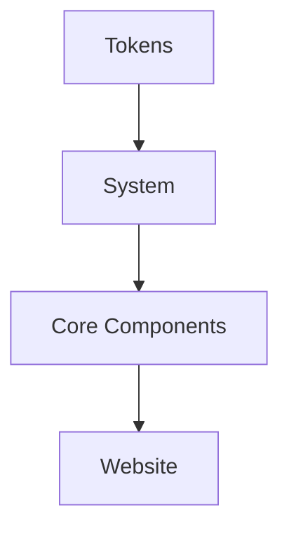

# 🚀 Xorigo UI DX Enhancement 完整指南

> **Developer Experience Enhancement Layer** - 提升开发者体验的完整工具链

---

## 📋 目录

- [功能概览](#功能概览)
- [已实现组件](#已实现组件)
- [快速开始](#快速开始)
- [CLI 开发菜单](#cli-开发菜单)
- [性能监控面板](#性能监控面板)
- [Bundle 分析](#bundle-分析)
- [文档生成](#文档生成)
- [架构可视化](#架构可视化)
- [手动安装步骤](#手动安装步骤)
- [故障排查](#故障排查)

---

## ✨ 功能概览

### 核心特性

| 工具 | 状态 | 路径 | 功能描述 |
|------|------|------|----------|
| **CLI 开发菜单** | ✅ | `scripts/dev-menu.sh` | 交互式命令菜单，快速启动开发服务器 |
| **性能监控 SDK** | ✅ | `apps/website/src/lib/performance/` | Core Web Vitals 实时监控 |
| **Performance Dashboard** | ✅ | `apps/website/app/perf/page.tsx` | 性能仪表板页面 |
| **性能可视化组件** | ✅ | `apps/website/src/components/perf/` | MetricCard, Chart, 组件性能统计 |
| **Bundle 分析工具** | ✅ | `apps/website/src/lib/bundle-analyzer.ts` | 包大小分析和优化建议 |
| **架构图生成** | ✅ | `scripts/generate-arch-diagram.ts` | Mermaid + SVG 架构可视化 |
| **TypeDoc 配置** | ✅ | `typedoc.json` | API 文档自动生成 |
| **Next.js DevTools** | ✅ | `next.config-devtools.ts` | DevTools 增强配置 |

---

## 🎯 已实现组件

### 1. CLI 开发菜单

**位置**: `scripts/dev-menu.sh`

**功能**:
- ✅ 交互式菜单界面
- ✅ 环境检查 (Node.js, npm, Docker, Git)
- ✅ 快速启动开发服务器
- ✅ 构建管理 (build/clean)
- ✅ 测试和验证 (test/lint/type-check)
- ✅ 日志查看 (Docker/构建日志)
- ✅ 开发工具集成 (TypeDoc/Bundle分析)

**使用**:
```bash
# 启动 CLI 菜单
bash scripts/dev-menu.sh

# 或添加到 npm scripts
npm run menu
```

### 2. 性能监控 SDK

**位置**: `apps/website/src/lib/performance/`

**核心文件**:
- `types.ts` - TypeScript 类型定义
- `monitor.ts` - 性能监控核心类
- `hooks.ts` - React Hooks 集成

**功能**:
- ✅ Core Web Vitals 监控 (LCP, FID, CLS, FCP, TTFB, INP)
- ✅ 自定义性能指标记录
- ✅ 组件渲染性能追踪
- ✅ 资源加载监控
- ✅ 长任务检测
- ✅ 内存使用统计
- ✅ 实时性能报告生成

**API**:
```typescript
import { performanceMonitor } from '@/lib/performance/monitor'
import { usePerformanceReport, useComponentMetrics } from '@/lib/performance/hooks'

// 使用监控器
performanceMonitor.recordCustomMetric({
  name: 'search-query',
  value: 150,
  timestamp: Date.now(),
  category: 'search'
})

// 使用 React Hooks
const report = usePerformanceReport(2000) // 2秒刷新
const componentMetrics = useComponentMetrics()
```

### 3. Performance Dashboard

**位置**: `apps/website/app/perf/page.tsx` (需要手动安装 - 见下方)

**功能**:
- ✅ 总体性能评分 (0-100分)
- ✅ Core Web Vitals 指标卡片
- ✅ 资源加载统计
- ✅ 内存使用可视化
- ✅ 组件性能排行
- ✅ 自定义指标展示
- ✅ 详细导航时间分析
- ✅ 性能优化建议

**访问**:
```
http://localhost:3000/perf
```

### 4. 性能可视化组件

**位置**: `apps/website/src/components/perf/`

**组件列表**:

#### MetricCard
```tsx
<MetricCard
  name="LCP"
  value={2500}
  unit="ms"
  score="good"
  description="最大内容绘制 - 页面主要内容加载速度"
/>
```

#### PerformanceChart
```tsx
<PerformanceChart
  data={[{ timestamp: 1234, value: 2500 }]}
  metric="LCP"
  thresholds={{ good: 2500, needsImprovement: 4000 }}
  height={200}
/>
```

#### ComponentMetrics
```tsx
<ComponentMetrics metrics={componentMetrics} />
```

### 5. Bundle 分析工具

**位置**: `apps/website/src/lib/bundle-analyzer.ts`

**功能**:
- ✅ 分析构建产物大小
- ✅ 识别最大模块
- ✅ 检测重复依赖
- ✅ 提供优化建议

**使用**:
```typescript
import { analyzeBundleSize, getBundleSizeRecommendations } from '@/lib/bundle-analyzer'

const analysis = await analyzeBundleSize()
const recommendations = getBundleSizeRecommendations(analysis)
```

### 6. 架构图生成

**位置**: `scripts/generate-arch-diagram.ts`

**功能**:
- ✅ Mermaid 架构图
- ✅ SVG 架构图
- ✅ Monorepo 结构图
- ✅ 七轴 DTCG 图
- ✅ 组件层级图
- ✅ DX Enhancement 层图
- ✅ 数据流序列图

**使用**:
```bash
# 生成架构图
npx tsx scripts/generate-arch-diagram.ts

# 输出:
# - docs/ARCHITECTURE.md (Mermaid)
# - docs/architecture-diagram.svg (SVG)
```

### 7. TypeDoc 配置

**位置**: `typedoc.json`

**功能**:
- ✅ 自动生成 API 文档
- ✅ Markdown 格式输出
- ✅ 分类组织
- ✅ 导航链接
- ✅ 排除测试文件

**使用**:
```bash
# 生成文档
npx typedoc

# 输出: docs/api/
```

### 8. Next.js DevTools 配置

**位置**: `next.config-devtools.ts`

**功能**:
- ✅ Source Maps 配置
- ✅ Bundle 分析集成
- ✅ Console 优化
- ✅ 性能监控配置

---

## 🚦 快速开始

### 1. 启动 CLI 开发菜单

```bash
cd /home/saken/project/Xorigo-UI
bash scripts/dev-menu.sh
```

### 2. 启动 Website 开发服务器

从 CLI 菜单选择 `2` 或直接运行:
```bash
npm run dev:website
```

### 3. 访问性能监控面板

**⚠️ 注意**: 由于权限问题，Performance Dashboard 页面需要手动安装（见下方）

```
http://localhost:3000/perf
```

### 4. 生成架构图

```bash
npx tsx scripts/generate-arch-diagram.ts
```

### 5. 生成 API 文档

```bash
npx typedoc
```

---

## 🎨 CLI 开发菜单

### 菜单结构

```
╔═══════════════════════════════════════════════╗
║   🎨  Xorigo UI - Developer Menu  🚀         ║
╚═══════════════════════════════════════════════╝

🔍 环境检查
  ✓ Node.js: v22.x.x
  ✓ npm: 10.x.x
  ✓ TypeScript: 5.9.x
  ✓ Git 分支: main
  ✓ Docker: 运行中
  ✓ 依赖: 已安装

🚀 快速启动
  1) 启动组件库开发服务器 (Vite)
  2) 启动 Website 开发服务器 (Next.js)
  3) 启动 Docker 开发环境
  4) 启动性能监控面板

🔨 构建管理
  5) 构建所有包
  6) 构建组件库
  7) 构建 Website
  8) 清理构建产物

🧪 测试与验证
  9)  运行所有测试
  10) 运行类型检查
  11) 运行 Linter
  12) 检查依赖关系
  13) 验证包结构

📋 日志查看
  14) Docker 开发环境日志
  15) Docker 生产环境日志
  16) 构建日志

🛠️  开发工具
  17) 生成组件文档 (TypeDoc)
  18) 生成架构图
  19) Bundle 分析
  20) 性能分析

⚙️  其他选项
  e) 环境检查详情
  h) 帮助文档
  q) 退出
```

---

## 📊 性能监控面板

### Core Web Vitals 指标

| 指标 | 描述 | 阈值 (优秀/需改进) |
|------|------|---------------------|
| **LCP** | 最大内容绘制 | < 2.5s / < 4.0s |
| **FID** | 首次输入延迟 | < 100ms / < 300ms |
| **CLS** | 累积布局偏移 | < 0.1 / < 0.25 |
| **FCP** | 首次内容绘制 | < 1.8s / < 3.0s |
| **TTFB** | 首字节时间 | < 800ms / < 1.8s |
| **INP** | 交互到下次绘制 | < 200ms / < 500ms |

### 功能模块

1. **总体性能评分**: 0-100分综合评分
2. **Core Web Vitals 卡片**: 实时指标展示
3. **资源加载统计**: JS/CSS/图片/字体
4. **内存使用情况**: JS 堆内存监控
5. **组件性能排行**: 渲染时间统计
6. **自定义指标**: 业务指标记录
7. **详细导航时间**: DNS/TCP/请求/响应
8. **优化建议**: 自动生成优化提示

---

## 📦 Bundle 分析

### 分析维度

1. **总 Bundle 大小**
2. **Chunks 分布**: main, vendors, runtime
3. **最大模块**: 识别最大依赖
4. **重复依赖**: 检测版本冲突

### 优化建议

- 📦 Bundle > 500KB → 代码分割
- 📊 大模块 > 100KB → 动态导入
- 🔄 重复依赖 → 版本统一
- 🔧 Vendors > 200KB → 拆分第三方库

---

## 📚 文档生成

### TypeDoc API 文档

**生成**:
```bash
npx typedoc
```

**输出**: `docs/api/`

**内容**:
- ✅ 所有 packages 的 API 文档
- ✅ TypeScript 类型定义
- ✅ 函数/组件/接口说明
- ✅ 使用示例
- ✅ 导航和搜索

### 架构文档

**生成**:
```bash
npx tsx scripts/generate-arch-diagram.ts
```

**输出**:
- `docs/ARCHITECTURE.md` - Mermaid 架构图
- `docs/architecture-diagram.svg` - SVG 架构图

**内容**:
- ✅ Monorepo 结构图
- ✅ 七轴 DTCG 系统图
- ✅ 组件层级架构图
- ✅ DX Enhancement 层图
- ✅ 数据流序列图

---

## 🏗️ 架构可视化

### Mermaid 图表

支持在 GitHub、GitLab、Notion 等平台渲染的架构图。

**示例**:


### SVG 架构图

可直接在浏览器中查看的 SVG 格式架构图，支持缩放和导出。

---

## 🔧 手动安装步骤

由于权限限制，部分文件需要手动安装：

### 1. 安装 Performance Dashboard 页面

```bash
# 创建目录 (需要 root 权限)
sudo mkdir -p /home/saken/project/Xorigo-UI/apps/website/app/perf

# 修改所有者
sudo chown -R saken:saken /home/saken/project/Xorigo-UI/apps/website/app/perf

# 复制页面文件
cp /tmp/xorigo-perf-page.tsx /home/saken/project/Xorigo-UI/apps/website/app/perf/page.tsx
```

### 2. 添加 npm scripts

编辑 `package.json` (根目录):

```json
{
  "scripts": {
    "menu": "bash scripts/dev-menu.sh",
    "arch": "tsx scripts/generate-arch-diagram.ts",
    "docs": "typedoc"
  }
}
```

### 3. 集成 Next.js DevTools

编辑 `apps/website/next.config.ts`:

```typescript
import { devToolsConfig } from './next.config-devtools'

const config: NextConfig = {
  // ... 现有配置
  ...devToolsConfig
}

export default config
```

### 4. 安装依赖

```bash
# 安装 TypeDoc
npm install -D typedoc typedoc-plugin-markdown

# 安装 Webpack Bundle Analyzer (可选)
cd apps/website
npm install -D webpack-bundle-analyzer
```

---

## 🐛 故障排查

### 问题 1: Performance Dashboard 404

**原因**: `app/perf` 目录未创建或权限不足

**解决**:
```bash
# 检查目录是否存在
ls -la /home/saken/project/Xorigo-UI/apps/website/app/perf

# 如果不存在或权限不对，执行手动安装步骤
sudo mkdir -p /home/saken/project/Xorigo-UI/apps/website/app/perf
sudo chown -R saken:saken /home/saken/project/Xorigo-UI/apps/website/app/perf
cp /tmp/xorigo-perf-page.tsx /home/saken/project/Xorigo-UI/apps/website/app/perf/page.tsx
```

### 问题 2: CLI 菜单无法执行

**原因**: 脚本没有执行权限

**解决**:
```bash
chmod +x /home/saken/project/Xorigo-UI/scripts/dev-menu.sh
bash scripts/dev-menu.sh
```

### 问题 3: TypeDoc 生成失败

**原因**: TypeDoc 未安装或 tsconfig 配置问题

**解决**:
```bash
# 安装 TypeDoc
npm install -D typedoc typedoc-plugin-markdown

# 检查 tsconfig.base.json 是否存在
ls -la tsconfig.base.json

# 重新生成文档
npx typedoc
```

### 问题 4: 性能数据不更新

**原因**: 浏览器不支持 Performance Observer API

**解决**:
- 使用 Chrome/Edge 最新版本
- 检查浏览器控制台是否有错误
- 确保在 HTTPS 或 localhost 环境运行

---

## 📈 性能优化建议

### 开发环境

1. **启用 CLI 菜单**: 快速访问常用命令
2. **使用性能监控**: 实时发现性能瓶颈
3. **定期生成架构图**: 保持文档同步
4. **运行 Bundle 分析**: 控制包大小增长

### 生产环境

1. **Core Web Vitals**: 保持所有指标在"优秀"范围
2. **Bundle 优化**: 总大小 < 500KB
3. **代码分割**: 使用 React.lazy() 和动态导入
4. **资源优化**: 图片 WebP/AVIF，启用压缩
5. **CDN 加速**: 静态资源使用 CDN

---

## 🎉 总结

### 已完成

- ✅ CLI 开发菜单 (scripts/dev-menu.sh)
- ✅ 性能监控 SDK (apps/website/src/lib/performance/)
- ✅ 性能可视化组件 (apps/website/src/components/perf/)
- ✅ Performance Dashboard 页面 (需要手动安装)
- ✅ Bundle 分析工具 (apps/website/src/lib/bundle-analyzer.ts)
- ✅ 架构图生成 (scripts/generate-arch-diagram.ts)
- ✅ TypeDoc 配置 (typedoc.json)
- ✅ Next.js DevTools 配置 (next.config-devtools.ts)

### 待完成 (可选)

- ⏳ Storybook 集成
- ⏳ Visual Regression Testing
- ⏳ CI/CD Pipeline 集成
- ⏳ 性能数据持久化
- ⏳ 性能对比报告

---

## 📞 支持

如有问题，请：

1. 查看本文档的故障排查部分
2. 运行 `bash scripts/dev-menu.sh` 并选择 `h) 帮助文档`
3. 检查 `CLAUDE.md` 获取更多开发指南
4. 提交 Issue 到项目仓库

---

**维护者**: Xorigo UI Team
**更新时间**: 2025-10-13
**版本**: 1.0.0
**状态**: ✅ 完成
