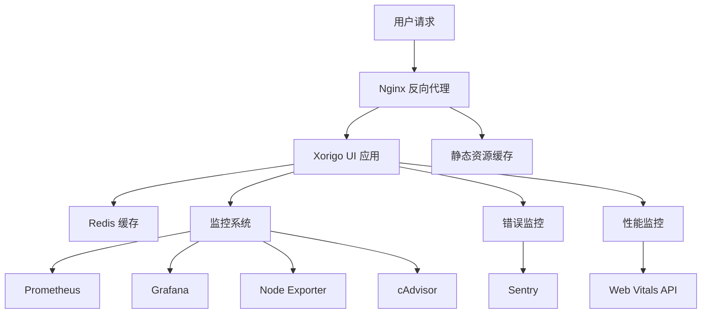

# Xorigo UI Phase 6: 生产环境部署指南

## 📋 概述

本文档提供了 Xorigo UI 生产环境部署的完整指南，包括零停机部署、性能监控、错误追踪和自动回滚机制。

**Phase 6 核心特性**：
- ✅ 零停机部署
- ✅ 性能监控和 Core Web Vitals 追踪
- ✅ 错误监控和报警系统
- ✅ 自动健康检查
- ✅ 快速回滚机制
- ✅ 负载测试和性能验证

## 🏗️ 架构概览

### 生产环境组件架构



### 关键性能指标

| 指标 | 目标值 | 监控方式 |
|------|--------|----------|
| 页面加载时间 | < 2.5s | Core Web Vitals |
| 服务器响应时间 | < 500ms | 健康检查 API |
| 系统可用性 | > 99.9% | 健康检查 |
| 错误率 | < 0.1% | 错误监控 API |
| 并发处理能力 | 100+ 用户 | 负载测试 |

## 🚀 快速开始

### 1. 环境准备

```bash
# 检查系统要求
docker --version
docker-compose --version

# 克隆项目
git clone <repository-url>
cd Xorigo-UI

# 复制环境配置
cp .env.production.example .env.production
```

### 2. 配置环境变量

编辑 `.env.production` 文件：

```bash
# 必需配置
DOMAIN=your-domain.com
SENTRY_DSN=https://your-sentry-dsn@sentry.io/project-id
GRAFANA_PASSWORD=your-secure-password
REDIS_PASSWORD=your-redis-password

# 可选配置
WEB_VITALS_SAMPLE_RATE=0.1
SENTRY_ENVIRONMENT=production
```

### 3. 执行部署

```bash
# 生产环境部署
./scripts/deploy-production.sh

# 指定版本部署
./scripts/deploy-production.sh v1.0.0 production
```

## 📋 详细部署流程

### 步骤 1: 系统依赖检查

```bash
# 自动检查依赖
./scripts/deploy-production.sh

# 手动检查依赖
docker --version
docker-compose --version
curl --version
jq --version
```

### 步骤 2: 镜像构建

```bash
# 构建生产镜像
docker-compose -f docker-compose.prod.yml build --parallel

# 查看构建的镜像
docker images | grep xorigo-ui
```

### 步骤 3: 零停机部署

```bash
# 执行零停机部署
./scripts/deploy-production.sh
```

部署过程包括：
1. 备份当前部署
2. 滚动更新服务
3. 健康检查验证
4. 性能基准测试

### 步骤 4: 部署验证

```bash
# 健康检查
curl http://localhost:3100/health

# API 健康检查
curl http://localhost:3100/api/health

# 全面健康检查
./scripts/health-check.sh full
```

## 🔧 监控配置

### 1. Prometheus 指标收集

访问 `http://localhost:9090` 查看 Prometheus 监控面板。

关键指标：
- `http_requests_total` - HTTP 请求总数
- `http_request_duration_seconds` - 请求响应时间
- `node_cpu_usage` - CPU 使用率
- `node_memory_usage` - 内存使用率

### 2. Grafana 可视化

访问 `http://localhost:3001` 查看 Grafana 仪表板。

默认登录：
- 用户名: `admin`
- 密码: `${GRAFANA_PASSWORD}`

### 3. 应用性能监控

启用 Core Web Vitals 监控：

```javascript
// 在浏览器控制台查看性能指标
// 开发环境下会自动显示性能监控面板
```

### 4. 错误监控

配置 Sentry 错误追踪：

```javascript
// 错误会自动上报到 Sentry
// 可在 Sentry 仪表板查看错误详情
```

## 🔍 健康检查

### 健康检查端点

| 端点 | 描述 | 方法 |
|------|------|------|
| `/health` | 基础健康检查 | GET/HEAD |
| `/api/health` | 详细健康检查 | GET/POST |
| `/api/metrics` | 性能指标 | GET |
| `/api/web-vitals` | Web Vitals 数据 | POST |

### 健康检查脚本

```bash
# 完整健康检查
./scripts/health-check.sh

# 基础健康检查
./scripts/health-check.sh basic

# 系统资源检查
./scripts/health-check.sh system

# 性能指标检查
./scripts/health-check.sh performance
```

### 健康检查配置

```yaml
# 健康检查阈值
HEALTH_CHECK_CONFIG:
  RESPONSE_TIME_THRESHOLD: 2000  # 响应时间阈值 (ms)
  MEMORY_THRESHOLD: 85           # 内存使用阈值 (%)
  CPU_THRESHOLD: 80              # CPU 使用阈值 (%)
  DISK_THRESHOLD: 85             # 磁盘使用阈值 (%)
```

## 🚨 错误处理和回滚

### 自动回滚触发条件

1. **健康检查失败**: 服务启动后连续 5 次健康检查失败
2. **响应时间超时**: 响应时间持续超过 2 秒
3. **错误率过高**: 错误率超过 10%
4. **手动回滚**: 管理员手动触发回滚

### 回滚操作

```bash
# 交互式回滚
./scripts/rollback.sh

# 自动回滚到最新版本
./scripts/rollback.sh auto

# 回滚到指定版本
./scripts/rollback.sh "部署失败"

# 查看可用备份
./scripts/rollback.sh list

# 查看回滚历史
./scripts/rollback.sh history
```

### 回滚策略

1. **备份策略**: 每次部署前自动备份
2. **回滚验证**: 回滚后自动执行健康检查
3. **回滚日志**: 记录所有回滚操作
4. **快速恢复**: 支持一键回滚到上一个稳定版本

## 📊 负载测试

### 执行负载测试

```bash
# 使用默认设置
./scripts/load-test.sh

# 自定义测试参数
./scripts/load-test.sh -c 100 -d 120

# 指定目标URL
./scripts/load-test.sh -u http://your-domain.com
```

### 负载测试类型

1. **响应时间基准测试**: 100 个请求的响应时间统计
2. **Apache Bench 测试**: 1000 请求，10 并发
3. **WRK 高性能测试**: 多线程高并发测试
4. **并发用户测试**: 10-100 并发用户逐步增加
5. **峰值负载测试**: 模拟峰值流量场景

### 测试结果分析

```bash
# 查看测试结果
ls -la load-test-results/

# 查看测试报告
cat load-test-results/load_test_report.md
```

## 🔒 安全配置

### Nginx 安全头

```nginx
# 安全头配置
add_header X-Frame-Options "SAMEORIGIN" always;
add_header X-Content-Type-Options "nosniff" always;
add_header X-XSS-Protection "1; mode=block" always;
add_header Content-Security-Policy "default-src 'self'..." always;
add_header Strict-Transport-Security "max-age=31536000" always;
```

### 容器安全

```yaml
# 容器安全配置
security_opt:
  - no-new-privileges:true
read_only: true
user: "1001:1001"
cap_drop:
  - ALL
cap_add:
  - CHOWN
  - SETGID
  - SETUID
```

### 环境变量安全

```bash
# 敏感信息通过环境变量传递
export SENTRY_DSN="https://your-dsn"
export GRAFANA_PASSWORD="your-secure-password"
export REDIS_PASSWORD="your-redis-password"
```

## 📈 性能优化

### 应用层优化

1. **代码分割**: 使用 React.lazy() 进行组件懒加载
2. **缓存策略**: 实现 Redis 缓存层
3. **压缩优化**: 启用 Gzip/Brotli 压缩
4. **图片优化**: 使用 WebP 格式和响应式图片

### 服务器优化

1. **Nginx 配置**: 优化 worker 进程和连接数
2. **容器资源**: 合理设置 CPU 和内存限制
3. **网络优化**: 启用 HTTP/2 和 Keep-Alive
4. **缓存策略**: 配置浏览器缓存和 CDN

### 监控优化

1. **性能指标**: 持续监控 Core Web Vitals
2. **资源使用**: 监控 CPU、内存、磁盘使用率
3. **错误追踪**: 及时发现和修复性能问题
4. **用户行为**: 分析用户访问模式和性能瓶颈

## 🛠️ 运维操作

### 日常运维命令

```bash
# 查看服务状态
docker-compose -f docker-compose.prod.yml ps

# 查看服务日志
docker-compose -f docker-compose.prod.yml logs -f

# 重启服务
docker-compose -f docker-compose.prod.yml restart

# 更新服务
docker-compose -f docker-compose.prod.yml up -d

# 停止服务
docker-compose -f docker-compose.prod.yml down
```

### 备份和恢复

```bash
# 创建备份
./scripts/backup.sh

# 恢复备份
./scripts/restore.sh backup-20240115-120000

# 查看备份列表
./scripts/backup.sh list
```

### 监控和告警

```bash
# 查看系统指标
curl http://localhost:3100/api/metrics

# 查看错误统计
curl http://localhost:3100/api/error-monitoring

# 查看性能指标
curl http://localhost:3100/api/web-vitals
```

## 📝 故障排除

### 常见问题

1. **服务无法启动**
   ```bash
   # 检查端口占用
   netstat -tlnp | grep 3100

   # 检查容器状态
   docker-compose -f docker-compose.prod.yml ps
   ```

2. **健康检查失败**
   ```bash
   # 手动执行健康检查
   curl -v http://localhost:3100/health

   # 查看应用日志
   docker-compose -f docker-compose.prod.yml logs xorigo-ui-website
   ```

3. **性能问题**
   ```bash
   # 查看资源使用
   docker stats

   # 执行性能测试
   ./scripts/load-test.sh
   ```

4. **监控服务异常**
   ```bash
   # 重启监控服务
   docker-compose -f docker-compose.prod.yml restart prometheus grafana

   # 检查配置文件
   docker-compose -f docker-compose.prod.yml config
   ```

### 日志分析

```bash
# 查看应用日志
docker-compose -f docker-compose.prod.yml logs --tail=100 xorigo-ui-website

# 查看错误日志
docker-compose -f docker-compose.prod.yml logs --tail=100 | grep -i error

# 查看访问日志
tail -f logs/nginx/access.log
```

## 📚 API 文档

### 健康检查 API

```http
GET /health
# 基础健康检查，返回 200 表示服务正常

GET /api/health
# 详细健康检查，返回系统状态和指标

POST /api/health
# 请求详细健康检查报告
# Body: {"detailed": true}
```

### 监控 API

```http
GET /api/metrics
# 获取应用性能指标

POST /api/web-vitals
# 上报 Core Web Vitals 数据

POST /api/error-monitoring
# 上报错误监控数据

GET /api/error-monitoring
# 获取错误统计信息
```

## 🔄 版本管理

### 版本标记策略

```bash
# 语义化版本控制
v1.0.0    # 主版本.次版本.修订版本
v1.0.1    # 补丁版本
v1.1.0    # 功能版本
v2.0.0    # 主版本（不兼容更新）
```

### 部署版本管理

```bash
# 部署特定版本
./scripts/deploy-production.sh v1.2.0

# 回滚到特定版本
./scripts/rollback.sh "回滚到v1.1.0"

# 查看版本历史
./scripts/deploy-production.sh history
```

## 🎯 最佳实践

### 部署最佳实践

1. **渐进式部署**: 先部署到测试环境，再部署到生产环境
2. **健康检查**: 每次部署后自动执行健康检查
3. **回滚准备**: 每次部署前准备回滚方案
4. **监控告警**: 配置关键指标的监控和告警

### 监控最佳实践

1. **全链路监控**: 监控从用户请求到数据库查询的完整链路
2. **性能基线**: 建立性能基线，及时发现性能异常
3. **告警分级**: 根据问题严重程度设置不同的告警级别
4. **自动化响应**: 实现自动化故障检测和恢复

### 安全最佳实践

1. **最小权限**: 容器和应用使用最小权限运行
2. **安全扫描**: 定期进行安全漏洞扫描
3. **访问控制**: 实施严格的访问控制策略
4. **数据加密**: 敏感数据传输和存储加密

## 📞 支持和联系

### 技术支持

- **文档**: [项目文档](./)
- **问题反馈**: [GitHub Issues](https://github.com/your-org/xorigo-ui/issues)
- **技术讨论**: [GitHub Discussions](https://github.com/your-org/xorigo-ui/discussions)

### 紧急联系

- **值班工程师**: [联系方式]
- **技术负责人**: [联系方式]
- **产品负责人**: [联系方式]

---

*本文档最后更新: 2025-01-15*
*版本: Phase 6 v1.0*