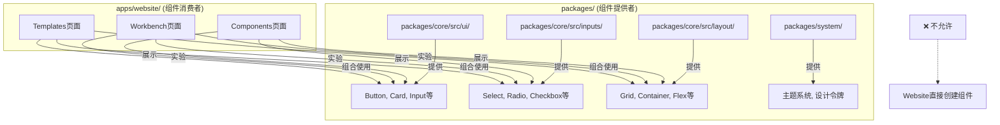

# 🚨 关键架构规则：Website与Packages的依赖关系

**创建日期**: 2025-01-14
**优先级**: 🔴 最高
**状态**: 强制执行

---

## 核心规则

### ⚠️ 绝对原则
**Website中展示的所有组件、变体、样式等必须来自`packages/`目录，Website本身不能创建UI组件。**

```
packages/core/  ← 组件源头（唯一事实来源）
     ↓
apps/website/   ← 消费者（只能调用，不能创建）
```

---

## 依赖关系图



---

## 具体规则

### 1. 组件引用规则

#### ✅ 正确做法
```typescript
// apps/website/app/(dashboard)/components/page.tsx
import { Button, Card, Input } from '@xorigo-ui/core'
import { Select, Radio } from '@xorigo-ui/core/inputs'
import { Grid, Container } from '@xorigo-ui/core/layout'

// 只展示packages中已有的组件
export function ComponentShowcase() {
  return (
    <div>
      <Button variant="primary">来自packages的按钮</Button>
      <Card>来自packages的卡片</Card>
    </div>
  )
}
```

#### ❌ 错误做法
```typescript
// apps/website/app/(dashboard)/components/page.tsx

// ❌ 错误：在Website中创建新组件
export function CustomButton({ children }) {
  return <button className="custom">{children}</button>
}

// ❌ 错误：在Website中定义组件变体
const MyCard = () => <div className="my-card">...</div>
```

---

## 2. 新组件需求流程

当Website需要展示新组件或新变体时：

### 执行流程
```yaml
需求识别:
  - Website需要展示新的组件变体
  - 或需要新的组件功能

步骤1_先在packages创建:
  location: packages/core/src/
  actions:
    - 设计组件API
    - 实现组件功能
    - 添加TypeScript类型
    - 编写单元测试
    - 导出到index.ts

步骤2_构建packages:
  command: pnpm build:packages
  verify: 组件正确导出

步骤3_在Website中使用:
  location: apps/website/
  actions:
    - import from '@xorigo-ui/core'
    - 在Components页面展示
    - 在Workbench中可编辑
    - 在Templates中可使用
```

### 示例：添加新的Button变体

```bash
# 1. 先在packages中添加
vim packages/core/src/ui/Button.tsx
# 添加 variant="gradient"

# 2. 重新构建
pnpm build:packages

# 3. 然后在Website使用
vim apps/website/app/(dashboard)/components/page.tsx
# import { Button } from '@xorigo-ui/core'
# <Button variant="gradient">渐变按钮</Button>
```

---

## 3. Website模块的职责边界

| 模块 | 允许 | 禁止 |
|------|------|------|
| **Components** | ✅ 展示packages中的组件<br>✅ 组织组件分类<br>✅ 提供复制功能 | ❌ 创建新组件<br>❌ 修改组件样式<br>❌ 定义新变体 |
| **Workbench** | ✅ 实验packages中的组件<br>✅ 调整组件props<br>✅ 组合现有组件 | ❌ 创建自定义组件<br>❌ 修改组件源码<br>❌ 添加新功能 |
| **Templates** | ✅ 组合使用packages组件<br>✅ 创建布局结构 | ❌ 创建模板专用组件<br>❌ 覆盖组件样式 |

---

## 4. 架构校验配置更新

```typescript
// architecture-validator.config.ts 追加规则
export const componentSourceRule = {
  name: 'component-source-validation',

  validate: (file: string, imports: string[]) => {
    // Website文件
    if (file.includes('apps/website/')) {
      // 检查是否有组件定义
      if (hasComponentDefinition(file)) {
        return {
          valid: false,
          error: 'Website不能定义UI组件，必须从packages引入'
        }
      }

      // 检查import来源
      const invalidImports = imports.filter(imp =>
        !imp.startsWith('@xorigo-ui/') &&
        isUIComponent(imp)
      )

      if (invalidImports.length > 0) {
        return {
          valid: false,
          error: `UI组件必须从@xorigo-ui包引入: ${invalidImports.join(', ')}`
        }
      }
    }

    return { valid: true }
  }
}
```

---

## 5. 特殊情况处理

### 允许的Website专属组件
仅以下类型的组件可以在Website中创建：

```typescript
// ✅ 允许：纯布局包装组件
function PageLayout({ children }) {
  return <div className="page-layout">{children}</div>
}

// ✅ 允许：业务逻辑组件（不是UI组件）
function ComponentSearchFilter({ onFilter }) {
  // 业务逻辑
  return <Input onChange={onFilter} /> // Input来自packages
}

// ✅ 允许：组合组件（组合packages中的组件）
function ComponentCard({ component }) {
  return (
    <Card> {/* Card来自packages */}
      <Button>复制</Button> {/* Button来自packages */}
    </Card>
  )
}
```

### 禁止的情况
```typescript
// ❌ 禁止：创建UI原语
function MyButton() { /* ... */ }

// ❌ 禁止：扩展packages组件
function ExtendedButton extends Button { /* ... */ }

// ❌ 禁止：覆盖组件样式
<Button className="my-custom-button-style" />
```

---

## 6. CI/CD检查

### 自动化检查脚本
```bash
#!/bin/bash
# check-component-source.sh

echo "检查Website是否违规创建组件..."

# 检查是否有组件定义
if grep -r "export.*function.*Button\|Card\|Input" apps/website/; then
  echo "❌ 错误：Website中发现UI组件定义"
  exit 1
fi

# 检查import来源
if grep -r "from ['\"]\..*components" apps/website/ | grep -v "@xorigo-ui"; then
  echo "❌ 错误：发现非packages来源的组件引用"
  exit 1
fi

echo "✅ 通过：所有组件都来自packages"
```

---

## 7. 开发者指南

### 当你需要在Website展示新内容时：

1. **先问自己**：这个组件在packages中存在吗？
   - 是 → 直接import使用
   - 否 → 继续步骤2

2. **确定组件归属**：
   - UI组件（按钮、卡片、输入框等）→ 必须先在packages中创建
   - 业务组件（搜索逻辑、筛选器等）→ 可以在Website中创建
   - 布局组件（页面结构）→ 可以在Website中创建

3. **创建流程**：
   ```bash
   # UI组件
   packages/core/src/ui/NewComponent.tsx → 创建
   packages/core/src/ui/index.ts → 导出
   pnpm build:packages → 构建
   apps/website/... → import使用

   # 业务/布局组件
   apps/website/src/components/business/SearchLogic.tsx → 直接创建
   ```

---

## 8. 违规后果

违反此规则将导致：
1. **构建失败** - CI/CD管道将拒绝构建
2. **Code Review不通过** - PR将被拒绝
3. **架构债务** - 增加维护成本
4. **版本混乱** - 组件版本不一致

---

## 📋 检查清单

在提交代码前，确认：
- [ ] Website中没有创建新的UI组件
- [ ] 所有UI组件都从 `@xorigo-ui/core` 导入
- [ ] 新需求的组件已先在packages中实现
- [ ] packages已构建并可正常导入
- [ ] 通过架构校验脚本

---

## 🎯 总结

**记住核心原则**：
> Website是组件的**展示平台**，不是**创建平台**。
> 所有UI组件的唯一来源是 `packages/` 目录。

这确保了：
- 组件的一致性
- 版本的统一管理
- 清晰的职责分离
- 可维护的架构

---

**强制执行级别**: 🔴 最高
**违规处理**: 自动拒绝构建