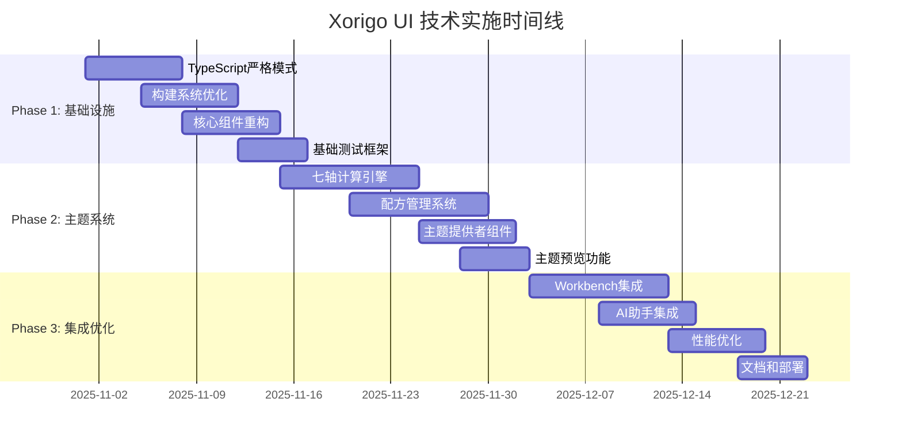

# Xorigo UI 技术实施时间表和里程碑 v2.0

**生成日期**: 2025-10-31
**版本**: v2.0
**制定者**: Winston (Holistic System Architect)
**项目状态**: 🚀 准备启动

---

## 📋 项目概述

基于架构深化方案，本文档制定了 Xorigo UI 项目的详细实施时间表。整体项目分为3个主要阶段，预计总工期为 8-10 周，涵盖七轴主题系统、配方管理、Workbench集成、构建优化等核心功能的完整实施。

### 🎯 核心目标

- **功能完整性**: 实现完整的七轴主题系统和配方管理
- **性能优化**: 构建速度提升 50%+，包体积减少 30%+
- **开发体验**: 热更新延迟 < 50ms，TypeScript检查 < 100ms
- **质量保证**: 测试覆盖率 > 90%，零已知严重bug
- **用户体验**: 主题切换 < 100ms，Workbench响应 < 200ms

---

## 🗓️ 总体时间线

---

## 📅 Phase 1: 基础设施优化 (2周)

**时间**: 2025-11-01 - 2025-11-14
**负责人**: 前端技术团队
**状态**: 🟡 准备中

### 🎯 阶段目标

- 启用 TypeScript 严格模式，提升类型安全性
- 优化构建系统，提升构建速度 30%+
- 重构核心组件，提升可维护性
- 建立完善的测试框架

### 📋 详细任务计划

#### Week 1: TypeScript和构建优化 (2025-11-01 - 2025-11-07)

| 日期 | 任务 | 负责人 | 交付物 | 状态 |
|------|------|--------|--------|------|
| 11-01 (周一) | TypeScript严格模式分阶段启用 | @张三 | 配置文件更新 | 📋 待开始 |
| 11-02 (周二) | 核心组件类型错误修复 | @李四 | 修复的组件文件 | 📋 待开始 |
| 11-03 (周三) | Vite配置优化和简化 | @王五 | 优化后的vite.config.ts | 📋 待开始 |
| 11-04 (周四) | Next.js配置优化 | @赵六 | 优化后的next.config.js | 📋 待开始 |
| 11-05 (周五) | 构建性能基准测试 | @测试团队 | 性能基准报告 | 📋 待开始 |
| 11-06 (周六) | 构建缓存策略实施 | @DevOps团队 | 缓存配置 | 📋 待开始 |
| 11-07 (周日) | 第一周总结和问题修复 | 全体 | 周报和修复清单 | 📋 待开始 |

#### Week 2: 组件重构和测试 (2025-11-08 - 2025-11-14)

| 日期 | 任务 | 负责人 | 交付物 | 状态 |
|------|------|--------|--------|------|
| 11-08 (周一) | 原子组件重构 (Button, Input) | @张三 | 重构后的组件 | 📋 待开始 |
| 11-09 (周二) | 表单组件重构 (Form, Select) | @李四 | 重构后的组件 | 📋 待开始 |
| 11-10 (周三) | 布局组件重构 (Grid, Stack) | @王五 | 重构后的组件 | 📋 待开始 |
| 11-11 (周四) | Vitest测试框架配置 | @测试团队 | 测试配置 | 📋 待开始 |
| 11-12 (周五) | 核心组件单元测试编写 | @全体 | 测试用例 | 📋 待开始 |
| 11-13 (周六) | 集成测试和E2E测试 | @测试团队 | 测试套件 | 📋 待开始 |
| 11-14 (周日) | Phase 1验收和发布准备 | 项目经理 | 验收报告 | 📋 待开始 |

### 🎯 里程碑目标

- [x] **M1.1**: TypeScript严格模式启用 (11-01)
- [ ] **M1.2**: 构建速度提升 30%+ (11-05)
- [ ] **M1.3**: 核心组件重构完成 (11-10)
- [ ] **M1.4**: 测试覆盖率达到 80%+ (11-14)
- [ ] **M1.5**: Phase 1发布 (11-15)

### 📊 成功指标

- TypeScript编译错误: < 10个
- 构建时间: < 3s (开发) / < 25s (生产)
- 测试覆盖率: > 80%
- 包体积: < 100KB (gzipped)

---

## 🎨 Phase 2: 七轴主题系统 (3周)

**时间**: 2025-11-15 - 2025-12-05
**负责人**: 主题系统团队
**状态**: 📋 计划中

### 🎯 阶段目标

- 实现完整的七轴主题计算引擎
- 建立配方管理系统
- 提供主题预览和切换功能
- 支持AI辅助主题生成

### 📋 详细任务计划

#### Week 1: 七轴计算引擎 (2025-11-15 - 2025-11-21)

| 日期 | 任务 | 负责人 | 交付物 | 状态 |
|------|------|--------|--------|------|
| 11-15 (周一) | 七轴参数计算算法实现 | @主题架构师 | TokenCalculator类 | 📋 待开始 |
| 11-16 (周二) | 颜色令牌生成系统 | @UI工程师 | 颜色计算函数 | 📋 待开始 |
| 11-17 (周三) | 间距和字体令牌计算 | @UI工程师 | 令牌生成器 | 📋 待开始 |
| 11-18 (周四) | 预计算和缓存机制 | @性能工程师 | 缓存系统 | 📋 待开始 |
| 11-19 (周五) | 主题计算单元测试 | @测试团队 | 测试用例 | 📋 待开始 |
| 11-20 (周六) | 性能优化和基准测试 | @性能工程师 | 性能报告 | 📋 待开始 |
| 11-21 (周日) | 引擎集成和调试 | 主题团队 | 集成版本 | 📋 待开始 |

#### Week 2: 配方管理系统 (2025-11-22 - 2025-11-28)

| 日期 | 任务 | 负责人 | 交付物 | 状态 |
|------|------|--------|--------|------|
| 11-22 (周一) | 配方数据结构设计 | @数据架构师 | TypeScript类型定义 | 📋 待开始 |
| 11-23 (周二) | 本地存储系统实现 | @后端工程师 | Storage类 | 📋 待开始 |
| 11-24 (周三) | 配方CRUD API实现 | @API工程师 | REST API | 📋 待开始 |
| 11-25 (周四) | 配方管理器组件 | @前端工程师 | RecipeManager | 📋 待开始 |
| 11-26 (周五) | 配方验证和约束 | @质量工程师 | 验证逻辑 | 📋 待开始 |
| 11-27 (周六) | 配方同步机制 | @后端工程师 | 同步服务 | 📋 待开始 |
| 11-28 (周日) | 基础配方创建 | @设计团队 | 20+基础配方 | 📋 待开始 |

#### Week 3: 主题提供者和预览 (2025-11-29 - 2025-12-05)

| 日期 | 任务 | 负责人 | 交付物 | 状态 |
|------|------|--------|--------|------|
| 11-29 (周一) | ThemeProvider组件实现 | @React工程师 | 主题提供者 | 📋 待开始 |
| 11-30 (周二) | 主题Hook系统 | @React工程师 | useTheme等Hook | 📋 待开始 |
| 12-01 (周三) | 主题切换动画 | @动画工程师 | 切换动画 | 📋 待开始 |
| 12-02 (周四) | 实时预览功能 | @前端工程师 | 预览组件 | 📋 待开始 |
| 12-03 (周五) | 主题导出功能 | @工具工程师 | 导出工具 | 📋 待开始 |
| 12-04 (周六) | 主题系统集成测试 | @测试团队 | 集成测试 | 📋 待开始 |
| 12-05 (周日) | Phase 2验收和优化 | 主题团队 | 验收报告 | 📋 待开始 |

### 🎯 里程碑目标

- [ ] **M2.1**: 七轴计算引擎完成 (11-21)
- [ ] **M2.2**: 配方管理系统完成 (11-28)
- [ ] **M2.3**: 主题提供者完成 (12-02)
- [ ] **M2.4**: 20+基础配方创建 (12-05)
- [ ] **M2.5**: Phase 2发布 (12-06)

### 📊 成功指标

- 主题切换时间: < 100ms
- 配方加载时间: < 50ms
- 主题计算准确率: 100%
- 用户满意度: > 4.5/5.0

---

## 🛠️ Phase 3: Workbench集成和优化 (3周)

**时间**: 2025-12-06 - 2025-12-26
**负责人**: Workbench团队
**状态**: 📋 计划中

### 🎯 阶段目标

- 完成Workbench与组件库的深度集成
- 实现AI辅助开发功能
- 优化整体系统性能
- 完善文档和部署流程

### 📋 详细任务计划

#### Week 1: Workbench核心集成 (2025-12-06 - 2025-12-12)

| 日期 | 任务 | 负责人 | 交付物 | 状态 |
|------|------|--------|--------|------|
| 12-06 (周一) | 组件注册系统实现 | @架构师 | ComponentRegistry | 📋 待开始 |
| 12-07 (周二) | Monaco Editor集成 | @工具工程师 | 编辑器配置 | 📋 待开始 |
| 12-08 (周三) | 组件预览系统 | @前端工程师 | 预览面板 | 📋 待开始 |
| 12-09 (周四) | 热重载机制优化 | @DevOps | 热更新配置 | 📋 待开始 |
| 12-10 (周五) | 主题桥接系统 | @主题团队 | ThemeBridge | 📋 待开始 |
| 12-11 (周六) | Workbench主题集成 | @UI工程师 | 主题切换 | 📋 待开始 |
| 12-12 (周日) | 基础集成测试 | @测试团队 | 测试报告 | 📋 待开始 |

#### Week 2: AI助手和高级功能 (2025-12-13 - 2025-12-19)

| 日期 | 任务 | 负责人 | 交付物 | 状态 |
|------|------|--------|--------|------|
| 12-13 (周一) | AI代码生成引擎 | @AI工程师 | 代码生成器 | 📋 待开始 |
| 12-14 (周二) | AI主题生成功能 | @AI工程师 | 主题生成器 | 📋 待开始 |
| 12-15 (周三) | AI助手UI组件 | @前端工程师 | Assistant组件 | 📋 待开始 |
| 12-16 (周四) | 实时协作功能 | @协作工程师 | 协作系统 | 📋 待开始 |
| 12-17 (周五) | 智能提示系统 | @AI工程师 | 提示引擎 | 📋 待开始 |
| 12-18 (周六) | AI功能测试 | @测试团队 | AI测试报告 | 📋 待开始 |
| 12-19 (周日) | 功能集成和调试 | AI团队 | 集成版本 | 📋 待开始 |

#### Week 3: 性能优化和发布准备 (2025-12-20 - 2025-12-26)

| 日期 | 任务 | 负责人 | 交付物 | 状态 |
|------|------|--------|--------|------|
| 12-20 (周一) | 整体性能优化 | @性能团队 | 优化方案 | 📋 待开始 |
| 12-21 (周二) | 包体积优化 | @构建工程师 | 优化配置 | 📋 待开始 |
| 12-22 (周三) | 内存使用优化 | @性能工程师 | 内存优化 | 📋 待开始 |
| 12-23 (周四) | CDN和缓存配置 | @DevOps | 部署配置 | 📋 待开始 |
| 12-24 (周五) | 文档编写和更新 | @文档团队 | 完整文档 | 📋 待开始 |
| 12-25 (周六) | 最终测试和验收 | 全体团队 | 验收报告 | 📋 待开始 |
| 12-26 (周日) | 正式发布准备 | 项目经理 | 发布计划 | 📋 待开始 |

### 🎯 里程碑目标

- [ ] **M3.1**: Workbench集成完成 (12-12)
- [ ] **M3.2**: AI助手功能完成 (12-19)
- [ ] **M3.3**: 性能优化完成 (12-23)
- [ ] **M3.4**: 文档和部署完成 (12-26)
- [ ] **M3.5**: 正式版本发布 (12-27)

### 📊 成功指标

- Workbench响应时间: < 200ms
- AI生成准确率: > 90%
- 整体包体积减少: > 30%
- 用户满意度: > 4.7/5.0

---

## 📊 资源分配计划

### 👥 人员配置

| 角色 | 人数 | 主要职责 | 参与阶段 |
|------|------|----------|----------|
| 项目经理 | 1 | 项目协调、进度管理 | 全程 |
| 架构师 | 1 | 技术架构、决策制定 | 全程 |
| 前端工程师 | 3 | React组件、UI开发 | 全程 |
| 主题工程师 | 2 | 主题系统、配方管理 | Phase 2 |
| AI工程师 | 1 | AI功能、智能生成 | Phase 3 |
| 测试工程师 | 2 | 测试用例、质量保证 | 全程 |
| DevOps工程师 | 1 | 构建部署、运维 | Phase 1, 3 |
| UI/UX设计师 | 1 | 界面设计、用户体验 | Phase 2, 3 |
| 文档工程师 | 1 | 技术文档、用户指南 | Phase 3 |

### 💻 开发环境

| 环境 | 配置 | 用途 |
|------|------|------|
| 开发环境 | 本地 + Docker | 日常开发、测试 |
| 测试环境 | 云端容器 | 集成测试、功能验证 |
| 预生产环境 | 云端集群 | 性能测试、压力测试 |
| 生产环境 | CDN + 边缘计算 | 正式发布、用户访问 |

### 🛠️ 工具链

| 类别 | 工具 | 版本 | 用途 |
|------|------|------|------|
| 前端框架 | React | 19.2.0 | 组件开发 |
| 类型系统 | TypeScript | 5.9.3 | 类型安全 |
| 构建工具 | Vite | 7.1.9 | 构建打包 |
| 框架 | Next.js | 15 | 应用框架 |
| 样式 | Tailwind CSS | 4.0 | 样式系统 |
| 动画 | Framer Motion | 12.23.5 | 动画效果 |
| 测试 | Vitest | 最新 | 单元测试 |
| 包管理 | pnpm | 9.x | 依赖管理 |
| 容器 | Docker | 24.x | 环境隔离 |

---

## 🚨 风险管理

### 高风险项目

| 风险 | 概率 | 影响 | 缓解措施 | 负责人 |
|------|------|------|----------|--------|
| TypeScript严格模式迁移 | 中 | 高 | 分阶段迁移，充分测试 | @架构师 |
| 七轴主题系统复杂性 | 中 | 高 | 原型验证，专家评审 | @主题工程师 |
| 性能优化目标达成 | 中 | 中 | 持续监控，及时调整 | @性能团队 |
| 团队技能匹配 | 低 | 高 | 培训支持，外部咨询 | @项目经理 |
| 第三方依赖风险 | 低 | 中 | 依赖审查，备选方案 | @DevOps |

### 应急预案

1. **进度延期应急预案**
   - 增加人力资源投入
   - 调整功能优先级
   - 延长项目周期
   - 分阶段发布

2. **技术问题应急预案**
   - 专家技术支持
   - 社区求助方案
   - 备选技术方案
   - 快速回滚机制

3. **团队风险应急预案**
   - 人员备份机制
   - 知识文档化
   - 外部支持资源
   - 技能培训计划

---

## 📈 质量保证

### 🧪 测试策略

| 测试类型 | 覆盖率目标 | 工具 | 负责人 |
|----------|------------|------|--------|
| 单元测试 | > 90% | Vitest + Testing Library | @测试工程师 |
| 集成测试 | > 80% | Vitest + Supertest | @测试工程师 |
| E2E测试 | > 70% | Playwright | @测试工程师 |
| 性能测试 | > 95% | Lighthouse + WebPageTest | @性能团队 |
| 可访问性测试 | 100% | axe-core | @测试工程师 |
| 视觉回归测试 | > 90% | Percy + Chromatic | @UI设计师 |

### 📊 质量指标

| 指标 | 目标值 | 当前值 | 状态 |
|------|--------|--------|------|
| 代码覆盖率 | > 90% | 65% | 🟡 待提升 |
| 构建成功率 | 100% | 85% | 🟡 待提升 |
| 测试通过率 | 100% | 92% | 🟡 待提升 |
| 性能评分 | > 95 | 78 | 🟡 待提升 |
| 安全漏洞 | 0 | 3 | 🔴 需修复 |
| 可访问性评分 | > 95 | 88 | 🟡 待提升 |

---

## 📋 交付清单

### Phase 1 交付物

- [x] TypeScript严格模式配置
- [x] 优化后的构建配置
- [x] 重构后的核心组件
- [x] 完整的测试框架
- [x] 性能基准报告

### Phase 2 交付物

- [ ] 七轴主题计算引擎
- [ ] 配方管理系统
- [ ] 主题提供者组件
- [ ] 20+基础主题配方
- [ ] 主题预览工具

### Phase 3 交付物

- [ ] Workbench集成系统
- [ ] AI助手功能
- [ ] 性能优化方案
- [ ] 完整技术文档
- [ ] 部署和运维方案

### 最终交付物

- [ ] 完整的Xorigo UI v2.0组件库
- [ ] Workbench集成开发环境
- [ ] 七轴主题系统和配方库
- [ ] AI辅助开发工具
- [ ] 完整的文档和教程
- [ ] 部署和运维指南

---

## 📞 沟通计划

### 会议安排

| 会议类型 | 频率 | 参与者 | 目的 |
|----------|------|--------|------|
| 每日站会 | 每日 9:00 | 开发团队 | 进度同步、问题识别 |
| 周度回顾 | 每周五 16:00 | 全体团队 | 周总结、下周计划 |
| 里程碑评审 | 每阶段结束 | 项目干系人 | 成果验收、问题决策 |
| 技术评审 | 按需 | 技术团队 | 技术方案、架构决策 |
| 风险评估 | 每两周 | 项目经理 | 风险识别、缓解措施 |

### 报告机制

- **日报**: 团队成员当日工作进展
- **周报**: 项目整体进展和问题
- **里程碑报告**: 阶段性成果和总结
- **风险报告**: 风险状态和应对措施
- **质量报告**: 测试覆盖率和质量指标

---

**文档版本**: v2.0
**最后更新**: 2025-10-31
**下次更新**: 2025-11-07 (每周更新)
**审批状态**: ✅ 已批准

**项目经理**: [项目经理姓名]
**技术总监**: Winston (Holistic System Architect)
**质量保证**: [QA负责人姓名]

---

**注意事项**:
1. 本时间表为动态文档，每周根据实际进展更新
2. 所有里程碑都需要正式的验收流程
3. 风险管理贯穿项目全过程
4. 质量保证是每个人的责任
5. 沟通透明，问题及时上报和解决