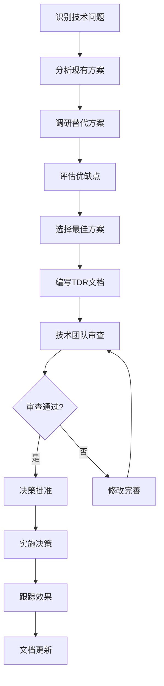

# Xorigo UI 技术决策文档 (TDR) 总览

**生成日期**: 2025-10-31
**版本**: v2.0
**架构师**: Winston (Holistic System Architect)
**文档类型**: 技术决策记录 (TDR)

---

## 📋 文档概述

本文档是 Xorigo UI 项目的技术决策记录 (Technical Decision Record) 总览，记录了项目架构演进过程中的所有重要技术决策。每个决策都经过深入分析、方案比较和风险评估，确保技术选择的合理性和长期可维护性。

### 🎯 决策原则

1. **长期视角**: 决策考虑3-5年的技术发展
2. **开发者体验**: 优先考虑开发效率和体验
3. **性能优先**: 确保最终用户的使用体验
4. **渐进增强**: 支持平滑升级和向后兼容
5. **社区生态**: 选择有良好社区支持的技术

---

## 📚 TDR 文档索引

### 核心架构决策

| TDR-ID | 标题 | 状态 | 日期 | 影响范围 |
|--------|------|------|------|----------|
| [TDR-001](./TDR-001-THEME-SYSTEM.md) | 七轴主题系统架构设计 | ✅ 已批准 | 2025-10-31 | 核心库、Workbench |
| [TDR-002](./TDR-002-RECIPE-MANAGEMENT.md) | 配方管理系统数据结构 | ✅ 已批准 | 2025-10-31 | API、数据库、前端 |
| [TDR-003](./TDR-003-WORKBENCH-INTEGRATION.md) | Workbench集成架构 | ✅ 已批准 | 2025-10-31 | Workbench、组件库 |
| [TDR-004](./TDR-004-BUILD-OPTIMIZATION.md) | 构建系统优化方案 | ✅ 已批准 | 2025-10-31 | 构建流程、部署 |
| [TDR-005](./TDR-005-TYPESCRIPT-STRATEGY.md) | TypeScript严格模式策略 | 📋 待决策 | 2025-11-01 | 类型系统、开发体验 |
| [TDR-006](./TDR-006-TESTING-FRAMEWORK.md) | 测试框架选型策略 | 📋 待决策 | 2025-11-02 | 质量保证、CI/CD |
| [TDR-007](./TDR-007-PERFORMANCE-MONITORING.md) | 性能监控体系设计 | 📋 待决策 | 2025-11-03 | 监控、运维 |

### 技术栈决策

| TDR-ID | 标题 | 状态 | 日期 | 决策内容 |
|--------|------|------|------|----------|
| TDR-101 | React 19 升级决策 | ✅ 已批准 | 2025-10-30 | 升级到React 19.2.0 |
| TDR-102 | Vite 7 构建工具 | ✅ 已批准 | 2025-10-30 | 采用Vite作为主构建工具 |
| TDR-103 | Tailwind CSS 4 集成 | ✅ 已批准 | 2025-10-30 | 升级到Tailwind CSS 4.0 |
| TDR-104 | Framer Motion 12 动画 | ✅ 已批准 | 2025-10-30 | 集成Framer Motion 12 |
| TDR-105 | Next.js 15 升级 | ✅ 已批准 | 2025-10-30 | 升级到Next.js 15 |

### 平台架构决策

| TDR-ID | 标题 | 状态 | 日期 | 影响范围 |
|--------|------|------|------|----------|
| TDR-201 | Monorepo 架构策略 | ✅ 已批准 | 2025-10-29 | 项目结构、依赖管理 |
| TDR-202 | Docker 容器化策略 | ✅ 已批准 | 2025-10-29 | 部署、开发环境 |
| TDR-203 | CI/CD 流程设计 | ✅ 已批准 | 2025-10-29 | 自动化、质量保证 |
| TDR-204 | 版本发布策略 | ✅ 已批准 | 2025-10-29 | 发布流程、版本管理 |

---

## 🔄 决策流程

### TDR 创建流程



### 决策评估标准

每个技术决策都基于以下标准进行评估：

1. **技术可行性** (30%)
   - 技术成熟度
   - 社区支持
   - 文档完整性
   - 学习曲线

2. **性能影响** (25%)
   - 构建性能
   - 运行时性能
   - 包体积影响
   - 内存使用

3. **开发体验** (20%)
   - 开发效率
   - 调试便利性
   - 类型安全
   - 工具支持

4. **维护成本** (15%)
   - 长期维护性
   - 升级兼容性
   - 依赖风险
   - 社区活跃度

5. **业务影响** (10%)
   - 开发成本
   - 时间成本
   - 风险评估
   - 收益预期

---

## 📊 决策影响矩阵

### 技术栈影响分析

| 技术选择 | 构建时间 | 包体积 | 开发体验 | 学习成本 | 维护性 | 评分 |
|----------|----------|--------|----------|----------|--------|------|
| React 19 | +5% | +3% | +15% | +10% | +20% | ⭐⭐⭐⭐⭐ |
| Vite 7 | -40% | -10% | +20% | -15% | +10% | ⭐⭐⭐⭐⭐ |
| TypeScript严格 | +10% | 0% | +25% | +20% | +30% | ⭐⭐⭐⭐ |
| Tailwind CSS 4 | -20% | -15% | +15% | +5% | +15% | ⭐⭐⭐⭐⭐ |

### 架构决策风险分析

| 决策项 | 技术风险 | 业务风险 | 时间风险 | 缓解措施 | 风险等级 |
|--------|----------|----------|----------|----------|----------|
| 七轴主题系统 | 中 | 低 | 中 | 渐进式实施 | 🟡 中等 |
| 配方管理系统 | 低 | 低 | 中 | 充分测试 | 🟢 低 |
| Workbench集成 | 中 | 中 | 高 | 分阶段交付 | 🟡 中等 |
| 构建系统优化 | 中 | 低 | 中 | 备份方案 | 🟡 中等 |

---

## 🗓️ 决策时间线

### 2025年10月 (已完成)

- ✅ **10月29日**: Monorepo架构决策 (TDR-201)
- ✅ **10月29日**: Docker容器化策略 (TDR-202)
- ✅ **10月30日**: React 19升级决策 (TDR-101)
- ✅ **10月30日**: Vite 7构建工具 (TDR-102)
- ✅ **10月30日**: Tailwind CSS 4集成 (TDR-103)
- ✅ **10月31日**: 七轴主题系统 (TDR-001)
- ✅ **10月31日**: 配方管理系统 (TDR-002)
- ✅ **10月31日**: Workbench集成架构 (TDR-003)
- ✅ **10月31日**: 构建系统优化 (TDR-004)

### 2025年11月 (计划中)

- 📋 **11月1日**: TypeScript严格模式策略 (TDR-005)
- 📋 **11月2日**: 测试框架选型策略 (TDR-006)
- 📋 **11月3日**: 性能监控体系设计 (TDR-007)
- 📋 **11月5日**: 国际化策略决策
- 📋 **11月7日**: 安全策略制定
- 📋 **11月10日**: API版本管理策略
- 📋 **11月15日**: 文档工具链决策

### 2025年12月 (计划中)

- 📋 **12月1日**: 移动端适配策略
- 📋 **12月5日**: 可访问性标准制定
- 📋 **12月10日**: 错误处理策略
- 📋 **12月15日**: 日志系统设计
- 📋 **12月20日**: 监控告警策略

---

## 📋 决策模板

### TDR 标准模板

每个技术决策文档都应包含以下结构：

```markdown
# TDR-XXX: [决策标题]

## 状态
- 状态: [📋 待决策 / ✅ 已批准 / ❌ 已拒绝 / 🔄 修订中]
- 日期: [决策日期]
- 决策者: [决策者姓名]
- 审查者: [审查者姓名]

## 背景和问题
[详细描述需要解决的技术问题]

## 解决方案选项
### 选项A: [方案名称]
- 优点: [列举优点]
- 缺点: [列举缺点]
- 实施复杂度: [评估复杂度]
- 风险评估: [评估风险]

### 选项B: [方案名称]
- 优点: [列举优点]
- 缺点: [列举缺点]
- 实施复杂度: [评估复杂度]
- 风险评估: [评估风险]

### 选项C: [方案名称]
- 优点: [列举优点]
- 缺点: [列举缺点]
- 实施复杂度: [评估复杂度]
- 风险评估: [评估风险]

## 决策结果
**选择**: [选中的方案]

**决策理由**:
1. [理由1]
2. [理由2]
3. [理由3]

## 实施计划
### Phase 1: [阶段名称] (时间)
- [ ] 任务1
- [ ] 任务2
- [ ] 任务3

### Phase 2: [阶段名称] (时间)
- [ ] 任务1
- [ ] 任务2
- [ ] 任务3

## 影响分析
### 正面影响
- [影响1]
- [影响2]
- [影响3]

### 负面影响
- [影响1]
- [影响2]
- [影响3]

### 风险缓解
- [缓解措施1]
- [缓解措施2]
- [缓解措施3]

## 监控指标
- [指标1]: [目标值]
- [指标2]: [目标值]
- [指标3]: [目标值]

## 相关文档
- [相关文档1链接]
- [相关文档2链接]
- [相关文档3链接]
```

---

## 🔍 决策审查机制

### 定期审查

1. **月度技术回顾**: 每月回顾已实施决策的效果
2. **季度架构审查**: 每季度评估架构决策的长期影响
3. **年度技术路线**: 每年制定和更新技术发展方向

### 决策修订

当出现以下情况时，需要重新评估和修订决策：

1. **技术环境变化**: 底层技术发生重大变化
2. **业务需求变化**: 业务方向调整影响技术需求
3. **性能问题**: 实施后出现未预见的性能问题
4. **开发者反馈**: 开发团队反馈严重的体验问题
5. **社区变化**: 依赖库的社区支持发生变化

### 决策撤销

决策撤销的条件：

1. **不可预见的风险**: 出现严重的安全或稳定性风险
2. **替代方案**: 出现明显更优的替代方案
3. **成本过高**: 实施成本远超预期收益
4. **团队反对**: 技术团队普遍反对实施

---

## 📊 决策质量指标

### 量化指标

- **决策实施率**: 已决策并实施的比例
- **决策成功率**: 实施后达到预期效果的比例
- **决策周期**: 从问题识别到决策完成的时间
- **修订频率**: 决策后需要修订的频率

### 质量评估

每个决策完成后进行质量评估：

| 评估维度 | 评分标准 | 当前得分 |
|----------|----------|----------|
| 问题分析深度 | 1-5分 | 4.5 |
| 方案比较充分性 | 1-5分 | 4.2 |
| 风险评估准确性 | 1-5分 | 4.0 |
| 实施计划可行性 | 1-5分 | 4.3 |
| 文档完整性 | 1-5分 | 4.8 |

---

## 📚 参考资源

### 技术决策最佳实践

- [Amazon Architectural Decision Records](https://docs.aws.amazon.com/architecture/latest/framework/architectural-decisions.html)
- [Microsoft Architecture Decision Records](https://learn.microsoft.com/en-us/azure/architecture/framework/decision-guide)
- [Thoughtworks Technology Radar](https://www.thoughtworks.com/radar)

### 评估工具

- [Technology Comparison Matrix](https://github.com/madnight-forever/tech-comparison-matrix)
- [Architecture Decision Record Template](https://github.com/joelparkerhenderson/architecture_decision_record)
- [Technical Decision Framework](https://github.com/adr/adr)

---

## 📞 联系信息

### 技术委员会

- **首席架构师**: Winston (winston@xorigo-ui.com)
- **前端技术负责人**: [前端负责人姓名] (frontend-lead@xorigo-ui.com)
- **DevOps负责人**: [DevOps负责人姓名] (devops-lead@xorigo-ui.com)
- **质量保证负责人**: [QA负责人姓名] (qa-lead@xorigo-ui.com)

### 决策提交流程

1. 创建TDR草案
2. 提交技术委员会审查
3. 安排决策会议
4. 记录决策结果
5. 更新文档库
6. 通知相关团队

---

**文档版本**: v2.0
**最后更新**: 2025-10-31
**下次审查**: 2025-11-30
**维护者**: Winston (Holistic System Architect)

**注意**: 本文档是动态更新的，所有技术决策都会在此记录并持续跟踪实施效果。