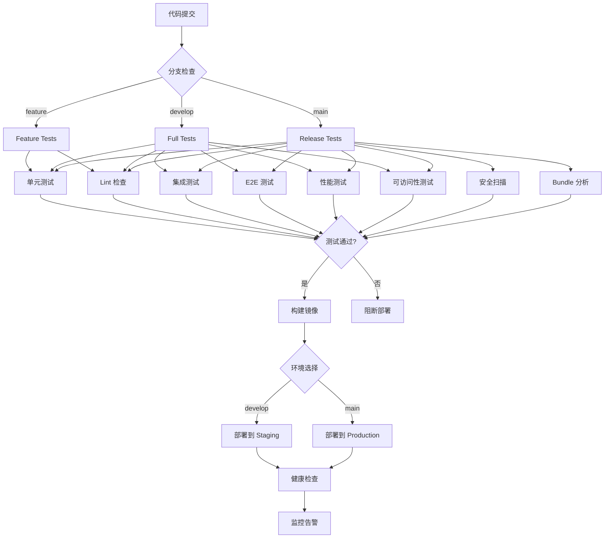

# 🔄 Xorigo UI Website CI/CD 集成方案

> **文档版本**: v1.0.0
> **创建日期**: 2025-10-13
> **负责团队**: Quality Engineer + DevOps
> **目标**: 构建自动化测试流水线, 确保代码质量和部署稳定性

---

## 📋 目录

1. [CI/CD 流程概览](#cicd-流程概览)
2. [GitHub Actions 配置](#github-actions-配置)
3. [测试流水线](#测试流水线)
4. [质量门禁](#质量门禁)
5. [部署流程](#部署流程)
6. [监控和告警](#监控和告警)

---

## 🎯 CI/CD 流程概览

### 流程架构



### 测试策略

```yaml
测试级别:
  L1_快速反馈 (< 2分钟):
    - ESLint/TypeScript 检查
    - 单元测试
    - 代码格式检查

  L2_核心验证 (< 5分钟):
    - 集成测试
    - 数据一致性校验
    - 构建验证

  L3_深度测试 (< 15分钟):
    - E2E 测试
    - 性能测试
    - 可访问性测试
    - 安全扫描

  L4_生产验证 (< 30分钟):
    - 冒烟测试
    - 负载测试
    - 监控验证
```

---

## ⚙️ GitHub Actions 配置

### 1. PR 检查工作流

```yaml
# .github/workflows/pr-check.yml
name: PR Check

on:
  pull_request:
    branches: [main, develop]
    types: [opened, synchronize, reopened]

concurrency:
  group: ${{ github.workflow }}-${{ github.ref }}
  cancel-in-progress: true

jobs:
  # 快速检查 (并行执行)
  quick-checks:
    name: Quick Checks
    runs-on: ubuntu-latest
    timeout-minutes: 5

    strategy:
      matrix:
        check: [lint, type-check, format]

    steps:
      - name: Checkout
        uses: actions/checkout@v4

      - name: Setup Node.js
        uses: actions/setup-node@v4
        with:
          node-version: '22'
          cache: 'npm'

      - name: Install dependencies
        run: npm ci

      - name: Run ${{ matrix.check }}
        run: |
          case "${{ matrix.check }}" in
            lint) npm run lint --workspace=apps/website ;;
            type-check) npm run type-check --workspace=apps/website ;;
            format) npm run format:check --workspace=apps/website ;;
          esac

  # 单元测试
  unit-tests:
    name: Unit Tests
    runs-on: ubuntu-latest
    timeout-minutes: 10

    steps:
      - name: Checkout
        uses: actions/checkout@v4

      - name: Setup Node.js
        uses: actions/setup-node@v4
        with:
          node-version: '22'
          cache: 'npm'

      - name: Install dependencies
        run: npm ci

      - name: Run unit tests with coverage
        run: npm run test:coverage --workspace=apps/website

      - name: Upload coverage to Codecov
        uses: codecov/codecov-action@v4
        with:
          files: ./apps/website/coverage/lcov.info
          flags: website-unit
          name: website-unit-coverage
          token: ${{ secrets.CODECOV_TOKEN }}

      - name: Check coverage threshold
        run: |
          COVERAGE=$(jq -r '.total.lines.pct' apps/website/coverage/coverage-summary.json)
          echo "Coverage: $COVERAGE%"
          if (( $(echo "$COVERAGE < 80" | bc -l) )); then
            echo "❌ Coverage below 80%"
            exit 1
          fi
          echo "✅ Coverage meets threshold"

  # 数据一致性检查
  data-consistency:
    name: Data Consistency Check
    runs-on: ubuntu-latest
    timeout-minutes: 5

    steps:
      - name: Checkout
        uses: actions/checkout@v4

      - name: Setup Node.js
        uses: actions/setup-node@v4
        with:
          node-version: '22'
          cache: 'npm'

      - name: Install dependencies
        run: npm ci

      - name: Validate Registry consistency
        run: npm run validate:registry --workspace=apps/website

      - name: Validate Tokens consistency
        run: npm run validate:tokens --workspace=apps/website

      - name: Validate Schemas
        run: npm run validate:schemas --workspace=apps/website

  # 集成测试
  integration-tests:
    name: Integration Tests
    runs-on: ubuntu-latest
    timeout-minutes: 10
    needs: [quick-checks, unit-tests, data-consistency]

    steps:
      - name: Checkout
        uses: actions/checkout@v4

      - name: Setup Node.js
        uses: actions/setup-node@v4
        with:
          node-version: '22'
          cache: 'npm'

      - name: Install dependencies
        run: npm ci

      - name: Run integration tests
        run: npm run test:integration --workspace=apps/website

  # PR 状态汇总
  pr-check-status:
    name: PR Check Status
    runs-on: ubuntu-latest
    needs: [quick-checks, unit-tests, data-consistency, integration-tests]
    if: always()

    steps:
      - name: Check all jobs status
        run: |
          if [[ "${{ needs.quick-checks.result }}" != "success" ]] || \
             [[ "${{ needs.unit-tests.result }}" != "success" ]] || \
             [[ "${{ needs.data-consistency.result }}" != "success" ]] || \
             [[ "${{ needs.integration-tests.result }}" != "success" ]]; then
            echo "❌ PR checks failed"
            exit 1
          fi
          echo "✅ All PR checks passed"
```

### 2. 完整测试工作流

```yaml
# .github/workflows/full-test.yml
name: Full Test Suite

on:
  push:
    branches: [develop, main]
  schedule:
    - cron: '0 0 * * *'  # 每天运行一次

jobs:
  # 前置检查 (复用 PR 检查)
  quick-checks:
    uses: ./.github/workflows/pr-check.yml

  # E2E 测试
  e2e-tests:
    name: E2E Tests
    runs-on: ubuntu-latest
    timeout-minutes: 20
    needs: quick-checks

    strategy:
      matrix:
        browser: [chromium, firefox, webkit]
        shard: [1, 2, 3]

    steps:
      - name: Checkout
        uses: actions/checkout@v4

      - name: Setup Node.js
        uses: actions/setup-node@v4
        with:
          node-version: '22'
          cache: 'npm'

      - name: Install dependencies
        run: npm ci

      - name: Install Playwright browsers
        run: npx playwright install --with-deps ${{ matrix.browser }}
        working-directory: apps/website

      - name: Build application
        run: npm run build --workspace=apps/website

      - name: Run E2E tests (${{ matrix.browser }})
        run: npx playwright test --project=${{ matrix.browser }} --shard=${{ matrix.shard }}/3
        working-directory: apps/website

      - name: Upload Playwright report
        uses: actions/upload-artifact@v4
        if: always()
        with:
          name: playwright-report-${{ matrix.browser }}-${{ matrix.shard }}
          path: apps/website/playwright-report/
          retention-days: 30

  # 性能测试
  performance-tests:
    name: Performance Tests
    runs-on: ubuntu-latest
    timeout-minutes: 15
    needs: quick-checks

    steps:
      - name: Checkout
        uses: actions/checkout@v4

      - name: Setup Node.js
        uses: actions/setup-node@v4
        with:
          node-version: '22'
          cache: 'npm'

      - name: Install dependencies
        run: npm ci

      - name: Build application
        run: npm run build --workspace=apps/website
        env:
          ANALYZE: true

      - name: Run Lighthouse CI
        run: |
          npm install -g @lhci/cli@0.14.x
          lhci autorun
        working-directory: apps/website
        env:
          LHCI_GITHUB_APP_TOKEN: ${{ secrets.LHCI_GITHUB_APP_TOKEN }}

      - name: Check bundle size
        run: npm run check:bundle-size --workspace=apps/website

      - name: Upload Lighthouse reports
        uses: actions/upload-artifact@v4
        if: always()
        with:
          name: lighthouse-reports
          path: apps/website/.lighthouseci/
          retention-days: 30

  # 可访问性测试
  accessibility-tests:
    name: Accessibility Tests
    runs-on: ubuntu-latest
    timeout-minutes: 15
    needs: quick-checks

    steps:
      - name: Checkout
        uses: actions/checkout@v4

      - name: Setup Node.js
        uses: actions/setup-node@v4
        with:
          node-version: '22'
          cache: 'npm'

      - name: Install dependencies
        run: npm ci

      - name: Install Playwright
        run: npx playwright install --with-deps chromium
        working-directory: apps/website

      - name: Build application
        run: npm run build --workspace=apps/website

      - name: Start server
        run: npm run start --workspace=apps/website &
        env:
          PORT: 3000

      - name: Wait for server
        run: npx wait-on http://localhost:3000

      - name: Run axe accessibility audit
        run: npm run audit:a11y --workspace=apps/website

      - name: Upload a11y reports
        uses: actions/upload-artifact@v4
        if: always()
        with:
          name: a11y-reports
          path: apps/website/a11y-*.json
          retention-days: 30

      - name: Check for critical violations
        run: |
          CRITICAL=$(jq '[.violations[] | select(.impact=="critical" or .impact=="serious")] | length' apps/website/a11y-home.json)
          echo "Critical/Serious violations: $CRITICAL"
          if [ "$CRITICAL" -gt 0 ]; then
            echo "❌ Accessibility test failed: $CRITICAL critical/serious violations"
            exit 1
          fi
          echo "✅ No critical accessibility violations"

  # 安全扫描
  security-scan:
    name: Security Scan
    runs-on: ubuntu-latest
    timeout-minutes: 10
    needs: quick-checks

    steps:
      - name: Checkout
        uses: actions/checkout@v4

      - name: Run npm audit
        run: npm audit --audit-level=moderate
        continue-on-error: true

      - name: Run Trivy vulnerability scanner
        uses: aquasecurity/trivy-action@master
        with:
          scan-type: 'fs'
          scan-ref: './apps/website'
          format: 'sarif'
          output: 'trivy-results.sarif'

      - name: Upload Trivy results to GitHub Security
        uses: github/codeql-action/upload-sarif@v3
        if: always()
        with:
          sarif_file: 'trivy-results.sarif'

  # 测试结果汇总
  test-summary:
    name: Test Summary
    runs-on: ubuntu-latest
    needs: [e2e-tests, performance-tests, accessibility-tests, security-scan]
    if: always()

    steps:
      - name: Download all artifacts
        uses: actions/download-artifact@v4

      - name: Generate test summary
        run: |
          echo "# 测试结果汇总" >> $GITHUB_STEP_SUMMARY
          echo "" >> $GITHUB_STEP_SUMMARY

          echo "## E2E 测试" >> $GITHUB_STEP_SUMMARY
          if [[ "${{ needs.e2e-tests.result }}" == "success" ]]; then
            echo "✅ 通过" >> $GITHUB_STEP_SUMMARY
          else
            echo "❌ 失败" >> $GITHUB_STEP_SUMMARY
          fi

          echo "" >> $GITHUB_STEP_SUMMARY
          echo "## 性能测试" >> $GITHUB_STEP_SUMMARY
          if [[ "${{ needs.performance-tests.result }}" == "success" ]]; then
            echo "✅ 通过" >> $GITHUB_STEP_SUMMARY
          else
            echo "❌ 失败" >> $GITHUB_STEP_SUMMARY
          fi

          echo "" >> $GITHUB_STEP_SUMMARY
          echo "## 可访问性测试" >> $GITHUB_STEP_SUMMARY
          if [[ "${{ needs.accessibility-tests.result }}" == "success" ]]; then
            echo "✅ 通过" >> $GITHUB_STEP_SUMMARY
          else
            echo "❌ 失败" >> $GITHUB_STEP_SUMMARY
          fi

          echo "" >> $GITHUB_STEP_SUMMARY
          echo "## 安全扫描" >> $GITHUB_STEP_SUMMARY
          if [[ "${{ needs.security-scan.result }}" == "success" ]]; then
            echo "✅ 通过" >> $GITHUB_STEP_SUMMARY
          else
            echo "⚠️ 发现安全问题" >> $GITHUB_STEP_SUMMARY
          fi

      - name: Check overall status
        run: |
          if [[ "${{ needs.e2e-tests.result }}" != "success" ]] || \
             [[ "${{ needs.performance-tests.result }}" != "success" ]] || \
             [[ "${{ needs.accessibility-tests.result }}" != "success" ]]; then
            echo "❌ Test suite failed"
            exit 1
          fi
          echo "✅ All tests passed"
```

### 3. 部署工作流

```yaml
# .github/workflows/deploy.yml
name: Deploy

on:
  push:
    branches: [main]
    tags:
      - 'v*.*.*'

  workflow_dispatch:
    inputs:
      environment:
        description: 'Deployment environment'
        required: true
        type: choice
        options:
          - staging
          - production

jobs:
  # 构建镜像
  build:
    name: Build Docker Image
    runs-on: ubuntu-latest
    timeout-minutes: 15

    outputs:
      image-tag: ${{ steps.meta.outputs.tags }}

    steps:
      - name: Checkout
        uses: actions/checkout@v4

      - name: Set up Docker Buildx
        uses: docker/setup-buildx-action@v3

      - name: Log in to Docker Hub
        uses: docker/login-action@v3
        with:
          username: ${{ secrets.DOCKER_USERNAME }}
          password: ${{ secrets.DOCKER_PASSWORD }}

      - name: Extract metadata
        id: meta
        uses: docker/metadata-action@v5
        with:
          images: xorigo-ui/website
          tags: |
            type=ref,event=branch
            type=ref,event=pr
            type=semver,pattern={{version}}
            type=semver,pattern={{major}}.{{minor}}
            type=sha

      - name: Build and push
        uses: docker/build-push-action@v5
        with:
          context: ./apps/website
          push: true
          tags: ${{ steps.meta.outputs.tags }}
          cache-from: type=gha
          cache-to: type=gha,mode=max
          build-args: |
            NODE_ENV=production

  # 部署到 Staging
  deploy-staging:
    name: Deploy to Staging
    runs-on: ubuntu-latest
    needs: build
    if: github.ref == 'refs/heads/develop' || github.event.inputs.environment == 'staging'
    environment:
      name: staging
      url: https://staging.xorigo-ui.com

    steps:
      - name: Deploy to Staging
        run: |
          echo "Deploying to Staging environment"
          # 实际部署命令 (Vercel/AWS/GCP)

      - name: Run smoke tests
        run: |
          echo "Running smoke tests"
          # 冒烟测试脚本

      - name: Notify deployment
        uses: 8398a7/action-slack@v3
        with:
          status: ${{ job.status }}
          text: 'Website deployed to Staging'
          webhook_url: ${{ secrets.SLACK_WEBHOOK }}

  # 部署到 Production
  deploy-production:
    name: Deploy to Production
    runs-on: ubuntu-latest
    needs: build
    if: startsWith(github.ref, 'refs/tags/v') || github.event.inputs.environment == 'production'
    environment:
      name: production
      url: https://xorigo-ui.com

    steps:
      - name: Deploy to Production
        run: |
          echo "Deploying to Production environment"
          # 实际部署命令

      - name: Run smoke tests
        run: |
          echo "Running smoke tests"
          # 冒烟测试脚本

      - name: Create GitHub Release
        uses: softprops/action-gh-release@v1
        if: startsWith(github.ref, 'refs/tags/v')
        with:
          generate_release_notes: true

      - name: Notify deployment
        uses: 8398a7/action-slack@v3
        with:
          status: ${{ job.status }}
          text: 'Website deployed to Production'
          webhook_url: ${{ secrets.SLACK_WEBHOOK }}
```

---

## 🚪 质量门禁

### 1. 代码质量门禁

```yaml
# .github/quality-gates.yml
quality_gates:
  # P0 门禁 (必须通过)
  critical:
    - name: "ESLint 检查"
      command: "npm run lint"
      threshold: "0 errors"
      blocking: true

    - name: "TypeScript 类型检查"
      command: "npm run type-check"
      threshold: "0 errors"
      blocking: true

    - name: "数据一致性校验"
      command: "npm run validate:consistency"
      threshold: "valid: true"
      blocking: true

    - name: "单元测试覆盖率"
      command: "npm run test:coverage"
      threshold: "lines >= 80%"
      blocking: true

  # P1 门禁 (强烈建议)
  important:
    - name: "集成测试"
      command: "npm run test:integration"
      threshold: "pass rate >= 95%"
      blocking: true

    - name: "E2E 测试"
      command: "npm run test:e2e"
      threshold: "pass rate >= 90%"
      blocking: true

    - name: "性能预算"
      command: "npm run check:bundle-size"
      threshold: "within budget"
      blocking: true

    - name: "Lighthouse 评分"
      command: "npm run lighthouse"
      threshold: "performance >= 80"
      blocking: true

    - name: "可访问性审计"
      command: "npm run audit:a11y"
      threshold: "critical + serious = 0"
      blocking: true

  # P2 门禁 (建议但不阻断)
  recommended:
    - name: "安全扫描"
      command: "npm audit"
      threshold: "high + critical = 0"
      blocking: false

    - name: "代码复杂度"
      command: "npm run complexity"
      threshold: "average < 10"
      blocking: false

    - name: "代码重复率"
      command: "npm run duplication"
      threshold: "< 5%"
      blocking: false
```

### 2. 质量门禁实现

```typescript
// scripts/check-quality-gates.ts
/**
 * @fileoverview 质量门禁检查脚本
 */

import { execSync } from 'child_process'
import { readFileSync } from 'fs'
import YAML from 'yaml'

interface QualityGate {
  name: string
  command: string
  threshold: string
  blocking: boolean
}

interface QualityGateConfig {
  critical: QualityGate[]
  important: QualityGate[]
  recommended: QualityGate[]
}

interface GateResult {
  gate: QualityGate
  passed: boolean
  actual: string
  expected: string
  error?: string
}

function loadQualityGates(): QualityGateConfig {
  const configPath = '.github/quality-gates.yml'
  const content = readFileSync(configPath, 'utf-8')
  const config = YAML.parse(content)
  return config.quality_gates
}

function executeGate(gate: QualityGate): GateResult {
  console.log(`\n🔍 检查: ${gate.name}`)
  console.log(`   命令: ${gate.command}`)
  console.log(`   阈值: ${gate.threshold}`)

  try {
    const output = execSync(gate.command, {
      encoding: 'utf-8',
      stdio: 'pipe'
    })

    // 解析输出并验证阈值
    const passed = validateThreshold(output, gate.threshold)

    return {
      gate,
      passed,
      actual: output.trim().substring(0, 100),
      expected: gate.threshold
    }
  } catch (error: any) {
    return {
      gate,
      passed: false,
      actual: 'Execution failed',
      expected: gate.threshold,
      error: error.message
    }
  }
}

function validateThreshold(output: string, threshold: string): boolean {
  // 简化的阈值验证逻辑
  // 实际实现需要根据具体阈值格式解析

  if (threshold.includes('0 errors')) {
    return !output.includes('error')
  }

  if (threshold.includes('lines >=')) {
    const match = threshold.match(/lines >= (\d+)%/)
    if (match) {
      const required = parseInt(match[1])
      const actual = extractCoverage(output)
      return actual >= required
    }
  }

  if (threshold.includes('critical + serious = 0')) {
    return !output.includes('"impact":"critical"') &&
           !output.includes('"impact":"serious"')
  }

  // 默认通过
  return true
}

function extractCoverage(output: string): number {
  const match = output.match(/Lines\s*:\s*(\d+\.?\d*)%/)
  return match ? parseFloat(match[1]) : 0
}

function printResults(results: GateResult[]) {
  console.log('\n📋 质量门禁检查结果\n')

  const passed = results.filter(r => r.passed)
  const failed = results.filter(r => !r.passed)

  console.log(`✅ 通过: ${passed.length}`)
  console.log(`❌ 失败: ${failed.length}\n`)

  if (failed.length > 0) {
    console.log('失败详情:\n')
    failed.forEach(result => {
      console.log(`❌ ${result.gate.name}`)
      console.log(`   预期: ${result.expected}`)
      console.log(`   实际: ${result.actual}`)
      if (result.error) {
        console.log(`   错误: ${result.error}`)
      }
      console.log('')
    })
  }
}

async function main() {
  console.log('🚀 开始质量门禁检查\n')

  const config = loadQualityGates()
  const allGates = [
    ...config.critical,
    ...config.important,
    ...config.recommended
  ]

  const results: GateResult[] = []

  for (const gate of allGates) {
    const result = executeGate(gate)
    results.push(result)

    const status = result.passed ? '✅ 通过' : '❌ 失败'
    console.log(`   ${status}`)
  }

  printResults(results)

  // 检查阻断性失败
  const blockingFailures = results.filter(
    r => !r.passed && r.gate.blocking
  )

  if (blockingFailures.length > 0) {
    console.log('❌ 质量门禁检查未通过: 存在阻断性失败')
    process.exit(1)
  }

  console.log('✅ 质量门禁检查全部通过')
  process.exit(0)
}

main()
```

---

## 📊 监控和告警

### 1. 性能监控配置

```typescript
// apps/website/src/lib/monitoring.ts
/**
 * @fileoverview 性能监控和错误追踪
 */

import { getCLS, getFID, getFCP, getLCP, getTTFB } from 'web-vitals'

interface AnalyticsEvent {
  name: string
  value: number
  rating: 'good' | 'needs-improvement' | 'poor'
  delta: number
  id: string
  navigationType: string
}

// 发送到分析服务
function sendToAnalytics(event: AnalyticsEvent) {
  if (typeof window === 'undefined') return

  // 示例: 发送到 Google Analytics
  if (window.gtag) {
    window.gtag('event', event.name, {
      value: Math.round(event.value),
      event_category: 'Web Vitals',
      event_label: event.id,
      non_interaction: true,
    })
  }

  // 示例: 发送到自定义 API
  fetch('/api/analytics/vitals', {
    method: 'POST',
    headers: { 'Content-Type': 'application/json' },
    body: JSON.stringify(event),
    keepalive: true,
  }).catch(console.error)
}

// 初始化 Web Vitals 监控
export function initWebVitalsMonitoring() {
  getCLS(sendToAnalytics)
  getFID(sendToAnalytics)
  getFCP(sendToAnalytics)
  getLCP(sendToAnalytics)
  getTTFB(sendToAnalytics)
}

// 错误边界监控
export function initErrorMonitoring() {
  if (typeof window === 'undefined') return

  window.addEventListener('error', (event) => {
    fetch('/api/analytics/errors', {
      method: 'POST',
      headers: { 'Content-Type': 'application/json' },
      body: JSON.stringify({
        message: event.message,
        filename: event.filename,
        lineno: event.lineno,
        colno: event.colno,
        stack: event.error?.stack,
        timestamp: Date.now(),
      }),
      keepalive: true,
    }).catch(console.error)
  })

  window.addEventListener('unhandledrejection', (event) => {
    fetch('/api/analytics/errors', {
      method: 'POST',
      headers: { 'Content-Type': 'application/json' },
      body: JSON.stringify({
        message: 'Unhandled Promise Rejection',
        reason: event.reason,
        timestamp: Date.now(),
      }),
      keepalive: true,
    }).catch(console.error)
  })
}
```

### 2. 告警规则配置

```yaml
# .github/alert-rules.yml
alert_rules:
  # 性能告警
  performance:
    - metric: "LCP"
      threshold: 2500
      severity: "warning"
      action: "notify_team"

    - metric: "CLS"
      threshold: 0.1
      severity: "error"
      action: "create_issue"

    - metric: "Bundle Size"
      threshold: 120KB
      severity: "error"
      action: "block_merge"

  # 可用性告警
  availability:
    - metric: "Error Rate"
      threshold: 1%
      severity: "warning"
      action: "notify_team"

    - metric: "API Success Rate"
      threshold: 95%
      severity: "error"
      action: "page_oncall"

  # 可访问性告警
  accessibility:
    - metric: "Critical Violations"
      threshold: 0
      severity: "error"
      action: "block_merge"

    - metric: "Serious Violations"
      threshold: 0
      severity: "error"
      action: "block_merge"

  # 安全告警
  security:
    - metric: "Critical Vulnerabilities"
      threshold: 0
      severity: "critical"
      action: "page_security_team"

    - metric: "High Vulnerabilities"
      threshold: 0
      severity: "error"
      action: "create_issue"
```

---

## 📝 总结

### CI/CD 流程完整性

✅ **PR 检查流程**: 快速反馈, 阻断低质量代码
✅ **完整测试流水线**: 多层次测试覆盖
✅ **质量门禁**: 自动化质量控制
✅ **自动化部署**: 安全可靠的发布流程
✅ **监控告警**: 实时问题检测和响应

### 关键指标

- **测试覆盖率**: ≥ 80%
- **E2E 测试通过率**: ≥ 90%
- **性能预算达标率**: 100%
- **可访问性合规**: 严重/中等问题 = 0
- **部署成功率**: ≥ 98%
- **回滚时间**: ≤ 5 分钟

### 后续优化

- 引入 Chaos Engineering 进行韧性测试
- 集成 Lighthouse CI 持续性能监控
- 实现金丝雀发布和蓝绿部署
- 引入 A/B 测试框架
- 完善日志聚合和分析

---

**维护说明**:
- 每月review和优化CI/CD流程
- 根据实际情况调整质量门禁阈值
- 持续监控和改进测试稳定性
