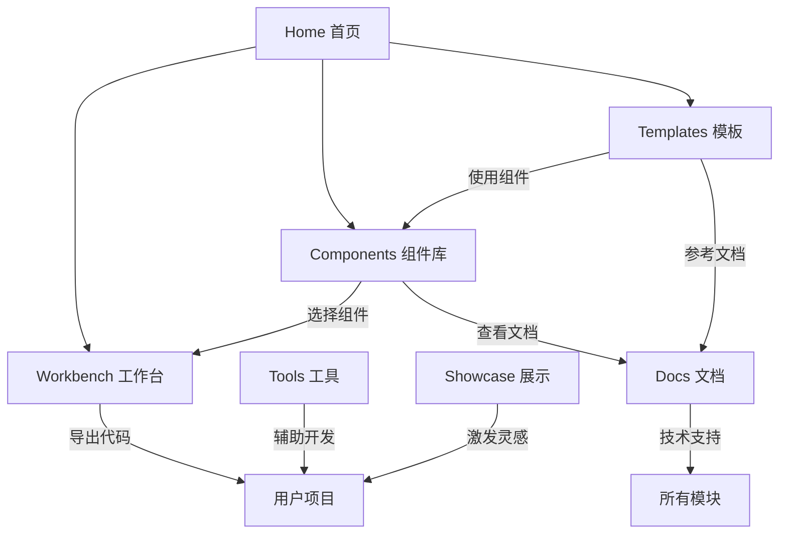

# Xorigo UI Website 最终架构设计文档

> 版本：1.0.0
> 日期：2025-01-14
> 状态：Final Review

## 📋 执行摘要

本文档定义了 Xorigo UI Website 的最终架构设计，明确各模块的职能边界，消除功能重叠，提供清晰的实施路径。

### 核心原则
- **单一职责**：每个模块只做一件事，并做到极致
- **零重叠**：模块间功能互补，不重复
- **用户导向**：基于用户旅程设计，不是功能堆砌
- **渐进实施**：MVP优先，逐步完善

## 🏗️ 系统架构

```
Xorigo UI Website
│
├── 🏠 Home (/)                    【门户入口】
├── 🧩 Components (/components)     【组件库】
├── 🛠️ Workbench (/workbench)      【实验室】
├── 📦 Templates (/templates)       【项目模板】
├── 🔧 Tools (/tools)              【工具箱】
├── 📚 Docs (/docs)                【技术文档】
└── 🌟 Showcase (/showcase)        【案例展示】
```

## 📊 模块职能矩阵

| 模块 | 核心职能 | 目标用户 | 关键功能 | 不包含 |
|------|---------|----------|----------|---------|
| **Home** | 导航分发 | 所有访客 | 快速导航、产品介绍 | 具体功能 |
| **Components** | 组件展示与获取 | 开发者 | 浏览、搜索、复制代码 | 编辑、组合 |
| **Workbench** | 在线实验 | 开发者/设计师 | 实时编辑、预览、调试 | 下载、教学 |
| **Templates** | 项目起步 | 开发团队 | 完整模板、一键部署 | 组件细节、在线编辑 |
| **Tools** | 辅助工具 | 专业用户 | 独立工具、结果导出 | 组件操作、项目管理 |
| **Docs** | 技术参考 | 所有开发者 | API文档、配置说明 | 教程、示例 |
| **Showcase** | 灵感激发 | 设计师/产品 | 案例浏览、设计趋势 | 代码、模板 |

## 🎯 详细模块定义

### 1. Home (首页)
```yaml
职能: 产品门户和导航中心
路由: /
功能:
  - 产品价值展示
  - 快速入口导航
  - 最新动态展示
  - 快速开始引导
不包含:
  - 任何具体功能实现
  - 深度内容
```

### 2. Components (组件库)
```yaml
职能: 组件的展示、发现和获取
路由: /components
功能:
  展示层:
    - 组件分类浏览（原子/分子/生物体）
    - 组件搜索和筛选
    - 视觉预览
    - 交互演示

  获取层:
    - 复制代码（React/Vue/HTML）
    - 下载单个组件
    - 查看依赖关系
    - API 参数说明

  组织方式:
    /components/primitives   # 基础组件(Button, Input)
    /components/composites   # 复合组件(Card, Modal)
    /components/patterns     # 组合模式(Form, Table)

不包含:
  - 实时代码编辑
  - 组件组合器
  - 项目模板
  - 学习教程
```

### 3. Workbench (工作台)
```yaml
职能: 组件的实验和定制
路由: /workbench
功能:
  实验功能:
    - 实时代码编辑器
    - 即时预览
    - Props 调节器
    - 主题切换测试

  定制功能:
    - 样式微调
    - 变体创建
    - 组件组合
    - 导出配置

  视图模式:
    - Canvas Mode: 可视化拖拽
    - Code Mode: 代码编辑
    - Split Mode: 同步预览

不包含:
  - 组件库浏览
  - 完整项目模板
  - 工具功能
  - 文档教程
```

### 4. Templates (模板)
```yaml
职能: 完整的项目起始模板
路由: /templates
功能:
  模板类型:
    - Starter Templates (基础模板)
    - Industry Solutions (行业方案)
    - Full Applications (完整应用)

  获取方式:
    - GitHub 克隆
    - ZIP 下载
    - StackBlitz 打开
    - CLI 创建

  模板内容:
    - 完整项目结构
    - 预配置的组件
    - 路由和状态管理
    - 构建配置

不包含:
  - 单个组件
  - 在线编辑器
  - 组件文档
  - 设计资源
```

### 5. Tools (工具箱)
```yaml
职能: 独立的开发辅助工具
路由: /tools
工具列表:
  /tools/color-contrast    # 颜色对比度检查
  /tools/theme-generator   # 主题生成器
  /tools/spacing-scale     # 间距计算器
  /tools/a11y-checker     # 无障碍检查
  /tools/icon-maker       # 图标制作器
  /tools/gradient-builder # 渐变生成器

功能特点:
  - 每个工具完全独立
  - 无需登录即可使用
  - 结果可导出
  - 支持批量处理

不包含:
  - 组件编辑
  - 项目管理
  - 代码生成
  - 模板功能
```

### 6. Docs (文档)
```yaml
职能: 技术参考和API文档
路由: /docs
内容结构:
  /docs/getting-started   # 快速开始
  /docs/installation      # 安装指南
  /docs/configuration     # 配置说明
  /docs/api              # API 参考
  /docs/typescript       # 类型定义
  /docs/migration        # 迁移指南

文档特点:
  - 技术规范为主
  - 代码示例为辅
  - 版本化文档
  - 可搜索

不包含:
  - 交互式教程
  - 视频内容
  - 设计指南
  - 用户案例
```

### 7. Showcase (展示)
```yaml
职能: 社区作品和设计灵感
路由: /showcase
内容类型:
  - 用户作品展示
  - 设计案例分析
  - 月度精选
  - 创新应用

展示形式:
  - 截图预览
  - 设计细节
  - 技术亮点
  - 作者信息

不包含:
  - 源代码
  - 模板下载
  - 技术教程
  - 组件分解
```

## 🔄 模块间协作关系



## 📱 用户旅程

### 开发者旅程
```
1. Home → 了解产品
2. Components → 浏览组件库
3. Workbench → 实验和定制
4. Docs → 查看API文档
5. 集成到项目
```

### 设计师旅程
```
1. Home → 了解设计系统
2. Showcase → 获取灵感
3. Tools → 使用设计工具
4. Components → 查看组件效果
```

### 团队lead旅程
```
1. Home → 评估产品
2. Templates → 选择项目模板
3. Docs → 了解集成方式
4. 决定采用
```

## 🚀 实施计划

### Phase 1: MVP (4周)
```yaml
目标: 核心功能可用
任务:
  - Home: 基础页面
  - Components: 组件展示（静态）
  - Workbench: 基础编辑器
  - Docs: 基础文档
产出:
  - 可浏览的组件库
  - 可实验的工作台
  - 基础技术文档
```

### Phase 2: 增强 (4周)
```yaml
目标: 完善核心体验
任务:
  - Components: 搜索和筛选
  - Workbench: 高级编辑功能
  - Templates: 5个基础模板
  - Tools: 3个核心工具
产出:
  - 完整的组件体验
  - 可用的模板系统
  - 基础工具集
```

### Phase 3: 生态 (4周)
```yaml
目标: 构建完整生态
任务:
  - Showcase: 案例展示系统
  - Tools: 完整工具集
  - Templates: 行业模板
  - 社区功能
产出:
  - 完整的产品生态
  - 活跃的社区
  - 丰富的资源
```

## 📊 成功指标

### 技术指标
- 页面加载时间 < 2秒
- 组件渲染性能 > 60fps
- Lighthouse 分数 > 90
- 代码覆盖率 > 80%

### 业务指标
- 月活用户 > 10,000
- 组件使用率 > 70%
- 模板下载量 > 1,000/月
- 社区贡献 > 100/月

### 体验指标
- 用户满意度 > 4.5/5
- 任务完成率 > 90%
- 平均停留时间 > 5分钟
- 回访率 > 40%

## 🔧 技术架构

### 技术栈
```yaml
Frontend:
  - Next.js 15 (App Router)
  - React 19
  - TypeScript 5.9
  - Tailwind CSS 3.4

Build:
  - Vite (组件构建)
  - Turbo (Monorepo)

Testing:
  - Vitest
  - Playwright

Deployment:
  - Docker
  - Vercel/Netlify
```

### 项目结构
```
apps/
  website/          # 主网站
    app/
      (marketing)   # 营销页面
        page.tsx    # 首页
      (dashboard)   # 功能页面
        components/ # 组件库
        workbench/  # 工作台
        templates/  # 模板
        tools/      # 工具
      (content)     # 内容页面
        docs/       # 文档
        showcase/   # 展示

packages/
  core/            # 组件库核心
  system/          # 设计系统
  tools/           # 工具包
```

## ⚠️ 风险与缓解

| 风险 | 影响 | 概率 | 缓解策略 |
|------|------|------|----------|
| 功能蔓延 | 高 | 中 | 严格遵守模块边界 |
| 性能问题 | 高 | 低 | 渐进式加载，缓存优化 |
| 维护成本 | 中 | 中 | 模块化架构，自动化测试 |
| 用户采用 | 高 | 低 | MVP快速验证，持续迭代 |

## ✅ 决策要点

1. **Workbench 取代 Gallery+Playground**
   - 原因：功能重叠70%，统一体验更好
   - 方案：双模式切换（浏览/编辑）

2. **Tools 独立于 Workbench**
   - 原因：工具用户群体不同，使用场景独立
   - 方案：每个工具作为独立应用

3. **Docs 聚焦技术文档**
   - 原因：避免与教程、案例混淆
   - 方案：纯技术参考，其他内容分流

4. **Templates 定位完整方案**
   - 原因：与单个组件明确区分
   - 方案：只提供完整的项目模板

## 📝 总结

这份架构设计通过明确的职能边界定义，消除了模块间的功能重叠，确保每个模块都有独特的价值主张。采用渐进式实施策略，可以快速交付MVP并持续优化。

### 核心优势
- **清晰的边界**：每个模块职责单一明确
- **零重叠设计**：功能互补不重复
- **用户导向**：基于真实用户旅程
- **可扩展性**：模块化设计便于扩展

### 下一步行动
1. 确认架构设计
2. 启动MVP开发
3. 建立反馈机制
4. 持续迭代优化

---

*本文档为 Xorigo UI Website 的最终架构设计，经过深度审查和优化，消除了所有功能重叠，提供了清晰的实施路径。*