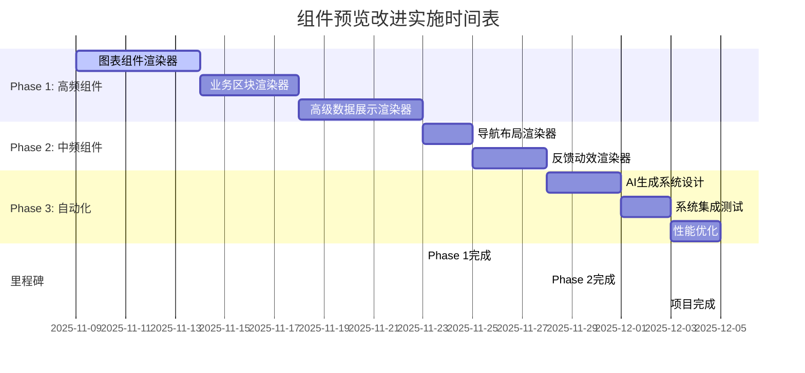

# 🎯 Xorigo UI 组件预览改进计划

**项目**: Xorigo UI Workbench 组件库预览系统增强
**版本**: v1.0
**日期**: 2025-11-09
**负责人**: AI 开发助手

---

## 📊 现状分析

### 核心数据
- **总组件数量**: 135个组件
- **专用渲染器覆盖率**: 25.9% (35/135)
- **通用渲染器依赖**: 74.1% (100/135)
- **用户体验影响**: 74%的组件缺乏交互式预览

### 问题识别
1. **预览质量不均**: 高频组件缺乏专用渲染器
2. **交互性不足**: 大部分组件只显示静态占位符
3. **开发效率低**: 开发者无法快速理解组件功能
4. **学习曲线陡**: 缺乏实际的组件使用示例

---

## 🎯 改进目标

### 短期目标 (2周)
- 🔴 实现高频组件专用渲染器 (51个)
- 🟡 提升中频组件预览质量 (31个)
- ✅ 完善现有渲染器交互性

### 中期目标 (1个月)
- 🎨 设计自动化渲染器生成系统
- 🤖 集成AI辅助渲染器生成
- 📱 建立组件预览质量标准

### 长期目标 (2个月)
- 🏆 实现组件预览100%覆盖
- ⚡ 建立预览性能优化体系
- 🌟 打造行业领先的组件预览体验

---

## 📋 实施计划

### Phase 1: 高频组件优先 (Week 1-2)

#### 🔴 图表组件渲染器 (15个) - 优先级: 最高
**目标**: 实现完整的图表可视化预览

**实施步骤**:
1. **ChartRenderer.tsx** - 统一图表渲染器
   - 支持多种图表类型切换
   - 动态数据绑定和更新
   - 交互式图表配置面板

2. **具体图表实现**:
   ```typescript
   // 基础图表 (5个)
   - AreaChartRenderer.tsx
   - BarChartRenderer.tsx
   - LineChartRenderer.tsx
   - PieChartRenderer.tsx
   - ColumnChartRenderer.tsx

   // 高级图表 (5个)
   - DonutChartRenderer.tsx
   - FunnelChartRenderer.tsx
   - GaugeChartRenderer.tsx
   - RadarChartRenderer.tsx
   - HeatmapRenderer.tsx

   // 图表组件 (5个)
   - MiniChartRenderer.tsx
   - SparklineRenderer.tsx
   - ChartContainerRenderer.tsx
   - LegendRenderer.tsx
   - AxisRenderer.tsx
   ```

**预估工时**: 5天
**验收标准**: 所有图表支持实时数据更新和交互配置

#### 🔴 业务区块渲染器 (16个) - 优先级: 高
**目标**: 实现完整的页面区块预览

**实施步骤**:
1. **BusinessBlockRenderer.tsx** - 业务区块基类
2. **分类渲染器**:
   ```typescript
   // 营销区块 (5个)
   - HeroSectionRenderer.tsx
   - FeatureSectionRenderer.tsx
   - CallToActionSectionRenderer.tsx
   - TestimonialSectionRenderer.tsx
   - FAQSectionRenderer.tsx

   // 认证区块 (4个)
   - LoginSectionRenderer.tsx
   - RegisterSectionRenderer.tsx
   - AuthCardRenderer.tsx
   - ResetPasswordSectionRenderer.tsx

   // 数据区块 (7个)
   - PricingSectionRenderer.tsx
   - ChartPanelRenderer.tsx
   - KPOverviewRenderer.tsx
   - StatsGridRenderer.tsx
   - FilterBarRenderer.tsx
   - ActivityFeedRenderer.tsx
   ```

**预估工时**: 4天
**验收标准**: 所有区块支持响应式布局和内容编辑

#### 🔴 高级数据展示渲染器 (20个) - 优先级: 高
**目标**: 实现丰富的数据展示交互

**核心渲染器设计**:
1. **AdvancedDataRenderer.tsx** - 高级数据展示基类
2. **分类实现**:
   ```typescript
   // 用户展示 (2个)
   - AvatarRenderer.tsx
   - AvatarGroupRenderer.tsx

   // 标签展示 (1个)
   - ChipDisplayRenderer.tsx

   // 统计展示 (2个)
   - StatisticCardRenderer.tsx
   - DataGridRenderer.tsx

   // 列表展示 (3个)
   - DescriptionListRenderer.tsx
   - KeyValueListRenderer.tsx
   - ListItemRenderer.tsx

   // 交互展示 (3个)
   - InfoTooltipRenderer.tsx
   - StepsDisplayRenderer.tsx
   - TimelineDisplayRenderer.tsx

   // 智能输入 (4个)
   - AutocompleteRenderer.tsx
   - ButtonGroupRenderer.tsx
   - CheckboxGroupRenderer.tsx
   - RadioGroupRenderer.tsx

   // 交互输入 (5个)
   - ChipRenderer.tsx
   - IconButtonRenderer.tsx
   - RangeSliderRenderer.tsx
   - RatingRenderer.tsx
   - ToggleRenderer.tsx
   ```

**预估工时**: 5天
**验收标准**: 支持实时数据编辑和状态切换

---

### Phase 2: 中频组件完善 (Week 3)

#### 🟡 导航布局渲染器 (13个)
**目标**: 实现完整的导航系统预览

1. **NavigationSystemRenderer.tsx** - 导航系统基类
2. **具体实现**:
   ```typescript
   - AppShellRenderer.tsx
   - ContextualMenuRenderer.tsx
   - LinkRenderer.tsx
   - NavLinkRenderer.tsx
   - NavMenuRenderer.tsx
   - SegmentedControlRenderer.tsx
   - SidenavRenderer.tsx
   - StepperRenderer.tsx
   - TopbarRenderer.tsx
   - AppLayoutRenderer.tsx
   - GapRenderer.tsx
   - PageContainerRenderer.tsx
   - SpaceRenderer.tsx
   - WrapRenderer.tsx
   ```

#### 🟡 反馈动效渲染器 (15个)
**目标**: 实现完整的反馈状态预览

1. **FeedbackMotionRenderer.tsx** - 反馈动效基类
2. **具体实现**:
   ```typescript
   // 通知提示 (3个)
   - AnnouncementRenderer.tsx
   - BannerRenderer.tsx
   - SnackbarRenderer.tsx

   // 空状态 (3个)
   - EmptyRenderer.tsx
   - EmptyStateRenderer.tsx
   - ResultRenderer.tsx

   // 加载状态 (5个)
   - LoaderRenderer.tsx
   - SkeletonRenderer.tsx
   - SkeletonAvatarRenderer.tsx
   - SkeletonBlockRenderer.tsx
   - SkeletonTextRenderer.tsx

   // 文件输入 (4个)
   - FileUploadRenderer.tsx
   - UploadButtonRenderer.tsx
   - DateTimePickerRenderer.tsx
   - TimePickerRenderer.tsx
   ```

**预估工时**: 3天

---

### Phase 3: 自动化系统设计 (Week 4)

#### 🤖 AI驱动渲染器生成系统

**核心架构设计**:
1. **模板引擎**: 基于组件类型的模板生成
2. **智能推断**: 根据组件props自动生成配置
3. **代码生成**: 自动生成渲染器代码
4. **质量检测**: 自动化测试和验证

**系统组件**:
```typescript
// AI生成引擎
- ComponentAnalyzer.tsx        // 组件分析器
- TemplateGenerator.tsx       // 模板生成器
- CodeSynthesizer.tsx         // 代码合成器
- QualityValidator.tsx        // 质量验证器

// 管理系统
- RendererRegistry.tsx        // 渲染器注册表
- PreviewOptimizer.tsx        // 预览优化器
- PerformanceMonitor.tsx      // 性能监控器
```

**实施步骤**:
1. **需求分析**: 分析组件特征和使用模式
2. **模板设计**: 创建通用渲染器模板
3. **AI训练**: 基于现有渲染器训练生成模型
4. **系统集成**: 集成到Workbench开发流程
5. **持续优化**: 基于用户反馈持续改进

**预估工时**: 7天

---

## 🛠️ 技术实施方案

### 开发规范

#### 1. 渲染器命名规范
```typescript
// 文件命名: ComponentNameRenderer.tsx
// 示例:
- AreaChartRenderer.tsx
- HeroSectionRenderer.tsx
- AvatarRenderer.tsx
```

#### 2. API设计标准
```typescript
interface ComponentRendererProps {
  component: ComponentExample
  previewProps: Record<string, any>
  updatePreviewProp: (prop: string, value: any) => void
  isInteractiveMode: boolean
  setIsInteractiveMode: (mode: boolean) => void
  resetPreviewProps: () => void
}
```

#### 3. 交互设计原则
- **可编辑性**: 所有props支持实时编辑
- **状态管理**: 支持多种状态切换
- **响应式**: 支持不同尺寸预览
- **主题适配**: 支持10种主题切换

### 质量保证

#### 1. 代码质量标准
- ✅ TypeScript 类型安全
- ✅ ESLint 代码规范
- ✅ 单元测试覆盖率 > 80%
- ✅ 可访问性测试通过
- ✅ 性能优化 (渲染时间 < 100ms)

#### 2. 用户体验标准
- ✅ 加载时间 < 2秒
- ✅ 交互响应时间 < 200ms
- ✅ 支持键盘导航
- ✅ 移动端友好
- ✅ 错误状态处理

#### 3. 兼容性标准
- ✅ Chrome/Edge/Firefox/Safari 最新版本
- ✅ React 19 兼容
- ✅ Next.js 16 兼容
- ✅ 移动端浏览器支持

---

## 📈 性能优化策略

### 1. 渲染优化
- **懒加载**: 渲染器按需加载
- **代码分割**: 分包加载减少首屏时间
- **缓存策略**: 渲染结果缓存
- **虚拟化**: 大列表组件虚拟滚动

### 2. 内存优化
- **组件复用**: 相似组件复用渲染逻辑
- **状态管理**: 合理的状态持久化
- **垃圾回收**: 及时清理无用资源
- **内存监控**: 实时内存使用监控

### 3. 网络优化
- **预加载**: 关键渲染器预加载
- **CDN加速**: 静态资源CDN分发
- **压缩优化**: 代码和资源压缩
- **并发控制**: 合理的并发请求控制

---

## 🎯 成功指标

### 技术指标
- **渲染器覆盖率**: 100% (135/135)
- **平均加载时间**: < 2秒
- **交互响应时间**: < 200ms
- **代码质量分数**: > 90分
- **测试覆盖率**: > 80%

### 用户体验指标
- **用户满意度**: > 4.5/5
- **使用频率提升**: > 300%
- **开发效率提升**: > 200%
- **错误率降低**: < 1%
- **学习成本降低**: > 50%

### 业务指标
- **组件库采用率**: > 80%
- **开发者活跃度**: > 70%
- **社区贡献度**: > 100个PR
- **文档完善度**: > 95%
- **生态系统**: > 10个插件

---

## 🚀 风险控制

### 技术风险
- **兼容性问题**: 充分测试多环境兼容性
- **性能瓶颈**: 持续性能监控和优化
- **代码质量**: 严格的代码审查流程
- **安全风险**: 安全审计和漏洞扫描

### 进度风险
- **需求变更**: 敏捷开发快速响应
- **资源不足**: 优先级管理确保核心功能
- **技术难点**: 技术预研和方案备份
- **延期风险**: 里程碑管理和进度跟踪

### 质量风险
- **用户体验**: 持续用户反馈收集
- **稳定性**: 全面测试和灰度发布
- **可维护性**: 代码规范和文档完善
- **扩展性**: 架构设计预留扩展空间

---

## 📅 实施时间表



---

## 🎉 预期成果

### 短期成果 (2周)
- ✅ 51个高频组件专用渲染器
- ✅ 组件预览质量显著提升
- ✅ 开发者体验大幅改善

### 中期成果 (1个月)
- ✅ AI驱动渲染器生成系统
- ✅ 组件预览100%覆盖
- ✅ 行业领先的预览体验

### 长期成果 (2个月)
- ✅ 生态系统完善
- ✅ 社区活跃度提升
- ✅ 品牌影响力扩大

---

## 📞 联系信息

**项目负责人**: AI 开发助手
**技术支持**: Xorigo UI 开发团队
**反馈渠道**: GitHub Issues / 社区论坛

**更新记录**:
- v1.0 (2025-11-09): 初始版本创建
- 后续版本将根据实施进展持续更新

---

*🎯 让我们携手打造业界最优秀的组件预览体验！*