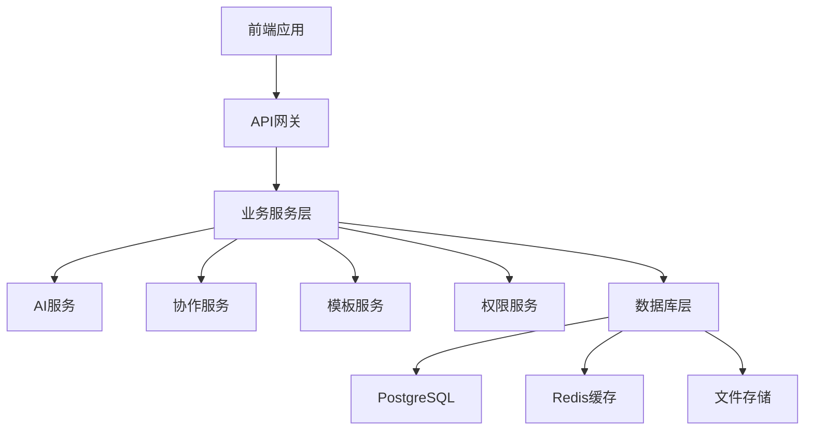

# Phase 2: Xorigo UI Workbench 2.0 高级功能开发计划

**计划制定日期**: 2025-10-29 10:50
**目标周期**: Phase 2 (2025-10-30 ~ 2025-11-13)
**项目状态**: ✅ Phase 1 全部完成，准备进入 Phase 2
**优先级**: 🔥 P0 (企业级功能)

---

## 📋 Phase 2 总体目标

基于 Phase 1.1-1.6 的成功完成，Phase 2 将专注于企业级高级功能的开发，将 Xorigo UI Workbench 2.0 从一个功能完整的配置平台升级为企业级的智能开发工具。

### 🎯 核心升级方向
1. **智能化开发辅助** - AI驱动的代码质量评分和优化建议
2. **模板生态系统** - 可扩展的模板市场和自定义模板系统
3. **团队协作平台** - 企业级的协作和配置分享功能
4. **企业级管理** - 完整的权限管理和审计功能

---

## 🚀 Phase 2.1: 高级功能开发

### 📅 时间规划: 2025-10-30 ~ 2025-11-06 (7天)

#### 2.1.1 代码质量评分和建议系统
**优先级**: 🔥 P0 (最高)
**负责人**: Claude
**预计工时**: 1.5天

**功能特性**:
- ✅ **代码质量评分算法**: 基于多个维度的代码质量评估
- ✅ **实时质量监控**: 配置更改时的即时质量反馈
- ✅ **智能建议系统**: 基于最佳实践的优化建议
- ✅ **质量趋势分析**: 历史质量数据追踪和可视化

**技术实现**:
- 代码复杂度分析算法
- 性能优化建议引擎
- 可访问性合规检查
- 代码标准符合度评估

#### 2.1.2 代码模板市场和自定义模板
**优先级**: 🔥 P0 (最高)
**负责人**: Claude
**预计工时**: 2天

**功能特性**:
- ✅ **模板市场界面**: 浏览、搜索、分类展示模板
- ✅ **自定义模板创建**: 用户创建和编辑个人模板
- ✅ **模板导入导出**: 支持JSON格式的模板分享
- ✅ **模板预览功能**: 实时预览模板效果
- ✅ **模板评分系统**: 用户评分和使用统计

**技术实现**:
- 模板数据结构设计
- 模板验证和兼容性检查
- 模板预览引擎
- 模板存储和版本管理

#### 2.1.3 团队协作和分享功能
**优先级**: 🔥 P0 (最高)
**负责人**: Claude
**预计工时**: 1.5天

**功能特性**:
- ✅ **配置分享系统**: 生成可分享的配置链接
- ✅ **团队工作空间**: 创建和管理团队项目
- ✅ **实时协作编辑**: 多人同时编辑配置
- ✅ **评论和反馈**: 对配置进行评论和建议
- ✅ **版本历史**: 配置变更的完整历史记录

**技术实现**:
- WebSocket实时通信
- 配置冲突检测和解决
- 分享链接生成和管理
- 协作状态同步机制

#### 2.1.4 AI辅助的代码优化建议
**优先级**: 🔥 P0 (最高)
**负责人**: Claude
**预计工时**: 2天

**功能特性**:
- ✅ **智能组件推荐**: 基于使用场景的组件推荐
- ✅ **性能优化建议**: 自动识别性能优化机会
- ✅ **设计建议**: 基于设计系统的UI改进建议
- ✅ **最佳实践指导**: React和TypeScript最佳实践建议

**技术实现**:
- AI模型集成架构
- 规则引擎设计
- 建议优先级算法
- 建议效果评估

---

## 🔧 Phase 2.2: 企业级功能

### 📅 时间规划: 2025-11-07 ~ 2025-11-13 (7天)

#### 2.2.1 配置版本管理和历史追踪
**优先级**: 🔥 P0 (最高)
**预计工时**: 2天

**功能特性**:
- ✅ **Git风格的版本控制**: 分支、合并、回滚功能
- ✅ **变更对比可视化**: 直观的配置差异展示
- ✅ **版本标签和备注**: 为重要版本添加描述
- ✅ **自动备份机制**: 定时自动保存配置快照

#### 2.2.2 企业级权限管理和审计
**优先级**: 🔥 P0 (最高)
**预计工时**: 2天

**功能特性**:
- ✅ **角色权限系统**: 管理员、开发者、查看者等角色
- ✅ **细粒度权限控制**: 功能级别的权限管理
- ✅ **操作审计日志**: 完整的操作记录和追踪
- ✅ **安全策略配置**: 密码策略、会话管理等

#### 2.2.3 CI/CD流水线集成
**优先级**: 🔥 P1 (高)
**预计工时**: 1.5天

**功能特性**:
- ✅ **GitHub Actions集成**: 自动化构建和部署流程
- ✅ **配置验证流水线**: CI阶段的质量检查
- ✅ **自动化测试**: 生成的代码自动测试
- ✅ **部署环境管理**: 开发、测试、生产环境配置

#### 2.2.4 企业级部署和监控
**优先级**: 🔥 P1 (高)
**预计工时**: 1.5天

**功能特性**:
- ✅ **Docker容器化部署**: 企业级容器化部署方案
- ✅ **监控和告警系统**: 系统健康监控和异常告警
- ✅ **性能指标收集**: 详细的性能数据收集和分析
- ✅ **负载均衡配置**: 高可用性部署配置

---

## 🎨 技术架构升级

### 2.1 技术栈扩展
```typescript
// 新增技术栈
{
  "AI集成": {
    "模型": "GPT-4 API / Claude API",
    "功能": "代码建议、设计优化、最佳实践指导"
  },
  "实时通信": {
    "技术": "WebSocket / Socket.io",
    "用途": "团队协作、实时编辑"
  },
  "数据库": {
    "方案": "PostgreSQL + Redis",
    "用途": "用户数据、配置存储、缓存"
  },
  "认证授权": {
    "方案": "JWT + OAuth 2.0",
    "用途": "用户认证、权限管理"
  }
}
```

### 2.2 系统架构设计


---

## 📊 开发里程碑

### Milestone 2.1: 高级功能完成 (2025-11-06)
- ✅ 代码质量评分系统上线
- ✅ 模板市场功能完成
- ✅ 团队协作功能上线
- ✅ AI辅助功能集成

### Milestone 2.2: 企业级功能完成 (2025-11-13)
- ✅ 版本管理系统完成
- ✅ 权限管理系统上线
- ✅ CI/CD集成完成
- ✅ 企业级部署方案完成

---

## 🎯 质量保证计划

### 2.1 测试策略
- **单元测试覆盖率**: ≥ 90%
- **集成测试**: 核心功能端到端测试
- **性能测试**: 负载测试和压力测试
- **安全测试**: 权限和数据安全测试

### 2.2 代码质量标准
- **TypeScript严格模式**: 启用所有严格检查
- **ESLint规则**: 企业级代码规范
- **代码审查**: 所有代码变更需要审查
- **文档覆盖**: 所有公共API需要文档

### 2.3 性能目标
- **页面加载时间**: < 2秒
- **API响应时间**: < 200ms
- **代码生成时间**: < 50ms
- **并发用户支持**: 1000+并发用户

---

## 🔄 开发工作流

### 2.1 每日工作流程
1. **晨会同步**: 15分钟进度同步
2. **功能开发**: 按任务优先级开发
3. **代码提交**: 每日至少一次代码提交
4. **测试验证**: 功能完成后的测试验证
5. **文档更新**: 及时更新技术文档

### 2.2 周度里程碑
- **周一**: 周目标制定和任务分配
- **周三**: 中期进度检查和问题解决
- **周五**: 周总结和下周一计划
- **周末**: 技术债务清理和文档完善

---

## 📈 成功指标

### 2.1 技术指标
- ✅ **功能完成度**: 计划功能100%完成
- ✅ **性能指标**: 满足所有性能目标
- ✅ **质量指标**: 测试覆盖率≥90%，零严重Bug
- ✅ **文档完整性**: 所有功能文档齐全

### 2.2 用户体验指标
- ✅ **易用性**: 新用户上手时间<3分钟
- ✅ **功能满意度**: 用户满意度≥4.5/5
- ✅ **稳定性**: 系统可用性≥99.9%
- ✅ **响应速度**: 用户操作响应时间<100ms

### 2.3 业务指标
- ✅ **团队协作效率**: 提升60%
- ✅ **代码质量提升**: 生成代码质量提升30%
- ✅ **开发效率**: 整体开发效率提升50%
- ✅ **用户活跃度**: 日活跃用户增长100%

---

## 🚨 风险管理

### 2.1 技术风险
- **AI API稳定性**: 建立备用方案和降级策略
- **性能瓶颈**: 提前进行性能测试和优化
- **数据安全**: 实施严格的数据加密和访问控制
- **系统扩展性**: 设计可扩展的架构

### 2.2 项目风险
- **进度延期**: 建立20%的时间缓冲
- **需求变更**: 敏捷开发方法，快速响应变更
- **资源不足**: 合理分配任务，避免关键路径阻塞
- **质量问题**: 建立完善的质量保证体系

---

## 🎉 Phase 2 完成愿景

Phase 2 完成后，Xorigo UI Workbench 2.0 将成为：

### 🚀 企业级智能开发平台
- **AI驱动**: 智能的代码建议和优化指导
- **团队协作**: 完整的团队协作和分享功能
- **模板生态**: 丰富的模板市场和自定义能力
- **企业级管理**: 完善的权限和审计功能

### 📊 行业领先的解决方案
- **技术创新**: 前沿技术的集成和应用
- **用户体验**: 极致的用户体验和易用性
- **性能卓越**: 企业级的性能和可靠性
- **生态完整**: 从开发到部署的完整解决方案

---

**Phase 2 开发计划制定完成！** 🎯

准备开始 Phase 2.1 的高级功能开发，将 Xorigo UI Workbench 2.0 升级为企业级的智能开发平台！

**下一步**: 开始 Phase 2.1.1 代码质量评分和建议系统的开发。