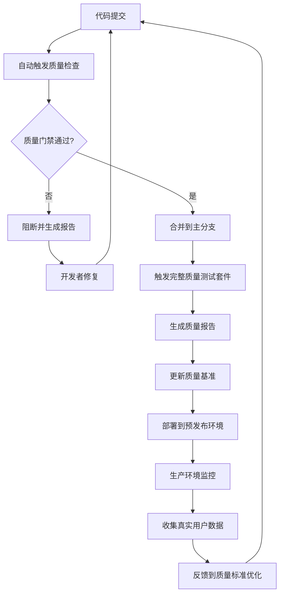

# 🧪 重构质量保证体系架构设计

## 核心设计理念

### 基于Monorepo的多层次测试架构

```
quality-assurance/
├── framework/                     # 测试框架核心
│   ├── test-types/               # 测试类型定义
│   ├── fixtures/                 # 测试数据和工具
│   ├── mocks/                    # Mock和Stub
│   └── reporters/                # 自定义报告器
├── standards/                    # 质量标准定义
│   ├── typescript-strict/        # TypeScript严格模式标准
│   ├── api-consistency/          # API一致性标准
│   ├── performance-benchmarks/   # 性能基准
│   └── accessibility-guidelines/ # 可访问性指南
├── test-suites/                  # 测试套件
│   ├── unit/                     # 单元测试
│   ├── integration/              # 集成测试
│   ├── theme-system/             # 七轴主题系统测试
│   ├── component-api/            # 组件API测试
│   ├── visual-regression/        # 视觉回归测试
│   ├── performance/              # 性能测试
│   ├── accessibility/            # 可访问性测试
│   ├── e2e/                      # 端到端测试
│   └── cross-package/            # 跨包集成测试
├── quality-gates/                # 质量门禁
│   ├── coverage-thresholds/      # 覆盖率阈值
│   ├── performance-limits/       # 性能限制
│   ├── api-compliance/           # API合规性检查
│   └── theme-compatibility/      # 主题兼容性检查
├── monitoring/                   # 监控和报告
│   ├── metrics/                  # 质量指标收集
│   ├── reports/                  # 报告生成
│   ├── dashboards/               # 质量看板
│   └── alerts/                   # 质量告警
└── automation/                   # 自动化工具
    ├── ci-cd-pipelines/          # CI/CD流水线配置
    ├── quality-checks/           # 自动质量检查
    └── release-automation/       # 发布自动化
```

## 七轴主题系统专项测试架构

### 主题测试覆盖维度

```typescript
interface SevenAxisThemeTest {
  // 轴1: 模式轴 (Mode Axis)
  mode: {
    light: ThemeTestSuite;
    dark: ThemeTestSuite;
    auto: ThemeTestSuite; // 系统偏好响应
  };

  // 轴2: 色调轴 (Hue Axis)
  hue: {
    primary: ColorHarmonyTest;
    secondary: ColorHarmonyTest;
    accent: ColorHarmonyTest;
    semantic: SemanticColorTest; // 成功/错误/警告色
  };

  // 轴3: 饱和度轴 (Saturation Axis)
  saturation: {
    muted: ColorVibrancyTest;
    normal: ColorVibrancyTest;
    vibrant: ColorVibrancyTest;
  };

  // 轴4: 亮度轴 (Lightness Axis)
  lightness: {
    bright: ContrastTest;
    normal: ContrastTest;
    dim: ContrastTest;
  };

  // 轴5: 密度轴 (Density Axis)
  density: {
    compact: SpacingTest;
    normal: SpacingTest;
    spacious: SpacingTest;
  };

  // 轴6: 圆度轴 (Roundness Axis)
  roundness: {
    sharp: BorderRadiusTest;
    rounded: BorderRadiusTest;
    circular: BorderRadiusTest;
  };

  // 轴7: 对比度轴 (Contrast Axis)
  contrast: {
    low: ContrastRatioTest;
    normal: ContrastRatioTest;
    high: ContrastRatioTest;
  };
}
```

## TypeScript严格模式质量标准

### 启用严格配置

```json
{
  "compilerOptions": {
    "strict": true,
    "noImplicitAny": true,
    "strictNullChecks": true,
    "strictFunctionTypes": true,
    "strictBindCallApply": true,
    "strictPropertyInitialization": true,
    "noImplicitThis": true,
    "noImplicitReturns": true,
    "noFallthroughCasesInSwitch": true,
    "noUncheckedIndexedAccess": true,
    "exactOptionalPropertyTypes": true
  }
}
```

### 类型安全质量指标

- **类型覆盖率**: ≥ 95%
- **Implicit Any**: 0 instances
- **Type Assertion**: ≤ 0.1% of codebase
- **Unknown Usage**: Properly handled in all cases

## 组件API一致性验证机制

### API标准模板

```typescript
interface StandardComponentAPI<T = {}> {
  // 基础属性
  variant?: ComponentVariants;
  size?: ComponentSizes;
  className?: string;
  children?: React.ReactNode;
  disabled?: boolean;

  // 事件处理
  onClick?: (event: Event) => void;
  onFocus?: (event: FocusEvent) => void;
  onBlur?: (event: FocusEvent) => void;

  // 主题集成
  theme?: ThemeOverride;
  colorScheme?: ColorScheme;

  // 可访问性
  'aria-label'?: string;
  'aria-describedby'?: string;
  'aria-labelledby'?: string;

  // 扩展属性
  [key: string]: T;
}

interface ComponentValidationRule {
  property: string;
  type: TypeDefinition;
  required: boolean;
  defaultValue?: any;
  validation: ValidationFunction;
  deprecationWarning?: string;
}
```

## 质量门禁具体实施标准

### 覆盖率要求

```typescript
interface CoverageThresholds {
  statements: 90;     // 语句覆盖率
  branches: 85;       // 分支覆盖率
  functions: 95;      // 函数覆盖率
  lines: 90;          // 行覆盖率
  themeCoverage: 100; // 主题覆盖必须100%
  apiCoverage: 95;    // API测试覆盖率
}
```

### 性能基准

```typescript
interface PerformanceBenchmarks {
  // 构建性能
  buildTime: {
    dev: "< 3s";
    prod: "< 30s";
    analysis: "< 10s";
  };

  // Bundle大小
  bundleSize: {
    core: "< 50KB gzipped";
    themes: "< 5KB each gzipped";
    total: "< 200KB gzipped";
  };

  // 运行时性能
  runtime: {
    firstPaint: "< 1.5s";
    firstContentfulPaint: "< 2s";
    largestContentfulPaint: "< 2.5s";
    cumulativeLayoutShift: "< 0.1";
  };
}
```

## 监控和报告体系

### 实时质量指标

```typescript
interface QualityMetrics {
  codeHealth: {
    testCoverage: number;
    typeCoverage: number;
    duplicateCode: number;
    complexityScore: number;
    maintainabilityIndex: number;
  };

  componentHealth: {
    apiConsistency: number;
    themeCompatibility: number;
    accessibilityScore: number;
    performanceScore: number;
  };

  releaseHealth: {
    changeFailureRate: number;
    leadTimeForChanges: number;
    deploymentFrequency: number;
    meanTimeToRecovery: number;
  };
}
```

### 质量改进迭代流程



## 实施计划

### Phase 1: 基础架构重构 (Week 1-2)
- [ ] 重组测试目录结构
- [ ] 建立测试框架核心
- [ ] 配置TypeScript严格模式
- [ ] 建立基础质量标准

### Phase 2: 七轴主题测试框架 (Week 3-4)
- [ ] 开发主题测试套件
- [ ] 建立主题兼容性检查
- [ ] 集成主题回归测试
- [ ] 建立主题性能基准

### Phase 3: API一致性验证 (Week 5-6)
- [ ] 开发API标准模板
- [ ] 建立API验证工具
- [ ] 集成API合规性检查
- [ ] 建立API文档生成

### Phase 4: 质量监控体系 (Week 7-8)
- [ ] 建立质量指标收集
- [ ] 开发质量看板
- [ ] 配置质量告警
- [ ] 建立质量报告自动化

### Phase 5: CI/CD流水线优化 (Week 9-10)
- [ ] 重构CI/CD配置
- [ ] 优化质量门禁
- [ ] 集成所有测试类型
- [ ] 建立发布自动化

---

这个重构将建立一个世界级的质量保证体系，确保Xorigo UI的每个组件都符合最高的质量标准。