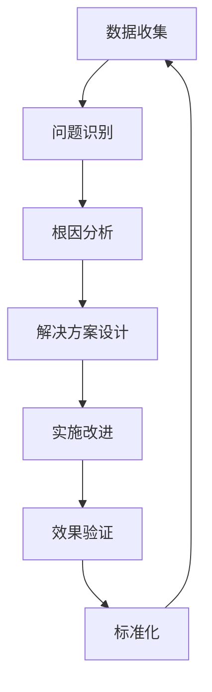
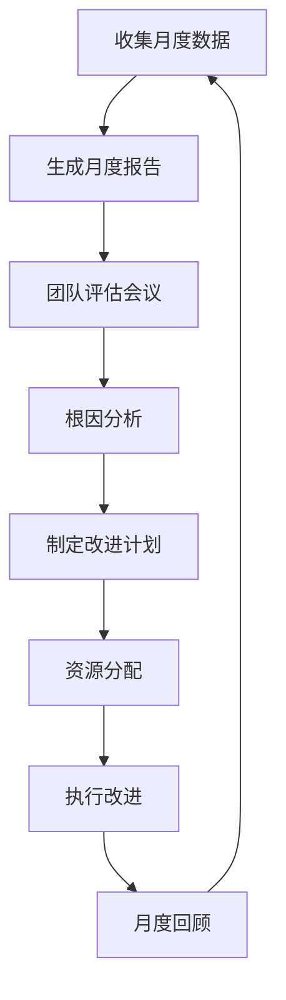

# 🔄 Xorigo UI 质量改进迭代流程

## 概述

本文档定义了 Xorigo UI 项目的质量改进迭代流程，建立了一个持续改进的闭环系统，确保质量不断提升。

## 🎯 核心理念

### 质量改进循环



### 四维度改进框架

1. **技术维度** - 代码质量、架构优化、性能提升
2. **流程维度** - 开发流程、测试流程、发布流程
3. **人员维度** - 技能提升、知识分享、协作效率
4. **工具维度** - 自动化工具、监控工具、协作工具

## 📊 质量度量体系

### 核心质量指标

| 类别 | 指标 | 目标值 | 权重 | 数据来源 |
|------|------|--------|------|----------|
| **代码质量** | 测试覆盖率 | ≥ 90% | 15% | Vitest 报告 |
| | 类型覆盖率 | ≥ 95% | 10% | TypeScript 分析 |
| | 代码重复率 | ≤ 5% | 5% | SonarQube |
| | 圈复杂度 | ≤ 10 | 5% | ESLint 分析 |
| | 技术债务比例 | ≤ 5% | 5% | 代码质量分析 |
| **组件质量** | API 一致性 | ≥ 95% | 10% | API 验证器 |
| | 主题兼容性 | 100% | 10% | 七轴主题测试 |
| | 可访问性评分 | ≥ 95% | 10% | axe-core 测试 |
| | 视觉回归通过率 | 100% | 5% | Playwright 视觉测试 |
| **构建质量** | 构建成功率 | ≥ 98% | 5% | CI/CD 数据 |
| | 平均构建时间 | ≤ 30s | 3% | 构建监控 |
| | Bundle 大小 | ≤ 200KB | 2% | Bundle 分析 |
| **发布质量** | 变更失败率 | ≤ 5% | 5% | 发布监控 |
| | 部署频率 | ≥ 5/周 | 3% | 发布数据 |
| | 平均恢复时间 | ≤ 60min | 2% | 故障监控 |

### 质量评分计算

```typescript
interface QualityScore {
  overall: number;           // 总体评分 (0-100)
  codeQuality: number;       // 代码质量评分
  componentQuality: number;  // 组件质量评分
  buildQuality: number;      // 构建质量评分
  releaseQuality: number;    // 发布质量评分
  trend: 'improving' | 'stable' | 'declining';
  issues: QualityIssue[];
}

interface QualityIssue {
  type: 'critical' | 'warning' | 'info';
  category: string;
  description: string;
  impact: number;           // 对总体评分的影响
  recommendation: string;
  dueDate?: Date;
}
```

## 🔄 迭代周期

### 1. 日常质量监控 (Daily)

**时间**: 每日自动运行
**执行者**: 自动化系统
**目标**: 实时监控质量状态

#### 每日检查清单

```yaml
daily_quality_checks:
  code_analysis:
    - 运行 ESLint 检查
    - 执行 TypeScript 类型检查
    - 运行单元测试套件
    - 检查测试覆盖率

  component_validation:
    - API 一致性验证
    - 主题兼容性检查
    - 可访问性基础检查

  build_verification:
    - 本地构建测试
    - Bundle 大小检查
    - 依赖安全扫描

  reporting:
    - 生成每日质量报告
    - 更新质量看板
    - 发送质量告警（如有）
```

#### 自动化脚本示例

```typescript
// scripts/daily-quality-check.ts
export async function runDailyQualityCheck(): Promise<DailyQualityReport> {
  const checks = [
    runESLintCheck(),
    runTypeScriptCheck(),
    runUnitTests(),
    checkTestCoverage(),
    validateAPIConsistency(),
    checkThemeCompatibility(),
    checkAccessibility(),
    analyzeBundleSize(),
    scanDependencies()
  ];

  const results = await Promise.allSettled(checks);

  return generateDailyReport(results);
}
```

### 2. 周度质量回顾 (Weekly)

**时间**: 每周五下午
**参与者**: 开发团队、质量负责人
**目标**: 回顾质量趋势，制定改进计划

#### 周度回顾议程

1. **质量指标回顾** (15分钟)
   - 查看一周质量趋势
   - 识别异常指标
   - 对比历史数据

2. **问题分析** (20分钟)
   - 分析新增质量问题
   - 讨论根本原因
   - 评估影响范围

3. **改进计划** (15分钟)
   - 制定下周改进目标
   - 分配责任人
   - 确定验收标准

4. **知识分享** (10分钟)
   - 分享质量最佳实践
   - 讨论新技术或工具
   - 经验教训总结

#### 周度质量报告模板

```markdown
# 📊 周度质量报告 - Week {week}

## 📈 质量概览
- 总体评分: {score}/100 ({trend} {trend_icon})
- 新增问题: {new_issues} 个
- 已解决问题: {resolved_issues} 个

## 🔍 详细指标
### 代码质量
- 测试覆盖率: {coverage}% ({coverage_change})
- 类型覆盖率: {type_coverage}% ({type_change})
- 技术债务: {debt}% ({debt_change})

### 组件质量
- API 一致性: {api_consistency}% ({api_change})
- 主题兼容性: {theme_compatibility}% ({theme_change})
- 可访问性: {accessibility}% ({a11y_change})

## 🚨 关键问题
{critical_issues}

## ✅ 改进成果
{improvements}

## 📋 下周计划
{next_week_plan}
```

### 3. 月度质量评估 (Monthly)

**时间**: 每月最后一个工作日
**参与者**: 全体团队成员、产品负责人
**目标**: 深度质量分析，制定长期策略

#### 月度评估流程



#### 月度评估内容

1. **质量趋势分析**
   - 月度质量变化趋势
   - 关键指标达成情况
   - 与历史同期对比

2. **深度问题分析**
   - 复杂问题的根本原因
   - 跨部门协作问题
   - 技术债务影响评估

3. **改进效果评估**
   - 上月改进措施效果
   - ROI 分析
   - 最佳实践总结

4. **下月策略制定**
   - 优先级排序
   - 资源需求规划
   - 风险评估

### 4. 季度质量规划 (Quarterly)

**时间**: 每季度最后一周
**参与者**: 管理层、技术负责人、产品负责人
**目标**: 战略性质量规划，技术方向决策

#### 季度规划议程

1. **季度质量总结**
   - 季度目标达成情况
   - 重大质量事件回顾
   - 团队能力评估

2. **技术方向规划**
   - 质量标准升级计划
   - 工具和技术栈优化
   - 架构质量改进

3. **资源规划**
   - 培训计划制定
   - 工具采购决策
   - 人员配置优化

4. **下季度目标设定**
   - SMART 质量目标
   - 关键结果指标
   - 里程碑设定

## 🛠️ 改进实施流程

### 问题识别与分类

```typescript
interface QualityIssue {
  id: string;
  title: string;
  description: string;
  severity: 'critical' | 'high' | 'medium' | 'low';
  category: 'code' | 'component' | 'process' | 'tool';
  impact: {
    quality_score: number;
    user_experience: number;
    development_efficiency: number;
  };
  root_cause?: RootCauseAnalysis;
  solution?: Solution;
  status: 'identified' | 'analyzing' | 'solving' | 'resolved';
  assignee?: string;
  due_date?: Date;
}

interface RootCauseAnalysis {
  method: '5-whys' | 'fishbone' | 'pareto';
  causes: Cause[];
  primary_cause: Cause;
}

interface Cause {
  description: string;
  category: 'people' | 'process' | 'technology' | 'environment';
  evidence: string[];
}

interface Solution {
  approach: 'preventive' | 'corrective' | 'adaptive';
  actions: Action[];
  expected_impact: number;
  implementation_cost: 'low' | 'medium' | 'high';
  timeline: string;
}

interface Action {
  description: string;
  assignee: string;
  due_date: Date;
  status: 'pending' | 'in_progress' | 'completed';
  dependencies?: string[];
}
```

### 改进优先级矩阵

| 影响程度 / 实施难度 | 低 | 中 | 高 |
|----------------------|----|----|----|
| **高** | 立即执行 | 计划执行 | 战略规划 |
| **中** | 快速胜利 | 优先执行 | 考虑执行 |
| **低** | 时间允许 | 备选方案 | 暂不考虑 |

### 改进实施模板

```markdown
# 🛠️ 质量改进实施计划

## 问题概述
**问题ID**: {issue_id}
**问题描述**: {description}
**严重程度**: {severity} ({severity_color})
**影响评分**: {impact_score}/100

## 根因分析
**分析方法**: {analysis_method}
**根本原因**: {root_cause}

## 解决方案
**方案类型**: {solution_type}
**预期影响**: +{expected_impact} 分

### 行动项
1. [ ] {action_1} - {assignee} - {due_date}
2. [ ] {action_2} - {assignee} - {due_date}
3. [ ] {action_3} - {assignee} - {due_date}

## 实施计划
**开始时间**: {start_date}
**预计完成**: {end_date}
**里程碑**:
- [ ] {milestone_1} - {date}
- [ ] {milestone_2} - {date}

## 成功标准
- [ ] {success_criteria_1}
- [ ] {success_criteria_2}
- [ ] {success_criteria_3}

## 监控指标
- {metric_1}: {target}
- {metric_2}: {target}
- {metric_3}: {target}
```

## 📈 质量提升策略

### 1. 预防性质量保证

**目标**: 在问题发生前预防质量下降

#### 策略措施

```typescript
// 质量预防检查点
const qualityGates = {
  commit: {
    checks: ['lint', 'type-check', 'unit-test'],
    required: true
  },
  PR: {
    checks: ['full-test-suite', 'api-consistency', 'theme-compatibility'],
    required: true
  },
  merge: {
    checks: ['integration-test', 'performance-test'],
    required: true
  },
  release: {
    checks: ['e2e-test', 'accessibility-test', 'security-scan'],
    required: true
  }
};
```

#### 质量培训计划

- **新成员入职培训** (第1周)
  - 代码质量标准
  - 测试编写规范
  - 工具使用指南

- **月度质量工作坊** (每月1次)
  - 新质量工具介绍
  - 最佳实践分享
  - 问题案例分析

- **季度深度培训** (每季度1次)
  - 高级测试技术
  - 性能优化方法
  - 可访问性设计

### 2. 自动化质量提升

**目标**: 通过自动化减少人为错误，提高效率

#### 自动化工具链

```yaml
automation_pipeline:
  code_quality:
    - 自动格式化 (Prettier)
    - 自动修复 (ESLint --fix)
    - 自动类型检查

  testing:
    - 自动测试生成
    - 自动覆盖率检查
    - 自动性能测试

  deployment:
    - 自动质量门禁
    - 自动回滚机制
    - 自动监控告警
```

#### 智能质量助手

```typescript
interface QualityAssistant {
  // 实时代码建议
  provideRealTimeSuggestions(code: string): Suggestion[];

  // 自动测试生成
  generateTests(component: Component): TestCase[];

  // 质量风险评估
  assessQualityRisk(changes: CodeChange[]): Risk[];

  // 改进建议
  suggestImprovements(metrics: QualityMetrics): Improvement[];
}
```

### 3. 持续学习机制

**目标**: 建立学习型组织，持续提升质量意识

#### 知识管理系统

```markdown
## 📚 质量知识库

### 最佳实践
- [ ] 组件设计指南
- [ ] 测试编写规范
- [ ] 性能优化技巧
- [ ] 可访问性设计

### 常见问题
- [ ] 质量问题诊断指南
- [ ] 调试技巧汇总
- [ ] 工具使用手册

### 案例研究
- [ ] 成功改进案例
- [ ] 失败教训总结
- [ ] 技术选型分析
```

#### 经验分享机制

- **技术分享会** (双周1次)
  - 质量改进经验分享
  - 新技术探索报告
  - 故障复盘分析

- **代码审查会议** (每周1次)
  - 优秀代码赏析
  - 重构技巧分享
  - 设计模式讨论

- **质量改进提案** (持续开放)
  - 任何人可以提交改进建议
  - 定期评审和实施
  - 效果跟踪和反馈

## 🎯 质量目标设定

### SMART 目标框架

- **Specific** (具体的): 明确的质量指标
- **Measurable** (可测量的): 量化的目标值
- **Achievable** (可实现的): 基于现状的合理目标
- **Relevant** (相关的): 与业务目标相关联
- **Time-bound** (有时限的): 明确的时间节点

### 目标设定示例

#### 季度质量目标

```yaml
Q1_2024_Goals:
  code_quality:
    test_coverage:
      current: 85%
      target: 90%
      timeline: "2024-03-31"

    type_coverage:
      current: 88%
      target: 95%
      timeline: "2024-03-31"

  component_quality:
    api_consistency:
      current: 82%
      target: 95%
      timeline: "2024-03-31"

    accessibility_score:
      current: 78%
      target: 95%
      timeline: "2024-03-31"

  process_improvement:
    reduce_flaky_tests:
      current: 5%
      target: 1%
      timeline: "2024-02-29"

    improve_build_time:
      current: 45s
      target: 25s
      timeline: "2024-03-31"
```

### 目标跟踪机制

```typescript
interface GoalTracking {
  goal: QualityGoal;
  current_value: number;
  target_value: number;
  progress: number;
  status: 'on_track' | 'at_risk' | 'behind' | 'achieved';
  last_updated: Date;
  next_check: Date;
  actions_needed: Action[];
}

interface QualityGoal {
  id: string;
  title: string;
  description: string;
  category: string;
  metric: string;
  target_value: number;
  current_value: number;
  due_date: Date;
  owner: string;
  dependencies: string[];
}
```

## 📊 质量报告体系

### 报告类型和频率

| 报告类型 | 频率 | 受众 | 详细程度 | 目的 |
|----------|------|------|----------|------|
| 实时监控 | 实时 | 开发团队 | 概览 | 及时发现问题 |
| 每日报告 | 每日 | 开发团队 | 详细 | 日常质量跟踪 |
| 周度报告 | 每周 | 团队负责人 | 总结 | 趋势分析 |
| 月度报告 | 每月 | 管理层 | 深度 | 决策支持 |
| 季度报告 | 每季度 | 高层管理 | 战略 | 战略规划 |

### 报告内容标准

#### 执行摘要
- 质量评分概览
- 关键指标变化
- 主要风险和机会
- 建议行动

#### 详细分析
- 各维度质量指标
- 趋势分析
- 同比/环比数据
- 问题根因分析

#### 改进计划
- 已实施改进效果
- 进行中改进状态
- 计划中改进安排
- 资源需求

### 报告自动化

```typescript
class QualityReportGenerator {
  async generateDailyReport(): Promise<DailyReport> {
    const data = await this.collectDailyData();
    const analysis = this.analyzeTrends(data);
    return this.formatReport(data, analysis);
  }

  async generateWeeklyReport(): Promise<WeeklyReport> {
    const data = await this.collectWeeklyData();
    const insights = this.generateInsights(data);
    return this.formatWeeklyReport(data, insights);
  }

  async generateMonthlyReport(): Promise<MonthlyReport> {
    const data = await this.collectMonthlyData();
    const deepAnalysis = this.performDeepAnalysis(data);
    return this.formatMonthlyReport(data, deepAnalysis);
  }
}
```

## 🔄 持续改进闭环

### PDCA 循环应用

1. **Plan (计划)**
   - 识别质量改进机会
   - 设定具体目标
   - 制定实施计划

2. **Do (执行)**
   - 实施改进措施
   - 收集实施数据
   - 记录实施过程

3. **Check (检查)**
   - 评估改进效果
   - 分析数据和反馈
   - 识别新问题

4. **Act (处理)**
   - 标准化成功经验
   - 调整改进方案
   - 开始下一轮循环

### 学习和适应机制

```typescript
interface LearningLoop {
  experience: QualityExperience;
  lessons: Lesson[];
  best_practices: BestPractice[];
  adaptation: Adaptation;
}

interface QualityExperience {
  context: string;
  challenge: string;
  actions: Action[];
  outcomes: Outcome[];
  timeline: DateRange;
}

interface Lesson {
  category: 'success' | 'failure' | 'insight';
  description: string;
  applicability: string[];
  confidence_level: number;
}

interface BestPractice {
  title: string;
  description: string;
  use_cases: string[];
  evidence: Evidence[];
  adoption_status: 'new' | 'adopting' | 'standard';
}
```

---

通过实施这个全面的质量改进迭代流程，Xorigo UI 将建立一个持续改进的文化，确保质量不断提升，为用户提供更好的产品体验。