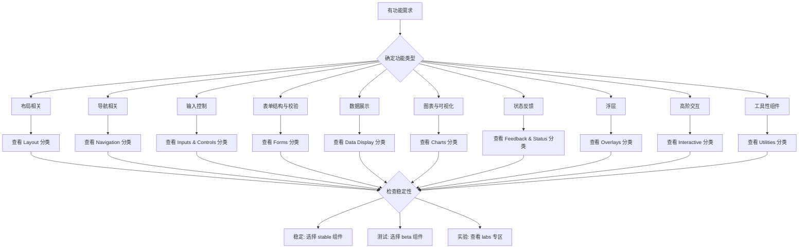

# 🎨 Xorigo UI 组件分类系统说明 v1.5

**创建日期**: 2025年11月3日
**版本**: v1.5.0
**状态**: ✅ 已完成
**位置**: `/docs/shared/component-classification-system-v1.5.md`
**用途**: 组件分类系统设计理念、使用指南和最佳实践
**关联**: [组件分类定义SSOT](./component-taxonomy-v1.5.yaml)

> **重要说明**：本文档是对 SSOT 文件 `component-taxonomy-v1.5.yaml` 的设计理念阐述和使用指南。所有分类定义以 SSOT 文件为准。

---

## 🎯 概述

Xorigo UI v1.5 采用 **三层结构（System / Component / Composition）+ Component Layer 的十一类组件分类 + 横向稳定性标签** 的现代化分类体系，基于以下核心原则：

1. **对齐行业共识** - 与 Antd / MUI / Chakra / Mantine 高度对齐
2. **兼容现代组件库理念** - 支持 Primitives / Blocks / Labs 体系
3. **清晰边界划分** - 每个分类有明确的职责边界
4. **可扩展性设计** - 支持未来组件增长和新功能扩展

### Component Layer · 十一类组件一览

| Slug (文件名) | Display Name (显示名) | 中文名称 |
|-------------|---------------------|---------|
| `layout` | Layout | 布局 |
| `navigation` | Navigation | 导航 |
| `inputs` | Inputs & Controls | 输入控制 |
| `forms` | Forms | 表单结构与校验 |
| `data-display` | Data Display | 数据展示 |
| `typography-media` | Typography & Media | 文本与媒体 |
| `charts` | Charts | 图表与可视化 |
| `feedback` | Feedback & Status | 状态反馈（含 Loading） |
| `overlays` | Overlays | 浮层 |
| `interactive` | Interactive | 高阶交互 |
| `utilities` | Utilities | 工具性组件 |

> 📌 **说明**：上述十一类组件专指 Component Layer 的功能分类，不包括 System Layer 的 3 个分类和 Composition Layer 的组合区块。
>
> 💡 **slug 提示**：在代码和配置中一律使用小写 slug（如 `feedback`），对应的显示名是 "Feedback & Status"。

## 🏗️ 架构设计理念

### 为什么选择这个架构？

#### 1. 行业共识对齐
通过分析主流组件库（Antd、MUI、Chakra、Mantine），我们发现它们都有以下共识分类：
- **Layout / Navigation / Inputs / Data Display / Feedback / Overlays**
- **Loading 通常并入 Feedback**
- **Charts 作为独立分类**

#### 2. 解决分类冲突
传统架构中的问题：
- **Loading**：有的独立成类，有的并入 Feedback
- **Forms**：与 Inputs 界限模糊
- **Labs**：作为独立分类会与其他分类冲突

#### 3. 支持现代开发需求
- **Primitives**：原子设计理念的实践
- **Blocks**：支持低代码/搭建器需求
- **Templates**：页面级复用需求

### 依赖层次结构

```
System Layer (基础设施层)
├── Foundations     (设计基础)     ← 静态令牌，无运行时
├── System          (系统能力)     ← 跨组件机制，支撑层
└── Primitives      (原子组件)     ← 高复用基元
    ↓
Component Layer (功能组件层)
├── Layout          (布局)
├── Navigation      (导航)
├── Inputs & Controls (输入控制)
├── Forms           (表单结构)
├── Data Display    (数据展示)
├── Typography & Media (文本与媒体)
├── Charts          (图表)
├── Feedback & Status (反馈状态)
├── Overlays        (浮层)
├── Interactive     (高阶交互)
└── Utilities       (工具组件)
    ↓
Composition Layer (组合应用层)
├── Blocks          (组合区块)
├── Templates       (页面模板)
└── Labs Zone       (实验组件视图：按 stability=labs 聚合)
```

## 📊 横向维度设计

### 🎯 Labs 双重含义说明

**重要**：在本系统中，"Labs" 有两层含义，需要明确区分：

1. **🧪 Labs 稳定性标签** (`stability=labs`)
   - 标记组件仍处于实验阶段
   - API 可能发生变化，不保证向后兼容
   - 警告：生产环境慎用

2. **📚 Labs 专区视图** (文档聚合)
   - 在文档导航中聚合所有 `stability=labs` 的组件
   - **功能分类仍以 Component Layer 的 11 大类为准**
   - 例如：`new-date-range-picker` 属于 `inputs` 分类，带有 `labs` 稳定性标签

> 🚨 **重要澄清**：Labs **不是** Component Layer 的第12个功能分类。Labs 只是稳定性标签和文档聚合视图，所有实验组件仍然严格按照功能归类到上述 11 大分类中。

### 📊 稳定性标签 (Stability Labels)

横跨所有分类的稳定性标识：

#### 🔒 Stable (稳定)
- **定义**：生产就绪，API稳定，向后兼容
- **适用**：核心功能组件，API基本不再变化
- **示例**：Button、Input、Modal、Table

#### 🚧 Beta (测试)
- **定义**：功能基本完成，可能有小的调整
- **适用**：新功能组件，API可能小幅调整
- **示例**：新的图表组件、复杂的交互组件

#### 🧪 Labs (实验)
- **定义**：实验性功能，API可能变化，不保证稳定性
- **适用**：探索性功能、前沿交互模式
- **示例**：AI聊天、3D效果、语音交互

> 💡 **使用提示**：选择实验组件时请关注 `stability=labs` 标签，谨慎在生产环境中使用。

### 组件层级 (Component Levels)

#### 🔷 Primitive (原子级)
- **定义**：原子级组件基元，高复用性
- **特点**：少而精，跨大量组件使用
- **示例**：Box、Text、ButtonBase、Portal

#### 🧩 Component (组件级)
- **定义**：完整的功能组件
- **特点**：独立功能，可直接使用
- **示例**：Button、Input、Modal、Table

#### 📦 Block (区块级)
- **定义**：组合区块，业务场景拼装
- **特点**：多个组件组合，解决特定场景
- **示例**：HeroSection、AuthCard、DataTable

## 📦 分类边界与取舍

### 核心设计原则

#### 1. 职责单一原则
每个分类只负责一类特定的功能，避免职责重叠：

```
✅ 正确分工：
- Inputs & Controls：负责输入控件本体
- Forms：负责表单结构、校验、状态管理
- Data Display：负责数据展示（不修改数据）
- Feedback & Status：负责状态反馈（包括 Loading）

❌ 错误重叠：
- Forms vs Inputs：功能边界不清
- Loading 独立分类：与 Feedback & Status 功能重叠
```

#### 2. 用户心智模型
符合用户的使用习惯和查找逻辑：

```
用户思路："我需要一个输入框"
→ 查找 Inputs & Controls 分类

用户思路："我需要一个完整的表单"
→ 查找 Forms 分类

用户思路："我需要展示一些数据"
→ 查找 Data Display 分类
```

#### 3. 开发便利性
便于开发者理解和维护：

```
开发者添加新组件：
1. 先确定功能类型
2. 找到对应分类
3. 检查是否与现有组件重复
4. 确定稳定性级别
5. 编写元数据
```

### 典型边界说明

#### Inputs & Controls vs Forms
- **Inputs & Controls**：输入控件本体（Button、Input、Select等）
- **Forms**：表单结构、校验、状态管理（FormField、Validation等）

#### Data Display vs Charts
- **Data Display**：通用数据展示（Table、List、Card等）
- **Charts**：专业数据可视化（LineChart、BarChart等）

#### Feedback & Status vs Loading
- **Feedback & Status**：所有状态反馈，包括 Loading
- **Loading**：不再作为独立分类，统一归入 Feedback & Status

#### Primitives vs Components
- **Primitives**：高复用基元（Box、Text、ButtonBase等）
- **Components**：完整功能组件（Button、Input、Modal等）

#### Utilities 与其他分类
- **Utilities**：辅助性、工具性组件（如 FocusTrap、MediaQuery、ErrorBoundary 等）
- 不直接承担页面主视觉或主交互，一般作为其他组件的配套能力存在
- 注意：Portal 等底层能力归类为 Primitives

## 🔧 使用指南

### 组件查找流程



### 组件开发流程

#### 1. 确定分类归属
```typescript
// 开发新组件前的检查清单
const componentChecklist = {
  // 1. 功能类型确定 (十一类组件分类)
  category: "layout | navigation | inputs | forms | data-display | typography-media | charts | feedback | overlays | interactive | utilities",

  // 2. 边界检查
  boundaries: {
    isFormControl: false,        // 是否为表单控件本体
    isDataDisplay: false,        // 是否为数据展示
    isStateFeedback: false,      // 是否为状态反馈
    isHighLevelInteraction: false // 是否为复杂交互
  },

  // 3. 稳定性评估
  stability: "stable | beta | labs",

  // 4. 复用性评估
  reusability: "primitive | component | block"
}
```

#### 2. 编写组件元数据
```yaml
# component-metadata.yaml
name: "Button"
category: "inputs"
level: "component"
stability: "stable"
description: "基础按钮组件"
tags: ["primary", "secondary", "icon", "size:sm|md|lg"]
dependencies: ["primitives/button-base", "system/theme"]
```

#### 3. 目录结构规范
```bash
# 基于 component-taxonomy-v1.5.yaml 的目录结构
packages/ui/src/
├── foundations/              # System Layer
│   ├── color-system/
│   ├── typography-system/
│   └── spacing-system/
├── system/                  # System Layer
│   ├── theming-engine/
│   └── accessibility-system/
├── primitives/              # System Layer
│   ├── box/
│   ├── text/
│   └── button-base/
├── components/              # Component Layer
│   ├── layout/
│   │   ├── container/
│   │   └── grid/
│   ├── inputs/
│   │   ├── button/
│   │   └── input/
│   └── ...
├── blocks/                  # Composition Layer
│   ├── marketing/
│   │   └── hero-section/
│   └── dashboard/
└── labs/                    # Composition Layer (Labs Zone - stability聚合)
    ├── inputs/                # labs状态的inputs组件
    └── interactive/           # labs状态的interactive组件
```

### 元数据查询 API

```typescript
// 基于分类系统的查询接口
// category 字段必须使用上文表格中的 slug（如 "inputs"、"feedback"）
interface ComponentMetadata {
  name: string
  category: string
  level: 'primitive' | 'component' | 'block'
  stability: 'stable' | 'beta' | 'labs'
  description: string
  tags: string[]
  dependencies: string[]
}

// 查询 API
export const ComponentRegistry = {
  // 按名称查询
  getByName(name: string): ComponentMetadata | null,

  // 按分类查询
  getByCategory(category: string): ComponentMetadata[],

  // 按稳定性查询
  getByStability(stability: string): ComponentMetadata[],

  // 按层级查询
  getByLevel(level: string): ComponentMetadata[],

  // 按标签查询
  getByTag(tag: string): ComponentMetadata[],

  // 获取所有分类
  getCategories(): string[],

  // 获取分类描述
  getCategoryDescription(category: string): string
}
```

## 🚀 最佳实践

### 组件设计原则

#### 1. 分类归属原则
- **单一归属**：每个组件只属于一个主要分类
- **功能明确**：组件功能应该清晰归属于某个分类
- **避免重复**：检查现有组件，避免功能重复

#### 2. 稳定性设置原则
- **stable**：API稳定，向后兼容，核心功能
- **beta**：功能完整，API可能小幅调整
- **labs**：实验性功能，API可能大幅变化

#### 3. 层级设置原则
- **primitive**：高复用基元，被多个组件使用
- **component**：独立功能，直接面向用户
- **block**：组合多个组件，解决特定场景

### 扩展原则

#### 新增分类原则
1. **必要性论证**：现有分类无法容纳
2. **行业对齐**：参考主流组件库分类
3. **边界清晰**：与现有分类无重叠
4. **团队共识**：需要团队充分讨论

#### 组件迁移原则
1. **向后兼容**：保持现有 API 不变
2. **渐进迁移**：提供迁移路径和工具
3. **文档更新**：及时更新相关文档
4. **社区通知**：提前通知开发者社区

## 📚 相关资源

### 核心文档
- **[组件分类定义 SSOT](./component-taxonomy-v1.5.yaml)** - 完整分类定义
- **[主题系统 SSOT](./theme-system-ssot-v1.5.md)** - 主题系统规范

### 工具和资源
- **组件生成器** - 基于分类系统自动生成组件模板
- **元数据验证器** - 验证组件元数据的正确性
- **分类检查器** - 检查组件分类的合理性

### 行业参考
- **[Ant Design](https://ant.design/components/)**
- **[Material-UI](https://mui.com/components/)**
- **[Chakra UI](https://chakra-ui.com/components)**
- **[Mantine](https://mantine.dev/components/)**

---

## ✅ 自检清单

在完成组件开发或分类更新时，请确认以下要点：

### 📋 分类归属检查
- [ ] 组件只属于一个主要分类（单一归属原则）
- [ ] 分类边界清晰，无功能重叠
- [ ] 符合用户心智模型和使用习惯

### 🏷️ 稳定性标签检查
- [ ] stable: API稳定，向后兼容，核心功能
- [ ] beta: 功能完整，API可能小幅调整
- [ ] labs: 实验性功能，API可能大幅变化

### 🔷 组件层级检查
- [ ] primitive: 高复用基元，被多个组件使用
- [ ] component: 独立功能，直接面向用户
- [ ] block: 组合多个组件，解决特定场景

### 📚 Labs 使用规范
- [ ] 理解 Labs 双重含义：稳定性标签 vs 文档聚合视图
- [ ] 实验组件仍按功能归类到 Component Layer 的 11 大分类中
- [ ] 生产环境谨慎使用 `stability=labs` 组件
- [ ] Labs 不是第12个功能分类，而是横向稳定性标签

### 📁 文件结构规范
- [ ] 基于 component-taxonomy-v1.5.yaml 的目录结构
- [ ] kebab-case 文件命名，PascalCase 组件命名
- [ ] 包含完整的 component-metadata.yaml

### 🔄 扩展原则
- [ ] 优先归入现有分类，**尤其是 Component Layer 的 11 大功能分类**
- [ ] System / Composition 层一般用于基础设施与组合层，不直接挂业务组件
- [ ] 新增分类需要充分论证和团队共识
- [ ] 参考主流组件库的分类方式

---

**维护团队**: Xorigo UI Team
**最后更新**: 2025年11月3日
**下次审查**: 2026年2月3日