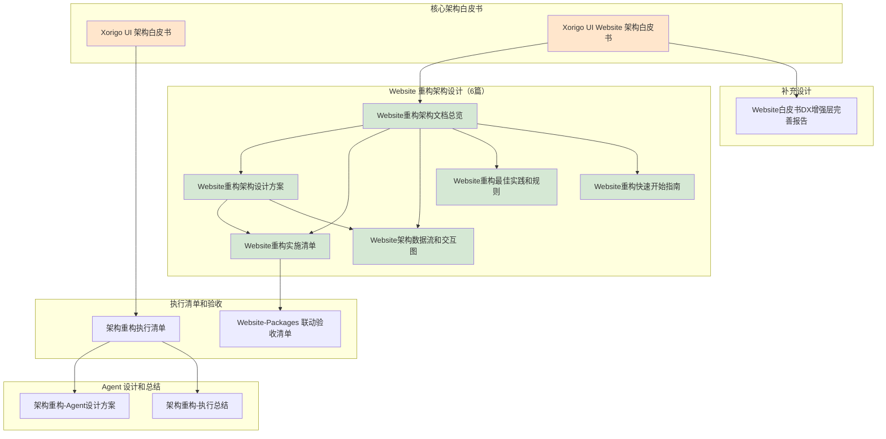

# Xorigo UI 架构文档总索引

**文档维护日期**: 2025-10-13
**文档状态**: ✅ 完整且最新
**适用范围**: Xorigo UI 完整项目架构（Core Library + Website + Registry）

---

## 📚 文档分类体系

### 🏗️ 核心架构白皮书

#### 1. [Xorigo UI 架构白皮书.md](./Xorigo UI 架构白皮书.md) (82KB)
**用途**: Xorigo UI 整体项目架构和设计哲学
**读者**: 所有项目参与者、外部合作方、新入职成员
**关键内容**:
- ✅ 项目整体架构和技术栈选型
- ✅ Monorepo 结构设计和包管理策略
- ✅ 设计系统核心原则和设计令牌体系
- ✅ 组件库设计哲学（Atomic Design）
- ✅ 开发工作流和质量保证体系

**适用场景**:
- 新成员 Onboarding（了解项目全局）
- 技术选型决策（参考架构原则）
- 向外部介绍项目（展示技术实力）

---

#### 2. [Xorigo UI Website 架构白皮书.md](./Xorigo UI Website 架构白皮书.md) (148KB)
**用途**: Xorigo UI Website 七轴架构和需求规格
**读者**: Website 团队成员、架构师、产品经理
**关键内容**:
- ✅ 七轴 DTCG 架构详解（Mode/Hue/Density/Surface/Category/State/Component）
- ✅ P0/P1/P2 功能需求矩阵
- ✅ DX 增强层需求（CLI 工具、Docs 自动同步、性能监控）
- ✅ 数据只读原则和 Packages 联动机制
- ✅ RSC/Client 分离策略和性能预算

**适用场景**:
- Website 重构架构设计（需求规格参考）
- 功能优先级排期（P0/P1/P2 分级）
- 七轴系统理解（DTCG 设计系统）

---

### 🔧 Website 重构架构设计

#### 3. [Website重构架构文档总览.md](./Website重构架构文档总览.md) (13KB)
**用途**: Website 重构架构文档导航和快速索引
**读者**: 所有 Website 重构项目参与者
**关键内容**:
- ✅ 6 篇核心文档导航指南
- ✅ 4 条阅读路线图（架构师/开发者/新人/PM）
- ✅ 核心架构原则速览
- ✅ 快速启动步骤
- ✅ KPI 指标体系
- ✅ 关键风险和应对策略

**适用场景**:
- 首次接触 Website 重构（快速找到需要的文档）
- 确定阅读顺序（根据角色选择路线）
- 快速查阅核心概念（速览章节）

---

#### 4. [Website重构架构设计方案.md](./Website重构架构设计方案.md) (57KB)
**用途**: Website 完整技术架构设计蓝图
**读者**: 架构师、技术负责人、核心开发者
**关键内容**:
- ✅ 四层架构设计（Packages → Data Layer → SDK Layer → App Layer）
- ✅ 完整目录结构（新建/重构/废弃路径）
- ✅ 数据层只读适配器实现（Singleton + Schema 验证）
- ✅ SDK 层客户端协议设计（Zustand + LocalStorage）
- ✅ Playground 双模式架构（Live Props + Snapshot）
- ✅ DX 增强层设计（CLI + 性能监控仪表板）
- ✅ 8 阶段渐进式迁移方案（16 周路线图）

**适用场景**:
- 开始重构前技术评审（理解完整架构）
- 实施过程中架构决策（查阅设计细节）
- 编写技术文档（引用架构设计）

---

#### 5. [Website重构实施清单.md](./Website重构实施清单.md) (26KB)
**用途**: 16 周详细实施清单（可追踪进度）
**读者**: 项目经理、开发团队、QA 团队
**关键内容**:
- ✅ Phase 1-8 详细任务分解（每周执行计划）
- ✅ 每阶段验收标准（Acceptance Criteria）
- ✅ 进度追踪 Checkboxes（可勾选完成状态）
- ✅ 里程碑定义（关键交付物）
- ✅ 风险点提示（每阶段的关键风险）

**适用场景**:
- 制定迁移计划（时间线和依赖关系）
- 每周站会前更新进度（勾选完成状态）
- Sprint 规划（分配任务优先级）

---

#### 6. [Website架构数据流和交互图.md](./Website架构数据流和交互图.md) (26KB)
**用途**: 可视化架构数据流和交互关系（Mermaid 图表）
**读者**: 全体开发者、架构师、新入职成员
**关键内容**:
- ✅ 四层架构数据流图
- ✅ Playground 双模式交互状态机
- ✅ Playground 状态管理流（Zustand Store）
- ✅ 搜索系统架构图（Fuse.js 客户端搜索）
- ✅ Adoption Matrix 筛选流（七轴筛选逻辑）
- ✅ 主题系统数据流（URL 参数化 + localStorage）
- ✅ 错误处理策略（四层错误边界）
- ✅ 性能监控流（RUM + Build Budget）
- ✅ CI/CD 流水线（构建阻断机制）

**适用场景**:
- 理解模块交互关系（可视化学习）
- Debug 复杂数据流问题（追踪数据流转）
- 新成员 Onboarding（图表学习架构）

---

#### 7. [Website重构最佳实践和规则.md](./Website重构最佳实践和规则.md) (27KB)
**用途**: 开发规范和 Code Review 标准
**读者**: 所有开发者、Code Reviewer
**关键内容**:
- ✅ 20 条强制开发规则（带正反示例）
- ✅ Code Review Checklist（架构/性能/安全/可访问性）
- ✅ 常见模式和反模式（Data Access/Component Split/State Management）
- ✅ ESLint 配置（禁止直接导入 Packages）
- ✅ 性能优化最佳实践（Dynamic Import/Bundle Split/ISR）
- ✅ 错误处理规范（Error Boundary/Fallback UI）

**适用场景**:
- 开始编码前学习规范
- Code Review 时检查列表
- 遇到架构冲突时查阅解决方案

---

#### 8. [Website重构快速开始指南.md](./Website重构快速开始指南.md) (20KB)
**用途**: 新成员快速上手和分阶段实战教程
**读者**: 新加入开发者、实习生、外包团队
**关键内容**:
- ✅ 10 分钟架构理解（核心概念速览）
- ✅ 开发环境配置（依赖安装 + 工具配置）
- ✅ Phase 1 快速开始（Data Layer 实战 Step-by-step）
- ✅ Phase 3 快速开始（Playground 实战 Step-by-step）
- ✅ 常见问题和解决方案（Troubleshooting）
- ✅ 学习资源和进阶路径

**适用场景**:
- 新成员入职第一天必读
- 开始具体 Phase 实施前参考教程
- 遇到技术难题时查阅 Troubleshooting

---

### 📋 执行清单和验收标准

#### 9. [架构重构执行清单.md](./架构重构执行清单.md) (15KB)
**用途**: Xorigo UI 整体架构重构执行清单
**读者**: 项目经理、核心架构师
**关键内容**:
- ✅ 整体架构重构任务分解
- ✅ 跨模块依赖关系梳理
- ✅ 重构优先级排序
- ✅ 风险评估和应对措施

**适用场景**:
- 整体架构重构规划
- 跨模块协调和排期
- 重构进度跟踪

---

#### 10. [Website-Packages 联动架构验收清单.md](./Website-Packages 联动架构验收清单.md) (16KB)
**用途**: Website 和 Packages 联动机制验收标准
**读者**: QA 团队、集成测试工程师
**关键内容**:
- ✅ Packages 数据变更验证流程
- ✅ Website 自动同步验证标准
- ✅ Build-time 验证检查项
- ✅ 性能预算验收标准

**适用场景**:
- Phase 1-2 完成后验收
- CI/CD 流水线配置验证
- 回归测试执行

---

### 🚀 Agent 设计和执行报告

#### 11. [架构重构-Agent设计方案.md](./架构重构-Agent设计方案.md) (24KB)
**用途**: Claude Agent 辅助架构重构的设计方案
**读者**: AI 辅助开发团队、工具链团队
**关键内容**:
- ✅ Agent 角色定义和职责分工
- ✅ Agent 协作流程和交互协议
- ✅ 自动化任务分配策略
- ✅ 质量检查和反馈机制

**适用场景**:
- AI 辅助开发工具设计
- 自动化重构流程规划
- Agent 协作模式研究

---

#### 12. [架构重构-执行总结.md](./架构重构-执行总结.md) (9.3KB)
**用途**: 架构重构执行过程总结和经验教训
**读者**: 项目复盘团队、未来项目参考
**关键内容**:
- ✅ 重构过程关键里程碑
- ✅ 遇到的技术难点和解决方案
- ✅ 经验教训和最佳实践总结
- ✅ 未来改进建议

**适用场景**:
- 项目复盘会议
- 经验沉淀和知识传承
- 未来类似项目规划参考

---

### 📝 补充报告和增强设计

#### 13. [Website白皮书DX增强层完善报告.md](./Website白皮书DX增强层完善报告.md) (5.4KB)
**用途**: DX 增强层功能补充设计
**读者**: DX 工具链开发者
**关键内容**:
- ✅ CLI 工具增强功能设计
- ✅ Docs 自动同步机制优化
- ✅ 性能监控仪表板需求细化

**适用场景**:
- DX 工具开发规划
- 开发者体验优化
- 自动化工具设计

---

## 🗺️ 文档关系图



---

## 📖 推荐阅读路线

### 🎯 路线 1: 全局架构理解（架构师/技术负责人）

```yaml
阅读顺序:
  1. Xorigo UI 架构白皮书 (30 分钟)
     - 理解整体项目架构和技术栈

  2. Xorigo UI Website 架构白皮书 (60 分钟)
     - 理解七轴 DTCG 系统和 P0-P2 需求

  3. Website重构架构文档总览 (10 分钟)
     - 快速导航 Website 重构文档

  4. Website重构架构设计方案 (90 分钟)
     - 深入理解四层架构和技术细节

  5. Website架构数据流和交互图 (30 分钟)
     - 可视化理解模块交互

  6. Website重构实施清单 (20 分钟)
     - 掌握迁移时间线和里程碑

  7. Website重构最佳实践和规则 (30 分钟)
     - 制定团队开发规范

总时间: ~4.5 小时
```

---

### 👨‍💻 路线 2: 快速上手开发（核心开发者）

```yaml
阅读顺序:
  1. Website重构架构文档总览 (10 分钟)
     - 快速了解文档体系

  2. Website重构快速开始指南 (30 分钟)
     - 10 分钟理解架构 + 环境配置

  3. Website重构最佳实践和规则 (30 分钟)
     - 学习开发规范和模式

  4. Website重构架构设计方案 (选读负责模块) (60 分钟)
     - 深入理解自己负责的模块设计

  5. Website架构数据流和交互图 (20 分钟)
     - 理解模块间协作

  6. Website重构实施清单 (10 分钟)
     - 跟踪自己的任务进度

总时间: ~2.5 小时
```

---

### 🌱 路线 3: 新人 Onboarding（新入职成员）

```yaml
阅读顺序:
  1. Xorigo UI 架构白皮书 (选读前 20 页) (20 分钟)
     - 了解项目背景和技术栈

  2. Website重构架构文档总览 (10 分钟)
     - 了解 Website 重构全貌

  3. Website重构快速开始指南 (30 分钟)
     - 配置开发环境 + 第一个实战

  4. Website架构数据流和交互图 (20 分钟)
     - 可视化学习架构

  5. Website重构最佳实践和规则 (30 分钟)
     - 学习代码规范

  6. Website重构实施清单 (10 分钟)
     - 了解自己在项目中的位置

总时间: ~2 小时
```

---

### 📊 路线 4: 项目管理和排期（项目经理/Scrum Master）

```yaml
阅读顺序:
  1. Xorigo UI Website 架构白皮书 (选读 P0-P2 需求章节) (30 分钟)
     - 理解功能优先级

  2. Website重构架构文档总览 (10 分钟)
     - 了解文档体系和 KPI

  3. Website重构实施清单 (30 分钟)
     - 制定 Sprint 计划和里程碑

  4. Website重构架构设计方案 (选读迁移方案章节) (30 分钟)
     - 了解技术复杂度和依赖关系

  5. Website-Packages 联动验收清单 (20 分钟)
     - 理解验收标准

  6. 架构重构-执行总结 (15 分钟)
     - 参考经验教训

总时间: ~2.5 小时
```

---

## 🚀 快速查找指南

### 按需求场景查找

**场景 1: 我想了解 Xorigo UI 整体架构**
→ 阅读 `Xorigo UI 架构白皮书.md`

**场景 2: 我想了解 Website 七轴 DTCG 系统**
→ 阅读 `Xorigo UI Website 架构白皮书.md`

**场景 3: 我想开始 Website 重构开发**
→ 阅读 `Website重构快速开始指南.md`

**场景 4: 我想理解 Website 数据流**
→ 阅读 `Website架构数据流和交互图.md`

**场景 5: 我想了解开发规范**
→ 阅读 `Website重构最佳实践和规则.md`

**场景 6: 我想制定迁移计划**
→ 阅读 `Website重构实施清单.md`

**场景 7: 我想了解四层架构设计**
→ 阅读 `Website重构架构设计方案.md`

**场景 8: 我想配置 CI/CD 验证**
→ 阅读 `Website-Packages 联动验收清单.md`

**场景 9: 我想参考重构经验**
→ 阅读 `架构重构-执行总结.md`

**场景 10: 我想了解 AI Agent 辅助开发**
→ 阅读 `架构重构-Agent设计方案.md`

---

### 按文档类型查找

**架构白皮书**:
- `Xorigo UI 架构白皮书.md` (整体项目)
- `Xorigo UI Website 架构白皮书.md` (Website 详细)

**架构设计**:
- `Website重构架构设计方案.md` (技术设计)
- `Website架构数据流和交互图.md` (可视化)

**实施指南**:
- `Website重构实施清单.md` (16 周清单)
- `Website重构快速开始指南.md` (新人教程)

**开发规范**:
- `Website重构最佳实践和规则.md` (Code Review 标准)

**验收标准**:
- `Website-Packages 联动验收清单.md` (集成验收)

**执行总结**:
- `架构重构-执行总结.md` (经验教训)
- `架构重构-Agent设计方案.md` (AI 辅助)

**导航索引**:
- `Website重构架构文档总览.md` (Website 重构导航)
- `00-架构文档总索引.md` (全局导航，本文档)

---

## 📊 文档统计

### 文档规模
```yaml
总文档数: 13 篇
总字符数: ~450KB
总页数: ~200 页 (A4 纸)

核心架构白皮书: 2 篇 (230KB)
Website 重构设计: 6 篇 (169KB)
执行清单验收: 2 篇 (31KB)
Agent 设计总结: 2 篇 (33.3KB)
补充设计: 1 篇 (5.4KB)
导航索引: 2 篇 (26KB)
```

### 阅读时间估算
```yaml
快速浏览全部文档: 2-3 小时
深入阅读核心文档: 6-8 小时
完整掌握所有文档: 12-15 小时
```

---

## ⚠️ 文档维护说明

### 更新频率
- **架构白皮书**: 每季度 Review，重大变更时更新
- **架构设计方案**: 每月 Review，架构变更时更新
- **实施清单**: 每周更新进度状态
- **最佳实践**: 发现新模式时即时更新
- **快速开始指南**: 新人反馈后优化
- **总索引**: 新增文档时即时更新

### 版本控制
- **版本号规则**: `v主版本.次版本.修订号`
- **主版本**: 架构重大变更（如四层架构 → 五层架构）
- **次版本**: 功能模块新增或调整（如新增 Phase 9）
- **修订号**: 文档优化和 Bug 修复（如修正错别字）

### 当前版本
```yaml
总索引版本: v1.0.0
最后更新: 2025-10-13
维护者: Xorigo UI Core Team
文档状态: ✅ 完整且最新
```

---

## 📞 支持和反馈

### 文档问题反馈
- **GitHub Issues**: [提交文档改进建议](https://github.com/xorigo-ui/xorigo-ui/issues)
- **内部 Slack**: #xorigo-architecture-docs

### 新文档提交流程
1. 确认文档主题和用途（避免重复）
2. 按照命名规范创建文档（参考现有文档）
3. 更新本总索引文档（添加新文档条目）
4. 提交 Pull Request 并通知架构团队 Review

### 文档命名规范
```yaml
核心白皮书: "Xorigo UI [模块名] 架构白皮书.md"
架构设计: "[模块名]重构架构设计方案.md"
实施清单: "[模块名]重构实施清单.md"
最佳实践: "[模块名]重构最佳实践和规则.md"
快速指南: "[模块名]重构快速开始指南.md"
验收清单: "[模块名]-[子模块] 联动架构验收清单.md"
总结报告: "架构重构-[主题]总结.md"
索引文档: "00-[范围]文档总索引.md"
```

---

## 🎯 核心价值主张

### 为什么需要这套文档体系？

**问题 1: 架构文档分散，难以查找**
✅ **解决**: 本总索引提供一站式导航，13 篇文档清晰分类

**问题 2: 新人 Onboarding 时间长**
✅ **解决**: 提供 4 条阅读路线，新人 2 小时快速上手

**问题 3: 不同角色需求不同**
✅ **解决**: 按角色定制阅读路线（架构师/开发者/新人/PM）

**问题 4: 架构理解碎片化**
✅ **解决**: 从白皮书 → 设计 → 实施 → 验收完整闭环

**问题 5: 实施过程缺乏指导**
✅ **解决**: 16 周详细清单 + Step-by-step 教程

---

## 🏆 文档质量标准

### 完整性检查
- ✅ 所有架构决策有文档支撑
- ✅ 所有开发规范有示例代码
- ✅ 所有实施步骤有验收标准
- ✅ 所有核心概念有可视化图表

### 可读性检查
- ✅ 文档结构清晰（标题层级合理）
- ✅ 代码示例带注释
- ✅ 关键概念有解释
- ✅ 复杂流程有图表

### 可维护性检查
- ✅ 文档版本号清晰
- ✅ 更新日期明确
- ✅ 维护者责任明确
- ✅ 反馈渠道畅通

---

**维护者**: Xorigo UI Core Team
**最后更新**: 2025-10-13
**文档版本**: v1.0.0
**文档状态**: ✅ 完整且最新

---

**下一步行动**:
1. 阅读本总索引，选择适合自己的阅读路线
2. 按照推荐顺序阅读核心文档
3. 遇到问题查阅对应场景的文档
4. 向团队反馈文档改进建议
