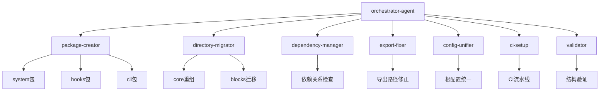

# 🤖 Xorigo UI Packages 重构 - Claude Flow Agent 执行方案

> **基于**：[架构重构执行清单](./架构重构执行清单.md)
> **执行模式**：`claude-flow hive-mind` 并发协作
> **适用范围**：仅重构 packages，不修改 website

---

## 📊 Agent 架构总览

### 执行模式：Hive-Mind 并发协作



---

## 🎯 Agent 团队设计

### Agent 1: orchestrator-agent（协调者）
**职责**：总体协调、进度监控、冲突解决

**输入**：
- [架构重构执行清单.md](./架构重构执行清单.md)
- [Xorigo UI 架构白皮书.md](./Xorigo UI 架构白皮书.md)

**输出**：
- 执行计划 JSON
- 进度报告
- 冲突解决方案

**执行逻辑**：
```yaml
phase: 协调
steps:
  1. 解析执行清单，生成任务图
  2. 分配任务给各专业 agent
  3. 监控执行进度
  4. 处理 agent 间依赖关系
  5. 生成最终验收报告
```

---

### Agent 2: package-creator（包创建者）
**职责**：创建新包结构（system/hooks/cli）

**依赖**：无（首个执行）

**任务清单**：
- ✅ 创建 `@xorigo-ui/system` 包
- ✅ 创建 `@xorigo-ui/hooks` 包
- ✅ 创建 `@xorigo-ui/cli` 包

**执行细节**：
```bash
# Task 1: 创建 system 包
mkdir -p packages/system/src/{providers,overlay,a11y}
touch packages/system/package.json
touch packages/system/tsconfig.json
touch packages/system/README.md
touch packages/system/src/index.ts

# package.json 配置（参考白皮书 18.1.1 节）
{
  "name": "@xorigo-ui/system",
  "version": "1.0.0",
  "type": "module",
  "sideEffects": false,
  "exports": {
    ".": {
      "types": "./dist/index.d.ts",
      "import": "./dist/index.js",
      "require": "./dist/index.cjs"
    }
  },
  "dependencies": {
    "@xorigo-ui/tokens": "workspace:*",
    "@xorigo-ui/style-recipe": "workspace:*"
  },
  "peerDependencies": {
    "react": "^19.0.0",
    "react-dom": "^19.0.0"
  }
}

# Task 2: 创建 hooks 包
mkdir -p packages/hooks/src
touch packages/hooks/package.json
touch packages/hooks/tsconfig.json
touch packages/hooks/README.md
touch packages/hooks/src/index.ts

# package.json 配置
{
  "name": "@xorigo-ui/hooks",
  "version": "1.0.0",
  "type": "module",
  "sideEffects": false,
  "exports": { "." { "types": "./dist/index.d.ts", "import": "./dist/index.js" } },
  "peerDependencies": {
    "react": "^19.0.0"
  }
}

# Task 3: 创建 cli 包
mkdir -p packages/cli/{bin,src/commands}
touch packages/cli/package.json
touch packages/cli/tsconfig.json
touch packages/cli/README.md
touch packages/cli/bin/xorigo.js
touch packages/cli/src/index.ts
chmod +x packages/cli/bin/xorigo.js

# package.json 配置
{
  "name": "@xorigo-cli/commands",
  "version": "1.0.0",
  "type": "module",
  "bin": { "xorigo": "./bin/xorigo.js" },
  "dependencies": {
    "@xorigo-ui/tokens": "workspace:*",
    "@xorigo-ui/registry": "workspace:*",
    "commander": "^13.0.0",
    "chalk": "^5.0.0",
    "ora": "^6.0.0"
  }
}
```

**验证标准**：
```bash
# 验证新包结构
test -d packages/system && echo "✅ system 包创建成功"
test -d packages/hooks && echo "✅ hooks 包创建成功"
test -d packages/cli && echo "✅ cli 包创建成功"
test -f packages/system/package.json && echo "✅ system package.json 存在"
test -f packages/hooks/package.json && echo "✅ hooks package.json 存在"
test -f packages/cli/package.json && echo "✅ cli package.json 存在"
```

---

### Agent 3: directory-migrator（目录迁移者）
**职责**：核心目录重组、组件迁移

**依赖**：`package-creator` 完成后执行

**任务清单**：
- ✅ 备份当前结构
- ✅ 创建九大类目录
- ✅ 迁移组件文件
- ✅ 迁移 blocks 到 composite
- ✅ 抽离 theme 到 system
- ✅ 抽离 hooks 到 hooks 包
- ✅ 清理空目录

**执行细节**：
```bash
# Task 1: 备份
cp -r packages/ packages-backup-$(date +%Y%m%d)

# Task 2: 创建新目录结构（白皮书 1.3 节）
mkdir -p packages/core/src/{base,layout,navigation,form,data,feedback,composite/{business,functional,ui-pattern},visualization,adapters/radix}

# Task 3: 迁移组件文件
# Base 层（原 components/ui）
if [ -d packages/core/src/components/ui ]; then
  mv packages/core/src/components/ui/* packages/core/src/base/ 2>/dev/null || true
fi

# Feedback 层
if [ -d packages/core/src/components/feedback ]; then
  mv packages/core/src/components/feedback/* packages/core/src/feedback/ 2>/dev/null || true
fi

# Navigation 层（合并去重）
if [ -d packages/core/src/components/navigation ]; then
  mv packages/core/src/components/navigation/* packages/core/src/navigation/ 2>/dev/null || true
fi

# Radix 适配层
if [ -d packages/core/src/components/radix ]; then
  mv packages/core/src/components/radix/* packages/core/src/adapters/radix/ 2>/dev/null || true
fi

# Advanced 拆分（需人工审查）
# 注意：advanced 组件需要按职责分类到 data/feedback/composite

# Task 4: 迁移 blocks 到 composite
if [ -d packages/core/src/blocks/auth ]; then
  mv packages/core/src/blocks/auth packages/core/src/composite/business/ 2>/dev/null || true
fi
if [ -d packages/core/src/blocks/forms ]; then
  mv packages/core/src/blocks/forms packages/core/src/composite/business/ 2>/dev/null || true
fi
if [ -d packages/core/src/blocks/header ]; then
  mv packages/core/src/blocks/header packages/core/src/composite/ui-pattern/ 2>/dev/null || true
fi
if [ -d packages/core/src/blocks/hero ]; then
  mv packages/core/src/blocks/hero packages/core/src/composite/ui-pattern/ 2>/dev/null || true
fi
if [ -d packages/core/src/blocks/footer ]; then
  mv packages/core/src/blocks/footer packages/core/src/composite/ui-pattern/ 2>/dev/null || true
fi
if [ -d packages/core/src/blocks/pricing ]; then
  mv packages/core/src/blocks/pricing packages/core/src/composite/ui-pattern/ 2>/dev/null || true
fi

# Task 5: 抽离 theme 到 system
if [ -d packages/core/src/theme ]; then
  mv packages/core/src/theme/* packages/system/src/providers/ 2>/dev/null || true
fi

# Task 6: 抽离 hooks 到 hooks 包
if [ -d packages/core/src/hooks ]; then
  mv packages/core/src/hooks/* packages/hooks/src/ 2>/dev/null || true
fi

# Task 7: 清理空目录
rmdir packages/core/src/components/ui 2>/dev/null || true
rmdir packages/core/src/components/feedback 2>/dev/null || true
rmdir packages/core/src/components/navigation 2>/dev/null || true
rmdir packages/core/src/components/radix 2>/dev/null || true
rmdir packages/core/src/components 2>/dev/null || true
rmdir packages/core/src/blocks 2>/dev/null || true
rmdir packages/core/src/theme 2>/dev/null || true
rmdir packages/core/src/hooks 2>/dev/null || true
rm -rf packages/core/src/layouts 2>/dev/null || true
```

**验证标准**：
```bash
# 验证目录结构
test -d packages/core/src/base && echo "✅ base 目录创建"
test -d packages/core/src/navigation && echo "✅ navigation 目录创建"
test -d packages/core/src/composite/business && echo "✅ composite/business 目录创建"
test -d packages/core/src/adapters/radix && echo "✅ adapters/radix 目录创建"
test -d packages/system/src/providers && echo "✅ theme 迁移到 system"
test -d packages/hooks/src && echo "✅ hooks 抽离成功"
! test -d packages/core/src/components && echo "✅ components 目录已清理"
! test -d packages/core/src/blocks && echo "✅ blocks 目录已清理"
```

---

### Agent 4: dependency-manager（依赖管理者）
**职责**：更新包依赖关系、检查循环依赖

**依赖**：`package-creator` + `directory-migrator` 完成后执行

**任务清单**：
- ✅ 更新 core 包依赖
- ✅ 更新 system 包依赖
- ✅ 更新 hooks 包依赖
- ✅ 安装依赖检查工具
- ✅ 创建依赖检查脚本
- ✅ 执行依赖检查

**执行细节**：
```bash
# Task 1: 更新 core 包依赖（白皮书 2.2 节）
# packages/core/package.json
{
  "dependencies": {
    "@xorigo-ui/tokens": "workspace:*",
    "@xorigo-ui/style-recipe": "workspace:*",
    "@xorigo-ui/system": "workspace:*",
    "@xorigo-ui/hooks": "workspace:*",
    "@xorigo-ui/i18n": "workspace:*"
  }
}

# Task 2: 安装依赖检查工具
npm install --save-dev madge
npm install --save-dev dependency-cruiser

# Task 3: 创建检查脚本
cat > scripts/check-dependencies.sh <<'EOF'
#!/bin/bash
set -e

echo "🔍 检查循环依赖..."
madge --circular packages/

echo "🔍 检查依赖方向..."
# 检查 core 不依赖 apps/cli
# 检查 system/hooks 不依赖 core

echo "✅ 依赖检查完成"
EOF
chmod +x scripts/check-dependencies.sh

# Task 4: 执行检查
bash scripts/check-dependencies.sh
```

**验证标准**：
```bash
# 验证依赖关系
npm run check-dependencies
# 期望输出：无循环依赖
```

---

### Agent 5: export-fixer（导出修复者）
**职责**：更新导出路径、修正 index.ts

**依赖**：`directory-migrator` 完成后执行

**任务清单**：
- ✅ 更新 core/src/index.ts
- ✅ 创建各分类 index.ts
- ✅ 更新 system/src/index.ts
- ✅ 更新 hooks/src/index.ts
- ✅ 更新 cli/src/index.ts

**执行细节**：
```typescript
// Task 1: packages/core/src/index.ts
export * from './base/'
export * from './layout/'
export * from './navigation/'
export * from './form/'
export * from './data/'
export * from './feedback/'
export * from './composite/'
export * from './visualization/'
export * from './adapters/'

// 类型导出
export type * from './types/'

// 工具函数
export * from './utils/'

// 配方系统从独立包导出
export {
  StyleRecipeProvider,
  useStyleRecipe,
  corporateBlueRecipe,
  type StyleRecipe
} from '@xorigo-ui/style-recipe'

// 主题系统从 system 包导出
export {
  ThemeProvider,
  ConfigProvider,
  A11yProvider,
  ZLayerProvider
} from '@xorigo-ui/system'

// Hooks 从 hooks 包导出
export {
  useControllableState,
  useKeyboardNavigation,
  useOverlay,
  useFocusReturn,
  useDebouncedValue,
  useVirtualList
} from '@xorigo-ui/hooks'

// Task 2: 创建各分类 index.ts
touch packages/core/src/base/index.ts
touch packages/core/src/layout/index.ts
touch packages/core/src/navigation/index.ts
touch packages/core/src/form/index.ts
touch packages/core/src/data/index.ts
touch packages/core/src/feedback/index.ts
touch packages/core/src/composite/index.ts
touch packages/core/src/visualization/index.ts
touch packages/core/src/adapters/index.ts

// 每个 index.ts 导出该分类下的所有组件
// 例如 packages/core/src/base/index.ts:
// export { Button } from './button'
// export { Input } from './input'
// ...
```

**验证标准**：
```bash
# 验证导出路径
npm run build --workspace=@xorigo-ui/core
test -f packages/core/dist/index.js && echo "✅ core 构建成功"
npm run build --workspace=@xorigo-ui/system
test -f packages/system/dist/index.js && echo "✅ system 构建成功"
npm run build --workspace=@xorigo-ui/hooks
test -f packages/hooks/dist/index.js && echo "✅ hooks 构建成功"
```

---

### Agent 6: config-unifier（配置统一者）
**职责**：统一根配置、创建继承体系

**依赖**：`package-creator` 完成后执行

**任务清单**：
- ✅ 创建根 tsconfig.base.json
- ✅ 创建根 eslint.config.mjs
- ✅ 创建根 tailwind.config.ts
- ✅ 各包继承根配置

**执行细节**：
```json
// Task 1: tsconfig.base.json（白皮书 16.1 节）
{
  "compilerOptions": {
    "strict": true,
    "target": "ES2022",
    "module": "ESNext",
    "moduleResolution": "bundler",
    "jsx": "react-jsx",
    "paths": {
      "@xorigo-ui/tokens": ["./packages/tokens/src"],
      "@xorigo-ui/style-recipe": ["./packages/style-recipe/src"],
      "@xorigo-ui/system": ["./packages/system/src"],
      "@xorigo-ui/hooks": ["./packages/hooks/src"],
      "@xorigo-ui/core": ["./packages/core/src"],
      "@xorigo-ui/i18n": ["./packages/i18n/src"],
      "@xorigo-ui/registry": ["./packages/registry/src"],
      "@xorigo-cli/commands": ["./packages/cli/src"]
    }
  },
  "include": ["packages/*/src/**/*"],
  "exclude": ["node_modules", "dist", "coverage"]
}

// Task 2: 各包继承
// packages/core/tsconfig.json
{
  "extends": "../../tsconfig.base.json",
  "compilerOptions": {
    "outDir": "./dist",
    "rootDir": "./src"
  },
  "include": ["src/**/*"],
  "exclude": ["dist", "node_modules"]
}
```

**验证标准**：
```bash
# 验证配置
npm run type-check
# 期望输出：TypeScript 编译通过
```

---

### Agent 7: ci-setup（CI 配置者）
**职责**：创建 CI 流水线、质量检查

**依赖**：`config-unifier` + `dependency-manager` 完成后执行

**任务清单**：
- ✅ 创建 GitHub Actions CI 工作流
- ✅ 创建依赖检查工作流
- ✅ 配置质量门禁

**执行细节**：
```yaml
# .github/workflows/ci.yml
name: CI

on:
  push:
    branches: [main, develop]
  pull_request:
    types: [opened, synchronize, reopened]

jobs:
  quality-check:
    runs-on: ubuntu-latest
    steps:
      - uses: actions/checkout@v4
      - uses: actions/setup-node@v4
        with:
          node-version: '22'
          cache: 'npm'
      - run: npm ci
      - run: npm run lint
      - run: npm run type-check
      - run: npm run test
      - run: npm run build

  dependency-check:
    runs-on: ubuntu-latest
    steps:
      - uses: actions/checkout@v4
      - uses: actions/setup-node@v4
      - run: npm ci
      - run: npm install -g madge
      - run: bash scripts/check-dependencies.sh
```

**验证标准**：
```bash
# 本地验证 CI 检查
npm run lint && echo "✅ lint 通过"
npm run type-check && echo "✅ type-check 通过"
npm run test && echo "✅ test 通过"
npm run build && echo "✅ build 通过"
```

---

### Agent 8: validator（验证者）
**职责**：最终验收、生成报告

**依赖**：所有其他 agent 完成后执行

**任务清单**：
- ✅ 包结构验证
- ✅ 依赖关系验证
- ✅ 导出路径验证
- ✅ 构建验证
- ✅ 测试验证
- ✅ 生成验收报告

**执行细节**：
```javascript
// scripts/validate-packages.js
#!/usr/bin/env node
import { readdirSync, existsSync } from 'fs';
import { join } from 'path';

const REQUIRED_FILES = ['package.json', 'README.md', 'src/index.ts'];
const packagesDir = join(process.cwd(), 'packages');
const packages = readdirSync(packagesDir, { withFileTypes: true })
  .filter(dirent => dirent.isDirectory())
  .map(dirent => dirent.name);

let hasErrors = false;

packages.forEach(pkg => {
  console.log(`\n🔍 验证包: @xorigo-ui/${pkg}`);
  const pkgPath = join(packagesDir, pkg);

  REQUIRED_FILES.forEach(file => {
    const filePath = join(pkgPath, file);
    if (!existsSync(filePath)) {
      console.error(`  ❌ 缺失: ${file}`);
      hasErrors = true;
    } else {
      console.log(`  ✅ ${file}`);
    }
  });
});

if (hasErrors) {
  console.error('\n❌ 包结构验证失败');
  process.exit(1);
} else {
  console.log('\n✅ 所有包结构验证通过');
}
```

**验证标准**：
```bash
# 运行完整验证
node scripts/validate-packages.js
npm run check-dependencies
npm run type-check
npm run lint
npm run test
npm run build
```

**生成报告**：
```markdown
# 🎉 Xorigo UI Packages 重构验收报告

## 📊 验收结果

### P0 关键修正（10/10）
- ✅ 创建新包结构（system/hooks/cli）
- ✅ 目录去重与命名统一
- ✅ 依赖关系清理
- ✅ 导出配置修正
- ✅ 根配置文件统一
- ✅ CI 基础检查流水线
- ✅ 包结构验证
- ✅ 依赖方向检查
- ✅ 基础测试迁移
- ✅ 抽离 theme/hooks

### 质量门禁
- ✅ TypeScript 编译无错误
- ✅ ESLint 检查通过
- ✅ 无循环依赖
- ✅ 依赖方向正确
- ✅ 构建成功率 100%

### 架构一致性
- ✅ 七轴到包映射清晰
- ✅ 九大类组件结构清晰
- ✅ 包边界职责明确
- ✅ 依赖关系符合规范

## 📝 后续建议
1. 继续执行 P1 重要优化（TypeScript 严格模式、CLI 命令集）
2. 继续执行 P2 长期改进（完整测试覆盖、Storybook 集成）
```

---

## 🚀 执行方式

### 1. 准备阶段
```bash
# 确认当前目录
cd /home/saken/project/Xorigo-UI

# 确认 Git 状态
git status
git branch
# 建议：在 feature/packages-refactor 分支执行

# 确认文档
ls -la docs/待整理/
# 应包含：架构重构执行清单.md、Xorigo UI 架构白皮书.md
```

### 2. 执行命令
```bash
# 使用 claude-flow hive-mind 模式执行
claude-flow hive-mind \
  --task "Xorigo UI Packages 重构" \
  --input "docs/待整理/Claude-Flow-Agent方案.md" \
  --agents "orchestrator-agent,package-creator,directory-migrator,dependency-manager,export-fixer,config-unifier,ci-setup,validator" \
  --mode "parallel"
```

### 3. 监控执行
```bash
# 查看 agent 执行日志
tail -f .claude-flow/logs/orchestrator-agent.log
tail -f .claude-flow/logs/package-creator.log
tail -f .claude-flow/logs/directory-migrator.log

# 查看进度
cat .claude-flow/progress.json
```

### 4. 验收检查
```bash
# P0 完成后执行
npm run validate-packages
npm run check-dependencies
npm run type-check
npm run lint
npm run build
```

---

## 📋 Agent 执行顺序

### Phase 1: 并发准备（可并行）
- ✅ `package-creator`：创建新包结构
- ✅ `config-unifier`：统一根配置

### Phase 2: 核心重组（顺序执行）
- ✅ `directory-migrator`：目录重组、组件迁移
  - 依赖：`package-creator` 完成

### Phase 3: 依赖与导出（可并行）
- ✅ `dependency-manager`：依赖关系管理
  - 依赖：`package-creator` + `directory-migrator` 完成
- ✅ `export-fixer`：导出路径修正
  - 依赖：`directory-migrator` 完成

### Phase 4: 质量保障（顺序执行）
- ✅ `ci-setup`：CI 流水线配置
  - 依赖：`config-unifier` + `dependency-manager` 完成
- ✅ `validator`：最终验收
  - 依赖：所有其他 agent 完成

---

## 🎯 预期产出

### 新增包
- `packages/system/` - 主题/配置/A11y/Overlay
- `packages/hooks/` - 通用行为 Hooks
- `packages/cli/` - 脚手架与质量检查工具

### 重组后的 core
```
packages/core/src/
├── base/                 # 原子层元素
├── layout/               # 空间与结构
├── navigation/           # 导航（去重合并）
├── form/                 # 数据录入
├── data/                 # 信息展示
├── feedback/             # 状态反馈
├── composite/            # 复合组件
│   ├── business/         # 业务组件
│   ├── functional/       # 功能组件
│   └── ui-pattern/       # UI 模式
├── visualization/        # 数据可视化
├── adapters/radix/       # Radix 适配层
├── types/                # 类型定义
└── utils/                # 工具函数
```

### 配置文件
- `tsconfig.base.json` - 根 TypeScript 配置
- `eslint.config.mjs` - 根 ESLint 配置
- `tailwind.config.ts` - 根 Tailwind 配置
- `.github/workflows/ci.yml` - CI 流水线

### 验证脚本
- `scripts/validate-packages.js` - 包结构验证
- `scripts/check-dependencies.sh` - 依赖检查

---

## ✅ 成功标准

- [ ] 所有 P0 任务完成（10/10）
- [ ] 包结构验证通过
- [ ] 依赖关系检查通过
- [ ] TypeScript 编译通过
- [ ] ESLint 检查通过
- [ ] 测试运行通过
- [ ] 构建成功
- [ ] CI 流水线配置完成

---

## 🔗 相关文档
- [架构重构执行清单](./架构重构执行清单.md)
- [Xorigo UI 架构白皮书](./Xorigo UI 架构白皮书.md)
- [packages 当前结构](../../packages/)

---

**生成时间**：2025-10-13
**适用版本**：Xorigo UI v0.1.0
**执行模式**：Claude Flow Hive-Mind
