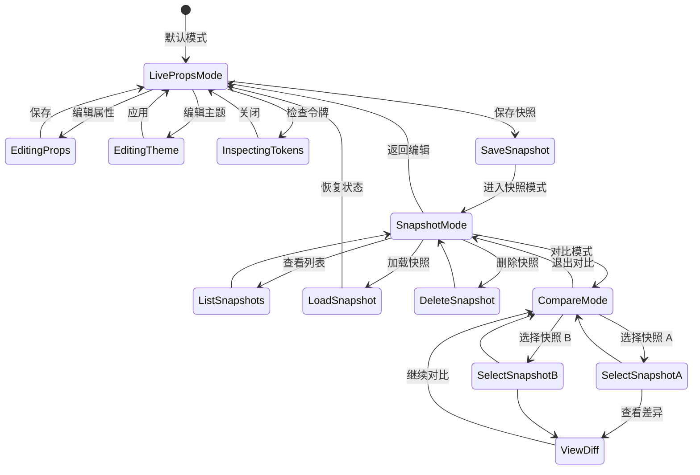
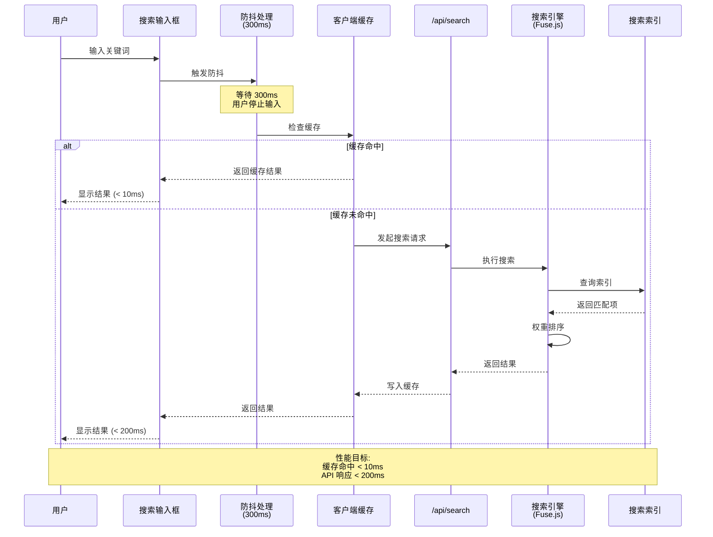
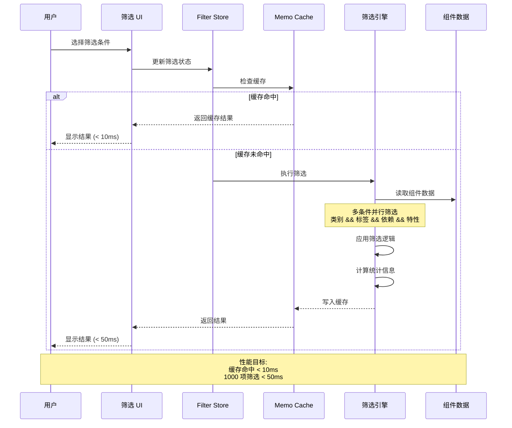
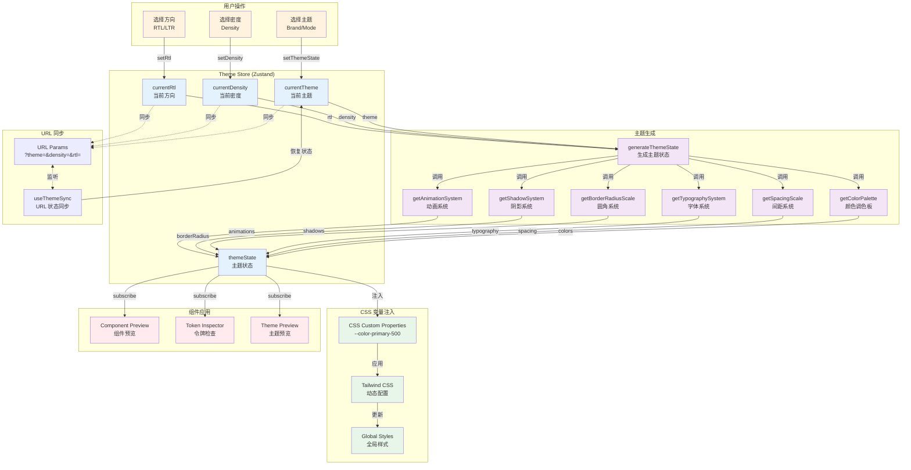
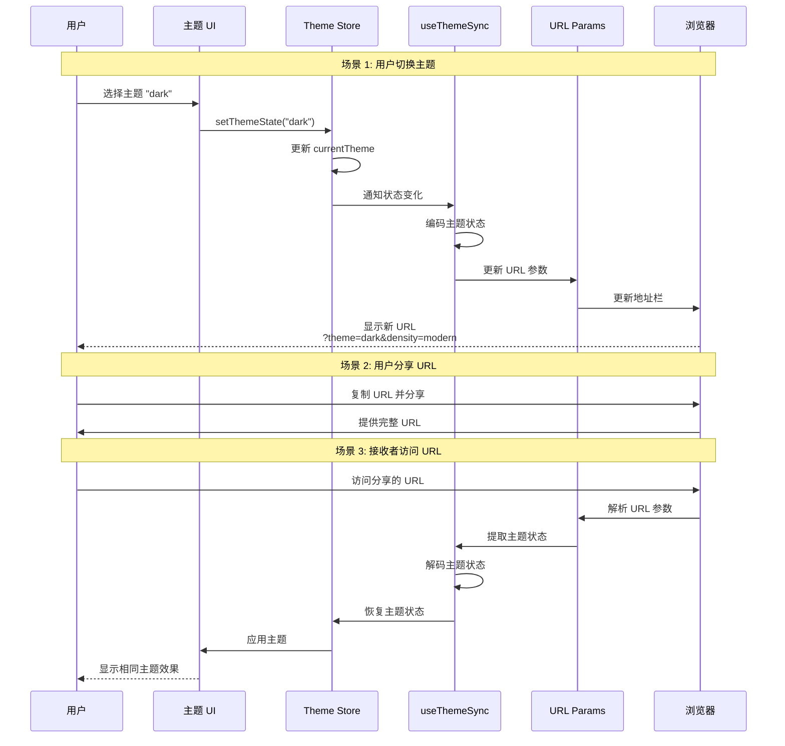
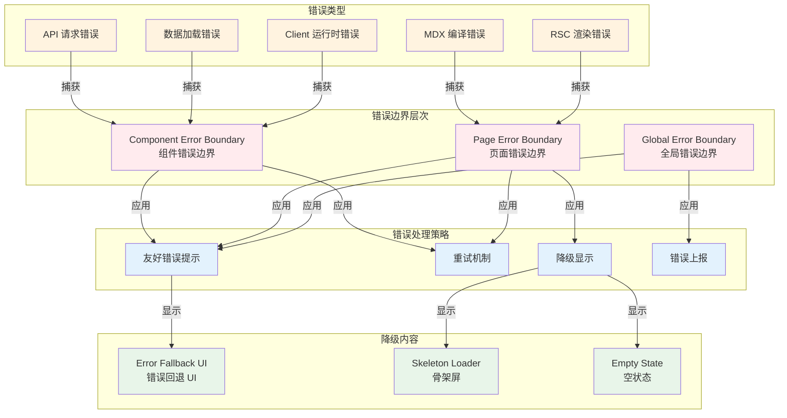
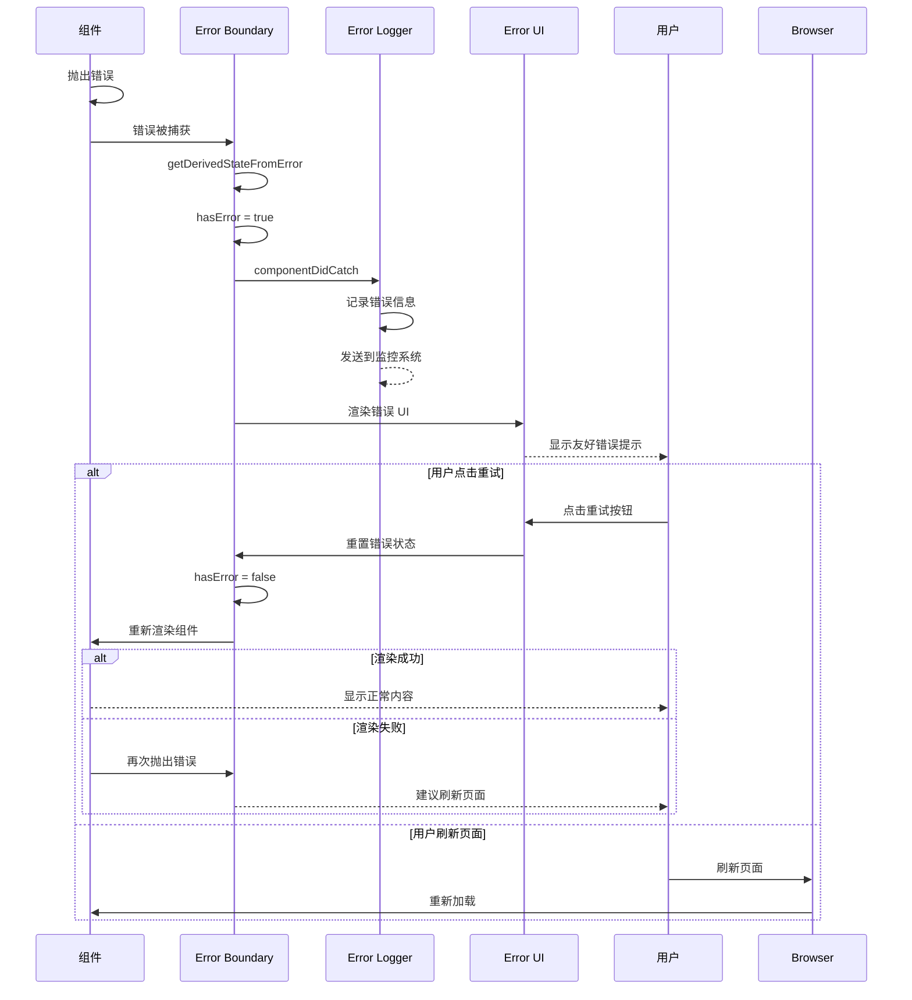
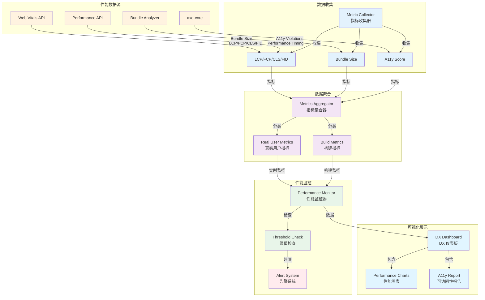
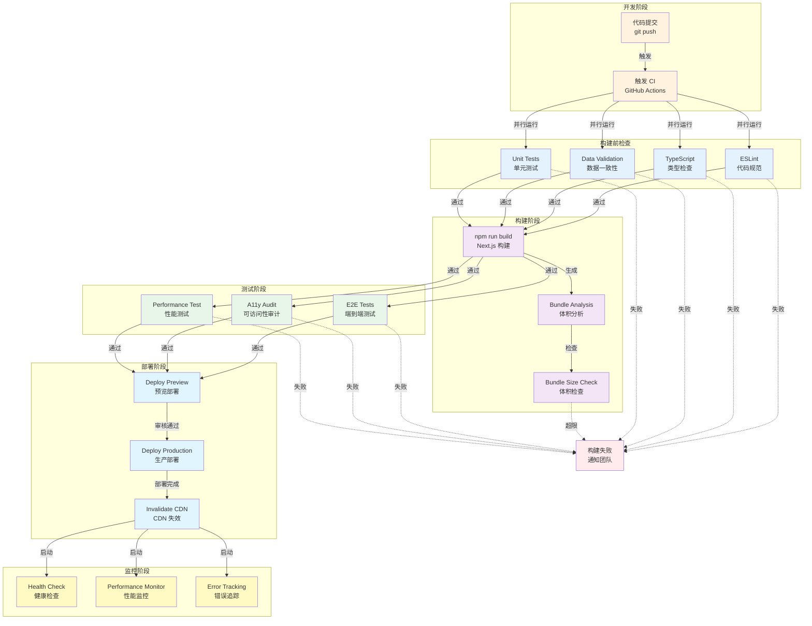

# 🔄 Xorigo UI Website 架构数据流和交互图

> **版本**: v2.0.0
> **创建时间**: 2025-10-13
> **目标**: 可视化数据流、组件交互和状态管理

---

## 一、完整系统数据流

### 1.1 四层架构数据流图

```mermaid
graph TB
    subgraph "Layer 4: Packages (只读源) - 上游数据"
        P1[registry.json<br/>组件注册表]
        P2[tokens/*.json<br/>设计令牌]
        P3[docs/*.mdx<br/>文档内容]
        P4[templates/*.tsx<br/>组件模板]
        P5[i18n/*.json<br/>国际化]
    end

    subgraph "Layer 3: Data Layer (适配层) - 只读入口"
        D1[registry.readonly.ts<br/>Registry 适配器]
        D2[tokens.readonly.ts<br/>Tokens 适配器]
        D3[docs.readonly.ts<br/>Docs 适配器]
        D4[validation.ts<br/>一致性校验]
    end

    subgraph "Layer 2: SDK Layer (协议层) - 客户端访问"
        SDK1[registry-client.ts<br/>Registry SDK]
        SDK2[tokens-client.ts<br/>Tokens SDK]
        SDK3[docs-client.ts<br/>Docs SDK]
        SDK4[cache.ts<br/>客户端缓存]
    end

    subgraph "Layer 1: App Layer (展示层) - 用户界面"
        subgraph "RSC Pages (服务端渲染)"
            A1[首页<br/>/]
            A2[文档<br/>/docs]
            A3[Adoption<br/>/adoption]
            A4[Tokens<br/>/tokens]
            A5[Theme<br/>/themes]
        end

        subgraph "Client Pages (客户端渲染)"
            A6[Playground<br/>/playground]
            A7[Search<br/>/search]
        end

        subgraph "API Routes"
            A8[/api/registry]
            A9[/api/tokens]
            A10[/api/docs]
            A11[/api/search]
        end
    end

    %% 构建时数据流
    P1 -.构建时读取.-> D1
    P2 -.构建时读取.-> D2
    P3 -.构建时读取.-> D3
    P4 -.构建时读取.-> D3
    P5 -.构建时读取.-> D3

    %% 校验流程
    D1 -.Schema 校验.-> D4
    D2 -.Schema 校验.-> D4
    D3 -.Schema 校验.-> D4
    D4 -.构建阻断.-> D1

    %% RSC 服务端数据访问
    D1 -->|直接访问| A1
    D1 -->|直接访问| A2
    D1 -->|直接访问| A3
    D2 -->|直接访问| A4
    D2 -->|直接访问| A5

    %% API Routes 数据访问
    D1 -->|直接访问| A8
    D2 -->|直接访问| A9
    D3 -->|直接访问| A10
    D1 -->|直接访问| A11
    D3 -->|直接访问| A11

    %% Client 通过 SDK 访问
    A8 -->|API 响应| SDK1
    A9 -->|API 响应| SDK2
    A10 -->|API 响应| SDK3
    A11 -->|API 响应| SDK1

    SDK1 -->|缓存| SDK4
    SDK2 -->|缓存| SDK4
    SDK3 -->|缓存| SDK4

    SDK1 -->|数据| A6
    SDK1 -->|数据| A7
    SDK2 -->|数据| A6
    SDK3 -->|数据| A7

    style P1 fill:#e1f5ff
    style P2 fill:#e1f5ff
    style P3 fill:#e1f5ff
    style P4 fill:#e1f5ff
    style P5 fill:#e1f5ff

    style D1 fill:#fff3e0
    style D2 fill:#fff3e0
    style D3 fill:#fff3e0
    style D4 fill:#ffebee

    style SDK1 fill:#f3e5f5
    style SDK2 fill:#f3e5f5
    style SDK3 fill:#f3e5f5
    style SDK4 fill:#f3e5f5

    style A1 fill:#e8f5e9
    style A2 fill:#e8f5e9
    style A3 fill:#e8f5e9
    style A4 fill:#e8f5e9
    style A5 fill:#e8f5e9

    style A6 fill:#e3f2fd
    style A7 fill:#e3f2fd
```

---

## 二、Playground 完整数据流

### 2.1 Playground 双模式交互图

```mermaid
graph TB
    subgraph "用户交互层"
        U1[用户操作<br/>编辑 Props]
        U2[用户操作<br/>切换主题]
        U3[用户操作<br/>保存快照]
        U4[用户操作<br/>对比快照]
    end

    subgraph "Playground Store (Zustand)"
        S1[currentTheme<br/>currentDensity<br/>currentRtl]
        S2[selectedComponent<br/>componentProps]
        S3[snapshots[]<br/>currentSnapshot]
        S4[history[]<br/>historyIndex]
        S5[editMode<br/>compareMode]
    end

    subgraph "Live Props 模式"
        L1[Live Props Editor<br/>实时编辑]
        L2[Theme Editor<br/>主题编辑]
        L3[Props Editor<br/>属性编辑]
        L4[Token Inspector<br/>令牌检查]
        L5[Component Preview<br/>实时预览]
    end

    subgraph "Snapshot 模式"
        SN1[Snapshot Manager<br/>快照管理]
        SN2[Compare Mode<br/>对比模式]
        SN3[Snapshot A<br/>快照 A 预览]
        SN4[Snapshot B<br/>快照 B 预览]
        SN5[Diff Viewer<br/>差异分析]
    end

    subgraph "数据持久化"
        P1[LocalStorage<br/>Zustand Persist]
        P2[URL Params<br/>?theme=&density=]
    end

    %% 用户操作到 Store
    U1 -->|updateComponentProp| S2
    U2 -->|setThemeState| S1
    U3 -->|saveSnapshot| S3
    U4 -->|setCompareMode| S5

    %% Store 到 Live Props 模式
    S1 -->|subscribe| L2
    S2 -->|subscribe| L3
    S1 -->|subscribe| L4
    S1 & S2 -->|subscribe| L5

    %% Live Props 模式交互
    L1 -->|包含| L2
    L1 -->|包含| L3
    L1 -->|包含| L4
    L1 -->|渲染| L5

    %% Store 到 Snapshot 模式
    S3 -->|subscribe| SN1
    S5 -->|subscribe| SN2
    S3 -->|快照数据| SN3
    S3 -->|快照数据| SN4

    %% Snapshot 模式交互
    SN2 -->|包含| SN3
    SN2 -->|包含| SN4
    SN2 -->|包含| SN5
    SN3 & SN4 -->|比较| SN5

    %% 数据持久化
    S3 -.持久化.-> P1
    S1 -.持久化.-> P1
    S1 <-.同步.-> P2

    %% 历史管理
    S1 -->|记录变更| S4
    S2 -->|记录变更| S4
    S4 -->|undo/redo| S1
    S4 -->|undo/redo| S2

    style U1 fill:#fff3e0
    style U2 fill:#fff3e0
    style U3 fill:#fff3e0
    style U4 fill:#fff3e0

    style S1 fill:#e3f2fd
    style S2 fill:#e3f2fd
    style S3 fill:#e3f2fd
    style S4 fill:#e3f2fd
    style S5 fill:#e3f2fd

    style L1 fill:#e8f5e9
    style L2 fill:#e8f5e9
    style L3 fill:#e8f5e9
    style L4 fill:#e8f5e9
    style L5 fill:#e8f5e9

    style SN1 fill:#f3e5f5
    style SN2 fill:#f3e5f5
    style SN3 fill:#f3e5f5
    style SN4 fill:#f3e5f5
    style SN5 fill:#f3e5f5

    style P1 fill:#ffebee
    style P2 fill:#ffebee
```

### 2.2 Playground 状态管理详图



---

## 三、搜索系统数据流

### 3.1 搜索引擎架构图

```mermaid
graph TB
    subgraph "用户输入"
        U1[Cmd+K 快捷键]
        U2[搜索输入框]
        U3[搜索筛选]
    end

    subgraph "Search Store (Zustand)"
        SS1[searchQuery<br/>搜索关键词]
        SS2[searchHistory[]<br/>搜索历史]
        SS3[recentSearches[]<br/>最近搜索]
        SS4[activeFilters<br/>活跃筛选]
    end

    subgraph "搜索引擎 (Fuse.js)"
        SE1[Search Index<br/>搜索索引]
        SE2[Component Index<br/>组件索引]
        SE3[Docs Index<br/>文档索引]
        SE4[Token Index<br/>令牌索引]
    end

    subgraph "搜索 API"
        API1[/api/search]
        API2[Search Engine<br/>搜索引擎]
        API3[Data Loader<br/>数据加载器]
    end

    subgraph "搜索结果"
        R1[Components<br/>组件结果]
        R2[Docs<br/>文档结果]
        R3[Tokens<br/>令牌结果]
        R4[Highlights<br/>高亮显示]
    end

    subgraph "数据源"
        D1[registry.readonly.ts]
        D2[docs.readonly.ts]
        D3[tokens.readonly.ts]
    end

    %% 用户输入到 Store
    U1 -->|触发| U2
    U2 -->|输入| SS1
    U3 -->|筛选| SS4

    %% Store 到 API
    SS1 -->|搜索请求| API1
    SS4 -->|筛选条件| API1

    %% API 处理流程
    API1 -->|调用| API2
    API2 -->|加载数据| API3

    %% 数据加载
    D1 -->|提供数据| API3
    D2 -->|提供数据| API3
    D3 -->|提供数据| API3

    %% 搜索索引
    API3 -->|构建索引| SE1
    SE1 -->|组件索引| SE2
    SE1 -->|文档索引| SE3
    SE1 -->|令牌索引| SE4

    %% 搜索执行
    API2 -->|搜索| SE2
    API2 -->|搜索| SE3
    API2 -->|搜索| SE4

    %% 搜索结果
    SE2 -->|组件结果| R1
    SE3 -->|文档结果| R2
    SE4 -->|令牌结果| R3

    %% 结果高亮
    R1 -->|高亮| R4
    R2 -->|高亮| R4
    R3 -->|高亮| R4

    %% 搜索历史
    SS1 -.记录.-> SS2
    SS1 -.记录.-> SS3

    style U1 fill:#fff3e0
    style U2 fill:#fff3e0
    style U3 fill:#fff3e0

    style SS1 fill:#e3f2fd
    style SS2 fill:#e3f2fd
    style SS3 fill:#e3f2fd
    style SS4 fill:#e3f2fd

    style SE1 fill:#f3e5f5
    style SE2 fill:#f3e5f5
    style SE3 fill:#f3e5f5
    style SE4 fill:#f3e5f5

    style R1 fill:#e8f5e9
    style R2 fill:#e8f5e9
    style R3 fill:#e8f5e9
    style R4 fill:#e8f5e9
```

### 3.2 搜索性能优化流程



---

## 四、Adoption Matrix 数据流

### 4.1 组件矩阵筛选流程

```mermaid
graph TB
    subgraph "用户筛选操作"
        F1[类别筛选<br/>Category]
        F2[标签筛选<br/>Tags]
        F3[依赖筛选<br/>Dependencies]
        F4[特性筛选<br/>A11y/RTL/I18n]
    end

    subgraph "Filter Store (Zustand)"
        FS1[activeCategory[]<br/>活跃类别]
        FS2[activeTags[]<br/>活跃标签]
        FS3[activeDeps[]<br/>活跃依赖]
        FS4[activeFeatures{}<br/>活跃特性]
    end

    subgraph "筛选引擎"
        FE1[Filter Engine<br/>筛选引擎]
        FE2[Category Filter<br/>类别筛选]
        FE3[Tag Filter<br/>标签筛选]
        FE4[Dependency Filter<br/>依赖筛选]
        FE5[Feature Filter<br/>特性筛选]
    end

    subgraph "数据源"
        D1[Registry Readonly<br/>组件注册表]
        D2[All Components[]<br/>所有组件]
    end

    subgraph "筛选结果"
        R1[Filtered Components[]<br/>筛选后组件]
        R2[Component Cards<br/>组件卡片]
        R3[Statistics<br/>统计信息]
    end

    subgraph "性能优化"
        P1[Virtual List<br/>虚拟滚动]
        P2[Memoization<br/>结果缓存]
    end

    %% 用户筛选到 Store
    F1 -->|更新| FS1
    F2 -->|更新| FS2
    F3 -->|更新| FS3
    F4 -->|更新| FS4

    %% 数据加载
    D1 -->|提供| D2

    %% Store 到筛选引擎
    FS1 -->|筛选条件| FE1
    FS2 -->|筛选条件| FE1
    FS3 -->|筛选条件| FE1
    FS4 -->|筛选条件| FE1

    %% 筛选引擎处理
    FE1 -->|类别| FE2
    FE1 -->|标签| FE3
    FE1 -->|依赖| FE4
    FE1 -->|特性| FE5

    %% 应用筛选
    D2 -->|输入| FE2
    FE2 -->|中间结果| FE3
    FE3 -->|中间结果| FE4
    FE4 -->|中间结果| FE5

    %% 输出结果
    FE5 -->|筛选结果| R1
    R1 -->|渲染| R2
    R1 -->|计算| R3

    %% 性能优化
    R2 -->|虚拟化| P1
    R1 -.缓存.-> P2
    P2 -.复用.-> R1

    %% 性能监控
    FE1 -.性能检测.-> Monitor[Performance Monitor<br/>≤ 50ms]

    style F1 fill:#fff3e0
    style F2 fill:#fff3e0
    style F3 fill:#fff3e0
    style F4 fill:#fff3e0

    style FS1 fill:#e3f2fd
    style FS2 fill:#e3f2fd
    style FS3 fill:#e3f2fd
    style FS4 fill:#e3f2fd

    style FE1 fill:#f3e5f5
    style FE2 fill:#f3e5f5
    style FE3 fill:#f3e5f5
    style FE4 fill:#f3e5f5
    style FE5 fill:#f3e5f5

    style R1 fill:#e8f5e9
    style R2 fill:#e8f5e9
    style R3 fill:#e8f5e9

    style P1 fill:#ffebee
    style P2 fill:#ffebee
    style Monitor fill:#ffe0b2
```

### 4.2 筛选性能优化策略



---

## 五、主题系统数据流

### 5.1 主题切换流程图



### 5.2 主题 URL 参数化流程



---

## 六、错误处理和降级策略

### 6.1 分层错误边界



### 6.2 错误恢复流程



---

## 七、性能监控数据流

### 7.1 性能指标收集流程



---

## 八、构建和部署流程

### 8.1 CI/CD 流程图



---

## 九、总结

### 9.1 核心数据流模式

1. **只读数据模式**: Packages → Data Layer (只读适配) → SDK Layer (协议) → App Layer (展示)
2. **RSC/Client 分离**: RSC 服务端直接访问 Data Layer，Client 通过 SDK 访问 API Routes
3. **状态管理模式**: Zustand Store + Persist 中间件 + URL 同步
4. **错误处理模式**: 分层错误边界 + 友好降级 + 错误上报
5. **性能监控模式**: 实时指标收集 + 聚合分析 + 阈值告警

### 9.2 关键交互流程

1. **Playground 双模式**: Live Props (实时编辑) + Snapshot (快照对比)
2. **搜索系统**: Cmd+K 触发 → 防抖处理 → 缓存检查 → Fuse.js 搜索 → 结果高亮
3. **筛选系统**: 多条件并行筛选 → Memoization 缓存 → Virtual List 虚拟化
4. **主题系统**: 主题切换 → 状态生成 → CSS 注入 → URL 同步
5. **构建部署**: 构建前检查 → Next.js 构建 → 体积检查 → E2E 测试 → 部署监控

---

**文档维护**: Xorigo UI Architecture Team
**版本**: v2.0.0
**更新时间**: 2025-10-13
**状态**: 架构设计完成
