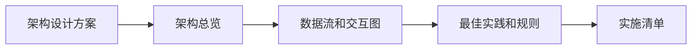
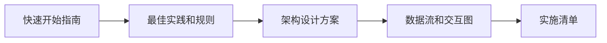
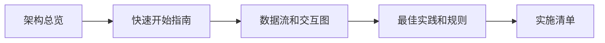
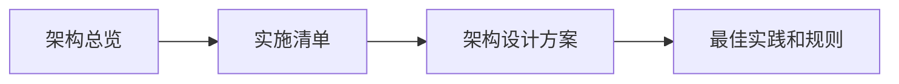
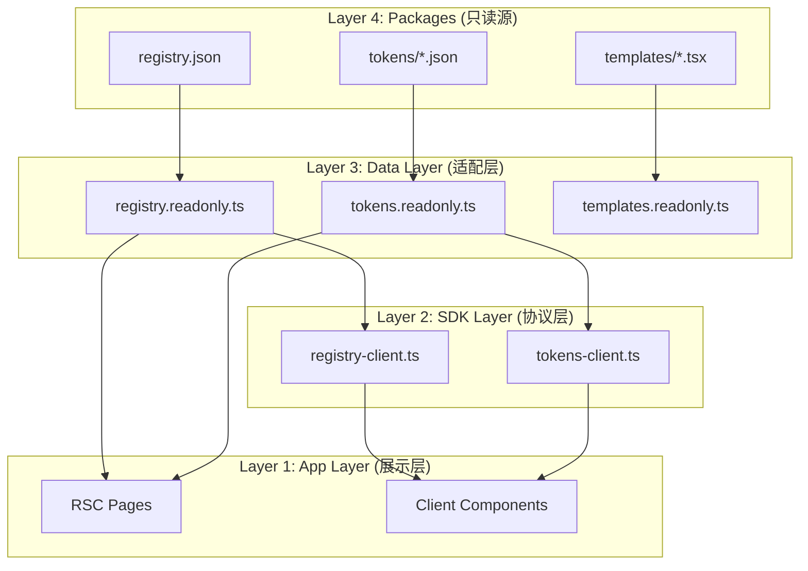

# Xorigo UI Website 重构架构文档总览

**文档创建日期**: 2025-10-13
**架构设计版本**: v1.0.0
**适用范围**: Xorigo UI Website 完整重构

---

## 📚 文档导航

### 核心设计文档

#### 1. [Website重构架构设计方案.md](./Website重构架构设计方案.md) (57KB)
**用途**: 完整技术架构设计蓝图
**读者**: 架构师、技术负责人、核心开发者
**关键内容**:
- ✅ 四层架构设计（Packages → Data Layer → SDK Layer → App Layer）
- ✅ 完整目录结构（新建/重构/废弃路径）
- ✅ 数据层只读适配器实现（Singleton 模式 + Schema 验证）
- ✅ SDK 层客户端协议设计（Zustand + LocalStorage 持久化）
- ✅ Playground 双模式架构（Live Props + Snapshot Manager）
- ✅ DX 增强层设计（CLI 工具 + 性能监控仪表板）
- ✅ 8 阶段渐进式迁移方案（16 周完整路线图）

**何时阅读**:
- 开始重构前必读（理解整体架构）
- 技术评审前必读（准备架构评审材料）
- 实施过程中遇到架构决策问题时查阅

---

#### 2. [Website重构实施清单.md](./Website重构实施清单.md) (26KB)
**用途**: 16 周详细实施清单（可追踪进度）
**读者**: 项目经理、开发团队、QA 团队
**关键内容**:
- ✅ Phase 1-8 详细任务分解（每周执行计划）
- ✅ 每阶段验收标准（Acceptance Criteria）
- ✅ 进度追踪 Checkboxes（可勾选完成状态）
- ✅ 里程碑定义（关键交付物）
- ✅ 风险点提示（每阶段的关键风险）

**何时阅读**:
- 制定迁移计划时必读（了解时间线和依赖关系）
- 每周站会前查阅（更新进度状态）
- Sprint 规划时参考（分配任务优先级）

**使用方式**:
```bash
# 示例：标记 Phase 1 Week 1 的任务为完成
- [x] 创建 src/data/registry.readonly.ts 适配器
- [x] 创建 src/data/tokens.readonly.ts 适配器
- [ ] 创建 src/data/templates.readonly.ts 适配器  # 待完成
```

---

#### 3. [Website架构数据流和交互图.md](./Website架构数据流和交互图.md) (26KB)
**用途**: 可视化架构数据流和交互关系（Mermaid 图表）
**读者**: 全体开发者、架构师、新入职成员
**关键内容**:
- ✅ 四层架构数据流图（Package → Data → SDK → App）
- ✅ Playground 双模式交互状态机
- ✅ Playground 状态管理流（Zustand Store 架构）
- ✅ 搜索系统架构图（Fuse.js 客户端搜索）
- ✅ Adoption Matrix 筛选流（Seven Axes 筛选逻辑）
- ✅ 主题系统数据流（URL 参数化 + localStorage 持久化）
- ✅ 错误处理策略（四层错误边界）
- ✅ 性能监控流（RUM + Build Budget 验证）
- ✅ CI/CD 流水线（构建阻断机制）

**何时阅读**:
- 理解模块交互关系时查阅
- Debug 复杂数据流问题时参考
- 新成员 Onboarding 时学习架构

**使用建议**:
- 在 Markdown 编辑器中查看（支持 Mermaid 渲染）
- 或复制到 https://mermaid.live 查看交互式图表

---

#### 4. [Website重构架构总览.md](./Website重构架构总览.md) (18KB)
**用途**: 架构核心概念和导航索引
**读者**: 所有项目参与者、外部合作方
**关键内容**:
- ✅ 文档导航指南（各文档用途和阅读顺序）
- ✅ 架构核心原则（数据只读、RSC/Client 分离、性能预算）
- ✅ 四层架构概览（Layer 职责和边界）
- ✅ 核心功能模块总结（Playground/Adoption/Token/Theme）
- ✅ KPI 指标体系（性能/可维护性/DX 指标）
- ✅ 风险管理策略（技术/进度/质量风险）

**何时阅读**:
- 首次接触项目时快速了解全局
- 向外部团队介绍架构时参考
- 制定项目计划时查阅 KPI 和风险

---

#### 5. [Website重构最佳实践和规则.md](./Website重构最佳实践和规则.md) (27KB)
**用途**: 开发规范和 Code Review 标准
**读者**: 所有开发者、Code Reviewer
**关键内容**:
- ✅ 20 条强制开发规则（带正反示例）
- ✅ Code Review Checklist（架构/性能/安全/可访问性）
- ✅ 常见模式和反模式（Data Access/Component Split/State Management）
- ✅ ESLint 配置（禁止直接导入 Packages）
- ✅ 性能优化最佳实践（Dynamic Import/Bundle Split/ISR）
- ✅ 错误处理规范（Error Boundary/Fallback UI）

**何时阅读**:
- 开始编码前必读（了解规范）
- Code Review 时参考（检查列表）
- 遇到架构冲突时查阅（解决方案）

**使用方式**:
```typescript
// ❌ 错误示例
import { registry } from '@xorigo-ui/registry'

// ✅ 正确示例（RSC）
import { readonlyRegistry } from '@/data/registry.readonly'

// ✅ 正确示例（Client）
import { registryClient } from '@/lib/sdk/registry-client'
```

---

#### 6. [Website重构快速开始指南.md](./Website重构快速开始指南.md) (20KB)
**用途**: 新成员快速上手和分阶段实战教程
**读者**: 新加入开发者、实习生、外包团队
**关键内容**:
- ✅ 10 分钟架构理解（核心概念速览）
- ✅ 开发环境配置（依赖安装 + 工具配置）
- ✅ Phase 1 快速开始（Data Layer 实战）
  - Step-by-step 创建 registry.readonly.ts
  - Schema 验证实现
  - Build-time 验证脚本
- ✅ Phase 3 快速开始（Playground 实战）
  - Zustand Store 搭建
  - Live Props 编辑器实现
  - Snapshot 管理器实现
- ✅ 常见问题和解决方案（Troubleshooting）
- ✅ 学习资源和进阶路径

**何时阅读**:
- 新成员入职第一天必读
- 开始具体 Phase 实施前参考 Step-by-step 教程
- 遇到技术难题时查阅 Troubleshooting

**使用建议**:
- 按章节顺序阅读（先理解架构，再实战）
- 跟随代码示例动手操作（Learn by Doing）
- 遇到问题先查阅 FAQ，再咨询团队

---

## 📖 阅读路线图

### 路线 1: 架构师/技术负责人



**推荐阅读顺序**:
1. **Website重构架构设计方案.md** - 完整理解四层架构和技术细节
2. **Website重构架构总览.md** - 掌握核心原则和 KPI 体系
3. **Website架构数据流和交互图.md** - 理解模块交互和数据流转
4. **Website重构最佳实践和规则.md** - 制定团队开发规范
5. **Website重构实施清单.md** - 规划迁移时间线和里程碑

---

### 路线 2: 核心开发者



**推荐阅读顺序**:
1. **Website重构快速开始指南.md** - 10 分钟快速理解架构
2. **Website重构最佳实践和规则.md** - 学习开发规范和模式
3. **Website重构架构设计方案.md** - 深入理解负责模块的设计
4. **Website架构数据流和交互图.md** - 理解模块间协作
5. **Website重构实施清单.md** - 跟踪自己负责的任务进度

---

### 路线 3: 新入职成员



**推荐阅读顺序**:
1. **Website重构架构总览.md** - 了解项目背景和核心概念
2. **Website重构快速开始指南.md** - 配置开发环境 + 实战教程
3. **Website架构数据流和交互图.md** - 可视化理解架构
4. **Website重构最佳实践和规则.md** - 学习代码规范
5. **Website重构实施清单.md** - 了解自己的任务在整体中的位置

---

### 路线 4: 项目经理/Scrum Master



**推荐阅读顺序**:
1. **Website重构架构总览.md** - 理解项目目标和 KPI
2. **Website重构实施清单.md** - 制定 Sprint 计划和里程碑
3. **Website重构架构设计方案.md** - 了解技术复杂度和依赖关系
4. **Website重构最佳实践和规则.md** - 理解质量标准和验收条件

---

## 🎯 核心架构原则速览

### 1. 数据只读原则 (Data Read-only)
```typescript
// ✅ 唯一数据入口
import { readonlyRegistry } from '@/data/registry.readonly'
import { readonlyTokens } from '@/data/tokens.readonly'

// ❌ 禁止直接导入
import { registry } from '@xorigo-ui/registry'
```

### 2. RSC/Client 严格分离
```yaml
RSC Pages (服务端渲染):
  - /docs/* (Docs 展示)
  - /adoption/* (Adoption Matrix)
  - /tokens/* (Token 可视化)
  - /themes/* (Theme Hub)

Client Pages (客户端渲染):
  - /playground/* (Playground 双模式)
```

### 3. 性能预算 (Performance Budget)
```yaml
Bundle Size Limits:
  - 站点整体: ≤ 120KB (gzip)
  - Playground: ≤ 150KB (gzip)
  - 单页面路由: ≤ 30KB (gzip)

Performance Targets:
  - LCP (Largest Contentful Paint): ≤ 2.5s
  - FID (First Input Delay): ≤ 100ms
  - CLS (Cumulative Layout Shift): ≤ 0.1
  - 筛选操作响应: ≤ 50ms
```

### 4. 四层架构 (Four-layer Architecture)


---

## 🚀 快速启动

### 第一步：阅读架构总览（10 分钟）
```bash
# 快速理解项目背景和核心概念
cat docs/待整理/Website重构架构总览.md
```

### 第二步：配置开发环境（15 分钟）
```bash
# 安装依赖
cd apps/website
npm install

# 启动开发服务器
npm run dev
```

### 第三步：跟随快速开始指南实战（30 分钟）
```bash
# 阅读快速开始指南
cat docs/待整理/Website重构快速开始指南.md

# 实战 Phase 1: 创建第一个 readonly adapter
# 实战 Phase 3: 搭建 Playground Zustand Store
```

### 第四步：查阅最佳实践和规则（20 分钟）
```bash
# 学习开发规范
cat docs/待整理/Website重构最佳实践和规则.md
```

### 第五步：开始实施（按 16 周清单执行）
```bash
# 查看实施清单
cat docs/待整理/Website重构实施清单.md

# 按 Phase 1 → Phase 2 → ... → Phase 8 顺序执行
```

---

## 📊 KPI 指标体系

### 性能指标
- **LCP**: ≤ 2.5s (Largest Contentful Paint)
- **FID**: ≤ 100ms (First Input Delay)
- **CLS**: ≤ 0.1 (Cumulative Layout Shift)
- **Bundle Size**: 站点 ≤ 120KB, Playground ≤ 150KB (gzip)

### 可维护性指标
- **ESLint 合规率**: 100% (零违规)
- **TypeScript 严格模式**: 启用 (零 any)
- **测试覆盖率**: ≥ 80% (核心模块)
- **构建成功率**: 100% (零失败)

### DX 指标
- **本地开发启动时间**: ≤ 3s
- **热更新响应时间**: ≤ 1s
- **构建时间**: ≤ 2 分钟
- **文档完整性**: 100% (所有 API 有文档)

---

## ⚠️ 关键风险和应对策略

### 技术风险

**风险 1: Next.js 15 App Router 不稳定**
- **影响**: 可能遇到 RSC 边界问题或 Hydration 错误
- **应对**:
  - 严格遵循 RSC/Client 分离规则
  - 使用 Dynamic Import + ssr: false 隔离客户端组件
  - 定期更新 Next.js 版本获取 Bug 修复

**风险 2: Build-time 验证可能阻断构建**
- **影响**: Schema 验证失败导致 CI/CD 失败
- **应对**:
  - Phase 1 早期建立完善的验证规则
  - 提供详细的验证错误提示
  - 配置 pre-commit hook 在本地提前发现问题

**风险 3: Playground 性能不达标**
- **影响**: 主题切换卡顿，Snapshot 对比慢
- **应对**:
  - 使用 Zustand 的 shallow 比较优化渲染
  - Snapshot 数据压缩存储
  - 虚拟滚动优化长列表

### 进度风险

**风险 4: 16 周时间线过紧**
- **影响**: 部分功能质量不达标
- **应对**:
  - Phase 1-2 是基础，必须高质量完成
  - Phase 5-8 可根据进度调整优先级
  - 建立快速 Review 机制减少返工

---

## 📞 支持和反馈

### 文档问题反馈
- **GitHub Issues**: [提交文档改进建议](https://github.com/xorigo-ui/xorigo-ui/issues)
- **内部 Slack**: #xorigo-website-refactor

### 技术支持
- **架构问题**: 联系架构师团队
- **实施问题**: 查阅快速开始指南 Troubleshooting 章节
- **Code Review**: 参考最佳实践和规则文档

---

## 📅 文档维护计划

### 更新频率
- **架构设计方案**: 每月 Review，重大变更时更新
- **实施清单**: 每周更新进度状态
- **最佳实践**: 发现新模式时即时更新

### 版本历史
- **v1.0.0** (2025-10-13): 初始版本，完整架构设计

---

**维护者**: Xorigo UI Core Team
**最后更新**: 2025-10-13
**文档状态**: ✅ 完整且最新
