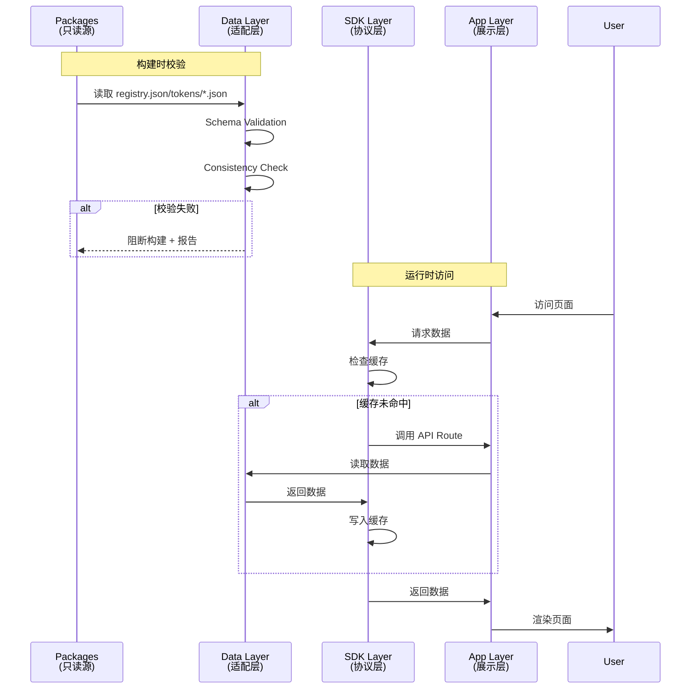

# 🏗️ Xorigo UI Website 重构架构设计方案

> **版本**: v2.0.0 (Complete Refactoring)
> **创建时间**: 2025-10-13
> **设计目标**: 基于白皮书的完整重构架构，实现数据只读、RSC/Client分离、DX增强层

---

## 一、架构概览

### 1.1 核心设计原则

```yaml
数据层原则:
  只读数据源: 所有内容来自 packages/ (registry/tokens/templates/docs/i18n)
  单一入口: 通过 src/data/*.readonly.ts 统一访问
  一致性保障: 构建前强制校验，失败阻断

渲染层原则:
  RSC优先: Docs/Adoption/Token/Theme 使用 RSC + ISR
  Client隔离: Playground 使用 Client + 动态导入
  体积预算: 站点基础 ≤120KB, Playground ≤150KB (gzip)

DX增强原则:
  SDK抽象: Website SDK 层提供统一数据协议
  CLI增强: Doctor/Check/Sync 工具链
  性能监控: KPI仪表板 + 实时告警
```

### 1.2 系统分层架构

```mermaid
graph TB
    subgraph "Packages Layer - 只读源"
        P1[registry.json<br/>组件注册表]
        P2[tokens/*.json<br/>设计令牌]
        P3[docs/*.mdx<br/>文档内容]
        P4[templates/*.tsx<br/>组件模板]
        P5[i18n/*.json<br/>国际化]
    end

    subgraph "Website SDK Layer - 数据协议"
        SDK1[@xorigo-ui/sdk-website<br/>registry.client.ts]
        SDK2[@xorigo-ui/sdk-website<br/>tokens.client.ts]
        SDK3[@xorigo-ui/sdk-website<br/>docs.client.ts]
    end

    subgraph "Website Data Layer - 适配层"
        D1[src/data/registry.readonly.ts<br/>Schema Validation]
        D2[src/data/tokens.readonly.ts<br/>Token Validation]
        D3[src/data/docs.readonly.ts<br/>Docs Pipeline]
        D4[src/data/validation.ts<br/>Consistency Check]
    end

    subgraph "Website App Layer - 展示层"
        A1[RSC Pages<br/>Docs/Adoption/Token/Theme]
        A2[Client Pages<br/>Playground + Live Props]
        A3[API Routes<br/>/api/registry /api/search]
        A4[Static Assets<br/>ISR + CDN]
    end

    subgraph "DX Enhancement Layer - 增强层"
        DX1[CLI Tools<br/>doctor/check/sync]
        DX2[Performance Monitor<br/>KPI Dashboard]
        DX3[Build Validation<br/>Pre-build Checks]
        DX4[Docs Sync Pipeline<br/>Auto-sync from Registry]
    end

    P1 --> SDK1
    P2 --> SDK2
    P3 --> SDK3
    P4 --> SDK3
    P5 --> SDK3

    SDK1 --> D1
    SDK2 --> D2
    SDK3 --> D3

    D1 --> D4
    D2 --> D4
    D3 --> D4

    D4 --> A1
    D4 --> A2
    D4 --> A3

    DX1 --> D4
    DX2 --> A1
    DX3 --> D4
    DX4 --> D3
```

---

## 二、完整目录结构设计

### 2.1 新建目录结构

```bash
apps/website/
├── src/
│   ├── data/                           # 🆕 只读数据适配层 (唯一数据入口)
│   │   ├── registry.readonly.ts        # Registry 适配器
│   │   ├── tokens.readonly.ts          # Tokens 适配器
│   │   ├── docs.readonly.ts            # Docs 适配器
│   │   ├── templates.readonly.ts       # Templates 适配器
│   │   ├── i18n.readonly.ts            # I18n 适配器
│   │   ├── validation.ts               # 一致性校验
│   │   └── types.ts                    # 数据层类型定义
│   │
│   ├── lib/                            # 🔄 重构现有 lib/
│   │   ├── sdk/                        # 🆕 Website SDK (数据协议层)
│   │   │   ├── registry-client.ts      # Registry SDK
│   │   │   ├── tokens-client.ts        # Tokens SDK
│   │   │   ├── docs-client.ts          # Docs SDK
│   │   │   ├── cache.ts                # 客户端缓存策略
│   │   │   └── types.ts                # SDK 类型定义
│   │   ├── utils.ts                    # 工具函数 (保持现有)
│   │   └── cn.ts                       # classnames 工具 (保持现有)
│   │
│   ├── stores/                         # 🆕 Zustand 状态管理
│   │   ├── playground.ts               # Playground 状态 (Live Props + Snapshot)
│   │   ├── theme.ts                    # 主题状态 (全局主题切换)
│   │   ├── filters.ts                  # 筛选状态 (Adoption Matrix)
│   │   └── search.ts                   # 搜索状态 (全局搜索)
│   │
│   ├── hooks/                          # 🔄 重构现有 hooks/
│   │   ├── use-theme-sync.ts           # 🆕 主题 URL 同步
│   │   ├── use-snapshot-manager.ts     # 🆕 快照管理
│   │   ├── use-registry.ts             # 🆕 Registry 数据钩子
│   │   ├── use-tokens.ts               # 🆕 Tokens 数据钩子
│   │   └── use-docs.ts                 # 🆕 Docs 数据钩子
│   │
│   ├── components/                     # 🔄 重构现有 components/
│   │   ├── playground/                 # 🔄 重构 Playground 组件
│   │   │   ├── playground-client.tsx   # 主容器 (保持)
│   │   │   ├── live-props-editor.tsx   # 🆕 实时属性编辑器
│   │   │   ├── snapshot-manager.tsx    # 🆕 快照管理器
│   │   │   ├── compare-mode.tsx        # 🆕 对比模式
│   │   │   ├── theme-editor.tsx        # 🆕 主题编辑器
│   │   │   ├── token-inspector.tsx     # 🆕 令牌检查器
│   │   │   ├── props-editor.tsx        # 🆕 属性编辑器
│   │   │   ├── code-viewer.tsx         # 🆕 代码预览
│   │   │   └── performance-panel.tsx   # 🆕 性能面板
│   │   │
│   │   ├── adoption/                   # 🆕 Adoption Matrix 组件
│   │   │   ├── component-matrix.tsx    # 组件矩阵主视图
│   │   │   ├── filter-panel.tsx        # 高级筛选面板
│   │   │   ├── component-card.tsx      # 组件卡片
│   │   │   ├── dependency-graph.tsx    # 依赖关系图
│   │   │   ├── token-usage-badge.tsx   # 令牌使用标记
│   │   │   └── a11y-score.tsx          # 可访问性评分
│   │   │
│   │   ├── tokens/                     # 🆕 Tokens Hub 组件
│   │   │   ├── token-browser.tsx       # 令牌浏览器
│   │   │   ├── token-visualization.tsx # 令牌可视化
│   │   │   ├── color-swatch.tsx        # 颜色色板
│   │   │   ├── spacing-ruler.tsx       # 间距可视化
│   │   │   ├── motion-preview.tsx      # 动画预览
│   │   │   ├── schema-viewer.tsx       # Schema 可视化
│   │   │   └── version-governance.tsx  # 版本治理
│   │   │
│   │   ├── docs/                       # 🆕 Docs 组件
│   │   │   ├── mdx-components.tsx      # MDX 自定义组件
│   │   │   ├── code-block.tsx          # 代码块增强
│   │   │   ├── table-of-contents.tsx   # 目录导航
│   │   │   ├── breadcrumb.tsx          # 面包屑导航
│   │   │   └── related-components.tsx  # 相关组件推荐
│   │   │
│   │   ├── search/                     # 🆕 Search 组件
│   │   │   ├── search-command.tsx      # Cmd+K 搜索面板
│   │   │   ├── search-results.tsx      # 搜索结果展示
│   │   │   ├── search-filters.tsx      # 搜索筛选
│   │   │   └── search-highlights.tsx   # 搜索高亮
│   │   │
│   │   ├── theme/                      # 🆕 Theme Hub 组件
│   │   │   ├── theme-switcher.tsx      # 主题切换器
│   │   │   ├── theme-preview.tsx       # 主题预览
│   │   │   ├── density-control.tsx     # 密度控制
│   │   │   ├── mode-control.tsx        # 亮暗模式控制
│   │   │   └── rtl-toggle.tsx          # RTL 切换
│   │   │
│   │   ├── layout/                     # 🔄 重构布局组件
│   │   │   ├── site-header.tsx         # 站点头部
│   │   │   ├── site-footer.tsx         # 站点底部
│   │   │   ├── sidebar.tsx             # 侧边栏
│   │   │   ├── mobile-nav.tsx          # 移动导航
│   │   │   └── skip-nav-link.tsx       # 跳转链接
│   │   │
│   │   ├── dx/                         # 🆕 DX Enhancement 组件
│   │   │   ├── status-dashboard.tsx    # KPI 监控仪表板
│   │   │   ├── performance-metrics.tsx # 性能指标展示
│   │   │   ├── bundle-analyzer.tsx     # Bundle 分析
│   │   │   ├── a11y-report.tsx         # 可访问性报告
│   │   │   └── build-health.tsx        # 构建健康检查
│   │   │
│   │   ├── errors/                     # 🆕 错误边界组件
│   │   │   ├── global-error-boundary.tsx      # 全局错误边界
│   │   │   ├── page-error-boundary.tsx        # 页面错误边界
│   │   │   ├── mdx-error-boundary.tsx         # MDX 渲染错误
│   │   │   ├── playground-error-boundary.tsx  # Playground 错误
│   │   │   └── error-fallback.tsx             # 通用错误回退
│   │   │
│   │   └── ui/                         # 🔄 保持现有 UI 组件
│   │       ├── button.tsx              # (保持现有)
│   │       ├── card.tsx                # (保持现有)
│   │       └── ...                     # 其他 UI 组件
│   │
│   └── app/                            # 🔄 重构 App Router
│       ├── (marketing)/                # 🆕 营销页面组
│       │   ├── page.tsx                # 首页 (RSC)
│       │   ├── features/page.tsx       # 特性页 (RSC)
│       │   └── layout.tsx              # 营销布局
│       │
│       ├── docs/                       # 🔄 重构文档页面
│       │   ├── [[...slug]]/page.tsx    # 动态文档路由 (RSC)
│       │   ├── layout.tsx              # 文档布局
│       │   └── loading.tsx             # 加载状态
│       │
│       ├── adoption/                   # 🆕 Adoption Matrix 页面
│       │   ├── page.tsx                # 组件矩阵主页 (RSC + Client Filter)
│       │   ├── [component]/page.tsx    # 组件详情页 (RSC)
│       │   └── layout.tsx              # Adoption 布局
│       │
│       ├── playground/                 # 🔄 重构 Playground 页面
│       │   ├── [component]/page.tsx    # 组件 Playground (Client)
│       │   ├── layout.tsx              # Playground 布局
│       │   └── loading.tsx             # 加载状态
│       │
│       ├── tokens/                     # 🆕 Tokens Hub 页面
│       │   ├── page.tsx                # 令牌总览 (RSC)
│       │   ├── [category]/page.tsx     # 令牌分类页 (RSC)
│       │   ├── schema/page.tsx         # Schema 可视化 (RSC)
│       │   └── layout.tsx              # Tokens 布局
│       │
│       ├── themes/                     # 🆕 Theme Hub 页面
│       │   ├── page.tsx                # 主题总览 (RSC)
│       │   ├── [theme]/page.tsx        # 主题详情 (RSC + Client Preview)
│       │   └── layout.tsx              # Theme 布局
│       │
│       ├── search/                     # 🆕 Search 页面
│       │   └── page.tsx                # 搜索页面 (RSC + Client Search)
│       │
│       ├── dx/                         # 🆕 DX Dashboard 页面
│       │   ├── page.tsx                # DX 总览 (RSC)
│       │   ├── performance/page.tsx    # 性能监控 (Client)
│       │   ├── a11y/page.tsx           # 可访问性报告 (RSC)
│       │   └── layout.tsx              # DX 布局
│       │
│       ├── api/                        # 🔄 重构 API Routes
│       │   ├── registry/
│       │   │   ├── route.ts            # Registry API (保持)
│       │   │   └── [component]/route.ts # 组件详情 API (保持)
│       │   ├── search/
│       │   │   ├── route.ts            # 搜索 API (重构)
│       │   │   ├── search-engine.ts    # 搜索引擎 (重构)
│       │   │   └── data-loader.ts      # 数据加载器 (重构)
│       │   ├── tokens/
│       │   │   ├── route.ts            # 🆕 Tokens API
│       │   │   └── [category]/route.ts # 🆕 Token Category API
│       │   ├── docs/
│       │   │   ├── route.ts            # 🆕 Docs Index API
│       │   │   └── [slug]/route.ts     # 🆕 Doc Content API
│       │   └── health/
│       │       └── route.ts            # 🆕 Health Check API
│       │
│       ├── layout.tsx                  # 🔄 重构 Root Layout
│       ├── providers.tsx               # 🆕 Root Providers
│       ├── error.tsx                   # 全局错误页
│       ├── not-found.tsx               # 404 页面
│       └── loading.tsx                 # 全局加载状态
│
├── scripts/                            # 🆕 DX Scripts
│   ├── validate-readonly-consistency.ts # 构建前一致性校验
│   ├── sync-docs-from-registry.ts      # 文档自动同步
│   ├── generate-props-tables.ts        # Props 表生成
│   ├── check-bundle-size.ts            # Bundle 大小检查
│   ├── run-a11y-audit.ts               # 可访问性审计
│   └── health-check.ts                 # 健康检查脚本
│
├── config/                             # 🆕 Configuration
│   ├── site.config.ts                  # 站点配置
│   ├── nav.config.ts                   # 导航配置
│   ├── search.config.ts                # 搜索配置
│   ├── performance.config.ts           # 性能预算配置
│   └── validation.config.ts            # 校验配置
│
├── public/                             # 静态资源 (保持)
├── package.json                        # 🔄 更新依赖和脚本
├── next.config.ts                      # 🔄 重构配置
├── tailwind.config.ts                  # 🔄 重构配置
├── tsconfig.json                       # 🔄 更新路径别名
└── .eslintrc.js                        # 🔄 新增 RSC 规则
```

### 2.2 废弃路径清单

```bash
# 需要移除或重构的路径
apps/website/
├── src/
│   ├── app/
│   │   ├── gallery/                    # ❌ 废弃 (迁移到 adoption/)
│   │   ├── matrix/                     # ❌ 废弃 (迁移到 adoption/)
│   │   ├── recipes/                    # ❌ 废弃 (迁移到 themes/)
│   │   ├── test-simple/                # ❌ 废弃 (测试页面)
│   │   ├── test-page.tsx               # ❌ 废弃 (测试页面)
│   │   ├── page-backup.tsx             # ❌ 废弃 (备份文件)
│   │   └── layout-full.tsx             # ❌ 废弃 (旧布局)
│   │
│   └── components/
│       ├── gallery/                    # ❌ 废弃 (迁移到 adoption/)
│       ├── matrix/                     # ❌ 废弃 (迁移到 adoption/)
│       ├── features/                   # ❌ 废弃 (迁移到 (marketing)/)
│       ├── stats/                      # ❌ 废弃 (迁移到 dx/)
│       └── test/                       # ❌ 废弃 (测试组件)
```

---

## 三、数据层架构设计

### 3.1 只读数据适配层 (src/data/)

**核心职责**:
- 提供唯一的 packages/ 数据访问入口
- 执行 Schema 验证和一致性校验
- 构建前强制校验，失败阻断

**实现示例**:

```typescript
// src/data/registry.readonly.ts
/**
 * @fileoverview Registry 只读适配层 - 唯一数据访问入口
 * 禁止其他路径直接访问 @xorigo-ui/registry
 */

import { readFileSync } from 'fs'
import { join } from 'path'
import { RegistrySchema, type Component } from './types'

class RegistryReadonlyAdapter {
  private static instance: RegistryReadonlyAdapter
  private registry: any = null
  private validated: boolean = false

  private constructor() {}

  static getInstance(): RegistryReadonlyAdapter {
    if (!RegistryReadonlyAdapter.instance) {
      RegistryReadonlyAdapter.instance = new RegistryReadonlyAdapter()
    }
    return RegistryReadonlyAdapter.instance
  }

  /**
   * 获取组件列表 - 唯一访问方法
   */
  getComponents(): Component[] {
    this.ensureLoaded()
    return this.registry.components
  }

  /**
   * 获取组件详情
   */
  getComponent(name: string): Component | undefined {
    this.ensureLoaded()
    return this.registry.components.find((c: Component) => c.name === name)
  }

  /**
   * 获取元数据
   */
  getMetadata() {
    this.ensureLoaded()
    return this.registry.metadata
  }

  /**
   * 按类别获取组件
   */
  getComponentsByCategory(category: string): Component[] {
    this.ensureLoaded()
    return this.registry.components.filter((c: Component) => c.category === category)
  }

  /**
   * 按标签搜索组件
   */
  searchByTags(tags: string[]): Component[] {
    this.ensureLoaded()
    return this.registry.components.filter((c: Component) =>
      tags.some(tag => c.tags?.includes(tag))
    )
  }

  /**
   * 验证 Registry 一致性
   */
  validateConsistency(): ValidationResult {
    this.ensureLoaded()

    const results: ValidationResult = {
      valid: true,
      errors: [],
      warnings: []
    }

    // 1. 验证 Schema
    try {
      RegistrySchema.parse(this.registry)
    } catch (error) {
      results.valid = false
      results.errors.push({
        type: 'schema',
        message: 'Registry Schema 验证失败',
        details: error
      })
    }

    // 2. 验证 preview.module 路径
    for (const component of this.registry.components) {
      if (component.preview?.module) {
        const modulePath = join(
          process.cwd(),
          '../../packages/core/src/components',
          `${component.name}.tsx`
        )
        try {
          readFileSync(modulePath, 'utf-8')
        } catch {
          results.valid = false
          results.errors.push({
            type: 'preview',
            message: `Preview module 不存在: ${component.name}`,
            component: component.name,
            path: modulePath
          })
        }
      }
    }

    // 3. 验证组件依赖
    for (const component of this.registry.components) {
      if (component.dependencies) {
        for (const dep of component.dependencies) {
          const depExists = this.registry.components.some(
            (c: Component) => c.name === dep
          )
          if (!depExists) {
            results.warnings.push({
              type: 'dependency',
              message: `依赖组件不存在: ${dep}`,
              component: component.name
            })
          }
        }
      }
    }

    return results
  }

  /**
   * 私有: 确保数据已加载和验证
   */
  private ensureLoaded() {
    if (!this.registry) {
      this.loadRegistry()
    }
    if (!this.validated) {
      this.validateRegistry()
    }
  }

  /**
   * 私有: 加载 Registry 数据
   */
  private loadRegistry() {
    try {
      const registryPath = join(
        process.cwd(),
        '../../packages/registry/registry.json'
      )
      const content = readFileSync(registryPath, 'utf-8')
      this.registry = JSON.parse(content)
    } catch (error) {
      throw new Error(`加载 Registry 失败: ${error}`)
    }
  }

  /**
   * 私有: 验证 Registry 数据
   */
  private validateRegistry() {
    try {
      RegistrySchema.parse(this.registry)
      this.validated = true
    } catch (error) {
      throw new Error(`Registry Schema 验证失败: ${error}`)
    }
  }
}

// 导出单例实例
export const readonlyRegistry = RegistryReadonlyAdapter.getInstance()

// 导出类型
export type { Component, ValidationResult }

/**
 * 构建时一致性校验 (在 scripts/ 中使用)
 */
export function validateRegistryConsistency(): ValidationResult {
  return readonlyRegistry.validateConsistency()
}
```

```typescript
// src/data/tokens.readonly.ts
/**
 * @fileoverview Tokens 只读适配层
 */

import { readFileSync, readdirSync } from 'fs'
import { join } from 'path'
import { TokensSchema, type DesignTokens, type SemanticTokens } from './types'

class TokensReadonlyAdapter {
  private static instance: TokensReadonlyAdapter
  private tokens: any = {}
  private validated: boolean = false

  private constructor() {}

  static getInstance(): TokensReadonlyAdapter {
    if (!TokensReadonlyAdapter.instance) {
      TokensReadonlyAdapter.instance = new TokensReadonlyAdapter()
    }
    return TokensReadonlyAdapter.instance
  }

  /**
   * 获取设计令牌
   */
  getDesignTokens(): DesignTokens {
    this.ensureLoaded()
    return this.tokens.design
  }

  /**
   * 获取语义令牌
   */
  getSemanticTokens(): SemanticTokens {
    this.ensureLoaded()
    return this.tokens.semantic
  }

  /**
   * 获取状态令牌
   */
  getStateTokens() {
    this.ensureLoaded()
    return this.tokens.state
  }

  /**
   * 获取主题令牌
   */
  getThemeTokens(theme: string) {
    this.ensureLoaded()
    return this.tokens.themes?.[theme] || null
  }

  /**
   * 获取所有主题列表
   */
  getThemeList(): string[] {
    this.ensureLoaded()
    return Object.keys(this.tokens.themes || {})
  }

  /**
   * 验证 Tokens 一致性
   */
  validateConsistency(): ValidationResult {
    this.ensureLoaded()

    const results: ValidationResult = {
      valid: true,
      errors: [],
      warnings: []
    }

    // 1. 验证 Schema
    try {
      TokensSchema.parse(this.tokens)
    } catch (error) {
      results.valid = false
      results.errors.push({
        type: 'schema',
        message: 'Tokens Schema 验证失败',
        details: error
      })
    }

    // 2. 验证语义令牌引用
    const { semantic, design } = this.tokens
    for (const [key, value] of Object.entries(semantic)) {
      if (typeof value === 'string' && value.startsWith('$')) {
        const ref = value.slice(1)
        if (!design[ref]) {
          results.warnings.push({
            type: 'reference',
            message: `语义令牌引用不存在: ${ref}`,
            token: key
          })
        }
      }
    }

    return results
  }

  /**
   * 私有: 确保数据已加载和验证
   */
  private ensureLoaded() {
    if (Object.keys(this.tokens).length === 0) {
      this.loadTokens()
    }
    if (!this.validated) {
      this.validateTokens()
    }
  }

  /**
   * 私有: 加载 Tokens 数据
   */
  private loadTokens() {
    try {
      const tokensDir = join(process.cwd(), '../../packages/tokens/src')
      const files = readdirSync(tokensDir).filter(f => f.endsWith('.json'))

      for (const file of files) {
        const filePath = join(tokensDir, file)
        const content = readFileSync(filePath, 'utf-8')
        const data = JSON.parse(content)
        const category = file.replace('.json', '')
        this.tokens[category] = data
      }
    } catch (error) {
      throw new Error(`加载 Tokens 失败: ${error}`)
    }
  }

  /**
   * 私有: 验证 Tokens 数据
   */
  private validateTokens() {
    try {
      TokensSchema.parse(this.tokens)
      this.validated = true
    } catch (error) {
      throw new Error(`Tokens Schema 验证失败: ${error}`)
    }
  }
}

// 导出单例实例
export const readonlyTokens = TokensReadonlyAdapter.getInstance()

// 导出类型
export type { DesignTokens, SemanticTokens, ValidationResult }

/**
 * 构建时一致性校验
 */
export function validateTokensConsistency(): ValidationResult {
  return readonlyTokens.validateConsistency()
}
```

```typescript
// src/data/validation.ts
/**
 * @fileoverview 统一验证入口
 */

import { validateRegistryConsistency } from './registry.readonly'
import { validateTokensConsistency } from './tokens.readonly'
import type { ValidationResult } from './types'

/**
 * 执行所有一致性校验
 */
export async function validateAllConsistency(): Promise<ValidationResult> {
  const results: ValidationResult = {
    valid: true,
    errors: [],
    warnings: []
  }

  // 1. Registry 校验
  const registryResult = validateRegistryConsistency()
  if (!registryResult.valid) {
    results.valid = false
  }
  results.errors.push(...registryResult.errors)
  results.warnings.push(...registryResult.warnings)

  // 2. Tokens 校验
  const tokensResult = validateTokensConsistency()
  if (!tokensResult.valid) {
    results.valid = false
  }
  results.errors.push(...tokensResult.errors)
  results.warnings.push(...tokensResult.warnings)

  return results
}

/**
 * 打印验证报告
 */
export function printValidationReport(result: ValidationResult) {
  console.log('\n📋 一致性校验报告\n')

  if (result.valid) {
    console.log('✅ 所有检查通过\n')
  } else {
    console.log('❌ 校验失败\n')

    if (result.errors.length > 0) {
      console.log('🚨 错误:')
      result.errors.forEach((err, i) => {
        console.log(`  ${i + 1}. [${err.type}] ${err.message}`)
        if (err.component) console.log(`     组件: ${err.component}`)
        if (err.path) console.log(`     路径: ${err.path}`)
      })
      console.log('')
    }

    if (result.warnings.length > 0) {
      console.log('⚠️  警告:')
      result.warnings.forEach((warn, i) => {
        console.log(`  ${i + 1}. [${warn.type}] ${warn.message}`)
        if (warn.component) console.log(`     组件: ${warn.component}`)
      })
      console.log('')
    }
  }

  // 统计
  console.log('📊 统计:')
  console.log(`  - 错误: ${result.errors.length}`)
  console.log(`  - 警告: ${result.warnings.length}`)
  console.log('')
}
```

```typescript
// src/data/types.ts
/**
 * @fileoverview 数据层类型定义
 */

import { z } from 'zod'

// Registry Schema
export const ComponentSchema = z.object({
  name: z.string(),
  title: z.string(),
  category: z.string(),
  description: z.string().optional(),
  tags: z.array(z.string()).optional(),
  preview: z.object({
    module: z.string()
  }).optional(),
  dependencies: z.array(z.string()).optional(),
  tokens: z.array(z.string()).optional(),
  a11y: z.boolean().optional(),
  rtl: z.boolean().optional(),
  i18n: z.boolean().optional()
})

export const RegistrySchema = z.object({
  components: z.array(ComponentSchema),
  metadata: z.object({
    version: z.string(),
    updated: z.string()
  })
})

export type Component = z.infer<typeof ComponentSchema>
export type Registry = z.infer<typeof RegistrySchema>

// Tokens Schema
export const DesignTokensSchema = z.record(z.string(), z.any())
export const SemanticTokensSchema = z.record(z.string(), z.any())

export const TokensSchema = z.object({
  design: DesignTokensSchema,
  semantic: SemanticTokensSchema,
  state: z.record(z.string(), z.any()).optional(),
  themes: z.record(z.string(), z.any()).optional()
})

export type DesignTokens = z.infer<typeof DesignTokensSchema>
export type SemanticTokens = z.infer<typeof SemanticTokensSchema>
export type Tokens = z.infer<typeof TokensSchema>

// Validation Result
export interface ValidationError {
  type: string
  message: string
  component?: string
  token?: string
  path?: string
  details?: any
}

export interface ValidationWarning {
  type: string
  message: string
  component?: string
  token?: string
}

export interface ValidationResult {
  valid: boolean
  errors: ValidationError[]
  warnings: ValidationWarning[]
}
```

### 3.2 Website SDK 层 (src/lib/sdk/)

**核心职责**:
- 提供统一的数据访问协议
- 实现客户端缓存策略
- 类型安全的 API 接口

**实现示例**:

```typescript
// src/lib/sdk/registry-client.ts
/**
 * @fileoverview Website Registry SDK
 * 客户端数据访问协议层
 */

import type { Component } from '@/data/types'

export class WebsiteRegistryClient {
  private cache: Map<string, any> = new Map()
  private baseUrl: string

  constructor(config?: { baseUrl?: string }) {
    this.baseUrl = config?.baseUrl || '/api/registry'
  }

  /**
   * 获取组件列表
   */
  async getComponents(): Promise<Component[]> {
    const cacheKey = 'components'
    if (this.cache.has(cacheKey)) {
      return this.cache.get(cacheKey)
    }

    const response = await fetch(`${this.baseUrl}/components.json`)
    if (!response.ok) {
      throw new Error('获取组件列表失败')
    }

    const components = await response.json()
    this.cache.set(cacheKey, components)
    return components
  }

  /**
   * 获取组件详情
   */
  async getComponent(name: string): Promise<Component> {
    const cacheKey = `component:${name}`
    if (this.cache.has(cacheKey)) {
      return this.cache.get(cacheKey)
    }

    const response = await fetch(`${this.baseUrl}/components/${name}.json`)
    if (!response.ok) {
      throw new Error(`获取组件 ${name} 失败`)
    }

    const component = await response.json()
    this.cache.set(cacheKey, component)
    return component
  }

  /**
   * 搜索组件
   */
  async searchComponents(query: string): Promise<Component[]> {
    const components = await this.getComponents()
    const lowerQuery = query.toLowerCase()

    return components.filter(comp =>
      comp.name.toLowerCase().includes(lowerQuery) ||
      comp.title.toLowerCase().includes(lowerQuery) ||
      comp.description?.toLowerCase().includes(lowerQuery) ||
      comp.tags?.some(tag => tag.toLowerCase().includes(lowerQuery))
    )
  }

  /**
   * 按类别获取组件
   */
  async getComponentsByCategory(category: string): Promise<Component[]> {
    const components = await this.getComponents()
    return components.filter(comp => comp.category === category)
  }

  /**
   * 清除缓存
   */
  clearCache() {
    this.cache.clear()
  }
}

// 导出单例
export const registryClient = new WebsiteRegistryClient()
```

```typescript
// src/lib/sdk/tokens-client.ts
/**
 * @fileoverview Website Tokens SDK
 */

import type { DesignTokens, SemanticTokens } from '@/data/types'

export class WebsiteTokensClient {
  private cache: Map<string, any> = new Map()
  private baseUrl: string

  constructor(config?: { baseUrl?: string }) {
    this.baseUrl = config?.baseUrl || '/api/tokens'
  }

  /**
   * 获取设计令牌
   */
  async getDesignTokens(): Promise<DesignTokens> {
    const cacheKey = 'design-tokens'
    if (this.cache.has(cacheKey)) {
      return this.cache.get(cacheKey)
    }

    const response = await fetch(`${this.baseUrl}/design.json`)
    if (!response.ok) {
      throw new Error('获取设计令牌失败')
    }

    const tokens = await response.json()
    this.cache.set(cacheKey, tokens)
    return tokens
  }

  /**
   * 获取语义令牌
   */
  async getSemanticTokens(): Promise<SemanticTokens> {
    const cacheKey = 'semantic-tokens'
    if (this.cache.has(cacheKey)) {
      return this.cache.get(cacheKey)
    }

    const response = await fetch(`${this.baseUrl}/semantic.json`)
    if (!response.ok) {
      throw new Error('获取语义令牌失败')
    }

    const tokens = await response.json()
    this.cache.set(cacheKey, tokens)
    return tokens
  }

  /**
   * 获取主题令牌
   */
  async getThemeTokens(theme: string) {
    const cacheKey = `theme:${theme}`
    if (this.cache.has(cacheKey)) {
      return this.cache.get(cacheKey)
    }

    const response = await fetch(`${this.baseUrl}/themes/${theme}.json`)
    if (!response.ok) {
      throw new Error(`获取主题 ${theme} 令牌失败`)
    }

    const tokens = await response.json()
    this.cache.set(cacheKey, tokens)
    return tokens
  }

  /**
   * 清除缓存
   */
  clearCache() {
    this.cache.clear()
  }
}

// 导出单例
export const tokensClient = new WebsiteTokensClient()
```

---

## 四、数据流架构

### 4.1 完整数据流图



### 4.2 数据访问模式

```typescript
// RSC 页面数据访问 (服务端)
// app/docs/[...slug]/page.tsx
import { readonlyRegistry } from '@/data/registry.readonly'

export default async function DocsPage({ params }: { params: { slug: string[] } }) {
  // 直接访问只读适配层 (服务端)
  const components = readonlyRegistry.getComponents()

  return (
    <div>
      <h1>文档</h1>
      <ComponentList components={components} />
    </div>
  )
}

// Client 组件数据访问 (客户端)
// components/adoption/component-matrix.tsx
'use client'

import { useEffect, useState } from 'react'
import { registryClient } from '@/lib/sdk/registry-client'

export function ComponentMatrix() {
  const [components, setComponents] = useState([])

  useEffect(() => {
    // 使用 SDK 客户端访问 (客户端)
    registryClient.getComponents().then(setComponents)
  }, [])

  return (
    <div>
      {components.map(comp => (
        <ComponentCard key={comp.name} component={comp} />
      ))}
    </div>
  )
}
```

---

## 五、页面层架构设计

### 5.1 RSC/Client 分离策略

```typescript
// RSC 页面模板
// app/(marketing)/page.tsx

import { readonlyRegistry } from '@/data/registry.readonly'
import { readonlyTokens } from '@/data/tokens.readonly'
import { Metadata } from 'next'

export const metadata: Metadata = {
  title: 'Xorigo UI - Modern React Design System',
  description: '基于七轴架构的现代化 React 组件库'
}

export default async function HomePage() {
  // RSC 服务端数据获取
  const components = readonlyRegistry.getComponents()
  const tokens = readonlyTokens.getDesignTokens()

  return (
    <div>
      <HeroSection />
      <FeaturesSection />
      <ComponentShowcase components={components} />
      <TokenPreview tokens={tokens} />
      <CTASection />
    </div>
  )
}

// 子组件也是 RSC
function HeroSection() {
  return (
    <section className="hero">
      <h1>Xorigo UI</h1>
      <p>现代化 React 设计系统</p>
    </section>
  )
}
```

```typescript
// Client 页面模板
// app/playground/[component]/page.tsx

import dynamic from 'next/dynamic'
import { Suspense } from 'react'
import { PlaygroundSkeleton } from '@/components/playground/loading'

// 动态导入 Client 组件，禁用 SSR
const PlaygroundClient = dynamic(
  () => import('@/components/playground/playground-client'),
  {
    loading: () => <PlaygroundSkeleton />,
    ssr: false
  }
)

export default function PlaygroundPage({ params }: { params: { component: string } }) {
  return (
    <div className="playground-container">
      <Suspense fallback={<PlaygroundSkeleton />}>
        <PlaygroundClient componentName={params.component} />
      </Suspense>
    </div>
  )
}
```

### 5.2 性能优化策略

```typescript
// next.config.ts
import type { NextConfig } from 'next'

const config: NextConfig = {
  // 实验性优化
  experimental: {
    optimizePackageImports: ['@xorigo-ui/core'],
  },

  // Webpack 配置
  webpack: (config, { isServer }) => {
    // 路由级分包
    config.optimization.splitChunks = {
      chunks: 'all',
      cacheGroups: {
        // 通用依赖
        vendor: {
          test: /[\\/]node_modules[\\/]/,
          name: 'vendors',
          priority: 10,
          chunks: 'all',
        },
        // Playground 独立分包
        playground: {
          test: /[\\/]components[\\/]playground[\\/]/,
          name: 'playground',
          priority: 20,
          chunks: 'all',
          maxSize: 150 * 1024, // 150KB gzip 上限
        },
        // 站点基础分包
        common: {
          name: 'common',
          minChunks: 2,
          priority: 5,
          chunks: 'all',
          maxSize: 120 * 1024, // 120KB gzip 上限
        },
      },
    }

    return config
  },

  // 图片优化
  images: {
    formats: ['image/avif', 'image/webp'],
    deviceSizes: [640, 750, 828, 1080, 1200, 1920, 2048, 3840],
  },

  // ISR 配置
  experimental: {
    isrMemoryCacheSize: 50 * 1024 * 1024, // 50MB
  },
}

export default config
```

```typescript
// config/performance.config.ts
/**
 * @fileoverview 性能预算配置
 */

export const PERFORMANCE_BUDGETS = {
  // 体积预算
  bundle: {
    site: 120 * 1024,        // 120KB gzip
    playground: 150 * 1024,  // 150KB gzip
    page: 50 * 1024,         // 单页 50KB gzip
  },

  // 性能指标目标
  metrics: {
    LCP: 2500,      // ms (3G 网络)
    FID: 100,       // ms
    CLS: 0.05,      // score
    TTFB: 800,      // ms
    FCP: 1800,      // ms
  },

  // 过滤性能目标
  filters: {
    maxFilterTime: 50,        // ms (1k 项筛选)
    maxSearchTime: 200,       // ms (全局搜索)
    debounceDelay: 300,       // ms (搜索防抖)
  },

  // 资源加载
  assets: {
    maxImageSize: 200 * 1024, // 200KB
    maxFontSize: 100 * 1024,  // 100KB
    maxCSSSize: 50 * 1024,    // 50KB
  },
}
```

---

## 六、Playground 双模式架构

### 6.1 Live Props 模式

```typescript
// components/playground/live-props-mode.tsx
'use client'

import { useState } from 'react'
import { usePlaygroundStore } from '@/stores/playground'
import { LivePropsEditor } from './live-props-editor'
import { TokenInspector } from './token-inspector'
import { CodeViewer } from './code-viewer'

export function LivePropsMode({ componentName }: { componentName: string }) {
  const {
    selectedComponent,
    componentProps,
    themeState,
    updateComponentProp,
    showTokenInspector,
    showPropsEditor,
  } = usePlaygroundStore()

  const [activeTab, setActiveTab] = useState<'preview' | 'code'>('preview')

  return (
    <div className="live-props-mode">
      {/* 左侧: Props 编辑器 */}
      {showPropsEditor && (
        <aside className="props-sidebar">
          <LivePropsEditor
            component={selectedComponent}
            props={componentProps}
            themeState={themeState}
            onPropChange={updateComponentProp}
          />
        </aside>
      )}

      {/* 中间: 预览区域 */}
      <main className="preview-area">
        <div className="preview-header">
          <div className="tabs">
            <button
              className={activeTab === 'preview' ? 'active' : ''}
              onClick={() => setActiveTab('preview')}
            >
              预览
            </button>
            <button
              className={activeTab === 'code' ? 'active' : ''}
              onClick={() => setActiveTab('code')}
            >
              代码
            </button>
          </div>

          <div className="preview-actions">
            <button>复制代码</button>
            <button>保存快照</button>
          </div>
        </div>

        <div className="preview-content">
          {activeTab === 'preview' ? (
            <ComponentPreview
              component={selectedComponent}
              props={componentProps}
              themeState={themeState}
            />
          ) : (
            <CodeViewer
              component={selectedComponent}
              props={componentProps}
            />
          )}
        </div>
      </main>

      {/* 右侧: Token Inspector */}
      {showTokenInspector && (
        <aside className="token-sidebar">
          <TokenInspector
            component={selectedComponent}
            themeState={themeState}
          />
        </aside>
      )}
    </div>
  )
}
```

### 6.2 Snapshot 模式

```typescript
// components/playground/snapshot-mode.tsx
'use client'

import { usePlaygroundStore } from '@/stores/playground'
import { SnapshotManager } from './snapshot-manager'
import { CompareMode } from './compare-mode'

export function SnapshotMode() {
  const { compareMode } = usePlaygroundStore()

  if (compareMode) {
    return <CompareMode />
  }

  return <SnapshotManager />
}
```

```typescript
// components/playground/compare-mode.tsx
'use client'

import { usePlaygroundStore } from '@/stores/playground'

export function CompareMode() {
  const {
    snapshots,
    snapshotA,
    snapshotB,
    setCompareSnapshots,
    setCompareMode,
  } = usePlaygroundStore()

  const snapshotAData = snapshots.find(s => s.id === snapshotA)
  const snapshotBData = snapshots.find(s => s.id === snapshotB)

  return (
    <div className="compare-mode">
      <div className="compare-header">
        <h3>快照对比</h3>
        <button onClick={() => setCompareMode(false)}>
          退出对比
        </button>
      </div>

      <div className="compare-controls">
        <div className="snapshot-selector">
          <label>快照 A</label>
          <select
            value={snapshotA || ''}
            onChange={(e) => setCompareSnapshots(e.target.value, snapshotB)}
          >
            <option value="">选择快照</option>
            {snapshots.map(s => (
              <option key={s.id} value={s.id}>{s.name}</option>
            ))}
          </select>
        </div>

        <div className="snapshot-selector">
          <label>快照 B</label>
          <select
            value={snapshotB || ''}
            onChange={(e) => setCompareSnapshots(snapshotA, e.target.value)}
          >
            <option value="">选择快照</option>
            {snapshots.map(s => (
              <option key={s.id} value={s.id}>{s.name}</option>
            ))}
          </select>
        </div>
      </div>

      <div className="compare-view">
        {/* 左侧: Snapshot A */}
        <div className="snapshot-panel">
          <h4>{snapshotAData?.name}</h4>
          {snapshotAData && (
            <ComponentPreview
              component={snapshotAData.componentState.selectedComponent}
              props={snapshotAData.componentState.componentProps}
              themeState={snapshotAData.themeState}
            />
          )}
        </div>

        {/* 右侧: Snapshot B */}
        <div className="snapshot-panel">
          <h4>{snapshotBData?.name}</h4>
          {snapshotBData && (
            <ComponentPreview
              component={snapshotBData.componentState.selectedComponent}
              props={snapshotBData.componentState.componentProps}
              themeState={snapshotBData.themeState}
            />
          )}
        </div>
      </div>

      {/* 差异分析 */}
      {snapshotAData && snapshotBData && (
        <div className="diff-analysis">
          <h4>差异分析</h4>
          <DiffViewer
            snapshotA={snapshotAData}
            snapshotB={snapshotBData}
          />
        </div>
      )}
    </div>
  )
}
```

---

## 七、DX 增强层实现

### 7.1 CLI 工具增强

```typescript
// packages/cli/src/commands/doctor.ts
/**
 * @fileoverview Doctor 命令 - 健康检查和问题诊断
 */

import { Command } from 'commander'
import ora from 'ora'
import chalk from 'chalk'

export const doctorCommand = new Command('doctor')
  .description('Xorigo UI 健康检查和问题诊断')
  .option('--fix', '自动修复发现的问题')
  .option('--verbose', '显示详细信息')
  .action(async (options) => {
    const spinner = ora('正在运行健康检查...').start()

    const healthCheck = new XorigoHealthCheck()

    try {
      const results = await healthCheck.runAllChecks()

      spinner.stop()
      healthCheck.printReport(results)

      if (options.fix) {
        console.log(chalk.blue('\n🔧 开始自动修复...\n'))
        await healthCheck.autoFix(results)
      }

      process.exit(results.every(r => r.passed) ? 0 : 1)
    } catch (error) {
      spinner.fail(chalk.red('健康检查失败'))
      console.error(error)
      process.exit(1)
    }
  })

class XorigoHealthCheck {
  async runAllChecks() {
    const results = await Promise.allSettled([
      this.checkPackageVersions(),
      this.checkDependencies(),
      this.checkTypeScript(),
      this.checkESLint(),
      this.checkA11y(),
      this.checkBundleSize(),
      this.checkRegistryConsistency(),
      this.checkTokensConsistency(),
    ])

    return results.map(r => r.status === 'fulfilled' ? r.value : { passed: false, error: r.reason })
  }

  async checkPackageVersions() {
    // 检查包版本一致性
    return { passed: true, name: 'Package Versions', message: 'All packages are up to date' }
  }

  async checkDependencies() {
    // 检查依赖健康状态
    return { passed: true, name: 'Dependencies', message: 'No vulnerabilities found' }
  }

  async checkTypeScript() {
    // TypeScript 编译检查
    return { passed: true, name: 'TypeScript', message: 'Type checking passed' }
  }

  async checkESLint() {
    // ESLint 检查
    return { passed: true, name: 'ESLint', message: 'No linting errors' }
  }

  async checkA11y() {
    // 可访问性检查
    return { passed: true, name: 'Accessibility', message: 'WCAG 2.1 AA compliant' }
  }

  async checkBundleSize() {
    // Bundle 大小检查
    return { passed: true, name: 'Bundle Size', message: 'Within budget limits' }
  }

  async checkRegistryConsistency() {
    // Registry 一致性检查
    return { passed: true, name: 'Registry Consistency', message: 'Registry is consistent' }
  }

  async checkTokensConsistency() {
    // Tokens 一致性检查
    return { passed: true, name: 'Tokens Consistency', message: 'Tokens are consistent' }
  }

  printReport(results: any[]) {
    console.log(chalk.bold('\n📋 健康检查报告\n'))

    results.forEach(result => {
      const icon = result.passed ? chalk.green('✓') : chalk.red('✗')
      const status = result.passed ? chalk.green('PASS') : chalk.red('FAIL')
      console.log(`${icon} ${chalk.bold(result.name)}: ${status}`)
      console.log(`  ${result.message}`)
      if (result.details) {
        console.log(chalk.gray(`  ${result.details}`))
      }
      console.log('')
    })

    const passed = results.filter(r => r.passed).length
    const total = results.length

    console.log(chalk.bold(`\n📊 总结: ${passed}/${total} 检查通过\n`))
  }

  async autoFix(results: any[]) {
    const failed = results.filter(r => !r.passed)

    for (const result of failed) {
      if (result.fixable) {
        console.log(chalk.blue(`正在修复: ${result.name}...`))
        await result.fix()
        console.log(chalk.green(`✓ ${result.name} 已修复\n`))
      } else {
        console.log(chalk.yellow(`⚠ ${result.name} 无法自动修复，请手动处理\n`))
      }
    }
  }
}
```

```bash
# packages/cli/src/commands/sync.ts
/**
 * @fileoverview Sync 命令 - 同步文档到 Website
 */

import { Command } from 'commander'
import ora from 'ora'
import chalk from 'chalk'
import { DocsSyncPipeline } from './sync-pipeline'

export const syncCommand = new Command('sync')
  .description('同步组件文档到 Website')
  .argument('[target]', '同步目标 (docs/props/examples/all)', 'all')
  .option('--watch', '监听模式，自动同步变更')
  .option('--dry-run', '仅预览，不实际写入文件')
  .action(async (target, options) => {
    const spinner = ora('开始同步文档...').start()

    const pipeline = new DocsSyncPipeline()

    try {
      if (options.watch) {
        spinner.text = '监听模式启动...'
        await pipeline.watch()
      } else {
        await pipeline.sync(target, { dryRun: options.dryRun })
        spinner.succeed(chalk.green('文档同步完成'))
      }
    } catch (error) {
      spinner.fail(chalk.red('文档同步失败'))
      console.error(error)
      process.exit(1)
    }
  })
```

### 7.2 构建前校验

```typescript
// scripts/validate-readonly-consistency.ts
/**
 * @fileoverview 构建前一致性校验
 */

import { validateAllConsistency, printValidationReport } from '../src/data/validation'

async function main() {
  console.log('🚀 开始构建前一致性校验...\n')

  const result = await validateAllConsistency()

  printValidationReport(result)

  if (!result.valid) {
    console.error('❌ 校验失败，构建已阻断')
    process.exit(1)
  }

  console.log('✅ 校验通过，继续构建')
  process.exit(0)
}

main()
```

```json
// package.json
{
  "scripts": {
    "prebuild": "tsx scripts/validate-readonly-consistency.ts",
    "build": "next build",
    "postbuild": "tsx scripts/check-bundle-size.ts",

    "dev": "next dev",
    "start": "next start",

    "doctor": "tsx ../cli/src/commands/doctor.ts",
    "sync:docs": "tsx ../cli/src/commands/sync.ts",
    "sync:docs:watch": "tsx ../cli/src/commands/sync.ts --watch",

    "lint": "next lint",
    "lint:fix": "next lint --fix",
    "type-check": "tsc --noEmit",

    "test": "vitest",
    "test:coverage": "vitest --coverage",

    "check:all": "npm run lint && npm run type-check && npm run doctor"
  }
}
```

### 7.3 性能监控仪表板

```typescript
// components/dx/status-dashboard.tsx
'use client'

import { useEffect, useState } from 'react'
import { PerformanceMetrics } from './performance-metrics'
import { BundleAnalyzer } from './bundle-analyzer'
import { A11yReport } from './a11y-report'
import { BuildHealth } from './build-health'

export function StatusDashboard() {
  const [metrics, setMetrics] = useState(null)

  useEffect(() => {
    // 加载性能指标
    fetch('/api/dx/metrics')
      .then(res => res.json())
      .then(setMetrics)
  }, [])

  return (
    <div className="status-dashboard">
      <header className="dashboard-header">
        <h1>DX 监控仪表板</h1>
        <p>实时性能指标和健康状态</p>
      </header>

      <div className="dashboard-grid">
        {/* 性能指标 */}
        <section className="dashboard-card">
          <h2>性能指标</h2>
          <PerformanceMetrics metrics={metrics?.performance} />
        </section>

        {/* Bundle 分析 */}
        <section className="dashboard-card">
          <h2>Bundle 分析</h2>
          <BundleAnalyzer data={metrics?.bundle} />
        </section>

        {/* 可访问性报告 */}
        <section className="dashboard-card">
          <h2>可访问性</h2>
          <A11yReport report={metrics?.a11y} />
        </section>

        {/* 构建健康 */}
        <section className="dashboard-card">
          <h2>构建健康</h2>
          <BuildHealth health={metrics?.build} />
        </section>
      </div>
    </div>
  )
}
```

---

## 八、渐进式迁移路径

### 8.1 迁移阶段规划

```yaml
Phase 1: 数据层重构 (Week 1-2)
  目标: 建立只读数据适配层和 SDK 层
  任务:
    - 创建 src/data/*.readonly.ts 适配器
    - 实现 Schema 验证和一致性校验
    - 创建 src/lib/sdk/ 客户端协议
    - 配置构建前校验脚本
    - 配置 ESLint 规则禁止直接访问 packages/
  验证:
    - 所有数据访问通过适配层
    - 构建前校验正常运行
    - 一致性校验通过

Phase 2: 页面层重构 (Week 3-4)
  目标: 重构现有页面为 RSC/Client 分离架构
  任务:
    - 重构首页为 RSC (app/(marketing)/page.tsx)
    - 迁移 gallery/ → adoption/ (RSC + Client Filter)
    - 迁移 matrix/ → adoption/ (合并)
    - 重构 playground/ 为 Client Only
    - 创建错误边界组件
  验证:
    - RSC 页面无浏览器 API 使用
    - Client 组件正确动态导入
    - 性能预算达标

Phase 3: Playground 双模式 (Week 5-6)
  目标: 实现 Live Props + Snapshot 双模式
  任务:
    - 创建 Zustand Playground Store
    - 实现 Live Props Editor
    - 实现 Snapshot Manager
    - 实现 Compare Mode
    - 实现 Token Inspector
  验证:
    - 实时编辑器正常工作
    - 快照保存/加载正常
    - 对比模式正常显示

Phase 4: DX 增强层 (Week 7-8)
  目标: 完善 CLI 工具和监控仪表板
  任务:
    - 实现 Doctor 命令
    - 实现 Sync 命令
    - 实现 Check 命令
    - 创建 DX 监控仪表板
    - 配置性能监控
  验证:
    - CLI 工具正常工作
    - 自动同步正常
    - 仪表板显示正确

Phase 5: Tokens/Theme Hub (Week 9-10)
  目标: 完善 Tokens 和 Theme Hub 功能
  任务:
    - 创建 Tokens Browser
    - 实现 Token Visualization
    - 实现 Schema Viewer
    - 创建 Theme Switcher
    - 实现 URL 参数化共享
  验证:
    - 令牌可视化正确
    - 主题切换正常
    - URL 分享正常

Phase 6: 文档和搜索 (Week 11-12)
  目标: 完善文档渲染和全局搜索
  任务:
    - 重构 Docs 页面 (MDX 渲染)
    - 实现 Cmd+K 搜索面板
    - 实现搜索高亮
    - 实现相关组件推荐
    - 优化搜索性能
  验证:
    - 文档渲染正常
    - 搜索响应时间 ≤ 200ms
    - 搜索结果准确

Phase 7: 性能优化和测试 (Week 13-14)
  目标: 达到性能目标和测试覆盖
  任务:
    - Bundle 体积优化
    - 图片资源优化
    - ISR 配置优化
    - 编写 E2E 测试
    - 可访问性测试
  验证:
    - LCP ≤ 2.5s (3G)
    - 站点 ≤ 120KB gzip
    - Playground ≤ 150KB gzip
    - 可访问性 WCAG 2.1 AA

Phase 8: 部署和监控 (Week 15-16)
  目标: 生产环境部署和监控配置
  任务:
    - Vercel 部署配置
    - CDN 配置
    - 监控告警配置
    - 日志收集配置
    - 文档更新
  验证:
    - 生产环境正常运行
    - 监控数据正常
    - 告警正常触发
```

### 8.2 风险管理

```yaml
风险 1: Registry/Tokens 产物与 Website 不同步
  缓解措施:
    - 构建前强制校验
    - 失败阻断构建
    - 自动生成差异报告
    - 监控产物变更并自动重建

风险 2: RSC 水合不一致
  缓解措施:
    - ESLint 规则检查禁用项
    - 禁用浏览器 API 使用
    - 禁用 React Hooks (RSC)
    - 动态导入 Client 组件

风险 3: 体积膨胀超出预算
  缓解措施:
    - 路由级分包配置
    - Bundle Analyzer 监控
    - 构建后体积检查
    - 超限阻断构建

风险 4: 文档渲染错误导致页面崩溃
  缓解措施:
    - 分层错误边界
    - 友好错误提示
    - 重试机制
    - 降级显示

风险 5: 搜索性能下降
  缓解措施:
    - 前端搜索引擎 (Fuse.js)
    - 搜索索引优化
    - 防抖处理
    - 结果分页
```

---

## 九、KPI 指标和监控

### 9.1 性能指标

```yaml
首屏性能:
  LCP (3G): ≤ 2.5s
  FCP: ≤ 1.8s
  TTFB: ≤ 800ms
  CLS: ≤ 0.05
  FID: ≤ 100ms

交互性能:
  Adoption 筛选: ≤ 50ms (1k 项)
  搜索响应: ≤ 200ms
  Playground 渲染: ≤ 100ms
  主题切换: ≤ 50ms

体积预算:
  站点基础: ≤ 120KB gzip
  Playground: ≤ 150KB gzip
  单页最大: ≤ 50KB gzip
  图片最大: ≤ 200KB
```

### 9.2 可用性指标

```yaml
可访问性:
  WCAG 2.1 AA: 严重/中等问题 0
  键盘导航: 100% 支持
  屏幕阅读器: 100% 兼容
  焦点可见: 100% 清晰

稳定性:
  示例加载成功率: ≥ 99%
  API 可用性: ≥ 99.9%
  构建成功率: ≥ 95%
  部署成功率: ≥ 98%
```

### 9.3 内容质量指标

```yaml
文档质量:
  文档覆盖率: 100% 组件有文档
  示例完整性: 100% 组件有示例
  Props 表完整性: 100% 组件有 Props 表
  链接有效性: 100% 有效

数据一致性:
  Registry 一致性: 100%
  Tokens 一致性: 100%
  Schema 合规性: 100%
  依赖正确性: 100%
```

---

## 十、总结

### 10.1 架构优势

```yaml
数据层:
  ✅ 单一入口访问，易于维护
  ✅ 强制校验，确保一致性
  ✅ 类型安全，开发体验好
  ✅ SDK 抽象，协议统一

渲染层:
  ✅ RSC/Client 分离，性能优化
  ✅ 体积预算控制，加载快速
  ✅ ISR 缓存策略，响应快速
  ✅ 错误边界保护，稳定可靠

DX增强:
  ✅ CLI 工具完善，开发高效
  ✅ 自动同步文档，减少重复
  ✅ 性能监控仪表板，问题可见
  ✅ 构建校验阻断，质量保证

用户体验:
  ✅ Playground 双模式，功能强大
  ✅ Tokens 可视化，直观易懂
  ✅ 主题 Hub 完善，配置灵活
  ✅ 搜索功能强大，快速准确
```

### 10.2 后续规划

```yaml
短期 (3-6个月):
  - 完成 Phase 1-8 重构
  - 达到性能和质量目标
  - 生产环境稳定运行
  - 监控体系完善

中期 (6-12个月):
  - Algolia DocSearch 集成
  - Storybook 集成
  - 更多组件和示例
  - 国际化完善

长期 (12个月+):
  - 主题编辑器
  - 组件市场
  - 在线协作
  - 社区贡献平台
```

---

**文档维护**: Xorigo UI Architecture Team
**版本**: v2.0.0
**更新时间**: 2025-10-13
**状态**: 架构设计完成，等待实施
