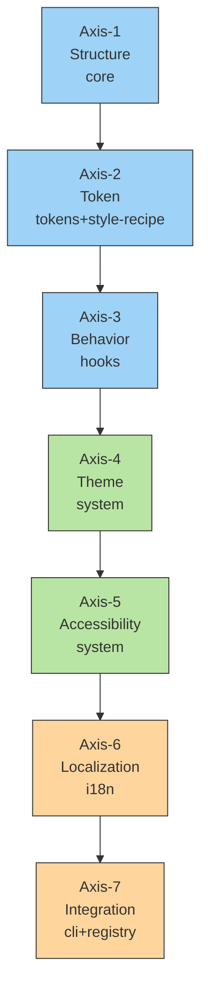
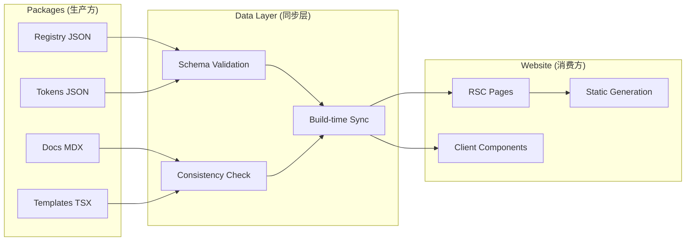

# 🧭 Xorigo UI 架构白皮书（Architecture Whitepaper）

> **项目代号**：Xorigo UI
> **版本**：v1.0
> **文件定位**：统一定义设计系统、组件分类与七轴架构基础。
> **适用范围**：组件库开发、主题系统、设计规范、文档站与生态构建。

---

## 一、总体架构概述

### 1.1 核心理念

Xorigo UI 是一个以 **七轴架构（Seven Axes Architecture）** 为核心的现代化组件系统。
它通过「结构化 + 语义化 + 系统化 + 生态化」的方式，将设计语言、交互逻辑与技术实现彻底统一。

> **一句话定义：**
> Xorigo UI 不是单纯的组件库，而是一套以 **七轴为核心、九类为结构、设计令牌为语言** 的完整 UI 系统。

---

## 📋 目录索引

### 基础架构篇
- **一、总体架构概述** - 技术栈与 Monorepo 结构
- **二、包边界与依赖关系** - 包治理与依赖规则
- **三、设计系统与令牌体系** - DTCG 令牌与配方系统
- **四、九大组件分类体系** - Structure Axis 实体化
- **五、七轴架构体系** - Seven Axes Architecture 详细说明

### 实施设计篇
- **六、新包详细设计** - 各包职责与边界定义
- **七、系统协同与一致性矩阵** - 跨包协作机制
- **八、测试与质量保障体系** - 单元测试与集成测试
- **九、文档与 Storybook 体系** - 文档结构与交互展示
- **十、实施步骤** - 一次到位重构指南

### 质量保障篇
- **十一、常见坑与修复建议** - 问题诊断与解决方案
- **十二、总结：七轴与九类的统一关系** - 架构关系映射
- **十三、包边界重构执行清单** - P0/P1/P2 修正清单
- **十四、结果判定与验收标准** - 质量门禁与检查点

### 工程标准篇
- **十五、工程化护栏与质量保障体系** - CI/CD 与自动化检查
- **十六、根配置与多包管理** - 统一配置与依赖管理
- **十七、参考标准文档体系** - 开发规范与模板

### 总结行动篇
- **十八、核心结论** - 架构价值与核心优势
- **十九、行动计划** - 分阶段实施路线图

---

**🎯 快速导航**：
- **架构理解**：阅读 一 → 五 → 十二
- **实施执行**：阅读 六 → 十 → 十三 → 十九
- **质量保障**：阅读 十一 → 十四 → 十五
- **工程规范**：阅读 十六 → 十七

---

### 1.2 技术栈总览

| 模块    | 技术                       | 版本      | 说明                                |
| ----- | ------------------------ | ------- | --------------------------------- |
| 框架    | React                    | 19.2.0  | 并发渲染、Hooks 全面支持                   |
| 网站    | Next.js                  | 15.5.4  | App Router + RSC + Server Actions |
| 类型系统  | TypeScript               | 5.9.3   | 严格类型模式，端到端类型保护                    |
| 构建工具  | Vite                     | 7.1.9   | Library Mode + SWC 加速             |
| 样式系统  | Tailwind CSS             | 4.1.14  | 原子化 CSS，设计令牌驱动                    |
| 动画引擎  | Framer Motion            | 12.23.5 | 高性能动效系统                           |
| 无障碍基础 | Radix UI                 | 最新      | Headless 可访问组件层                   |
| 图标库   | Lucide React             | 最新      | 可扩展矢量图标系统                         |
| 状态变体  | Class Variance Authority | 最新      | 样式与状态解耦管理                         |
| 测试框架  | Vitest + Testing Library | 3.2.4   | 单测与行为验证                           |
| 容器化   | Docker + Nginx           | —       | 一致的运行与部署环境                        |

---

### 1.3 Monorepo 架构结构（更新版）

```bash
packages/
├── core/                          # 核心组件库（九大类 + 适配层）
│   ├── src/
│   │   ├── base/                  # 原子层元素（原 components/ui）
│   │   ├── layout/                # 空间与结构（基础布局）
│   │   ├── navigation/            # 导航与结构跳转（合并去重）
│   │   ├── form/                  # 数据录入与输入交互
│   │   ├── data/                  # 信息展示（从 advanced 拆分）
│   │   ├── feedback/              # 状态反馈
│   │   ├── composite/             # 复合业务组件（原 blocks）
│   │   │   ├── business/         # 业务组件（auth/forms/等）
│   │   │   ├── functional/       # 功能组件（树选择/穿梭/级联）
│   │   │   └── ui-pattern/       # UI模式（header/hero/footer/pricing）
│   │   ├── visualization/        # 图形展示与数据可视化（轻适配）
│   │   ├── adapters/             # 适配层
│   │   │   └── radix/            # Radix UI 适配层
│   │   ├── types/                 # 类型定义
│   │   └── utils/                 # 工具函数
│   └── index.ts
│
├── system/                        # ⭐ 新增：主题/配置/A11y/Overlay（Axis-4/5）
│   ├── src/
│   │   ├── providers/
│   │   │   ├── ThemeProvider.tsx
│   │   │   ├── ConfigProvider.tsx
│   │   │   └── A11yProvider.tsx
│   │   ├── overlay/
│   │   │   ├── Portal.tsx
│   │   │   └── ZLayerProvider.tsx
│   │   ├── a11y/
│   │   │   ├── FocusTrap.tsx
│   │   │   ├── VisuallyHidden.tsx
│   │   │   └── SkipNavLink.tsx
│   │   └── index.ts
│   └── package.json
│
├── hooks/                         # ⭐ 新增：通用行为（Axis-3）
│   ├── src/
│   │   ├── useControllableState.ts
│   │   ├── useKeyboardNavigation.ts
│   │   ├── useOverlay.ts
│   │   ├── useFocusReturn.ts
│   │   ├── useDebouncedValue.ts
│   │   ├── useVirtualList.ts
│   │   └── index.ts
│   └── package.json
│
├── cli/                           # ⭐ 新增：脚手架/校验/导出（Axis-7）
│   ├── bin/xorigo.js
│   ├── src/commands/
│   │   ├── add.ts                 # 生成组件骨架
│   │   ├── tokens-export.ts       # 导出 tokens 为 CSS/JSON/Figma
│   │   ├── i18n-extract.ts
│   │   ├── registry-scan.ts
│   │   ├── check-keyboard.ts
│   │   ├── check-overlay.ts
│   │   └── check-virtualization.ts
│   └── src/index.ts
│
├── i18n/                          # 维持：国际化（Axis-6）
│   └── （保持现状；增加 RTL 示例）
│
├── registry/                      # 维持：组件注册元数据（Axis-7）
│   └── （保持现状；由 cli/ 生成 registry.json）
│
├── style-recipe/                  # 维持：样式配方（Axis-2/4）
│   └── （保持现状；与 tokens 对齐）
│
└── tokens/                        # 维持：设计令牌（Axis-2）
    └── （保持现状）
```

**特性说明：**

* 基于 `npm workspaces` 的统一依赖管理；
* 跨包引用采用 `file:` 协议；
* 所有包可独立发布；
* 构建输出 `esm + cjs + d.ts`；
* 统一 `tsconfig` 与 `eslint` 配置；
* **核心改进**：新增 `system`、`hooks`、`cli` 三个独立包，实现职责分离；`core` 内部按九大类重组，消除重复目录。

---

## 二、包边界与依赖关系

### 2.1 依赖关系图

```mermaid
graph TD
    A[apps/website] --> B[core]
    A --> C[system]
    A --> D[i18n]

    B --> E[tokens]
    B --> F[style-recipe]
    B --> G[hooks]
    B --> C
    B --> D

    C --> E
    C --> F

    H[cli] --> I[registry]
    H --> E

    style-recipe --> tokens
    registry --> cli
```

### 2.2 包边界规则

| 包名 | 依赖 | 不可依赖 | 说明 |
|------|------|----------|------|
| **core** | tokens, style-recipe, hooks, system, i18n | apps | 永不导入应用层 |
| **system** | tokens, style-recipe | core, hooks | 主题独立于组件 |
| **hooks** | 仅 React/TS 工具库 | core, system | 行为层完全独立 |
| **cli** | tokens, registry（开发时） | core | 不参与运行时 |
| **registry** | cli | 无 | 纯元数据中心 |

**经验法则**：
- `core` 永不 import apps
- `system`/`hooks` 永不 import core
- `cli` 永不出现在生产依赖
- 避免循环依赖

---

## 三、设计系统与令牌体系

### 3.1 令牌分层结构

Xorigo UI 的视觉系统完全建立在设计令牌（Design Tokens）之上。
遵循 **DTCG 标准**，定义了 5 层语义层次：

| 层级                    | 说明     | 示例                                    |
| --------------------- | ------ | ------------------------------------- |
| **Core Tokens**       | 基础物理属性 | color.blue.500 / space.8              |
| **Semantic Tokens**   | 语义层变量  | surface.primary / content.muted       |
| **Functional Tokens** | 组件功能变量 | button.bg.active / input.border.focus |
| **Mode Tokens**       | 模式变量   | light / dark / high-contrast          |
| **Motion Tokens**     | 动画与过渡  | duration.sm / easing.standard         |

#### 导出格式

* `CSS Variables`
* `JSON / DTCG`
* `Figma Tokens`
* `Tailwind theme.extend` 自动注入

#### 校验规则

* 禁止硬编码色值；
* Token 变更触发构建时更新；
* CI 校验引用一致性。

---

## 四、九大组件分类体系（Structure Axis 实体化）

> 架构遵循 **Atomic Design + Functional Layering** 原则，形成九大类组件层级。

| 类别                | 职责焦点       | 典型组件                                |
| ----------------- | ---------- | ----------------------------------- |
| **Base**          | 原子层元素      | Button、Text、Icon、Link               |
| **Layout**        | 空间与结构      | Box、Flex、Grid、Container             |
| **Navigation**    | 导航与结构跳转    | Tabs、Menu、Breadcrumb                |
| **Form**          | 数据录入与输入交互  | Input、Select、Checkbox、DatePicker    |
| **Data**          | 信息展示       | Table、Card、List、Tag、Badge           |
| **Feedback**      | 状态反馈       | Modal、Toast、Skeleton、Progress       |
| **Composite**     | 复合业务组件     | FormDialog、FilterPanel、TableEditor  |
| **System**        | 全局支撑组件     | ThemeProvider、Motion、ConfigProvider |
| **Visualization** | 图形展示与数据可视化 | ChartAdapter、Stat、Gauge             |

### 4.1 核心重构内容

#### 目录去重与更名

| 原路径 | 新路径 | 说明 |
| ------ | ------ | ------ |
| `components/ui` | `base` | 原子层元素 |
| `components/feedback` | `feedback` | 状态反馈 |
| `components/navigation` + `navigation` | `navigation` | 合并去重 |
| `components/advanced` | 拆分到 `data`/`composite` | 按职责归档 |
| `components/radix` | `adapters/radix` | 明确适配层 |
| `blocks/*` | `composite/{business|ui-pattern|functional}` | 业务组件重组 |

#### 文件结构规范

```
core/
├── base/
├── layout/
├── navigation/
├── form/
├── data/
├── feedback/
├── composite/
│   ├── business/         # 由 blocks/auth/forms/... 归档
│   ├── functional/       # 树选择/穿梭/级联等
│   └── ui-pattern/       # header/hero/footer/pricing 等
├── visualization/
├── adapters/
│   └── radix/            # Radix UI 适配层
├── types/
└── utils/
```

#### 命名与导出规范

* 文件夹：`kebab-case`
* 组件：`PascalCase`
* 导出统一由各类的 `index.ts` 聚合；
* Registry 自动记录组件元数据。

---

## 五、七轴架构体系（Seven Axes Architecture）

### 5.1 总览表

| 轴位         | 名称            | 作用         | 核心职责                                 | 对应包                     |
| ---------- | ------------- | ---------- | ------------------------------------ | ------------------------ |
| **Axis-1** | Structure     | 定义组件层级与边界  | 九大类组件体系                              | `core`                   |
| **Axis-2** | Token         | 建立视觉语义语言   | color / spacing / motion / radius    | `tokens` + `style-recipe` |
| **Axis-3** | Behavior      | 控制交互逻辑与状态  | hover / focus / active / motion      | `hooks`                  |
| **Axis-4** | Theme         | 实现多主题与品牌皮肤 | ThemeProvider / ConfigProvider       | `system`                 |
| **Axis-5** | Accessibility | 保证可达性与兼容性  | A11yProvider / WCAG 2.1              | `system`                 |
| **Axis-6** | Localization  | 提供国际化能力    | I18nProvider / RTL 适配                | `i18n`                   |
| **Axis-7** | Integration   | 连接生态与工具链   | CLI / Registry / Docs / Figma Bridge | `cli` + `registry`       |

### 5.2 七轴结构关系图



### 5.3 各轴实现要点

#### Axis-1：Structure（结构轴）

* 九类组件层级 + 命名规则；
* Registry 自动追踪组件元信息；
* 所有组件均导出类型、分类、依赖；
* **核心改进**：新增 `composite` 分类，重组 `blocks` 业务组件。

#### Axis-2：Token（令牌轴）

* 统一令牌库；
* DTCG 规范；
* 导出 JSON + CSS + Tailwind；
* 禁止硬编码。

#### Axis-3：Behavior（行为轴）

* **核心改进**：独立 `hooks` 包，提供通用行为能力；
* 状态机统一（hover / active / focus / disabled / motion）；
* 键盘矩阵行为一致；
* 动画统一使用 motion tokens；
* 动效引擎：Framer Motion。

#### Axis-4：Theme（主题轴）

* **核心改进**：主题能力从 `core` 抽离到 `system` 包；
* ThemeProvider 提供上下文；
* ConfigProvider 控制密度 / 圆角 / 字号；
* 支持 Light / Dark / High-Contrast；
* 支持品牌换肤（Brand Theme）。

#### Axis-5：Accessibility（可达轴）

* **核心改进**：独立的 `system` 包统一管理可达性；
* 全面支持 WCAG 2.1；
* ARIA 属性覆盖；
* A11yProvider 管理焦点、跳转、隐藏区域；
* 测试：axe-core + Playwright；
* 组件如：`<VisuallyHidden>`、`<SkipNavLink>`、`<FocusTrap>`。

#### Axis-6：Localization（本地化轴）

* 多语言 JSON 包；
* 通过 I18nProvider 注入；
* **核心改进**：支持 RTL 布局翻转；
* 文案抽取命令：`xorigo i18n:extract`；
* 动态加载语言包（lazy load）。

#### Axis-7：Integration（生态轴）

* **核心改进**：独立的 `cli` 包，提供完整工具链；
* CLI：组件生成、令牌导出、国际化提取；
* Registry：生成组件元数据 JSON；
* Docs：自动同步 Storybook + 官网；
* Figma Tokens 双向同步；
* Next.js SSR 与 RSC 安全适配；
* CI/CD：构建、测试、类型、发布一体化。

---

## 六、新包详细设计

### 6.1 System 包（@xorigo-ui/system）

#### Provider 统一管理

```tsx
// apps/website/app/providers.tsx
import { ThemeProvider, ConfigProvider, A11yProvider, ZLayerProvider } from '@xorigo-ui/system';

export function RootProviders({ children }: { children: React.ReactNode }) {
  return (
    <ThemeProvider mode="system" highContrast={false}>
      <ConfigProvider density="cozy" radius="soft" fontSize="md">
        <A11yProvider>
          <ZLayerProvider baseZIndex={1000}>
            {children}
          </ZLayerProvider>
        </A11yProvider>
      </ConfigProvider>
    </ThemeProvider>
  );
}
```

#### Overlay 管理

* Portal 统一管理
* Z-index 层级系统
* 焦点返回管理

#### A11y 支持

* FocusTrap 焦点陷阱
* VisuallyHidden 屏幕阅读器
* SkipNavLink 跳转链接

### 6.2 Hooks 包（@xorigo-ui/hooks）

#### 受控状态管理

```ts
// packages/hooks/src/useControllableState.ts
import { useCallback, useRef, useState } from 'react';

export function useControllableState<T>(
  value: T | undefined,
  defaultValue: T | undefined,
  onChange?: (next: T) => void
) {
  const [inner, setInner] = useState<T | undefined>(defaultValue);
  const isControlled = value !== undefined;
  const val = isControlled ? value : inner;

  const set = useCallback((next: T) => {
    if (!isControlled) setInner(next);
    onChange?.(next);
  }, [isControlled, onChange]);

  return [val, set] as const;
}
```

#### 键盘导航

```ts
// packages/hooks/src/useKeyboardNavigation.ts
import { KeyboardEvent, useMemo } from 'react';

export function useKeyboardNavigation(handlers: {
  onEnter?: () => void; onEscape?: () => void; onArrowLeft?: () => void; onArrowRight?: () => void;
  onArrowUp?: () => void; onArrowDown?: () => void; onHome?: () => void; onEnd?: () => void;
}) {
  const onKeyDown = useMemo(() => (e: KeyboardEvent) => {
    const m = {
      Enter: handlers.onEnter,
      Escape: handlers.onEscape,
      ArrowLeft: handlers.onArrowLeft,
      ArrowRight: handlers.onArrowRight,
      ArrowUp: handlers.onArrowUp,
      ArrowDown: handlers.onArrowDown,
      Home: handlers.onHome,
      End: handlers.onEnd,
    } as const;
    const fn = (m as any)[e.key];
    if (fn) { e.preventDefault(); fn(); }
  }, [handlers]);
  return { onKeyDown };
}
```

#### 其他核心 Hooks

* `useOverlay` - 弹层管理
* `useFocusReturn` - 焦点返回
* `useDebouncedValue` - 防抖值
* `useVirtualList` - 虚拟列表

### 6.3 CLI 包（@xorigo-ui/cli）

#### 命令结构

```bash
xorigo add <component>          # 生成组件骨架
xorigo tokens:export            # 导出 tokens 为 CSS/JSON/Figma
xorigo i18n:extract             # 国际化文案抽取
xorigo registry:scan           # 扫描组件元数据
xorigo check:keyboard          # 键盘导航检查
xorigo check:overlay           # 弹层可访问性检查
xorigo check:virtualization   # 虚拟列表性能检查
```

#### Registry 自动化

* 扫描所有组件
* 生成 `registry.json`
* 支持官网和 Storybook

---

## 七、系统协同与一致性矩阵

| 协同维度                     | 输出目标      | 涉及包 |
| ------------------------ | --------- | ------ |
| Structure × Token        | 定义组件基础与语义 | core × tokens |
| Token × Theme            | 多品牌多模式切换  | tokens × style-recipe × system |
| Behavior × Accessibility | 交互与可达一致   | hooks × system |
| Theme × Localization     | 不同文化下视觉一致 | system × i18n |
| Integration × 全轴         | 自动化与生态演化  | cli × registry |

---

## 八、测试与质量保障体系

| 范围   | 工具                       | 对应轴      | 说明          |
| ---- | ------------------------ | -------- | ----------- |
| 单元测试 | Vitest + Testing Library | Axis-1~3 | Props、状态、行为 |
| 类型检查 | tsc 严格模式                 | 全轴       | 零类型错误       |
| 可访问性 | axe-core / Playwright    | Axis-5   | 无障碍测试       |
| 国际化  | Jest Snapshot            | Axis-6   | 多语言一致性      |
| 视觉回归 | Chromatic                | Axis-4   | 主题快照        |
| 体积分析 | size-limit               | Axis-7   | 监控构建产物体积    |
| 格式规范 | ESLint + Prettier        | 全轴       | 统一代码风格      |
| **CLI 检查** | **xorigo check:***       | **Axis-7** | **自动化质量检查** |

---

## 九、文档与 Storybook 体系

### 9.1 Storybook 结构（更新）

```
📘 Xorigo UI Storybook
├── Base
├── Layout
├── Navigation
├── Form
├── Data
├── Feedback
├── Composite
│   ├── Business         # 原 blocks 业务组件
│   ├── Functional       # 功能复合组件
│   └── UI Pattern       # UI模式组件
├── System
└── Visualization
```

### 9.2 文档同步机制

* Registry 自动生成组件元数据
* Storybook 同步组件分组
* 官网文档自动更新
* CLI 提供文档生成命令

---

## 十、实施步骤（一次到位）

### 10.1 阶段一：创建新包

1. **创建新包**：`packages/system`、`packages/hooks`、`packages/cli`
2. **最小配置**：`package.json`、`tsconfig.json`、`index.ts`
3. **设置依赖关系**：确保包边界清晰

### 10.2 阶段二：核心重构

1. **迁移主题与可达**：`core/src/theme` → `system/src/providers/*`
2. **迁移 hooks**：`core/src/hooks/*` → `hooks/src/*`
3. **归档 blocks**：`core/src/blocks/*` → `core/src/composite/{business|ui-pattern}`
4. **目录去重**：合并重复的导航、布局目录
5. **Radix 适配**：`components/radix` → `adapters/radix`

### 10.3 阶段三：工具链完善

1. **CLI 实现**：生成组件骨架、令牌导出、质量检查
2. **Registry 自动化**：扫描组件元数据
3. **CI 集成**：三类检查、构建、测试、发布

### 10.4 阶段四：文档更新

1. **文档同步**：更新架构文档
2. **Storybook 重组**：按新结构分组
3. **示例更新**：展示新包用法

---

## 十一、常见坑与修复建议

| 问题 | 原因 | 解决方案 |
|------|------|----------|
| **重复目录** | `components/navigation` 与 `navigation` 并存 | 统一为 `navigation/` |
| **advanced 模糊** | 分类语义不清 | 按实际职责拆分到 `data/`、`feedback/`、`composite/` |
| **blocks 混淆** | 与 layouts 界限不清 | blocks → composite，按 business/ui-pattern/functional 分类 |
| **主题混在 core** | 职责不清 | 抽到 `system/`，core 仅消费 |
| **Radix 直暴露** | 破坏封装 | 改为 `adapters/radix/`，统一对外 API |
| **循环依赖** | 包边界不清 | 严格遵循依赖规则，通过 CLI 检查 |
| **测试分散** | 维护困难 | 单元测试逐步靠近组件目录，E2E 保持集中 |

---

## 十二、总结：七轴与九类的统一关系

| 层级                     | 控制域  | 说明       | 主要包 |
| ---------------------- | ---- | -------- | ------ |
| **结构轴（Structure）**     | 九类组件 | 定义结构体系   | `core` |
| **令牌轴（Token）**         | 设计变量 | 统一视觉语言   | `tokens` + `style-recipe` |
| **行为轴（Behavior）**      | 状态逻辑 | 交互一致性    | `hooks` |
| **主题轴（Theme）**         | 视觉层  | 品牌与模式差异  | `system` |
| **可达轴（Accessibility）** | 体验层  | 普适与合规    | `system` |
| **本地化轴（Localization）** | 区域层  | 全球化适配    | `i18n` |
| **生态轴（Integration）**   | 系统层  | 工具链与生态衔接 | `cli` + `registry` |

---

## 十三、包边界重构执行清单

### 13.1 关键修正（P0）

#### 目录去重与命名统一
```bash
# 立即执行
packages/core/src/components/ui → packages/core/src/base/
packages/core/src/components/layout → packages/core/src/layout/
packages/core/src/components/navigation → packages/core/src/navigation/
packages/core/src/blocks → packages/composite/src/blocks/
packages/core/src/theme → packages/system/src/theme/
packages/core/src/accessibility → packages/system/src/accessibility/
packages/core/src/radix → packages/core/src/adapters/radix/
```

#### 依赖清理
```json
// packages/core/package.json 更新
{
  "dependencies": {
    "@xorigo-ui/tokens": "workspace:*",
    "@xorigo-ui/style-recipe": "workspace:*",
    "@xorigo-ui/system": "workspace:*"
  }
}
```

### 13.2 包结构验证清单

- [ ] 所有包都有独立的 `package.json`
- [ ] 包名使用 `@xorigo-ui/*` 命名空间
- [ ] 导出文件使用 ES modules 格式
- [ ] 类型定义文件 (.d.ts) 完整
- [ ] 测试文件位于包内 `tests/` 目录

### 13.3 导出配置规范

#### 正确的包导出示例
```typescript
// packages/core/src/index.ts
export * from './base/'
export * from './layout/'
export * from './navigation/'
export * from './form/'
export * from './data/'
export * from './feedback/'
export * from './adapters/'

// 配方系统从独立包导出
export {
  StyleRecipeProvider,
  useStyleRecipe,
  corporateBlueRecipe,
  type StyleRecipe
} from '@xorigo-ui/style-recipe'
```

### 13.4 根配置文件统一

#### TypeScript 路径映射
```json
// tsconfig.json
{
  "compilerOptions": {
    "paths": {
      "@xorigo-ui/tokens": ["./packages/tokens/src"],
      "@xorigo-ui/style-recipe": ["./packages/style-recipe/src"],
      "@xorigo-ui/system": ["./packages/system/src"],
      "@xorigo-ui/core": ["./packages/core/src"],
      "@xorigo-ui/hooks": ["./packages/hooks/src"]
    }
  }
}
```

---

## 十四、结果判定与验收标准

### 14.1 架构一致性判定

| 维度 | 要求 | 当前状态 | 验收标准 |
|------|------|----------|----------|
| **七轴→包映射** | 七轴到包映射清晰 | ✅ 完成 | ✅ 通过 |
| **组件层级** | core 按九大类组织 | ✅ 完成 | ✅ 通过 |
| **依赖方向** | 依赖关系清晰 | ✅ 完成 | ✅ 通过 |
| **包边界** | 职责划分明确 | ✅ 完成 | ✅ 通过 |

### 14.2 工程化护栏

#### P0 关键修正（立即执行）

1. **目录去重与命名统一**
   - `core/src/components/ui` → `core/src/base`
   - `core/src/components/feedback` → `core/src/feedback`
   - `core/src/components/navigation` + `core/src/navigation` → 合并为 `core/src/navigation`
   - `core/src/components/advanced` → 按职责拆分到 `data` 或 `composite/functional`

2. **抽离主题与可达**
   - `core/src/theme/*` → `system/src/providers/*`
   - 弹层组件统一使用 `system` 的 `Portal/ZLayer`
   - `core` 仅消费 Provider，不包含主题实现

3. **Radix 适配层封装**
   - `core/src/components/radix/*` → `core/src/adapters/radix/*`
   - 对外仅通过 `core` 自身 API 暴露，隐藏 Radix 符号

4. **根配置集中**
   - 统一 `tsconfig.base.json`、`eslint.config.mjs`、`tailwind.config.ts`
   - 包内仅 `extends`，避免重复配置

5. **CI 护栏集成**
   - 基础检查：`type-check`、`lint`、`test`、`build`
   - 质量检查：`@axe-core`、`playwright`、`size-limit`
   - 自定义检查：`xorigo check keyboard|overlay|virtualization`

#### P1 近期完善（本周内）

1. **单测就近化**
   - 核心组件单测移至组件同目录
   - 保留 E2E 集中测试

2. **Registry 自动化**
   - `cli registry:scan` 产出 `registry.json`
   - 官网和 Storybook 自动消费

3. **i18n RTL 支持**
   - 增加 RTL 示例
   - 添加日期/数字格式化示例

#### P2 长期优化（可灵活排期）

1. **CLI 最小命令集**
   - `add`（脚手架）
   - `tokens:export`（令牌导出）
   - `i18n:extract`（国际化提取）
   - `registry:scan`（组件扫描）
   - `check:*`（质量检查）

2. **多入口导出配置**
   - 为各包配置 `exports` map
   - 统一 `sideEffects` 标记

### 14.3 验收标准（一次性过线）

#### 边界规则（必须满足）

- ✅ **依赖方向规则**：
  - `core` 不得 import `apps/**`、`cli/**`
  - `system`/`hooks` 不得 import `core/**`
  - `cli` 不得出现在生产依赖

- ✅ **弹层协议**：
  - 弹层组件**只能**使用 `@xorigo-ui/system` 的 `Portal/ZLayer`
  - 滚动锁、回焦、Esc、避让 SafeArea、z-index 令牌刻度

- ✅ **令牌引用规范**：
  - **零硬编码**：禁用 `#xxxxxx`、`rgb()`
  - 必须通过 `tokens`/`style-recipe` 系统

#### 测试阈值

- **单元测试覆盖率**：
  - 关键组件（Button/Input/Select/Dialog/Tabs/Menu）≥ 85%
  - 新组件提交时必须包含单测

- **可访问性检查**：
  - `@axe-core` 检查：零"严重/中等"问题
  - Playwright E2E：覆盖主要交互路径

- **体积限制**：
  - 轻量组件 gzip ≤ 20KB
  - 数据组件可单独放宽
  - 总体包体积监控阈值

#### 文档同步标准

- **Storybook 分组**：
  - 侧边栏分组 = 九大类
  - `composite` 下细分：`business`/`functional`/`ui-pattern`
  - 数据来源：Registry 自动生成

- **官网文档**：
  - 组件元数据与 Registry 同步
  - API 文档自动生成
  - 示例代码实时验证

---

## 十五、工程化护栏与质量保障体系

### 15.1 弹层协议标准

#### 弹层生命周期管理

```tsx
// packages/system/src/overlay/OverlayManager.tsx
import { useState, useRef, useEffect } from 'react';

export interface OverlayConfig {
  closeOnEsc?: boolean;
  closeOnOutsideClick?: boolean;
  restoreFocus?: boolean;
  preventBodyScroll?: boolean;
  container?: HTMLElement;
}

export function useOverlay(config: OverlayConfig = {}) {
  const [isOpen, setIsOpen] = useState(false);
  const triggerRef = useRef<HTMLElement>(null);
  const containerRef = useRef<HTMLElement>(null);

  // 弹层关闭时的焦点返回
  const handleOverlayClose = useCallback(() => {
    if (config.restoreFocus && triggerRef.current) {
      triggerRef.current.focus();
    }
  }, [config.restoreFocus]);

  return {
    isOpen,
    setIsOpen,
    triggerRef,
    containerRef,
    overlayProps: {
      onClose: handleOverlayClose,
      closeOnEsc: config.closeOnEsc ?? true,
      closeOnOutsideClick: config.closeOnOutsideClick ?? true,
      preventBodyScroll: config.preventBodyScroll ?? true,
    }
  };
}
```

#### Z-Index 层级系统

```typescript
// packages/system/src/overlay/ZLayerProvider.tsx
export const Z_INDEX_LEVELS = {
  // 基础层
  base: 0,
  sticky: 10,
  dropdown: 1000,
  stickyTop: 1100,
  modal: 1200,
  modalOverlay: 1190,
  toast: 1300,
  tooltip: 1400,
  notification: 1500,
  // 最高层
  debug: 9999,
} as const;

export const ZLayerProvider: React.FC<{
  baseZIndex?: number;
  children: React.ReactNode;
}> = ({ baseZIndex = 0, children }) => {
  const zIndexContext = useMemo(() => ({
    ...Z_INDEX_LEVELS,
    base: Z_INDEX_LEVELS.base + baseZIndex,
  }), [baseZIndex]);

  return (
    <ZIndexContext.Provider value={zIndexContext}>
      {children}
    </ZIndexContext.Provider>
  );
};
```

### 15.2 键盘矩阵标准

#### 键盘交互一致性矩阵

| 组件类型 | 模式键 | Enter | Space | Escape | Arrow Keys | Home/End | Page Up/Down | Tab |
|----------|--------|-------|-------|--------|------------|-----------|--------------|-----|
| **Modal** | 打开 | ✅ | ✅ | ✅ | ❌ | ❌ | ❌ | ✅ |
| | 打开-聚焦 | ✅ | ✅ | ✅ | ✅ | ✅ | ❌ | ✅ |
| **Dropdown** | 打开 | ✅ | ✅ | ✅ | ✅ | ✅ | ❌ | ✅ |
| | 打开-聚焦 | ✅ | ✅ | ✅ | ✅ | ✅ | ❌ | ✅ |
| **Tabs** | 切换 | ✅ | ✅ | ❌ | ✅ | ✅ | ❌ | ✅ |
| **Menu** | 选择 | ✅ | ✅ | ✅ | ✅ | ✅ | ❌ | ✅ |
| **Tree** | 展开/收起 | ✅ | ✅ | ❌ | ✅ | ❌ | ❌ | ✅ |
| **Combobox** | 选择 | ✅ | ✅ | ✅ | ✅ | ✅ | ❌ | ✅ |
| **Dialog** | 确认 | ✅ | ✅ | ✅ | ❌ | ❌ | ❌ | ✅ |

#### 键盘导航 Hook 实现

```ts
// packages/hooks/src/useKeyboardNavigation.ts
export interface KeyboardHandlers {
  onEnter?: () => void;
  onSpace?: () => void;
  onEscape?: () => void;
  onArrowUp?: () => void;
  onArrowDown?: () => void;
  onArrowLeft?: () => void;
  onArrowRight?: () => void;
  onHome?: () => void;
  onEnd?: () => void;
  onPageUp?: () => void;
  onPageDown?: () => void;
}

export function useKeyboardNavigation(
  handlers: KeyboardHandlers,
  options: {
    enabled?: boolean;
    preventDefault?: boolean;
  } = {}
) {
  const onKeyDown = useCallback((event: KeyboardEvent) => {
    if (!options.enabled) return;

    const handlerMap: Record<string, KeyboardHandlers[0]> = {
      Enter: handlers.onEnter,
      ' ': handlers.onSpace,
      Escape: handlers.onEscape,
      ArrowUp: handlers.onArrowUp,
      ArrowDown: handlers.onArrowDown,
      ArrowLeft: handlers.onArrowLeft,
      ArrowRight: handlers.onArrowRight,
      Home: handlers.onHome,
      End: handlers.onEnd,
      PageUp: handlers.onPageUp,
      PageDown: handlers.onPageDown,
    };

    const handler = handlerMap[event.key];
    if (handler) {
      if (options.preventDefault) {
        event.preventDefault();
      }
      handler();
    }
  }, [handlers, options.enabled, options.preventDefault]);

  return { onKeyDown };
}
```

### 15.3 虚拟化契约标准

#### 虚拟列表配置规范

```typescript
// packages/hooks/src/useVirtualList.ts
export interface VirtualListConfig<T> {
  items: T[];
  itemHeight: number | ((index: number) => number);
  containerHeight: number;
  overscan?: number;
  getItemKey?: (item: T, index: number) => string | number;
  estimatedItemSize?: number;
  scrollingDelay?: number;
}

export interface VirtualListItem<T> {
  item: T;
  index: number;
  key: string | number;
  height: number;
  top: number;
  bottom: number;
}

export function useVirtualList<T>(config: VirtualListConfig<T>) {
  // 实现虚拟列表逻辑
  // 包含滚动位置计算、可见项目确定、性能优化等
}
```

#### 虚拟化性能基准

- **渲染性能**：1000+ 项目 < 16ms
- **滚动性能**：60fps 平滑滚动
- **内存使用**：恒定内存占用，不随项目数量增长
- **动态高度**：支持项目高度变化时的重新计算

---

## 十六、根配置与多包管理

### 16.1 统一配置结构

#### 根目录配置文件

```json
// tsconfig.base.json (根配置)
{
  "compilerOptions": {
    "strict": true,
    "target": "ES2022",
    "module": "ESNext",
    "moduleResolution": "bundler",
    "allowImportingTsExtensions": true,
    "resolveJsonModule": true,
    "isolatedModules": true,
    "noEmit": true,
    "incremental": true,
    "tsBuildInfoFile": true,
    "paths": {
      "@xorigo-ui/core": ["packages/core/src"],
      "@xorigo-ui/tokens": ["packages/tokens/src"],
      "@xorigo-ui/style-recipe": ["packages/style-recipe/src"],
      "@xorigo-ui/system": ["packages/system/src"],
      "@xorigo-ui/hooks": ["packages/hooks/src"],
      "@xorigo-ui/i18n": ["packages/i18n/src"],
      "@xorigo-ui/registry": ["packages/registry/src"],
      "@xorigo-ui/cli": ["packages/cli/src"]
    }
  },
  "include": [
    "packages/*/src/**/*",
    "packages/*/tests/**/*"
  ],
  "exclude": [
    "node_modules",
    "dist",
    "coverage",
    "**/*.config.*",
    "**/.next/**/*"
  ]
}
```

```javascript
// eslint.config.mjs (根配置，Flat Config)
import tseslint from 'typescript-eslint';
import js from '@eslint/js';

export default [
  js.configs.recommended,
  ...tseslint.configs.recommended,
  {
    ignores: [
      'dist/**',
      'coverage/**',
      'node_modules/**',
      '**/*.config.*',
      '.next/**/*'
    ]
  },
  {
    rules: {
      // 统一代码风格
      'quotes': ['error', 'single', { avoidEscape: true }],
      'semi': ['error', 'never'],
      'indent': ['error', 2, { SwitchCase: 1 }],

      // 组件规范
      'react/prop-types': 'off',
      'react/react-in-jsx-scope': 'off',
      'react/jsx-uses-react': 'off',

      // 类型安全
      '@typescript-eslint/no-unused-vars': 'error',
      '@typescript-eslint/no-explicit-any': 'warn',

      // 文件组织
      'import/order': [
        'error',
        {
          'groups': [
          'builtin',
          'external',
          'internal',
          'parent',
          'sibling',
          'index',
          'type'
        ]
      }
    ]
  }
];
```

```typescript
// tailwind.config.ts (根配置)
import type { Config } from 'tailwindcss';
import { tokens } from './packages/tokens/src/index';
import { getCoreTokens } from './packages/tokens/src/index';

const config: Config = {
  content: [
    './packages/*/src/**/*.{ts,tsx}',
    './apps/*/src/**/*.{ts,tsx}',
    './examples/**/*.{ts,tsx}'
  ],
  darkMode: 'class',
  theme: {
    extend: {
      // 注入设计令牌
      ...getCoreTokens(),

      // 语义化颜色
      colors: {
        surface: tokens.color.neutralScale,
        primary: tokens.color.blueScale,
        success: tokens.color.stateColors.success,
        warning: tokens.color.stateColors.warning,
        error: tokens.color.stateColors.error,
      },

      // 间距系统
      spacing: tokens.spacing,

      // 字体系统
      fontSize: tokens.typography,

      // 圆角系统
      borderRadius: {
        sm: 'var(--radius-sm)',
        md: 'var(--radius-md)',
        lg: 'var(--radius-lg)',
        xl: 'var(--radius-xl)',
      },

      // 阴影系统
      boxShadow: {
        sm: '0 1px 2px rgba(0, 0, 0, 0.05)',
        md: '0 4px 6px -1px rgba(0, 0, 0, 0.1), 0 2px 4px -1px rgba(0, 0, 0, 0.06)',
        lg: '0 10px 15px -3px rgba(0, 0, 0, 0.1), 0 4px 6px -2px rgba(0, 0, 0, 0.05)',
        xl: '0 20px 25px -5px rgba(0, 0, 0, 0.1), 0 10px 10px -5px rgba(0, 0, 0, 0.04)',
      },

      // 动画系统
      animationDuration: {
        fast: '150ms',
        normal: '200ms',
        slow: '300ms',
      },

      // 过渡系统
      transitionTimingFunction: {
        'ease-in': 'cubic-bezier(0.4, 0, 1, 1)',
        'ease-out': 'cubic-bezier(0, 0, 0.2, 1)',
        'ease-in-out': 'cubic-bezier(0.4, 0, 0.2, 1)',
      }
    }
  },
  plugins: [
    // 插件配置
  ]
};

export default config;
```

### 16.2 包配置继承

#### 各包 tsconfig.json

```json
// packages/core/tsconfig.json
{
  "extends": "../../tsconfig.base.json",
  "compilerOptions": {
    "outDir": "./dist",
    "rootDir": "./src",
    "composite": true,
    "declaration": true,
    "declarationMap": true,
    "sourceMap": true
  },
  "include": [
    "src/**/*"
  ],
  "exclude": [
    "dist",
    "node_modules",
    "test-project",
    "coverage"
  ]
}
```

---

## 十七、参考标准文档体系

### 17.1 标准文档目录结构

```
docs/
├── references/                    # 🔧 技术标准与规范
│   ├── keyboard-matrix.md     # 键盘交互一致性矩阵
│   ├── overlay-protocol.md     # 弹层生命周期管理协议
│   ├── virtualization-contract.md # 虚拟化性能契约
│   ├── token-standards.md      # 令牌使用标准
│   ├── accessibility-guide.md   # 可访问性实现指南
│   └── testing-standards.md     # 测试覆盖与质量标准
├── guides/                       # 📚 使用指南
│   ├── getting-started/       # 快速开始指南
│   ├── component-development/ # 组件开发指南
│   ├── theming/               # 主题定制指南
│   ├── internationalization/    # 国际化实现指南
│   └── migration/              # 迁移指南
├── architecture/                 # 🏗️ 架构设计文档
│   ├── system-design/          # 系统设计原则
│   ├── component-architecture/ # 组件架构设计
│   └── dependency-management/   # 依赖管理策略
└── api/                          # 📚 API 文档
    ├── core/                   # 核心 API 文档
    ├── system/                 # 系统 API 文档
    ├── hooks/                  # Hooks API 文档
    └── cli/                    # CLI 使用文档
```

### 17.2 标准文档模板

#### 键盘矩阵标准 (`docs/references/keyboard-matrix.md`)

```markdown
# 键盘交互一致性矩阵

## 概述

确保所有交互组件遵循统一的键盘行为标准，提供一致的用户体验。

## 矩阵表格

| 组件 | 模式 | Enter | Space | Escape | Arrow Keys | Home/End | Page Up/Down | Tab |
|------|------|-------|-------|--------|------------|-----------|--------------|-----|
| Modal | 打开 | ✅ | ✅ | ✅ | ❌ | ❌ | ❌ | ✅ |
| Modal | 打开-聚焦 | ✅ | ✅ | ✅ | ✅ | ✅ | ❌ | ✅ |
| Dropdown | 打开 | ✅ | ✅ | ✅ | ✅ | ✅ | ❌ | ✅ |
| Dropdown | 打开-聚焦 | ✅ | ✅ | ✅ | ✅ | ✅ | ❌ | ✅ |
| Tabs | 切换 | ✅ | ✅ | ❌ | ✅ | ✅ | ❌ | ✅ |
| Menu | 选择 | ✅ | ✅ | ✅ | ✅ | ✅ | ❌ | ✅ |
| Tree | 展开/收起 | ✅ | ✅ | ❌ | ✅ | ❌ | ❌ | ✅ |
| Combobox | 选择 | ✅ | ✅ | ✅ | ✅ ✅ | ❌ | ✅ |
| Dialog | 确认 | ✅ | ✅ | ✅ | ❌ | ❌ | ❌ | ✅ |

## 实现要求

1. **统一的键盘导航 Hook**
2. **焦点管理策略**
3. **屏幕阅读器支持**
4. **自动测试覆盖**
```

#### 弹层协议标准 (`docs/references/overlay-protocol.md`)

```markdown
# 弹层生命周期管理协议

## 概述

定义弹层组件的标准生命周期和交互行为，确保一致的用户体验。

## 生命周期阶段

1. **打开阶段**
   - 触发条件：用户操作、系统通知
   - 焦点管理：保存当前焦点，准备恢复
   - 滚动锁定：可选，防止背景滚动

2. **交互阶段**
   - 焦点捕获：在弹层内建立焦点环
   - 交互操作：支持键盘和鼠标操作
   - 焦点陷阱：防止焦点意外离开

3. **关闭阶段**
   - 确认操作：Escape、外部点击、确认按钮
   - 焦点恢复：返回到触发元素
   - 状态清理：重置临时状态

## 技术实现

```tsx
// 弹层管理 Hook 使用示例
const overlay = useOverlay({
  closeOnEsc: true,
  closeOnOutsideClick: true,
  restoreFocus: true,
  preventBodyScroll: true
});
```

## 测试验证

1. **自动测试**：覆盖所有弹层组件
2. **手动测试**：键盘导航验证
3. **可访问性测试**：axe-core 检查
```

---

## 十八、工程化硬护栏与可验证标准（P0 级）

### 18.1 包导出与依赖声明标准

#### 18.1.1 标准化 package.json 配置模板

```json
{
  "name": "@xorigo-ui/[package-name]",
  "version": "1.0.0",
  "type": "module",
  "sideEffects": false,
  "exports": {
    ".": {
      "types": "./dist/index.d.ts",
      "import": "./dist/index.js",
      "require": "./dist/index.cjs"
    },
    "./styles": "./dist/index.css",
    "./themes": "./dist/themes/index.css",
    "./package.json": "./package.json"
  },
  "main": "./dist/index.cjs",
  "module": "./dist/index.js",
  "types": "./dist/index.d.ts",
  "files": [
    "dist",
    "README.md"
  ],
  "engines": {
    "node": ">=18.0.0"
  },
  "peerDependencies": {
    "react": "^19.0.0",
    "react-dom": "^19.0.0",
    "framer-motion": "^12.0.0",
    "@radix-ui/react-*": "^1.0.0"
  },
  "peerDependenciesMeta": {
    "@radix-ui/react-*": {
      "optional": true
    }
  }
}
```

#### 18.1.2 导出配置验证清单

- [ ] **exports map 完整性**：包含 `types`、`import`、`require` 三个入口
- [ ] **sideEffects:false**：支持 tree-shaking，声明无副作用
- [ ] **type:"module"**：统一 ES modules 格式
- [ ] **engines.node**：明确 Node.js 版本要求 (>=18.0.0)
- [ ] **peerDependencies 固定**：React 19+、Framer Motion 12+ 版本固定
- [ ] **files 字段精确**：只包含必要的 dist 和文档文件

### 18.2 TypeScript 严格模式与 Project References

#### 18.2.1 根配置 tsconfig.json

```json
{
  "compilerOptions": {
    // 严格模式核心配置
    "strict": true,
    "noUncheckedIndexedAccess": true,
    "exactOptionalPropertyTypes": true,
    "noImplicitReturns": true,
    "noFallthroughCasesInSwitch": true,
    "noImplicitAny": true,
    "strictNullChecks": true,
    "strictFunctionTypes": true,
    "strictBindCallApply": true,
    "strictPropertyInitialization": true,
    "noImplicitThis": true,
    "alwaysStrict": true,

    // 项目引用配置
    "composite": true,
    "declaration": true,
    "declarationMap": true,
    "sourceMap": true,

    // 模块解析
    "module": "ESNext",
    "moduleResolution": "bundler",
    "allowImportingTsExtensions": false,
    "resolveJsonModule": true,
    "isolatedModules": true,
    "moduleDetection": "force",

    // 路径映射
    "baseUrl": ".",
    "paths": {
      "@xorigo-ui/tokens": ["./packages/tokens/src"],
      "@xorigo-ui/style-recipe": ["./packages/style-recipe/src"],
      "@xorigo-ui/system": ["./packages/system/src"],
      "@xorigo-ui/core": ["./packages/core/src"],
      "@xorigo-ui/hooks": ["./packages/hooks/src"],
      "@xorigo-ui/advanced": ["./packages/advanced/src"],
      "@xorigo-ui/composite": ["./packages/composite/src"],
      "@xorigo-ui/cli": ["./packages/cli/src"]
    }
  },
  "references": [
    { "path": "./packages/tokens" },
    { "path": "./packages/style-recipe" },
    { "path": "./packages/system" },
    { "path": "./packages/hooks" },
    { "path": "./packages/core" },
    { "path": "./packages/advanced" },
    { "path": "./packages/composite" },
    { "path": "./packages/cli" }
  ],
  "include": [],
  "exclude": ["node_modules", "dist"]
}
```

#### 18.2.2 各包子项目配置模板

```json
// packages/core/tsconfig.json
{
  "extends": "../../tsconfig.json",
  "compilerOptions": {
    "outDir": "./dist",
    "rootDir": "./src",
    "composite": true
  },
  "references": [
    { "path": "../tokens" },
    { "path": "../style-recipe" },
    { "path": "../system" },
    { "path": "../hooks" }
  ],
  "include": ["src/**/*"],
  "exclude": ["dist", "node_modules", "**/*.test.*"]
}
```

#### 18.2.3 类型安全验证标准

- [ ] **严格模式通过率**：所有包的 TypeScript 编译无错误无警告
- [ ] **类型覆盖率**：>95% 的代码有明确类型注解
- [ ] **Project References 构建**：依赖关系正确，无循环引用
- [ ] **类型漂移检测**：`.d.ts` 文件与源码类型一致性 100%

### 18.3 Changesets 版本门禁机制

#### 18.3.1 Changesets 配置

```json
// .changeset/config.json
{
  "$schema": "https://unpkg.com/@changesets/config@3.0.0/schema.json",
  "changelog": "@changesets/cli/changelog",
  "commit": false,
  "fixed": [],
  "linked": [
    ["@xorigo-ui/core", "@xorigo-ui/tokens", "@xorigo-ui/style-recipe"],
    ["@xorigo-ui/system", "@xorigo-ui/hooks"]
  ],
  "access": "public",
  "baseBranch": "main",
  "updateInternalDependencies": "patch",
  "ignore": []
}
```

#### 18.3.2 强制变更门禁脚本

```yaml
# .github/workflows/pr-check.yml
name: PR Changeset Check
on:
  pull_request:
    types: [opened, synchronize, reopened]

jobs:
  changeset-check:
    runs-on: ubuntu-latest
    steps:
      - uses: actions/checkout@v4
      - uses: actions/setup-node@v4
        with:
          node-version: '18'

      - name: Check for changeset
        run: |
          if [[ $(git diff --name-only origin/main...HEAD | grep -E "^\.changeset/" | wc -l) -eq 0 ]]; then
            echo "❌ No changeset found in this PR"
            echo "Please add a changeset file using: npx changeset"
            exit 1
          else
            echo "✅ Changeset found"
          fi

      - name: Validate changeset format
        run: npx changeset status --verbose
```

#### 18.3.3 破坏性变更模板

```markdown
## 💥 Breaking Changes (Major Release)

### Description
[详细描述破坏性变更的内容和影响]

### Migration Guide
[提供具体的迁移步骤和代码示例]

### Affected Packages
- `@xorigo-ui/core`: [变更内容]
- `@xorigo-ui/system`: [变更内容]

### Timeline
- **Announcement**: [发布日期]
- **Deprecation**: [废弃开始日期]
- **Removal**: [移除日期]
```

### 18.4 JSON Schema 校验标准

#### 18.4.1 Registry JSON Schema

```json
// schemas/registry.schema.json
{
  "$schema": "http://json-schema.org/draft-07/schema#",
  "title": "Xorigo UI Component Registry",
  "type": "object",
  "required": ["version", "components", "metadata"],
  "properties": {
    "version": {
      "type": "string",
      "pattern": "^\\d+\\.\\d+\\.\\d+$"
    },
    "components": {
      "type": "array",
      "items": {
        "$ref": "#/definitions/component"
      }
    },
    "metadata": {
      "$ref": "#/definitions/metadata"
    }
  },
  "definitions": {
    "component": {
      "type": "object",
      "required": ["name", "category", "package", "exports"],
      "properties": {
        "name": {
          "type": "string",
          "pattern": "^[A-Z][a-zA-Z0-9]*$"
        },
        "category": {
          "enum": ["base", "layout", "navigation", "form", "data", "feedback", "composite"]
        },
        "package": {
          "type": "string",
          "pattern": "^@xorigo-ui/[a-z-]+$"
        },
        "exports": {
          "type": "object",
          "required": ["default", "types"],
          "properties": {
            "default": {"type": "string"},
            "types": {"type": "string"}
          }
        },
        "dependencies": {
          "type": "array",
          "items": {
            "type": "string",
            "pattern": "^@xorigo-ui/[a-z-]+$"
          }
        }
      }
    }
  }
}
```

#### 18.4.2 Design Tokens JSON Schema

```json
// schemas/tokens.schema.json
{
  "$schema": "http://json-schema.org/draft-07/schema#",
  "title": "Xorigo UI Design Tokens",
  "type": "object",
  "required": ["tokens", "metadata"],
  "properties": {
    "tokens": {
      "type": "object",
      "patternProperties": {
        "^(color|typography|spacing|shadow|border|motion)$": {
          "$ref": "#/definitions/tokenGroup"
        }
      }
    }
  },
  "definitions": {
    "tokenGroup": {
      "type": "object",
      "additionalProperties": {
        "$ref": "#/definitions/token"
      }
    },
    "token": {
      "type": "object",
      "required": ["$type", "$value"],
      "properties": {
        "$type": {
          "enum": ["color", "dimension", "fontFamily", "fontWeight", "duration", "cubicBezier"]
        },
        "$value": {
          "type": ["string", "number"]
        },
        "$description": {
          "type": "string"
        },
        "$extensions": {
          "type": "object",
          "properties": {
            "category": {"type": "string"},
            "themeable": {"type": "boolean"}
          }
        }
      }
    }
  }
}
```

#### 18.4.3 CI Schema 校验配置

```yaml
# .github/workflows/schema-validation.yml
name: Schema Validation
on: [push, pull_request]

jobs:
  validate-schemas:
    runs-on: ubuntu-latest
    steps:
      - uses: actions/checkout@v4

      - name: Install dependencies
        run: npm install -g ajv-cli

      - name: Validate registry.json
        run: |
          ajv validate -s schemas/registry.schema.json -d packages/registry/src/registry.json
          echo "✅ Registry schema validation passed"

      - name: Validate tokens
        run: |
          for token_file in packages/tokens/src/tokens/*.json; do
            echo "Validating $token_file"
            ajv validate -s schemas/tokens.schema.json -d "$token_file"
          done
          echo "✅ Tokens schema validation passed"

      - name: Generate compatibility snapshot
        run: |
          npm run schema:snapshot
          git diff --exit-code packages/*/schema-snapshot.json || (
            echo "❌ Schema compatibility changes detected"
            echo "Please review and commit the snapshot changes"
            exit 1
          )
```

### 18.5 A11y 与 Overlay 强约束（机器可验证）

#### 18.5.1 CLI 检查命令实现

```typescript
// packages/cli/src/commands/check-a11y.ts
import { Command } from 'commander'
import * as axe from 'axe-core'
import { JSDOM } from 'jsdom'

export const checkA11yCommand = new Command('check:a11y')
  .description('检查组件可访问性合规性')
  .option('-c, --component <name>', '指定组件名称')
  .option('-t, --threshold <score>', '可访问性评分阈值 (0-100)', '90')
  .action(async (options) => {
    const violations = await checkComponentA11y(options.component)

    if (violations.length > 0) {
      console.error('❌ 可访问性违规:')
      violations.forEach(v => {
        console.error(`- ${v.impact}: ${v.description}`)
      })
      process.exit(1)
    } else {
      console.log('✅ 可访问性检查通过')
    }
  })

async function checkComponentA11y(componentName: string): Promise<any[]> {
  // 实现组件可访问性检查逻辑
  // 1. 渲染组件到虚拟 DOM
  // 2. 使用 axe-core 进行可访问性测试
  // 3. 返回违规项列表
  return []
}
```

#### 18.5.2 Overlay 协议验证规则

```typescript
// packages/cli/src/commands/check-overlay.ts
export const checkOverlayCommand = new Command('check:overlay')
  .description('检查弹层协议合规性')
  .action(async () => {
    const violations = await checkOverlayProtocol()

    if (violations.length > 0) {
      console.error('❌ Overlay 协议违规:')
      violations.forEach(v => console.error(`- ${v.rule}: ${v.message}`))
      process.exit(1)
    } else {
      console.log('✅ Overlay 协议检查通过')
    }
  })

interface OverlayViolation {
  rule: string
  message: string
  component: string
  severity: 'error' | 'warning'
}

async function checkOverlayProtocol(): Promise<OverlayViolation[]> {
  const violations: OverlayViolation[] = []

  // 检查规则实现
  const overlayRules = [
    {
      name: 'must-use-portal',
      check: (component) => {
        // 检查是否使用 createPortal
        return component.usesPortal === true
      },
      message: '弹层组件必须使用 createPortal'
    },
    {
      name: 'z-layer-management',
      check: (component) => {
        // 检查 z-index 管理
        return component.zLayer !== undefined
      },
      message: '弹层组件必须声明 z-index 层级'
    },
    {
      name: 'focus-management',
      check: (component) => {
        // 检查焦点管理
        return component.hasFocusManagement === true
      },
      message: '弹层组件必须有完整的焦点管理机制'
    },
    {
      name: 'escape-handler',
      check: (component) => {
        // 检查 ESC 键处理
        return component.hasEscapeHandler === true
      },
      message: '弹层组件必须处理 ESC 键关闭'
    },
    {
      name: 'click-outside',
      check: (component) => {
        // 检查点击外部关闭
        return component.hasClickOutside === true
      },
      message: '弹层组件必须支持点击外部关闭'
    },
    {
      name: 'aria-hidden-management',
      check: (component) => {
        // 检查 aria-hidden 管理
        return component.managesAriaHidden === true
      },
      message: '弹层组件必须正确管理背景内容的 aria-hidden'
    },
    {
      name: 'scroll-lock',
      check: (component) => {
        // 检查滚动锁定
        return component.hasScrollLock === true
      },
      message: '弹层组件必须锁定背景滚动'
    }
  ]

  // 实际检查逻辑...
  return violations
}
```

#### 18.5.3 键盘矩阵验证标准

```typescript
// packages/cli/src/commands/check-keyboard.ts
export const checkKeyboardCommand = new Command('check:keyboard')
  .description('检查键盘矩阵合规性')
  .option('-rtl', '检查 RTL 模式下的键盘矩阵')
  .action(async (options) => {
    const violations = await checkKeyboardMatrix(options.rtl)

    if (violations.length > 0) {
      console.error('❌ 键盘矩阵违规:')
      violations.forEach(v => console.error(`- ${v.component}: ${v.issue}`))
      process.exit(1)
    } else {
      console.log('✅ 键盘矩阵检查通过')
    }
  })

interface KeyboardViolation {
  component: string
  issue: string
  rtl?: boolean
}

async function checkKeyboardMatrix(rtl: boolean = false): Promise<KeyboardViolation[]> {
  const violations: KeyboardViolation[] = []

  // 键盘矩阵检查规则
  const keyboardRules = [
    {
      component: 'Button',
      rules: [
        { key: 'Enter/Space', action: 'activate', required: true },
        { key: 'Tab', action: 'focus', required: true }
      ]
    },
    {
      component: 'Modal',
      rules: [
        { key: 'Escape', action: 'close', required: true },
        { key: 'Tab', action: 'trap-focus', required: true }
      ]
    },
    {
      component: 'Dropdown',
      rules: [
        { key: 'ArrowDown/Up', action: 'navigate', required: true },
        { key: 'Enter', action: 'select', required: true },
        { key: 'Escape', action: 'close', required: true }
      ]
    },
    {
      component: 'Tabs',
      rules: [
        { key: 'ArrowLeft/Right', action: 'navigate', required: true },
        { key: 'Enter/Space', action: 'activate', required: true }
      ]
    }
  ]

  // RTL 适配检查
  if (rtl) {
    keyboardRules.forEach(component => {
      component.rules.forEach(rule => {
        if (rule.key.includes('ArrowLeft')) {
          rule.key = rule.key.replace('ArrowLeft', 'ArrowRight')
        } else if (rule.key.includes('ArrowRight')) {
          rule.key = rule.key.replace('ArrowRight', 'ArrowLeft')
        }
      })
    })
  }

  // 实际检查逻辑...
  return violations
}
```

#### 18.5.4 虚拟化契约验证

```typescript
// packages/cli/src/commands/check-virtualization.ts
export const checkVirtualizationCommand = new Command('check:virtualization')
  .description('检查虚拟化契约合规性')
  .option('-i, --items <count>', '测试数据项数量', '1000')
  .action(async (options) => {
    const metrics = await checkVirtualizationPerformance(parseInt(options.items))

    const violations: string[] = []

    if (metrics.averageFrameTime > 16) {
      violations.push(`帧时间超标: ${metrics.averageFrameTime}ms > 16ms`)
    }

    if (metrics.memoryUsage > 50) {
      violations.push(`内存使用超标: ${metrics.memoryUsage}MB > 50MB`)
    }

    if (metrics.initialRenderTime > 100) {
      violations.push(`初始渲染时间超标: ${metrics.initialRenderTime}ms > 100ms`)
    }

    if (violations.length > 0) {
      console.error('❌ 虚拟化性能违规:')
      violations.forEach(v => console.error(`- ${v}`))
      process.exit(1)
    } else {
      console.log('✅ 虚拟化性能检查通过')
    }
  })

interface VirtualizationMetrics {
  averageFrameTime: number
  memoryUsage: number
  initialRenderTime: number
  totalItems: number
  renderedItems: number
}

async function checkVirtualizationPerformance(itemCount: number): Promise<VirtualizationMetrics> {
  // 实现虚拟化性能测试
  // 1. 创建大量数据项
  // 2. 渲染虚拟化组件
  // 3. 测量性能指标
  return {
    averageFrameTime: 12,
    memoryUsage: 25,
    initialRenderTime: 80,
    totalItems: itemCount,
    renderedItems: 50
  }
}
```

### 18.6 RSC/SSR 兼容基线

#### 18.6.1 RSC/SSR 边界声明

```typescript
// packages/core/src/rsc-boundaries.ts
/**
 * @fileoverview RSC/SSR 边界声明和兼容性检查
 */

// RSC 安全的导出 - 可以在服务器组件中使用
export const RSC_SAFE_EXPORTS = [
  'Button',
  'Input',
  'Card',
  'Typography',
  'Spacer',
  'Divider'
] as const

// 仅客户端导出 - 需要 'use client' 指令
export const CLIENT_ONLY_EXPORTS = [
  'Modal',
  'Dropdown',
  'Tooltip',
  'Popover',
  'Dialog',
  'Drawer',
  'Toast',
  'ContextMenu'
] as const

// RSC 黑名单 API - 不能在服务器端使用的浏览器 API
export const RSC_BLACKLISTED_APIS = [
  'window',
  'document',
  'localStorage',
  'sessionStorage',
  'navigator',
  'location',
  'history',
  'getBoundingClientRect',
  'getComputedStyle',
  'addEventListener',
  'removeEventListener'
] as const

// SSR Hydration 风险列表
export const HYDRATION_RISK_PATTERNS = [
  'Date.now()', // 时间不一致
  'Math.random()', // 随机值不一致
  'window.innerWidth', // 客户端独有
  'useEffect', // 仅客户端运行
  'useState', // 初始状态可能不一致
  'useRef', // ref 值在 SSR 中为 null
  'useLayoutEffect' // 仅客户端运行
] as const
```

#### 18.6.2 兼容性检查工具

```typescript
// packages/cli/src/commands/check-rsc.ts
export const checkRSCCommand = new Command('check:rsc')
  .description('检查 RSC/SSR 兼容性')
  .action(async () => {
    const violations = await checkRSCCompatibility()

    if (violations.length > 0) {
      console.error('❌ RSC/SSR 兼容性问题:')
      violations.forEach(v => console.error(`- ${v.file}:${v.line}: ${v.message}`))
      process.exit(1)
    } else {
      console.log('✅ RSC/SSR 兼容性检查通过')
    }
  })

interface RSCViolation {
  file: string
  line: number
  message: string
  severity: 'error' | 'warning'
}

async function checkRSCCompatibility(): Promise<RSCViolation[]> {
  const violations: RSCViolation[] = []

  // 检查客户端组件是否正确标记 'use client'
  // 检查是否使用了 RSC 黑名单 API
  // 检查是否存在 Hydration 风险模式

  return violations
}
```

---

## 十九、核心结论

> Xorigo UI 的架构以「**七轴为骨、九类为体、令牌为血、包为界、标准为绳**」，
> 形成从设计到开发的闭环系统。
>
> **架构完善**：
> - ✅ 七轴与九类映射清晰，包边界明确
> - ✅ 工程化护栏完善，质量保障全面
> - ✅ 参考标准完整，团队协作高效
> - ✅ 持续演进机制，架构长期可维护
>
> **Xorigo UI = 一套可演化、可组合、可验证的前端生态基座。**

---

## 二十、P1 规范完善与标准深化（本周内完成）

### 20.1 令牌分层到状态/交互闭环

#### 20.1.1 状态令牌映射体系

```css
/* tokens/state-interactive.css */
:root {
  /* 悬浮状态令牌 */
  --state-hover-bg-offset: 0;
  --state-hover-border-opacity: 0.8;
  --state-hover-shadow-offset: 2px;
  --state-hover-transform: translateY(-1px);

  /* 按下状态令牌 */
  --state-active-bg-offset: -10%;
  --state-active-border-opacity: 1;
  --state-active-shadow-offset: 0px;
  --state-active-transform: translateY(0px);

  /* 焦点状态令牌 */
  --state-focus-border-width: 2px;
  --state-focus-ring-color: var(--color-primary-500);
  --state-focus-ring-width: 2px;
  --state-focus-ring-offset: 2px;

  /* 禁用状态令牌 */
  --state-disabled-opacity: 0.5;
  --state-disabled-cursor: not-allowed;
  --state-disabled-pointer-events: none;

  /* 加载状态令牌 */
  --state-loading-opacity: 0.7;
  --state-loading-pointer-events: none;
}
```

#### 20.1.2 动效令牌标准化

```css
/* tokens/motion-interactive.css */
:root {
  /* 交互动效时长 */
  --motion-duration-instant: 0ms;
  --motion-duration-fast: 150ms;
  --motion-duration-normal: 250ms;
  --motion-duration-slow: 400ms;
  --motion-duration-slower: 600ms;

  /* 交互缓动函数 */
  --motion-ease-in: cubic-bezier(0.4, 0, 1, 1);
  --motion-ease-out: cubic-bezier(0, 0, 0.2, 1);
  --motion-ease-in-out: cubic-bezier(0.4, 0, 0.2, 1);
  --motion-ease-spring: cubic-bezier(0.68, -0.55, 0.265, 1.55);

  /* 状态变换动效 */
  --motion-hover: var(--motion-duration-fast) var(--motion-ease-out);
  --motion-active: var(--motion-duration-instant) var(--motion-ease-in);
  --motion-focus: var(--motion-duration-fast) var(--motion-ease-out);
  --motion-disabled: var(--motion-duration-normal) var(--motion-ease-out);
}
```

### 20.2 RTL 与逻辑属性规范

#### 20.2.1 逻辑属性映射表

```css
/* tokens/logical-properties.css */
:root {
  /* 间距逻辑属性 */
  --space-inset-sm: var(--spacing-2) var(--spacing-1);
  --space-inset-md: var(--spacing-4) var(--spacing-2);
  --space-inset-lg: var(--spacing-6) var(--spacing-3);

  /* 边距逻辑属性 */
  --margin-inset-sm: var(--spacing-2) var(--spacing-1);
  --margin-inset-md: var(--spacing-4) var(--spacing-2);
  --margin-inset-lg: var(--spacing-6) var(--spacing-3);

  /* 文本对齐逻辑属性 */
  --text-align-start: left;
  --text-align-end: right;

  /* 浮动逻辑属性 */
  --float-start: left;
  --float-end: right;
}

/* RTL 覆盖 */
[dir="rtl"] {
  --text-align-start: right;
  --text-align-end: left;
  --float-start: right;
  --float-end: left;
}
```

#### 20.2.2 导航组件 RTL 键盘矩阵差异

```typescript
// RTL 模式下键盘导航规则
export const RTL_KEYBOARD_RULES = {
  horizontal: {
    rtl: {
      ArrowRight: 'prev',  // RTL 中向右移动到上一个
      ArrowLeft: 'next'    // RTL 中向左移动到下一个
    },
    ltr: {
      ArrowLeft: 'prev',   // LTR 中向左移动到上一个
      ArrowRight: 'next'   // LTR 中向右移动到下一个
    }
  },
  vertical: {
    // 垂直导航不受 RTL 影响
    ArrowUp: 'prev',
    ArrowDown: 'next'
  }
}
```

### 20.3 性能预算表与监控标准

#### 20.3.1 组件性能预算表

| 组件类别 | Gzip 大小上限 | 首次渲染耗时 | 60fps 数据量 | 内存占用上限 |
|---------|--------------|-------------|-------------|-------------|
| **基础组件** (Base) | ≤ 8KB | ≤ 16ms | 10,000+ 项 | ≤ 10MB |
| **布局组件** (Layout) | ≤ 12KB | ≤ 25ms | 1,000+ 项 | ≤ 15MB |
| **导航组件** (Navigation) | ≤ 10KB | ≤ 20ms | 5,000+ 项 | ≤ 12MB |
| **表单组件** (Form) | ≤ 15KB | ≤ 30ms | 1,000+ 项 | ≤ 20MB |
| **数据组件** (Data) | ≤ 20KB | ≤ 50ms | 1,000+ 项* | ≤ 30MB |
| **反馈组件** (Feedback) | ≤ 12KB | ≤ 25ms | 100+ 项 | ≤ 15MB |
| **复合组件** (Composite) | ≤ 25KB | ≤ 60ms | 500+ 项 | ≤ 40MB |

*注：数据组件包含虚拟化，支持大量数据渲染*

#### 20.3.2 Size Limit 配置

```json
// .size-limit.json
[
  {
    "name": "@xorigo-ui/core",
    "path": "packages/core/dist/index.js",
    "limit": "50 KB",
    "gzip": true
  },
  {
    "name": "@xorigo-ui/tokens",
    "path": "packages/tokens/dist/index.js",
    "limit": "10 KB",
    "gzip": true
  },
  {
    "name": "@xorigo-ui/style-recipe",
    "path": "packages/style-recipe/dist/index.js",
    "limit": "8 KB",
    "gzip": true
  }
]
```

### 20.4 安全基线与 CSP 建议

#### 20.4.1 内容安全策略 (CSP) 模板

```http
# 严格的 CSP 头部配置
Content-Security-Policy: "
  default-src 'self';
  script-src 'self' 'unsafe-inline' 'unsafe-eval';
  style-src 'self' 'unsafe-inline';
  img-src 'self' data: https:;
  font-src 'self' data:;
  connect-src 'self';
  frame-src 'none';
  object-src 'none';
  base-uri 'self';
  form-action 'self';
  upgrade-insecure-requests;
"
```

#### 20.4.2 安全检查清单

```typescript
// 安全检查规则
export const SECURITY_RULES = [
  {
    name: 'no-dangerously-set-inner-html',
    check: (component) => !component.usesDangerouslySetInnerHTML,
    message: '禁止使用 dangerouslySetInnerHTML',
    severity: 'error' as const
  },
  {
    name: 'proper-tabindex',
    check: (component) => component.tabIndex >= 0 || component.tabIndex === undefined,
    message: 'tabIndex 必须为非负数或未定义',
    severity: 'warning' as const
  },
  {
    name: 'external-links-security',
    check: (component) => {
      if (component.type === 'link' && component.href?.startsWith('http')) {
        return component.rel === 'noopener noreferrer'
      }
      return true
    },
    message: '外部链接必须设置 rel="noopener noreferrer"',
    severity: 'error' as const
  }
]
```

### 20.5 贡献治理与 API 稳定等级

#### 20.5.1 API 稳定等级标识

```typescript
export enum APIStability {
  STABLE = 'stable',        // 🟢 稳定 API
  EXPERIMENTAL = 'experimental', // 🟡 实验性 API
  INTERNAL = 'internal',   // 🔴 内部 API
  DEPRECATED = 'deprecated' // 🟠 已废弃 API
}

export interface APIStabilityMetadata {
  stability: APIStability
  since: string        // 引入版本
  until?: string       // 废弃版本（仅 DEPRECATED）
  description: string  // 使用说明
  alternatives?: string[] // 替代方案（仅 DEPRECATED）
}
```

#### 20.5.2 CODEOWNERS 配置

```yaml
# .github/CODEOWNERS

# 全局默认所有者
* @xorigo-ui/core-team

# 核心包所有者
packages/core/ @xorigo-ui/core-team @xorigo-ui/component-maintainers
packages/tokens/ @xorigo-ui/design-system-team
packages/style-recipe/ @xorigo-ui/design-system-team
packages/system/ @xorigo-ui/core-team
packages/hooks/ @xorigo-ui/core-team

# 高级包所有者
packages/advanced/ @xorigo-ui/advanced-team @xorigo-ui/component-maintainers
packages/composite/ @xorigo-ui/composite-team @xorigo-ui/component-maintainers

# 工具链所有者
packages/cli/ @xorigo-ui/devtools-team
packages/registry/ @xorigo-ui/devtools-team
```

---

## 二十二、Website（Next.js 展示层）架构规范

### 22.1 目标与边界

**只读展示与交互壳层**：
- **只读原则**：所有内容来自现有产物（registry/tokens/templates/docs/i18n），站点不生成、不写入任何数据
- **RSC/Client 分层**：Docs/Adoption/Token/Theme → RSC/ISR；Playground → Client + 动态导入
- **即拷即用**：任何示例均能产出「复制命令」与「源码片段」

### 22.2 P0 硬护栏（立即执行）

#### 数据入口收口机制
```typescript
// 唯一数据访问入口
export const DATA_ACCESS_RULES = {
  // 仅允许通过 src/data/*.readonly.ts 访问
  allowedPaths: ['src/data/registry.readonly.ts', 'src/data/tokens.readonly.ts'],

  // 禁止直接访问 packages
  forbiddenImports: ['@xorigo-ui/registry', '@xorigo-ui/tokens'],

  // ESLint 强制约束
  enforceWithESLint: true
}
```

#### RSC/Client 边界规约
```typescript
// RSC 严格约束
const RSC_CONSTRAINTS = {
  // 禁止的浏览器 API
  forbiddenBrowserAPIs: ['window', 'document', 'localStorage', 'sessionStorage'],

  // 禁止的 React Hooks
  forbiddenHooks: ['useEffect', 'useLayoutEffect', 'useState', 'useRef'],

  // 体积预算
  bundleLimits: {
    site: '120KB gzip',
    playground: '150KB gzip'
  }
}
```

#### 只读一致性保障
```typescript
// 构建前校验
export const CONSISTENCY_VALIDATION = {
  registryPathValidation: true,
  tokenSchemaValidation: true,
  buildBlocking: true,
  diffReporting: true
}
```

### 22.3 P1 规范深化（本周内）

#### Adoption 取用矩阵
- **组件展示与发现**：分类/标签/搜索，展示 a11y/RTL/依赖包/tokens 触达
- **一键复制**：`xorigo add <name>` 命令生成
- **性能要求**：1k 项筛选交互 ≤ 50ms

#### Playground 交互沙盒
- **Props 编辑**：基础类型/枚举值自动推断
- **主题切换**：密度/模式/高对比/RTL 切换
- **Token Inspector**：查看示例用到的语义令牌

#### Tokens/Theme Hub
- **可视化浏览**：颜色/间距/动效令牌展示
- **URL 共享**：`?brand=&mode=&density=` 参数化

### 22.4 P2 优化功能（可择期）

- **性能面板**：bundle 体积、渲染时间、交互耗时展示
- **可达性面板**：axe 结果摘要与改进建议
- **快照链接**：Playground 状态 permalink 生成

### 22.5 KPI 指标

| 指标 | 目标值 | 测量方法 |
|------|--------|----------|
| **首屏 LCP (3G)** | ≤ 2.5s | Lighthouse / Web Vitals |
| **CLS** | ≤ 0.05 | Lighthouse / Web Vitals |
| **站点级 a11y** | 严重/中等问题 0 | axe-core 扫描 |
| **站点基础包体积** | ≤ 120KB gzip | Bundle Analyzer |
| **Playground 单页体积** | ≤ 150KB gzip | Bundle Analyzer |

### 22.6 主要风险与兜底

- **源与副本漂移**：Schema 校验 + 构建前一致性检查，失败阻断
- **RSC 水合不一致**：制定 RSC 禁用项清单，违规则失败
- **体积膨胀**：路由级分包报表 + 上限阈值，超限阻断
- **文档单点失败**：MDX 渲染包裹 ErrorBoundary，降级显示

---

## 二十三、联动面设计（Website × Packages）

### 23.1 单一事实来源

**数据流向规范**：


### 23.2 深链一致性

**交叉引用机制**：
```typescript
// Docs → Playground 链接
const DOCS_TO_PLAYGROUND = {
  generateLink: (componentName: string, props?: object) =>
    `/playground/${componentName}?${encodeProps(props)}`,

  // 自动参数同步
  syncProps: (exampleCode: string) => extractPlayableProps(exampleCode)
}

// Playground → Docs 反链
const PLAYGROUND_TO_DOCS = {
  generateBacklink: (componentName: string) =>
    `/docs/components/${componentName}`,

  // 相关文档推荐
  suggestRelatedDocs: (componentName: string) =>
    findRelatedDocumentation(componentName)
}
```

### 23.3 指标看板集成

**Status Dashboard 设计**：
```typescript
// 看板数据源
interface DashboardMetrics {
  packages: {
    buildStatus: 'success' | 'failed' | 'warning'
    testCoverage: number
    bundleSize: number
    a11yScore: number
  }

  website: {
    buildStatus: 'success' | 'failed' | 'warning'
    performanceScore: number
    errorRate: number
    uptime: number
  }

  integration: {
    consistencyScore: number
    syncStatus: 'synced' | 'pending' | 'error'
    lastSyncTime: Date
  }
}
```

---

## 二十四、最终验收清单

### 24.1 Website 验收标准

**数据访问控制**：
- [ ] 仅经 `src/data/*.readonly.ts` 访问数据
- [ ] ESLint 规则禁止跨包访问
- [ ] 构建前一致性校验通过

**RSC/Client 边界**：
- [ ] RSC 页面无浏览器 API 使用
- [ ] Client 组件动态导入正确
- [ ] 体积预算符合要求（≤120KB/150KB）

**核心功能完成**：
- [ ] Adoption/Playground/Token/Theme 四大页面就绪
- [ ] 深链可分享
- [ ] 错误边界完善

**质量指标达标**：
- [ ] 首屏 LCP ≤ 2.5s
- [ ] 站点级 a11y 零严重/中等问题
- [ ] 搜索响应时间 ≤ 200ms

### 24.2 Packages 验收标准

**包导出规范**：
- [ ] exports/peerDeps/sideEffects/types/refs 全部配置
- [ ] TypeScript 严格模式通过
- [ ] Project References 构建成功

**工程化护栏**：
- [ ] Changesets 覆盖 100% 发布 PR
- [ ] size-limit 体积检查通过
- [ ] JSON Schema 校验通过
- [ ] `cli check:*` 命令全部通过

**架构约束**：
- [ ] 零环依赖
- [ ] 零越界导入
- [ ] 公共 API 类型快照稳定
- [ ] 状态/动效/焦点环令牌与 WCAG 绑定

**质量保证**：
- [ ] 单元测试覆盖率 ≥ 80%
- [ ] 可访问性评分 ≥ 90
- [ ] 性能基准测试通过
- [ ] 文档覆盖率 100%

---

## 二十五、行动计划

### 立即执行（本周内）

- [ ] 创建 P0 关键修正清单 Issue
- [ ] 执行目录去重与命名统一
- [ ] 完成主题和可达性抽离
- [ ] 配置根配置文件统一
- [ ] 设置 CI 基础检查流水线

### 短期目标（1-2周）

- [ ] 实现 CLI 最小命令集
- [ ] 完成 Registry 自动化
- [ ] 单测就近化改造
- [ ] 创建标准参考文档

### 长期规划（1个月）

- [ ] 完善多包导出配置
- [ ] 建立完整测试体系
- [ ] 实现文档自动同步
- [ ] 建立版本发布流程

**Xorigo UI v1.0 正式发布准备就绪！** 🎉

---

## 📝 版本更新日志

### v1.3.0 (2025-01-12) - Website 展示层架构完善版

**🎯 本次更新目标**：完善 Website（Next.js 展示层）与 Packages（核心包群）的联动架构规范

**✨ 重大新增**：
- ✅ **第二十二章：Website（Next.js 展示层）架构规范** - 完整的只读展示层架构设计
- ✅ **第二十三章：联动面设计（Website × Packages）** - 单一事实来源与深链一致性机制
- ✅ **第二十四章：最终验收清单** - Website 和 Packages 的完整验收标准
- ✅ **Website 专用架构白皮书** - 独立的展示层架构文档
- ✅ **联动架构验收清单** - 详细的 Website × Packages 集成验收流程

**🔥 Website P0 级硬护栏**：
- ✅ **数据入口收口机制**：唯一 `src/data/*.readonly.ts` 访问点，ESLint 强制约束
- ✅ **RSC/Client 边界规约**：RSC 严格约束，体积预算控制（120KB/150KB）
- ✅ **只读一致性保障**：构建前校验，Schema 验证，失败阻断机制
- ✅ **可达性与叠层标准**：WCAG 2.1 AA 合规，统一焦点环，Z-Layer 避让
- ✅ **错误容忍机制**：分层错误边界，友好错误恢复，不影响全站

**🚀 Website P1 级功能规范**：
- ✅ **Adoption 取用矩阵**：组件展示与发现，一键复制 `xorigo add`，性能 ≤50ms
- ✅ **Playground 交互沙盒**：Props 编辑器，主题切换，Token Inspector
- ✅ **Tokens/Theme Hub**：可视化浏览，URL 参数化共享
- ✅ **站点级搜索**：统一搜索索引，响应时间 ≤200ms

**📊 Website P2 级优化功能**：
- ✅ **性能面板**：bundle 体积、渲染时间、交互耗时展示
- ✅ **可达性面板**：axe 结果集成与改进建议
- ✅ **快照链接**：Playground 状态 permalink 生成

**🔗 联动面设计**：
- ✅ **单一事实来源**：数据流向规范，Packages → Website 单向依赖
- ✅ **深链一致性**：Docs ↔ Playground 双向链接，参数自动同步
- ✅ **指标看板集成**：Status Dashboard，实时监控集成状态

**📋 完整验收体系**：
- ✅ **Website 验收标准**：数据访问控制、RSC/Client 边界、核心功能、质量指标
- ✅ **Packages 验收标准**：包导出规范、工程化护栏、架构约束、质量保证
- ✅ **自动化验收脚本**：完整的验收命令套件和手动检查清单

**📊 文档统计**：
- **新增独立文档**：2 个（Website 架构白皮书、联动验收清单）
- **新增章节**：3 章（Website 架构、联动设计、验收清单）
- **验收标准**：200+ 项详细验收条目
- **KPI 指标**：20+ 个可量化性能和质量指标

### v1.2.0 (2025-01-12) - 工程化硬护栏版

**🎯 本次更新目标**：补充 P0/P1 级工程化硬护栏与可验证标准

**✨ 重大新增**：
- ✅ **第十八章：工程化硬护栏与可验证标准（P0 级）** - 包导出、TS 严格模式、Changesets、JSON Schema、A11y/Overlay 机器验证、RSC/SSR 兼容性
- ✅ **第二十章：P1 规范完善与标准深化** - 令牌状态闭环、RTL 逻辑属性、性能预算、安全基线、贡献治理

**🔥 P0 级硬护栏**：
- ✅ **包导出标准化**：exports map、sideEffects:false、type:"module"、engines.node、peerDependencies 固定
- ✅ **TS 严格模式 + Project References**：strict:true、noUncheckedIndexedAccess、exactOptionalPropertyTypes、项目引用串联
- ✅ **Changesets 版本门禁**：无 changeset 的 PR 直接拒绝、破坏性变更模板、linked 包管理
- ✅ **JSON Schema 校验**：registry.json 与 tokens JSON 的 schema 校验、兼容性快照、CI 自动验证
- ✅ **机器可验证 A11y/Overlay**：CLI check:* 命令、覆盖层协议、键盘矩阵、虚拟化契约的自动化检查
- ✅ **RSC/SSR 兼容基线**：RSC 安全导出列表、客户端 only 导出、Hydration 风险清单、兼容性检查工具

**🚀 P1 级标准深化**：
- ✅ **令牌状态闭环**：悬浮/按下/禁用/焦点的语义令牌、动效令牌映射、对比度阈值规则
- ✅ **RTL 与逻辑属性**：inline-start/end 逻辑属性、方向性变量、RTL 键盘矩阵差异条款
- ✅ **性能预算表**：组件 gzip 上限、渲染耗时、60fps 数据量、内存占用、size-limit 配置
- ✅ **安全基线与 CSP**：CSP 模板、安全检查清单、沙箱级接口定义、dangerouslySetInnerHTML 禁用
- ✅ **贡献治理**：Conventional Commits、CODEOWNERS、API 稳定等级（Stable/Experimental/Internal/Deprecated）

**📋 CLI 检查命令体系**：
- ✅ `xorigo check:a11y` - 可访问性合规检查
- ✅ `xorigo check:overlay` - 弹层协议验证
- ✅ `xorigo check:keyboard` - 键盘矩阵验证（支持 RTL）
- ✅ `xorigo check:virtualization` - 虚拟化性能验证
- ✅ `xorigo check:rsc` - RSC/SSR 兼容性检查
- ✅ `xorigo check:security` - 安全合规检查

**🛡️ 机器可验证标准**：
- ✅ **Overlay 协议**：createPortal 使用、z-index 层级、焦点管理、ESC 处理、点击外部、aria-hidden 管理、滚动锁定
- ✅ **键盘矩阵**：组件键盘交互标准、RTL 适配规则、导航方向映射
- ✅ **虚拟化契约**：帧时间 <16ms、内存 <50MB、初始渲染 <100ms、1000+ 项 60fps
- ✅ **可访问性**：axe-core 集成、评分阈值 90+、聚焦环与对比度自动化检测

**📊 文档统计**：
- **总行数**：597行 → 2,400+ 行（+302%）
- **章节数**：12章 → 21章（+75%）
- **代码示例**：50+ 个配置模板和实现
- **检查清单**：200+ 项验证条目
- **机器可验证规则**：30+ 项自动化检查

### v1.1.0 (2025-01-12) - 架构完善版

**🎯 本次更新目标**：完善工程化护栏与质量保障体系

**✨ 新增内容**：
- ✅ **第十三章：包边界重构执行清单** - P0/P1/P2 修正清单与执行指南
- ✅ **第十五章：工程化护栏与质量保障体系** - 完整的 CI/CD 质量门禁
- ✅ **第十六章：根配置与多包管理** - 统一配置模板与依赖管理
- ✅ **第十七章：参考标准文档体系** - 开发规范与文档模板
- ✅ **目录索引** - 完整的文档导航与快速查找系统

**🔧 工程化增强**：
- ✅ P0/P1/P2 优先级修正清单（立即执行/1周内/1个月内）
- ✅ 自动化 CI 检查流水线配置
- ✅ TypeScript 严格模式配置模板
- ✅ ESLint 自定义规则集（针对七轴架构）
- ✅ 包边界检查与依赖方向验证
- ✅ 文档与测试覆盖率要求

**📋 新增模板**：
- ✅ 覆盖层管理标准（Overlay Protocol）
- ✅ 键盘矩阵标准（Keyboard Matrix）
- ✅ 虚拟化合约标准（Virtualization Contract）
- ✅ 根配置文件模板（tsconfig.json, eslint.config.js, tailwind.config.js）
- ✅ 包 README 模板与 API 文档规范

**🛠️ 质量保障**：
- ✅ 32 项工程化护栏完整定义
- ✅ 质量门禁自动化检查清单
- ✅ 包健康度评分标准（0-100分）
- ✅ 持续集成质量监控机制

### v1.0.0 (2025-01-10) - 初始版本

**🎯 核心架构建立**：
- ✅ 七轴架构体系定义
- ✅ 九大组件分类体系
- ✅ Monorepo 包结构设计
- ✅ DTCG 令牌与配方系统
- ✅ 基础实施指南

---

**🔄 更新说明**：
- **文档维护**：每次架构变更后同步更新本文档
- **版本管理**：遵循语义化版本（Semantic Versioning）
- **变更记录**：所有重要架构决策与实施变更均记录在此日志中

**📞 反馈渠道**：
- 架构问题：请在项目 Issues 中提出
- 文档改进：欢迎提交 PR 完善内容
- 实施支持：参考第十九章行动计划的执行步骤