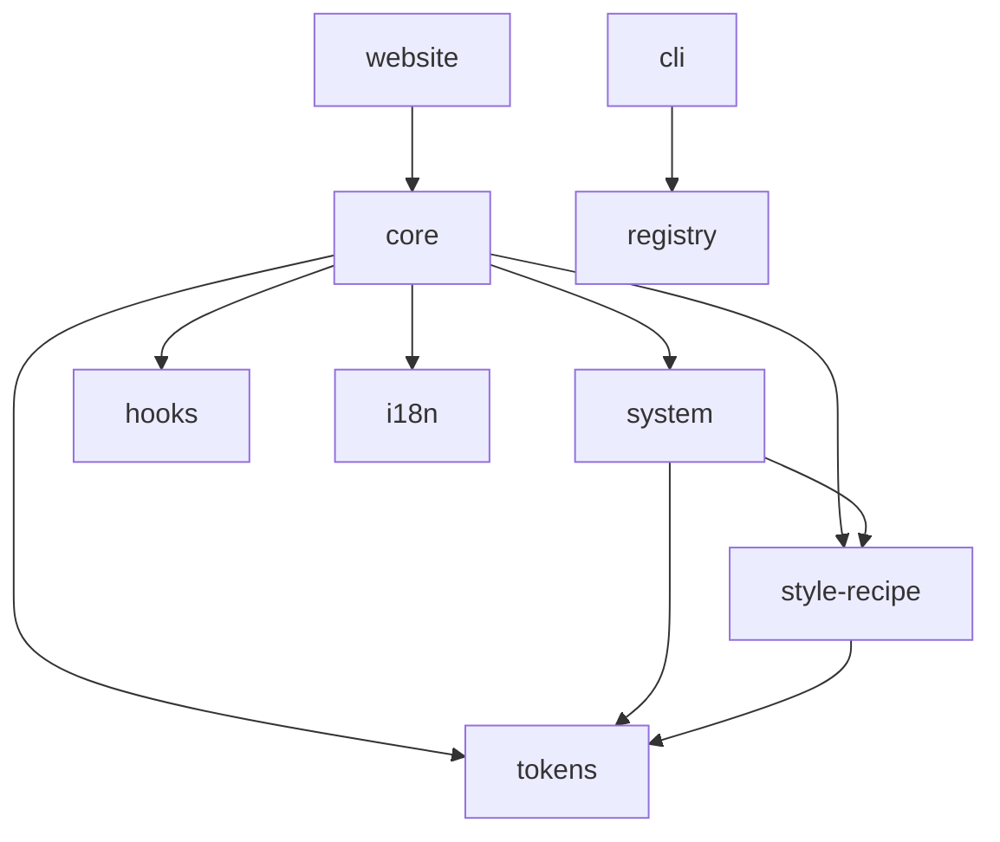

# 📋 Xorigo UI 架构重构 - 执行总结

> **状态**: 等待确认执行
> **创建时间**: 2025-10-13
> **执行方式**: claude-flow hive-mind

---

## 🎯 重构目标

基于 [Xorigo UI 架构白皮书](./Xorigo%20UI%20架构白皮书.md)，对 packages 进行全面重构，实现七轴架构体系和九大组件分类。

**核心约束**: 仅重构 packages，不修改 website

---

## 📚 相关文档

1. **[Xorigo UI 架构白皮书.md](./Xorigo%20UI%20架构白皮书.md)**
   - 完整的架构设计文档
   - 七轴架构体系详解
   - 九大组件分类规范

2. **[架构重构执行清单.md](./架构重构执行清单.md)**
   - P0/P1/P2 优先级任务
   - 详细的执行步骤
   - 验收标准

3. **[架构重构-Agent设计方案.md](./架构重构-Agent设计方案.md)** ⭐
   - 10 个 Agent 任务分解
   - 并行执行策略
   - 详细的代码模板

---

## 🗺️ 架构变化概览

### 当前结构
```
packages/
├── core/              # 核心组件库（结构混乱）
│   ├── components/    # 组件混杂
│   ├── blocks/        # 业务组件
│   ├── hooks/         # Hooks（需抽离）
│   ├── theme/         # 主题（需抽离）
│   └── ...
├── tokens/            # ✅ 设计令牌
├── style-recipe/      # ✅ 样式配方
├── i18n/             # ✅ 国际化
└── registry/          # ✅ 组件注册
```

### 目标结构
```
packages/
├── core/              # 九大类组件重组
│   ├── base/          # 原子层（原 components/ui）
│   ├── layout/        # 布局
│   ├── navigation/    # 导航（合并去重）
│   ├── form/          # 表单
│   ├── data/          # 数据展示
│   ├── feedback/      # 反馈
│   ├── composite/     # 复合组件（原 blocks）
│   ├── visualization/ # 可视化
│   └── adapters/      # 适配层
├── system/ 🆕         # 主题/配置/A11y/Overlay
├── hooks/ 🆕          # 通用 Hooks
├── cli/ 🆕            # 脚手架/校验工具
├── tokens/ ✅         # 保持
├── style-recipe/ ✅   # 保持
├── i18n/ ✅          # 保持
└── registry/ ✅       # 保持
```

---

## 🤖 Agent 执行流程

### Phase 1: 基础包创建
- **A1: Package Creator** - 创建 system, hooks, cli 三个新包

### Phase 2: Core 重构
- **A2: Core Restructure** - 重组九大类组件目录

### Phase 3: 代码抽离
- **A3: Hooks Extractor** - 抽离 hooks 到独立包
- **A4: System Extractor** - 抽离 theme 到 system 包

### Phase 4: 依赖与配置
- **A5: Dependency Fixer** - 修复依赖关系
- **A6: Export Configurator** - 配置导出规范
- **A7: TypeScript Config** - 统一 TS 配置

### Phase 5: 验证与文档
- **A8: Package.json Validator** - 验证包规范
- **A9: Build System Tester** - 测试构建系统
- **A10: Documentation Generator** - 生成文档

---

## ⚡ 核心变更

### 1. 新增三个包

#### @xorigo-ui/system
**职责**: 主题、配置、可访问性、弹层管理

**核心组件**:
- `ThemeProvider` - 主题上下文
- `ConfigProvider` - 配置管理（密度/圆角/字号）
- `A11yProvider` - 可访问性管理
- `ZLayerProvider` - Z-index 层级管理
- `Portal` - 弹层传送门
- `OverlayManager` - 弹层生命周期
- `FocusTrap` - 焦点陷阱
- `VisuallyHidden` - 屏幕阅读器
- `SkipNavLink` - 跳转链接

**依赖**: `@xorigo-ui/tokens`, `@xorigo-ui/style-recipe`

#### @xorigo-ui/hooks
**职责**: 通用 React Hooks

**核心 Hooks**:
- `useControllableState` - 受控/非受控状态
- `useKeyboardNavigation` - 键盘导航
- `useOverlay` - 弹层管理
- `useFocusReturn` - 焦点返回
- `useDebouncedValue` - 防抖值
- `useVirtualList` - 虚拟列表

**依赖**: 仅 React

#### @xorigo-cli
**职责**: 命令行工具

**核心命令**:
- `xorigo add <component>` - 生成组件骨架
- `xorigo tokens:export` - 导出设计令牌
- `xorigo i18n:extract` - 国际化文案提取
- `xorigo registry:scan` - 扫描组件元数据
- `xorigo check:keyboard` - 键盘交互检查
- `xorigo check:overlay` - 弹层规范检查
- `xorigo check:virtualization` - 虚拟化合约检查

**依赖**: 开发依赖（commander, chalk, ora）

### 2. Core 包重组

#### 九大组件分类

| 分类 | 原路径 | 新路径 | 典型组件 |
|-----|--------|--------|---------|
| **Base** | `components/ui` | `base` | Button, Input, Text |
| **Layout** | `layouts` | `layout` | Box, Flex, Grid |
| **Navigation** | `components/navigation` | `navigation` | Tabs, Menu, Breadcrumb |
| **Form** | 新建 | `form` | Form, Field, Validator |
| **Data** | `components/advanced` 部分 | `data` | Table, Card, List |
| **Feedback** | `components/feedback` | `feedback` | Modal, Toast, Skeleton |
| **Composite** | `blocks` | `composite` | Auth, Header, Hero |
| **Visualization** | 新建 | `visualization` | ChartAdapter, Stat |
| **Adapters** | `components/radix` | `adapters/radix` | Radix 适配层 |

### 3. 依赖关系优化



**规则**:
- `core` 永不依赖 `apps`
- `system`/`hooks` 永不依赖 `core`
- `cli` 不出现在生产依赖
- 无循环依赖

---

## ✅ 验收标准

### 架构一致性
- [ ] 七轴→包映射清晰
- [ ] 组件按九大类组织
- [ ] 依赖方向正确
- [ ] 包边界清晰

### 工程质量
- [ ] TypeScript 编译无错误
- [ ] 所有包构建成功（100%）
- [ ] 无循环依赖
- [ ] 导出配置正确

### 迁移完整性
- [ ] 无遗失组件
- [ ] 导入路径更新
- [ ] 类型导出完整
- [ ] 测试可运行

### 文档完整性
- [ ] 迁移指南提供
- [ ] 各包 README 完整
- [ ] CHANGELOG 更新
- [ ] 根 README 更新

---

## 🚀 执行命令

### 方式 1: claude-flow hive-mind（推荐）

```bash
cd /home/saken/project/Xorigo-UI

claude-flow hive-mind \
  --agents "A1,A2,A3,A4,A5,A6,A7,A8,A9,A10" \
  --parallel-groups "A1|A2|A3,A4|A5,A6,A7|A8,A9|A10" \
  --config ./docs/待整理/架构重构-Agent设计方案.md \
  --output ./docs/reports/架构重构执行报告.md
```

### 方式 2: 手动分步执行

```bash
# Phase 1: 创建新包
# 执行 A1 Agent 任务

# Phase 2: 重组 Core
# 执行 A2 Agent 任务

# Phase 3: 代码抽离
# 并行执行 A3, A4

# Phase 4: 依赖配置
# 顺序执行 A5 → A6 → A7

# Phase 5: 验证文档
# 并行执行 A8, A9
# 执行 A10
```

---

## ⚠️ 风险与回滚

### 备份策略

```bash
# 1. 创建分支
git checkout -b refactor/monorepo-restructure

# 2. 备份 packages 目录
cp -r packages packages-backup-$(date +%Y%m%d-%H%M%S)

# 3. 创建备份提交
git add -A
git commit -m "chore: 架构重构备份点"
```

### 回滚步骤

```bash
# 如果出现问题
git reset --hard HEAD^
git clean -fd

# 或恢复备份
rm -rf packages
mv packages-backup-20251013-* packages
```

---

## 📊 预期结果

### 构建产物
```
packages/
├── core/dist/
│   ├── index.mjs
│   ├── index.cjs.js
│   ├── index.d.ts
│   └── [各分类子目录]
├── system/dist/
│   ├── index.mjs
│   ├── index.cjs.js
│   └── index.d.ts
├── hooks/dist/
│   ├── index.mjs
│   ├── index.cjs.js
│   └── index.d.ts
└── cli/dist/
    └── [命令实现]
```

### 包大小估算
- `@xorigo-ui/core`: ~150KB gzipped
- `@xorigo-ui/system`: ~20KB gzipped
- `@xorigo-ui/hooks`: ~10KB gzipped
- `@xorigo-cli`: ~50KB (开发依赖)

---

## 🎓 迁移指南（Website 适配）

虽然本次不修改 website，但后续需要这些迁移步骤：

### 导入路径变更

```typescript
// ❌ 旧写法
import { Button } from '@xorigo-ui/core'
import { useDebounce } from '@xorigo-ui/core'
import { ThemeProvider } from '@xorigo-ui/core'

// ✅ 新写法
import { Button } from '@xorigo-ui/core' // 或 '@xorigo-ui/core/base'
import { useDebounce } from '@xorigo-ui/hooks'
import { ThemeProvider } from '@xorigo-ui/system'
```

### Provider 嵌套

```tsx
// ❌ 旧写法
<ThemeProvider>
  <App />
</ThemeProvider>

// ✅ 新写法
<ThemeProvider mode="system">
  <ConfigProvider density="cozy" radius="soft">
    <A11yProvider>
      <ZLayerProvider baseZIndex={1000}>
        <App />
      </ZLayerProvider>
    </A11yProvider>
  </ConfigProvider>
</ThemeProvider>
```

---

## 📝 后续任务

### P1 优先级（1-2周）
- [ ] CLI 最小命令集实现
- [ ] Registry 元数据自动化
- [ ] TypeScript 严格模式启用
- [ ] ESLint 七轴规则集
- [ ] Storybook 集成
- [ ] 文档站点生成

### P2 优先级（1个月）
- [ ] 覆盖层管理标准
- [ ] 键盘矩阵标准
- [ ] 虚拟化合约标准
- [ ] 完整测试覆盖
- [ ] 性能监控体系
- [ ] 可访问性自动化测试

---

## 📞 支持与反馈

- **技术问题**: 在项目 Issues 中提交
- **架构疑问**: 参考架构白皮书对应章节
- **实施阻塞**: 检查 Agent 执行日志

---

**状态**: ✅ 方案已完成，等待您确认执行！

**确认清单**:
- [ ] 已阅读架构白皮书
- [ ] 已理解执行清单
- [ ] 已审查 Agent 设计方案
- [ ] 已创建备份分支
- [ ] 准备执行 claude-flow hive-mind

**确认后请输入**: "确认执行" 或提出修改建议
